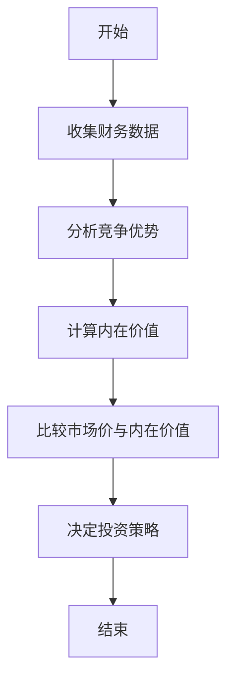
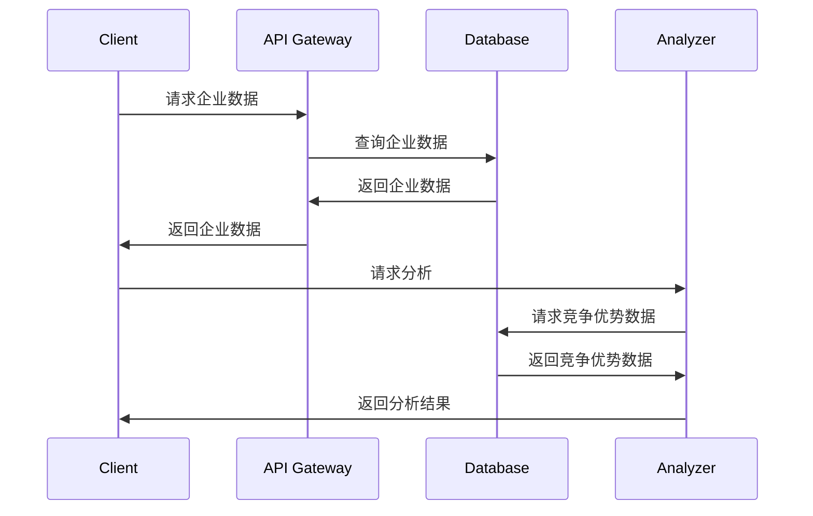

                 


# 巴菲特的商业分析方法论

> 关键词：巴菲特，商业分析，价值投资，企业评估，竞争优势，投资策略，系统架构

> 摘要：本文将深入探讨巴菲特的商业分析方法论，从其核心概念到实际应用，结合技术化的流程图、数学模型和系统架构，全面解析其投资哲学在现代商业环境中的应用。通过具体案例分析和系统设计，展示如何将巴菲特的方法论转化为可操作的技术方案。

---

## 第1章 巴菲特商业分析方法论的背景与核心概念

### 1.1 背景介绍

#### 1.1.1 核心概念术语说明
- **价值投资**：寻找被市场低估的企业，长期持有，获得超额收益。
- **竞争优势**：企业相对于竞争对手的独特优势，如成本优势、品牌影响力等。
- **企业价值**：企业整体价值的评估，包括资产、负债、未来现金流等。

#### 1.1.2 问题背景
- 投资者在信息不对称和市场波动中如何找到优质企业？
- 如何量化企业的内在价值，避免市场情绪干扰？

#### 1.1.3 问题描述
- 投资者常面临选择困难：短期波动 vs. 长期价值。
- 如何通过系统化的方法评估企业，降低投资风险？

#### 1.1.4 问题解决
- 巴菲特提出的价值投资方法论，通过基本面分析和企业评估，找到具有持续竞争优势的企业。

#### 1.1.5 边界与外延
- 仅适用于公开上市公司。
- 不考虑短期市场波动，专注于长期价值。
- 不涉及高频交易或短期套利。

#### 1.1.6 核心要素组成
- 财务数据：收入、利润、现金流。
- 企业特征：竞争优势、管理团队、行业地位。

### 1.2 核心概念与联系

#### 1.2.1 核心概念原理
- **企业价值**：企业的整体价值，包括资产、负债、未来现金流。
- **股东权益**：股东对企业净资产的所有权。
- **竞争优势**：企业的独特优势，使其在行业中具有领先地位。

#### 1.2.2 概念属性特征对比表格
| 概念       | 特征1 | 特征2 | 特征3 |
|------------|-------|-------|-------|
| 企业价值   | 数量化 | 可比性 | 动态性 |
| 股东权益   | 所有权 | 持续性 | 可变性 |
| 竞争优势   | 独特性 | 可持续性 | 可衡量性 |

#### 1.2.3 ER实体关系图架构
```mermaid
erDiagram
    company {
        id
        name
        industry
        revenue
        profit
        marketValue
    }
    shareholder {
        id
        name
        equity
        investment
    }
    competition {
        id
        advantage
        competitor
        industry
    }
    company <-o- shareholder : "拥有"
    company <-o- competition : "参与"
```

---

## 第2章 巴菲特商业分析方法论的算法原理

### 2.1 算法原理讲解

#### 2.1.1 核心算法思路
1. **企业基本面分析**：通过财务报表评估企业的收入、利润、现金流。
2. **竞争优势识别**：分析企业的成本优势、品牌影响力、市场地位。
3. **企业估值**：使用DCF模型计算企业内在价值。

#### 2.1.2 算法步骤
1. 收集企业财务数据。
2. 分析企业竞争优势。
3. 计算企业内在价值。
4. 比较市场价与内在价值，决定投资决策。

#### 2.1.3 算法流程图


#### 2.1.4 Python核心代码实现
```python
def calculate_intrinsic_value(revenue, profit, growth_rate, discount_rate):
    # DCF模型计算内在价值
    terminal_value = revenue * (1 + growth_rate) / (discount_rate - growth_rate)
    present_value = (terminal_value) / (1 + discount_rate)
    return present_value

# 示例数据
revenue = 100000000  # 收入
profit = 20000000    # 利润
growth_rate = 0.05    # 收益增长率
discount_rate = 0.08  # 折现率

intrinsic_value = calculate_intrinsic_value(revenue, profit, growth_rate, discount_rate)
print(f"企业内在价值：{intrinsic_value}")
```

---

## 第3章 巴菲特商业分析方法论的系统架构设计

### 3.1 系统分析与架构

#### 3.1.1 问题场景介绍
- 企业价值评估系统：基于巴菲特方法论，构建一个自动化的企业分析工具。

#### 3.1.2 系统功能设计
- 数据采集：获取企业财务数据。
- 竞争优势分析：识别企业的竞争优势。
- 价值评估：计算企业内在价值。
- 投资决策：比较市场价与内在价值。

#### 3.1.3 系统架构图
```mermaid
graph LR
    Client --> API Gateway
    API Gateway --> Database
    Database --> Analyzer
    Analyzer --> Output
    Output --> Client
```

#### 3.1.4 系统交互序列图


---

## 第4章 巴菲特商业分析方法论的项目实战

### 4.1 项目介绍
- 开发一个基于巴菲特方法论的企业分析工具。

### 4.2 核心实现源代码
```python
# 数据采集模块
import pandas as pd

def fetch_financial_data(ticker):
    # 模拟从数据库获取数据
    data = pd.DataFrame({
        'revenue': [100000000],
        'profit': [20000000],
        'market_value': [150000000]
    })
    return data

# 竞争优势分析模块
def analyze_competitive_advantage(data):
    # 简单的竞争优势分析
    if data['revenue'].iloc[0] > data['market_value'].iloc[0]:
        return "竞争优势明显"
    else:
        return "竞争优势不明显"

# 主程序
def main():
    ticker = "AAPL"
    data = fetch_financial_data(ticker)
    advantage = analyze_competitive_advantage(data)
    print(f"企业{ticker}的竞争优势：{advantage}")

if __name__ == "__main__":
    main()
```

---

## 第5章 巴菲特商业分析方法论的最佳实践与总结

### 5.1 最佳实践 tips
- **数据准确性**：确保财务数据的准确性。
- **模型简化**：避免过度复杂的模型，保持可解释性。
- **持续学习**：市场变化快，需不断更新分析方法。

### 5.2 小结
本文详细讲解了巴菲特的商业分析方法论，从理论到实践，结合技术化的流程图和代码实现，展示了如何将投资哲学转化为可操作的技术方案。

### 5.3 注意事项
- 不要盲目依赖模型，需结合市场实际情况。
- 风险提示：投资需谨慎，方法论仅为参考。

### 5.4 拓展阅读
- 巴菲特的《投资之道》
- 技术书籍：《系统设计精要》

---

通过本文的系统分析与实践，读者可以深入理解巴菲特的商业分析方法论，并将其应用于实际投资决策中。

