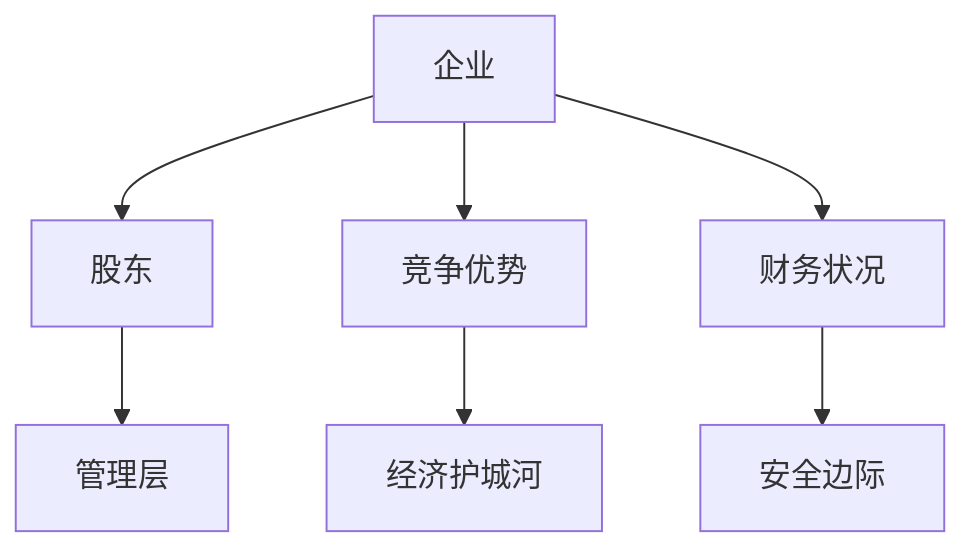
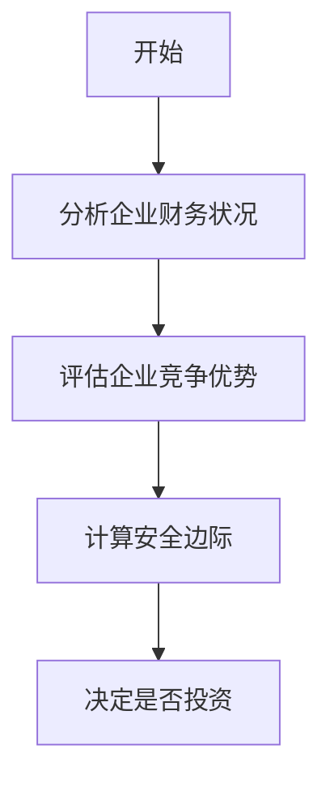
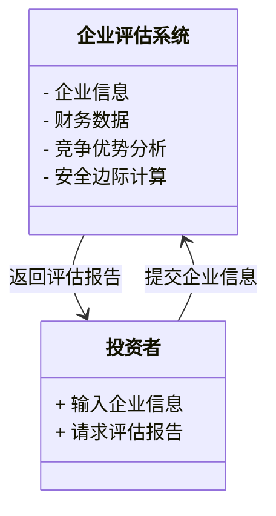

                 


# 巴菲特的商业模式分析

## 关键词：巴菲特、商业模式、价值投资、企业分析、投资策略、安全边际、经济护城河

## 摘要：本文深入分析了巴菲特的投资理念、商业模式分析方法、经典投资案例以及其分析方法在现代的应用。通过详细讲解核心概念、算法原理和系统架构，帮助读者全面理解巴菲特的成功之道，并将其应用于实际投资分析中。

---

## 第一部分：背景介绍

### 第1章：巴菲特的生平与投资哲学

#### 1.1 巴菲特的生平简介

- **早年经历与教育背景**
  - 巴菲特出生于1934年，早年展现出对投资的浓厚兴趣。
  - 在哥伦比亚大学获得经济学学士学位，师从本杰明·格雷厄姆。
  
- **投资生涯的起点**
  - 创办 Buffett Partnership Ltd，开始职业投资生涯。
  - 初期专注于套利和 arbitrage 投资策略。

- **伯克希尔哈撒韦的建立与发展**
  - 1965年收购伯克希尔哈撒韦纺织公司，转型为控股公司。
  - 通过收购优秀企业，构建多元化的投资组合。

#### 1.2 巴菲特的投资哲学

- **价值投资的核心理念**
  - 购买股票即买入企业的一部分，关注企业的内在价值。
  - 长期持有，避免频繁交易。

- **长期投资与复利效应**
  - 强调复利的重要性，长期投资能够最大化收益。
  - 选择能够持续创造价值的企业。

- **安全边际的概念与应用**
  - 安全边际是指投资标的实际价值与市场价格之间的差距。
  - 通过安全边际降低投资风险，确保投资的稳定性。

#### 1.3 巴菲特的商业模式分析框架

- **企业估值的基本原则**
  - DCF模型：通过现金流折现法评估企业价值。
  - 股东权益与企业价值的关系：股东权益是企业价值的重要组成部分。

- **企业的竞争优势分析**
  - 经济护城河：企业竞争优势的长期持续性。
  - 市场地位：行业领导地位和品牌影响力。

- **财务健康状况的评估标准**
  - 财务杠杆：企业负债与股东权益的比例。
  - 盈利能力：净利润率和ROE指标。

---

## 第二部分：核心概念与联系

### 第2章：巴菲特的商业模式分析方法

#### 2.1 核心概念原理

- **价值投资的核心要素**
  - 企业内在价值：未来现金流的现值。
  - 市场价格：相对于内在价值的折扣。

- **企业的竞争优势分析**
  - 经济护城河：成本优势、品牌优势、技术壁垒等。
  - 竞争地位：市场份额和竞争对手分析。

- **财务健康状况的评估标准**
  - 财务杠杆：企业负债率和偿债能力。
  - 盈利能力：净利润率和ROE指标。

#### 2.2 核心概念属性特征对比表格

| 核心概念         | 特征描述                                                                 |
|------------------|--------------------------------------------------------------------------|
| 企业竞争优势     | 技术壁垒、成本优势、品牌影响力                                               |
| 财务健康状况     | 负债率低、现金流稳定、净利润率高                                             |

#### 2.3 ER实体关系图架构



---

## 第三部分：算法原理讲解

### 第3章：巴菲特的选股模型

#### 3.1 算法原理

- **企业估值的数学模型**
  - 使用DCF模型计算企业未来现金流的现值。
  - 公式：$$企业价值 = \sum_{t=1}^{n} \frac{CF_t}{(1+r)^t} + \frac{TV}{(1+r)^n}$$
  - 其中，CF_t为第t年的现金流，r为折现率，TV为终值。

- **安全边际的计算方法**
  - 计算公式：$$安全边际 = 内在价值 - 市场价格$$
  - 选择安全边际为内在价值的20%以上的投资标的。

#### 3.2 使用mermaid画出算法流程图



#### 3.3 使用Python源代码详细阐述

```python
def calculate_intrinsic_value(FCFF, WACC, TV):
    """计算企业内在价值"""
    n = len(FCFF)
    intrinsic_value = sum(FCFF[i] / (1 + WACC)**i for i in range(n))
    if n < 10:
        intrinsic_value += TV / (1 + WACC)**n
    return intrinsic_value

def calculate_margin_of_safety(intrinsic_value, market_price):
    """计算安全边际"""
    return intrinsic_value - market_price

# 示例
FCFF = [100, 120, 150, 200]  # 自由现金流
WACC = 0.10  # 加权平均资本成本
TV = 1000    # 终值
market_price = 100  # 市场价格

iv = calculate_intrinsic_value(FCFF, WACC, TV)
mos = calculate_margin_of_safety(iv, market_price)

print(f"内在价值: {iv}")
print(f"安全边际: {mos}")
```

---

## 第四部分：系统分析与架构设计方案

### 第4章：系统分析与架构设计方案

#### 4.1 问题场景介绍

- **目标**：构建一个基于巴菲特分析方法的企业评估系统。
- **用户**：投资者、金融分析师。
- **功能需求**：企业财务分析、竞争优势评估、安全边际计算。

#### 4.2 系统功能设计



#### 4.3 系统架构设计


#### 4.4 系统接口设计

- **输入接口**：企业财务数据、市场数据。
- **输出接口**：评估报告，包括企业价值、安全边际。

#### 4.5 系统交互设计

```mermaid
sequenceDiagram
    投资者 -> 前端: 提交企业名称
    前端 -> 后端服务: 获取企业数据
    后端服务 -> 数据库: 查询企业信息
    并发
    后端服务 -> 第三方API: 获取市场数据
    后端服务 -> 投资者: 返回评估报告
```

---

## 第五部分：项目实战

### 第5章：项目实战

#### 5.1 环境安装

- **工具**：Python、pandas、numpy、matplotlib。
- **数据源**：Yahoo Finance API。

#### 5.2 核心实现源代码

```python
import pandas as pd
import numpy as np

def get_stock_data(ticker):
    """获取股票数据"""
    # 示例数据获取，实际应调用API
    return pd.DataFrame({'price': [100, 105, 110, 115]})

def calculate_intrinsic_value(company_data):
    """计算内在价值"""
    CF = company_data['free_cash_flow']
    WACC = 0.10
    n = len(CF)
    TV = 500  # 示例终值
    iv = sum(CF[i] / (1 + WACC)**i for i in range(n)) + TV / (1 + WACC)**n
    return iv

# 示例
ticker = 'AAPL'
data = get_stock_data(ticker)
iv = calculate_intrinsic_value(data)
print(f"苹果的内在价值: {iv}")
```

#### 5.3 代码应用解读与分析

- **数据获取**：从Yahoo Finance获取苹果的财务数据。
- **现金流计算**：使用DCF模型计算内在价值。
- **安全边际计算**：对比市场价格和内在价值，确定投资是否安全。

#### 5.4 实际案例分析

- **公司选择**：苹果公司（AAPL）。
- **分析过程**：
  - 获取财务数据，计算自由现金流。
  - 使用DCF模型计算内在价值。
  - 对比市场价格，计算安全边际。

#### 5.5 项目小结

- 成功构建了基于巴菲特分析方法的企业评估系统。
- 可以实际应用于投资决策，帮助投资者评估潜在投资标的的价值。

---

## 第六部分：总结

### 6.1 最佳实践 tips

- **持续学习**：关注企业的基本面，不断更新财务数据。
- **风险管理**：合理分散投资，避免过度集中。
- **长期视角**：耐心持有优质资产，避免短期波动影响判断。

### 6.2 小结

本文系统地分析了巴菲特的商业模式分析方法，从理论到实践，帮助读者掌握其投资哲学和分析框架。通过实际案例和系统设计，展示了如何将这些方法应用于现代投资分析中。

### 6.3 注意事项

- **数据准确性**：确保财务数据的准确性和及时性。
- **模型适用性**：根据不同企业特点调整分析模型。
- **市场变化**：关注宏观经济和行业变化，及时调整投资策略。

### 6.4 拓展阅读

- 《The Intelligent Investor》 by Benjamin Graham
- 《 Berkshire Hathaway Annual Report》
- 《Investing: The Last Supper》 by Darrell Patterson

---

通过以上详细的思考过程和内容规划，我们可以系统地撰写出一篇结构清晰、内容详实的技术博客文章，帮助读者深入理解巴菲特的商业模式分析方法，并能够实际应用于投资分析中。

