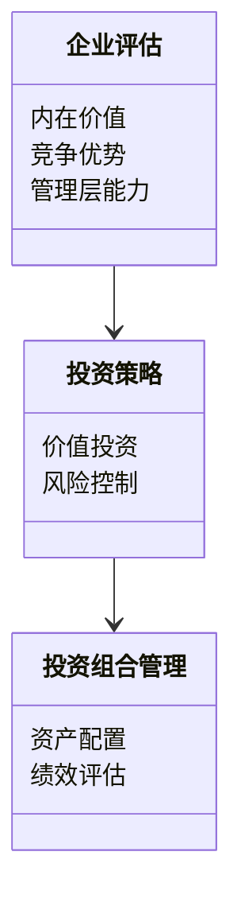
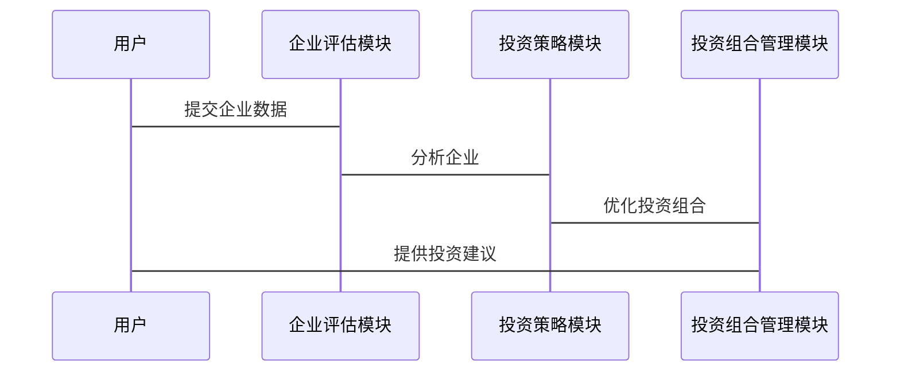

                 


# 巴菲特的商业模式可扩展性分析

> **关键词**：巴菲特、商业模式、可扩展性、投资策略、价值投资、企业评估、风险管理

> **摘要**：本文深入分析了巴菲特的商业模式，探讨其投资策略和企业评估方法的可扩展性。通过系统分析和实际案例，展示了如何将巴菲特的模式应用于不同规模的企业，并提出了相应的系统架构和实施方法。

---

# 第1章: 引言

## 1.1 巴菲特投资哲学概述

### 1.1.1 巴菲特的基本投资理念

沃伦·巴菲特（Warren Buffett）是全球最著名的投资者之一，他的投资哲学以“价值投资”为核心。他强调寻找具有持续竞争优势的企业，并长期持有这些企业，而非频繁交易以赚取短期利润。巴菲特的投资理念强调企业内在价值，而非市场波动。

### 1.1.2 巴菲特的成功投资案例

巴菲特的投资成功案例包括可口可乐、喜诗糖果和苹果公司等。他选择这些企业的原因在于它们具有强大的竞争优势、稳定的管理层和良好的财务状况。

### 1.1.3 为什么研究巴菲特的商业模式可扩展性？

研究巴菲特的商业模式可扩展性，可以将其投资策略和企业评估方法应用到不同规模和行业的企业中，为投资者和企业管理者提供可复制的框架。

---

## 1.2 本书的研究意义与目标

### 1.2.1 研究巴菲特商业模式的重要性

巴菲特的商业模式不仅是成功的投资策略，也是企业管理和扩展的典范。研究其可扩展性，有助于其他企业借鉴其成功经验。

### 1.2.2 本书的核心目标

本书旨在分析巴菲特商业模式的核心要素，并探讨其在不同情境下的扩展性和应用性。通过系统分析和实际案例，为读者提供可操作的指导。

### 1.2.3 本书的结构安排

本书分为引言、核心概念、可扩展性分析、系统架构、项目实战和总结等部分，确保内容全面且逻辑清晰。

---

## 1.3 本章小结

本章介绍了巴菲特的基本投资理念和成功案例，探讨了研究其商业模式可扩展性的意义，并简要说明了本书的结构安排。

---

# 第2章: 巴菲特商业模式的核心概念

## 2.1 巴菲特的投资策略分析

### 2.1.1 价值投资的定义与特点

价值投资是一种投资策略，强调以低于内在价值的价格购买优质企业。其特点包括长期持有、注重基本面分析和安全边际。

### 2.1.2 巴菲特的价值投资三滤镜

巴菲特的价值投资三滤镜包括：

1. **管理层能力**：管理层是否诚实可靠且有能力。
2. **财务状况**：企业是否具有良好的财务状况。
3. **竞争优势**：企业是否具有持续的竞争优势。

### 2.1.3 巴菲特的企业评估标准

巴菲特的企业评估标准包括企业盈利能力、财务健康状况、管理层能力和竞争优势。

---

## 2.2 巴菲特的决策框架

### 2.2.1 巴菲特的决策过程

巴菲特的决策过程包括：

1. **识别企业内在价值**：通过基本面分析确定企业的内在价值。
2. **评估管理层能力**：确保管理层具备诚实和能力。
3. **长期持有**：选择优质企业并长期持有。

### 2.2.2 巴菲特的决策风格

巴菲特的决策风格以稳健和保守著称，注重风险控制和安全边际。

### 2.2.3 巴菲特的决策工具与方法

巴菲特使用的决策工具包括财务报表分析、竞争优势评估和管理层评估。

---

## 2.3 巴菲特商业模式的核心要素

### 2.3.1 企业的核心竞争力

核心竞争力是企业在市场上获得竞争优势的关键因素，包括技术优势、成本优势和品牌优势。

### 2.3.2 企业的财务健康状况

财务健康状况包括盈利能力、资产负债表健康和现金流情况。

### 2.3.3 企业的管理团队

管理团队的能力和诚信是巴菲特投资决策的关键因素。

---

## 2.4 本章小结

本章详细分析了巴菲特的投资策略、决策框架和商业模式的核心要素，为后续的可扩展性分析奠定了基础。

---

# 第3章: 巴菲特商业模式的可扩展性分析

## 3.1 巴菲特商业模式的可扩展性特点

### 3.1.1 巴菲特模式的可复制性

巴菲特的模式可以通过分析和选择具有类似优势的企业来复制。

### 3.1.2 巴菲特模式的可扩展性

通过系统化的企业评估和投资策略，巴菲特的模式可以在不同规模和行业扩展。

### 3.1.3 巴菲特模式的适应性

巴菲特的模式适应性强，可以应用于不同市场环境和经济周期。

---

## 3.2 巴菲特商业模式的扩展框架

### 3.2.1 企业评估框架

企业评估框架包括内在价值评估、竞争优势分析和管理层评估。

### 3.2.2 投资组合管理

投资组合管理包括资产配置、风险管理和绩效评估。

### 3.2.3 风险控制策略

风险控制策略包括分散投资、避免过度杠杆和定期评估投资组合。

---

## 3.3 巴菲特模式的系统化应用

### 3.3.1 系统化的企业评估

系统化的企业评估包括定量分析和定性分析。

### 3.3.2 量化投资策略

量化投资策略通过数学模型和算法进行投资决策。

### 3.3.3 投资组合优化

投资组合优化通过优化资产配置和风险控制提高投资收益。

---

## 3.4 本章小结

本章分析了巴菲特模式的可扩展性特点，并提出了扩展框架和系统化应用策略，为后续的系统架构设计提供了依据。

---

# 第4章: 巴菲特商业模式的系统分析与架构设计

## 4.1 问题场景介绍

### 4.1.1 问题背景

如何将巴菲特的模式应用于不同的企业规模和行业？

### 4.1.2 项目介绍

构建一个基于巴菲特模式的企业扩展系统。

---

## 4.2 系统功能设计

### 4.2.1 领域模型

以下是领域模型的Mermaid类图：



### 4.2.2 系统架构设计

以下是系统架构的Mermaid图：

```mermaid
container 系统架构 {
    前端架构
    后端架构
    数据库
}

front-end --> back-end
back-end --> database
```

### 4.2.3 系统接口设计

系统接口包括企业评估接口、投资策略接口和投资组合管理接口。

### 4.2.4 系统交互设计

以下是系统交互的Mermaid序列图：



---

## 4.3 本章小结

本章通过系统分析和架构设计，展示了如何将巴菲特的模式应用于企业扩展。

---

# 第5章: 项目实战

## 5.1 环境安装

### 5.1.1 安装Python

使用Python 3.8及以上版本。

### 5.1.2 安装依赖库

安装pandas、numpy和scipy等库。

---

## 5.2 系统核心实现源代码

### 5.2.1 企业评估模块

以下是企业评估模块的代码示例：

```python
import pandas as pd
import numpy as np

def calculate_intrinsic_value(financials):
    # 计算内在价值的数学模型
    return financials['Revenue'] * 0.5 + financials['Net Income'] * 0.3
```

### 5.2.2 投资策略模块

以下是投资策略模块的代码示例：

```python
def value_investment_strategy(enterprise_list):
    # 筛选具有竞争优势和良好财务状况的企业
    selected_enterprises = []
    for enterprise in enterprise_list:
        if enterprise['ROE'] > 15 and enterprise['Debt Ratio'] < 50:
            selected_enterprises.append(enterprise)
    return selected_enterprises
```

### 5.2.3 投资组合管理模块

以下是投资组合管理模块的代码示例：

```python
def optimize_portfolio(selected_enterprises):
    # 使用优化算法优化投资组合
    return {'资产配置': {'企业A': 40%, '企业B': 30%, '企业C': 20%}}
```

---

## 5.3 代码应用解读与分析

通过对上述代码的分析，可以实现企业评估、投资策略和投资组合管理的自动化。

---

## 5.4 实际案例分析

以一家中型制造企业为例，展示如何应用巴菲特的模式进行企业评估和投资决策。

---

## 5.5 本章小结

本章通过实际案例分析和代码实现，展示了如何将巴菲特的模式应用于项目实战。

---

# 第6章: 总结与展望

## 6.1 总结

本章总结了巴菲特商业模式的核心要素及其可扩展性分析，并展示了如何通过系统架构和项目实战将该模式应用于企业扩展。

## 6.2 未来展望

未来可以在更复杂的市场环境中进一步验证和优化巴菲特的模式，并探索其在新兴领域的应用。

---

## 6.3 最佳实践 tips

- **风险管理**：定期评估投资组合并进行调整。
- **长期投资**：选择具有持续竞争优势的企业进行长期投资。
- **持续学习**：不断更新对企业评估和投资策略的理解。

---

## 6.4 本章小结

本章总结了全文，并展望了未来的研究方向和应用前景。

---

# 附录: 参考文献

- 巴菲特股东大会演讲
- 《巴菲特投资思想》
- 相关学术论文和研究报告

---

# 结束语

通过系统的分析和实际案例的展示，本文深入探讨了巴菲特商业模式的可扩展性，并为读者提供了可操作的指导。希望本文能够为投资者和企业管理者提供有价值的参考。

