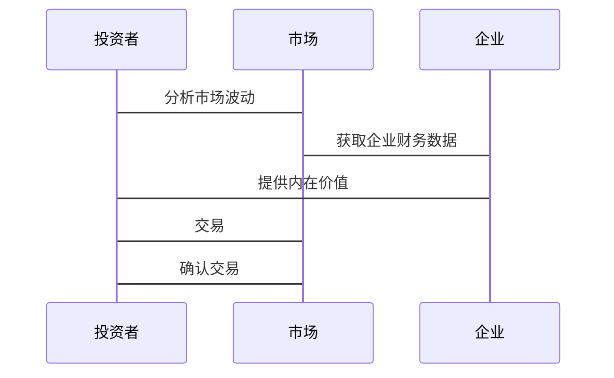

                 


# 巴菲特的四大投资准则：选择优质股票的关键

---

## 关键词：
巴菲特、投资准则、价值投资、安全边际、内在价值、市场先生、股票选择

---

## 摘要：
本文系统地阐述了巴菲特的四大投资准则：安全边际、市场先生、内在价值和集中投资。通过分析这些准则的核心概念、应用场景和实际案例，本文旨在帮助读者理解如何选择优质股票，避免投资陷阱，并在长期市场波动中实现稳健收益。文章结合技术性的分析方法，从数学模型、系统架构和项目实战等多角度深入探讨巴菲特的投资哲学，为读者提供实用的投资策略和决策框架。

---

# 第一部分: 巴菲特投资准则的背景与核心理念

## 第1章: 投资的哲学与理念

### 1.1 投资的核心问题与挑战

#### 1.1.1 投资的基本问题
投资的本质是通过资源配置实现财富增值，但市场波动、信息不对称和人性弱点是投资者面临的三大核心挑战。

#### 1.1.2 投资者的主要挑战
- **市场波动性**：市场的短期波动往往由情绪驱动，而非理性决策可能导致投资损失。
- **信息不对称**：投资者难以全面掌握企业的财务和经营状况。
- **人性弱点**：贪婪和恐惧常常导致投资者做出错误决策。

#### 1.1.3 投资与投机的本质区别
- **投资**：基于基本面分析，追求长期稳健收益。
- **投机**：基于市场短期波动，追求短期利润。

---

### 1.2 巴菲特投资理念的哲学基础

#### 1.2.1 巴菲特投资理念的核心思想
巴菲特的投资理念以“价值投资”为核心，强调寻找具有持续竞争优势的企业，并以合理价格买入并长期持有。

#### 1.2.2 巴菲特投资理念的演变历程
- 早期受本杰明·格雷厄姆的影响，专注于寻找被市场低估的股票。
- 后期发展出“护城河”概念，强调企业的竞争优势和管理层质量。

#### 1.2.3 巴菲特投资理念的现实意义
- 为投资者提供了长期稳健的投资策略。
- 强调了对企业基本面的深入研究。

---

### 1.3 价值投资与市场的矛盾统一

#### 1.3.1 价值投资的定义与特征
- **定义**：基于对企业内在价值的评估，寻找市场价格低于内在价值的投资标的。
- **特征**：长期、耐心、专注。

#### 1.3.2 市场波动与价值投资的关系
- 市场波动为价值投资者提供了低价买入优质资产的机会。
- 价值投资的核心是“逆市场思维”，即在市场恐慌时买入，在市场狂热时卖出。

#### 1.3.3 巴菲特如何应对市场短期波动
- 通过集中投资和长期持有，降低短期波动对投资组合的影响。

---

## 1.4 本章小结
本章介绍了巴菲特投资理念的核心思想、哲学基础以及价值投资与市场的矛盾统一关系。投资者只有理解这些核心理念，才能更好地应用巴菲特的四大投资准则。

---

# 第二部分: 巴菲特四大投资准则的核心概念

## 第2章: 第一准则：安全边际

### 2.1 安全边际的定义与本质

#### 2.1.1 安全边际的定义
安全边际是指股票的市场价格低于其内在价值的部分，是投资的安全垫。

#### 2.1.2 安全边际的本质特征
- 量化风险：通过计算内在价值与市场价格的差异，量化投资的风险。
- 提供保护：在市场波动时，安全边际能够保护投资者免受损失。

#### 2.1.3 安全边际与投资风险的关系
- 安全边际越高，投资风险越小。
- 安全边际是价值投资的核心要素之一。

---

### 2.2 安全边际的计算与应用

#### 2.2.1 安全边际的计算方法
- 内在价值 = 股东权益 + 流动资产 - 流动负债
- 安全边际 = 内在价值 - 市场价格

#### 2.2.2 安全边际在股票选择中的应用
- 选择具有较高安全边际的股票，降低投资风险。
- 通过安全边际的动态变化，判断市场的投资机会。

---

### 2.3 巴菲特如何实践安全边际原则

#### 2.3.1 巴菲特的安全边际策略
- 专注于寻找具有显著安全边际的企业。
- 避免投资于市场价格接近或超过内在价值的股票。

#### 2.3.2 巴菲特的经典案例分析
- 以可口可乐为例，分析巴菲特如何通过安全边际选择投资标的。

#### 2.3.3 安全边际原则的局限性
- 安全边际仅适用于基本面稳定的优质企业。
- 在市场剧烈波动时，安全边际可能不足以保护投资者。

---

## 2.4 本章小结
安全边际是巴菲特投资理念的核心要素之一，通过计算内在价值与市场价格的差异，投资者可以降低投资风险，选择具有长期稳健收益的优质股票。

---

## 第3章: 第二准则：市场先生的伙伴

### 3.1 市场先生的定义与角色

#### 3.1.1 市场先生的定义
市场先生是巴菲特用来描述市场的比喻，代表市场的短期波动和情绪变化。

#### 3.1.2 市场先生的双重角色
- 作为资产的价格发现者。
- 作为投资者的合作伙伴。

---

### 3.2 市场波动性与投资机会

#### 3.2.1 市场波动的规律
- 市场波动具有周期性，投资者可以通过分析市场周期选择投资策略。
- 市场波动与企业基本面无关。

#### 3.2.2 市场波动与投资机会的关系
- 市场波动为价值投资者提供了低价买入优质资产的机会。
- 在市场恐慌时，投资者可以利用市场先生的情绪化行为获取超额收益。

---

### 3.3 巴菲特与市场先生的互动策略

#### 3.3.1 巴菲特的市场先生互动原则
- 通过长期持有优质资产，避免与市场先生短期博弈。
- 在市场恐慌时，利用市场先生的情绪化行为获取投资机会。

#### 3.3.2 巴菲特的经典市场先生案例
- 以2008年金融危机为例，分析巴菲特如何利用市场先生的机会。

#### 3.3.3 市场先生原则的现代应用
- 在当前市场环境下，如何运用市场先生的理论选择投资标的。

---

## 3.4 本章小结
市场先生是巴菲特用来描述市场的关键概念，投资者应通过分析市场周期和情绪变化，选择具有长期竞争优势的优质股票。

---

## 第4章: 第三准则：寻找企业的内在价值

### 4.1 内在价值的定义与计算

#### 4.1.1 内在价值的定义
内在价值是企业未来现金流的现值，是企业的真实价值。

#### 4.1.2 内在价值的计算方法
- 使用DCF模型（ discounted cash flow model）计算企业未来现金流的现值。
- 考虑企业的竞争优势、财务状况和管理层质量。

---

### 4.2 内在价值的评估与应用

#### 4.2.1 内在价值的评估指标
- 股东权益回报率（ROE）
- 资产回报率（ROA）
- 净利润率（Net Profit Margin）

#### 4.2.2 内在价值在股票选择中的应用
- 选择具有高ROE、高ROA和高净利润率的企业。
- 结合市场环境和企业生命周期，动态评估企业的内在价值。

---

### 4.3 巴菲特如何评估企业的内在价值

#### 4.3.1 巴菲特的内在价值评估方法
- 专注于企业的竞争优势和管理层质量。
- 结合企业的财务状况和行业地位，评估企业的内在价值。

#### 4.3.2 巴菲特的经典内在价值案例
- 以苹果公司为例，分析巴菲特如何评估企业的内在价值。

#### 4.3.3 内在价值评估的注意事项
- 内在价值评估需要结合企业实际情况。
- 内在价值是动态变化的，需要定期更新。

---

## 4.4 本章小结
内在价值是巴菲特投资理念的核心要素之一，投资者应通过深入分析企业的财务状况和竞争优势，选择具有长期稳健收益的优质股票。

---

## 第5章: 第四准则：集中投资与长期持有

### 5.1 集中投资的定义与优势

#### 5.1.1 集中投资的定义
集中投资是指将大部分资金投资于少数优质股票，以降低投资风险。

#### 5.1.2 集中投资的优势
- 降低投资风险：通过集中投资于优质企业，减少投资组合的波动性。
- 提高投资收益：通过集中投资，投资者可以更好地把握优质企业的长期增值潜力。

---

### 5.2 长期持有的意义与策略

#### 5.2.1 长期持有的意义
- 避免短期波动对投资组合的影响。
- 享受优质企业的长期增值。

#### 5.2.2 长期持有的策略
- 选择具有长期竞争优势的企业。
- 长期持有优质股票，避免频繁交易。

---

### 5.3 巴菲特如何实现集中投资与长期持有

#### 5.3.1 巴菲特的集中投资策略
- 将大部分资金投资于少数优质股票。
- 长期持有优质股票，享受企业的长期增值。

#### 5.3.2 巴菲特的经典集中投资案例
- 以可口可乐和苹果为例，分析巴菲特如何实现集中投资。

#### 5.3.3 集中投资与长期持有的注意事项
- 集中投资需要选择具有长期竞争优势的企业。
- 长期持有需要耐心和信心，避免短期波动影响投资决策。

---

## 5.4 本章小结
集中投资与长期持有是巴菲特投资理念的重要组成部分，通过集中投资于优质企业，并长期持有，投资者可以实现长期稳健的收益。

---

# 第三部分: 巴菲特投资准则的数学模型与系统分析

## 第6章: 投资准则的数学模型

### 6.1 内在价值计算的数学模型

#### 6.1.1 DCF模型公式
$$
\text{内在价值} = \sum_{t=1}^{n} \frac{\text{现金流}_t}{(1 + r)^t} + \frac{\text{残值}}{(1 + r)^n}
$$
其中，\( r \) 是折现率，\( \text{现金流}_t \) 是第 \( t \) 年的现金流。

#### 6.1.2 安全边际计算公式
$$
\text{安全边际} = \text{内在价值} - \text{市场价格}
$$

---

### 6.2 投资组合的优化模型

#### 6.2.1 马科维茨均值-方差模型
$$
\min_w \frac{1}{2} w^T \Sigma w \quad \text{subject to} \quad \mu^T w \geq \text{目标收益}
$$
其中，\( w \) 是投资组合权重，\( \Sigma \) 是协方差矩阵，\( \mu \) 是收益向量。

---

## 6.3 投资准则的系统架构

### 6.3.1 领域模型（Mermaid 类图）


---

### 6.4 系统交互（Mermaid 序列图）


---

## 6.5 本章小结
本章通过数学模型和系统架构，进一步分析了巴菲特投资准则的实现方法。投资者可以通过内在价值计算和投资组合优化，实现长期稳健的收益。

---

# 第四部分: 巴菲特投资准则的项目实战

## 第7章: 项目实战：模拟投资案例

### 7.1 环境安装与数据准备

#### 7.1.1 环境安装
- 安装Python和相关数据分析库（Pandas、NumPy、Matplotlib）。

#### 7.1.2 数据准备
- 获取目标企业的财务数据和市场数据。

---

### 7.2 核心实现代码

#### 7.2.1 内在价值计算代码
```python
import pandas as pd
import numpy as np

def calculate_intrinsic_value(financial_data, discount_rate):
    cash_flow = financial_data['现金流']
    residual_value = financial_data['残值']
    n = len(cash_flow)
    
    intrinsic_value = 0
    for t in range(n):
        intrinsic_value += cash_flow[t] / (1 + discount_rate)**t
    intrinsic_value += residual_value / (1 + discount_rate)**n
    return intrinsic_value
```

#### 7.2.2 安全边际计算代码
```python
def calculate_margin_of_safety(intrinsic_value, market_price):
    return intrinsic_value - market_price
```

---

### 7.3 代码应用与案例分析

#### 7.3.1 投资标的选择
选择具有较高安全边际的优质企业。

#### 7.3.2 投资组合优化
通过优化模型，选择最优投资组合。

#### 7.3.3 实际案例分析
以苹果公司为例，分析其内在价值和安全边际。

---

## 7.4 本章小结
本章通过实际案例分析，展示了如何应用巴菲特的投资准则进行投资决策。投资者可以通过内在价值计算和安全边际分析，选择具有长期稳健收益的优质股票。

---

# 第五部分: 总结与启示

## 第8章: 总结与启示

### 8.1 巴菲特投资准则的核心要点

#### 8.1.1 安全边际：降低投资风险
- 选择具有较高安全边际的股票。

#### 8.1.2 市场先生：利用市场波动
- 在市场恐慌时买入，在市场狂热时卖出。

#### 8.1.3 内在价值：选择优质企业
- 专注于具有长期竞争优势的企业。

#### 8.1.4 集中投资与长期持有：实现稳健收益
- 集中投资于优质股票，长期持有。

---

### 8.2 投资的哲学与原则

#### 8.2.1 投资的长期性
- 长期持有优质股票，避免短期波动。

#### 8.2.2 投资的纪律性
- 遵循投资准则，避免情绪化决策。

#### 8.2.3 投资的独立性
- 保持独立思考，避免盲目跟随市场。

---

## 8.3 投资的注意事项

#### 8.3.1 风险管理
- 通过分散投资降低风险。
- 设置止损点，避免重大损失。

#### 8.3.2 持续学习
- 关注企业的财务状况和行业动态。
- 提高自身的投资能力。

---

## 8.4 未来展望

#### 8.4.1 投资准则的现代应用
- 结合大数据和人工智能，优化投资决策。

#### 8.4.2 投资者的未来挑战
- 应对市场的复杂性和不确定性。

---

## 8.5 本章小结
本章总结了巴菲特投资准则的核心要点，强调了投资的哲学与原则，并提出了投资的注意事项和未来展望。

---

# 附录: 投资者必读经典书籍

- 《聪明的投资者》（The Intelligent Investor）——本杰明·格雷厄姆
- 《巴菲特致股东的信》（Letters to Shareholders）——沃伦·巴菲特
- 《投资之道》（The Way to Wealth）——本杰明·富兰克林

---

# 结语

巴菲特的投资准则为投资者提供了长期稳健的投资策略，但成功投资不仅需要理论知识，更需要实践经验和纪律性。希望本文能够帮助读者更好地理解巴菲特的投资理念，并在实际投资中取得成功。

