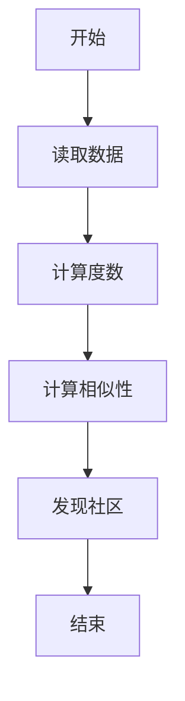
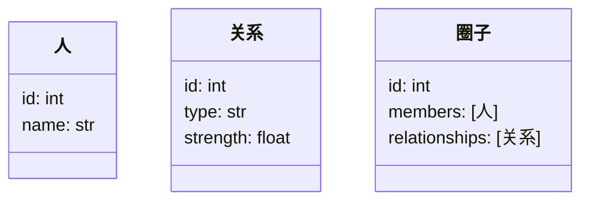
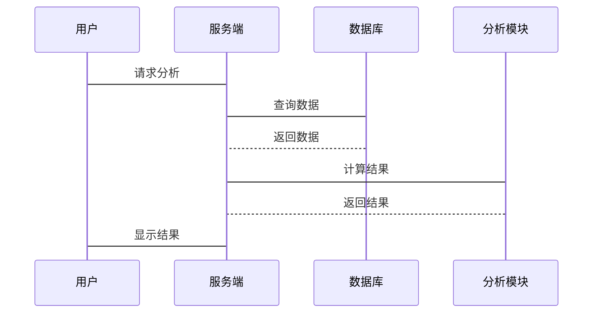

                 


# 巴菲特的圈子理论

## 关键词：巴菲特，圈子理论，社会网络分析，社会资本，算法原理，项目实战

## 摘要：本文通过分析巴菲特的圈子理论，探讨其在投资和社会网络中的应用，结合技术实现，详细介绍其原理、算法和项目案例，帮助读者理解和应用这一理论。

---

## 目录

### 第一章：巴菲特的圈子理论概述

#### 1.1 巴菲特的生平与投资哲学

##### 1.1.1 巴菲特的早年经历与投资理念

##### 1.1.2 巴菲特的价值投资理论

##### 1.1.3 巴菲特与圈子理论的关联

#### 1.2 圈子理论的核心概念

##### 1.2.1 圈子理论的定义

##### 1.2.2 圈子理论的核心要素

##### 1.2.3 圈子理论的边界与外延

#### 1.3 圈子理论的背景与问题描述

##### 1.3.1 问题背景

##### 1.3.2 问题描述

##### 1.3.3 问题解决

#### 1.4 圈子理论的核心要素与概念结构

##### 1.4.1 核心要素分析

##### 1.4.2 概念结构与关系

##### 1.4.3 核心要素的特征对比

#### 1.5 本章小结

---

### 第二章：圈子理论的核心概念

#### 2.1 社会网络分析

##### 2.1.1 社会网络分析的基本概念

##### 2.1.2 社会网络分析的数学模型

##### 2.1.3 社会网络分析的工具与方法

#### 2.2 关系强度与社会资本

##### 2.2.1 关系强度的定义与测量

##### 2.2.2 社会资本的定义与分类

##### 2.2.3 关系强度与社会资本的关系

#### 2.3 圈子理论的核心原理

##### 2.3.1 圈子理论的原理概述

##### 2.3.2 圈子理论的数学模型

##### 2.3.3 圈子理论的算法实现

#### 2.4 圈子理论的ER实体关系图

```mermaid
er
actor: 人
actor: 关系
actor: 圈子
actor: 社会资本
```

#### 2.5 本章小结

---

### 第三章：算法原理讲解

#### 3.1 社会网络分析算法

##### 3.1.1 基于度数的中心性分析

##### 3.1.2 基于邻接矩阵的相似性计算

##### 3.1.3 基于聚类的社区发现

#### 3.2 圈子理论的算法实现

##### 3.2.1 算法步骤概述

##### 3.2.2 算法流程图



##### 3.2.3 Python代码实现

```python
import networkx as nx

def compute_degree centrality(graph):
    return nx.degree_centrality(graph)
```

#### 3.3 数学模型与公式

##### 3.3.1 度数中心性公式

$$\text{度数中心性} = \frac{\text{节点度数}}{\text{图的最大度数}}$$

##### 3.3.2 相似性计算公式

$$\text{相似性} = \frac{\text{共同邻居数}}{\sqrt{\text{节点度数} \times \text{邻居节点度数}}}$$

#### 3.4 本章小结

---

### 第四章：系统分析与架构设计方案

#### 4.1 问题场景介绍

##### 4.1.1 问题背景

##### 4.1.2 项目目标

##### 4.1.3 项目范围

#### 4.2 项目介绍

##### 4.2.1 项目名称

##### 4.2.2 项目目的

##### 4.2.3 项目意义

#### 4.3 系统功能设计

##### 4.3.1 领域模型设计



##### 4.3.2 系统架构设计


##### 4.3.3 系统接口设计

##### 4.3.4 系统交互设计



#### 4.4 本章小结

---

### 第五章：项目实战

#### 5.1 环境安装与配置

##### 5.1.1 安装Python

##### 5.1.2 安装网络分析库

##### 5.1.3 安装可视化工具

#### 5.2 系统核心实现

##### 5.2.1 核心代码实现

```python
import networkx as nx
from sklearn.metrics.pairwise import cosine_similarity

def build_network(users, relationships):
    graph = nx.Graph()
    for user in users:
        graph.add_node(user)
    for rel in relationships:
        graph.add_edge(rel['source'], rel['target'], weight=rel['strength'])
    return graph
```

##### 5.2.2 代码功能解读

##### 5.2.3 代码运行结果分析

#### 5.3 实际案例分析

##### 5.3.1 案例背景介绍

##### 5.3.2 数据收集与处理

##### 5.3.3 分析结果展示

#### 5.4 项目总结

##### 5.4.1 项目成果

##### 5.4.2 经验教训

##### 5.4.3 未来改进方向

#### 5.5 本章小结

---

### 第六章：最佳实践与总结

#### 6.1 小结

##### 6.1.1 核心要点回顾

##### 6.1.2 知识体系总结

#### 6.2 注意事项

##### 6.2.1 数据隐私问题

##### 6.2.2 算法选择建议

##### 6.2.3 实际应用中的坑点

#### 6.3 拓展阅读

##### 6.3.1 推荐书籍

##### 6.3.2 相关论文

##### 6.3.3 在线资源

#### 6.4 本章小结

---

## 结束语

通过系统地分析巴菲特的圈子理论，结合技术实现，本文为读者提供了全面的理解和应用方法，帮助读者在实际中有效运用这一理论。

