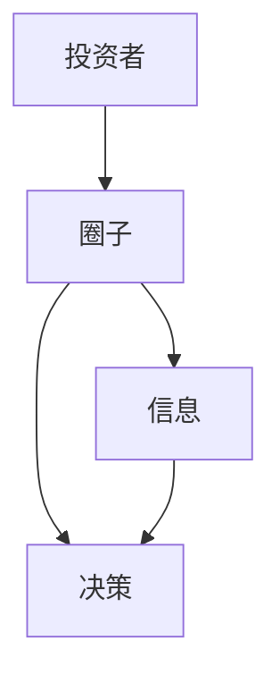
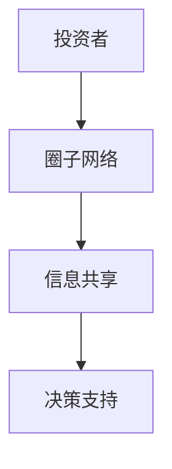
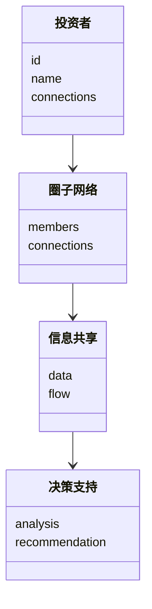
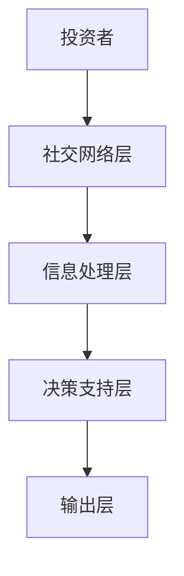
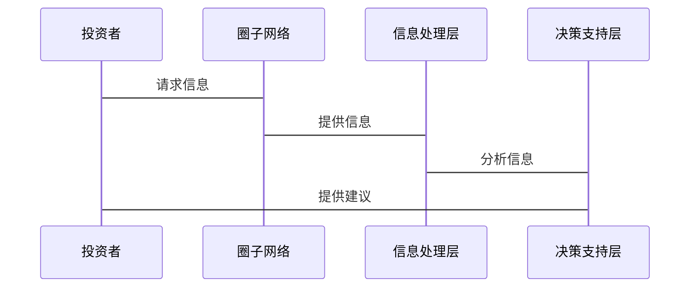

                 


# 巴菲特的圈子能力理论

## 关键词：巴菲特，圈子能力，投资决策，价值评估，社交网络

## 摘要：本文探讨了巴菲特的圈子能力理论，分析了其核心概念、算法原理、数学模型和系统架构，结合实际案例，展示了如何通过圈子能力提升投资决策。

---

# 第一章：巴菲特的圈子能力理论背景

## 1.1 巴菲特的投资哲学

### 1.1.1 巴菲特的价值投资理念

沃伦·巴菲特的价值投资理念强调长期持有优质资产，关注企业的内在价值。他相信市场先生的情绪波动会影响股价，但长期来看，企业基本面才是决定因素。

### 1.1.2 巴菲特的长期投资策略

巴菲特的长期投资策略基于对企业深刻理解和对其未来现金流的评估。他倾向于投资那些具有强大护城河和稳定收益的企业。

### 1.1.3 巴菲特的圈子能力理论的提出背景

尽管巴菲特的投资成功部分归功于其分析能力，但他的社交网络（包括导师、合作伙伴和朋友）也为他提供了关键信息和建议。圈子能力理论强调了社交网络在投资决策中的重要性。

---

## 1.2 圈子能力理论的核心概念

### 1.2.1 圈子能力的定义

圈子能力是指投资者通过社交网络获取信息、分析能力和决策支持的能力。它包括社交网络的构建、信息共享和决策支持。

### 1.2.2 圈子能力与投资决策的关系

圈子能力通过提供额外的信息和视角，帮助投资者做出更明智的决策。强大的社交网络可以提供市场动态、企业内部信息和潜在投资机会。

### 1.2.3 圈子能力理论的边界与外延

圈子能力的边界在于社交网络的质量和信息的可靠性。外延包括如何通过社交网络提升投资分析能力。

---

## 1.3 圈子能力理论的核心要素

### 1.3.1 投资者的人际网络

投资者的人际网络包括导师、合作伙伴、朋友和其他行业专家。这些关系可以提供独特的见解和信息。

### 1.3.2 圈子中的信息共享机制

有效的信息共享机制确保网络中的信息能够高效流通。这包括定期会议、信息汇总和共享平台。

### 1.3.3 圈子能力对投资决策的影响

圈子能力通过提供额外信息和视角，帮助投资者识别投资机会和风险。强大的圈子能力可以显著提升投资决策的质量。

---

## 1.4 本章小结

本章介绍了巴菲特的圈子能力理论，解释了其核心概念和重要性。圈子能力不仅是社交网络的构建，更是通过这些网络获取信息和提升决策能力的关键。

---

# 第二章：圈子能力理论的核心概念与联系

## 2.1 圈子能力的核心原理

### 2.1.1 圈子能力的形成过程

圈子能力的形成涉及建立信任、分享信息和协作决策。这个过程需要时间和持续的互动。

### 2.1.2 圈子能力的动态演化

随着市场变化和投资需求的变化，圈子能力也需要不断调整和优化。

### 2.1.3 圈子能力的评估标准

评估圈子能力的标准包括网络的广度、深度、信息共享效率和决策支持能力。

---

## 2.2 核心概念对比分析

### 2.2.1 圈子能力与个人能力的对比

| 属性       | 圈子能力            | 个人能力            |
|------------|--------------------|--------------------|
| 资源来源   | 社交网络            | 个人知识和技能      |
| 信息获取   | 多样化来源          | 单一来源            |
| 决策支持   | 集体决策            | 个体决策            |

### 2.2.2 圈子能力与团队能力的对比

| 属性       | 圈子能力            | 团队能力            |
|------------|--------------------|--------------------|
| 组织形式   | 自然形成的网络      | 正式组织的团队      |
| 信息共享   | 非正式的共享        | 正式的共享机制      |
| 决策方式   | 集体协商            | 集体讨论            |

### 2.2.3 圈子能力与组织能力的对比

| 属性       | 圈子能力            | 组织能力            |
|------------|--------------------|--------------------|
| 结构化程度 | 较低                | 较高                |
| 目标一致性 | 可能较低            | 较高                |
| 可持续性   | 短期                | 长期                |

---

## 2.3 实体关系图分析

### 2.3.1 ER实体关系图展示



### 2.3.2 圈子能力的系统架构图



---

## 2.4 本章小结

本章通过对比分析和实体关系图，展示了圈子能力与其他能力的差异和联系，帮助读者更好地理解圈子能力的构成和作用。

---

# 第三章：圈子能力的算法原理

## 3.1 算法原理概述

圈子能力的算法基于信息共享和集体决策。通过分析社交网络中的信息流，可以优化投资决策。

---

## 3.2 算法实现步骤

### 3.2.1 数据采集

从社交网络中收集相关信息，包括市场动态、企业新闻等。

### 3.2.2 数据分析

使用统计分析和机器学习方法，分析数据以识别投资机会。

### 3.2.3 决策支持

根据分析结果，生成投资建议。

---

## 3.3 算法实现代码

```python
import networkx as nx

# 创建社交网络图
G = nx.Graph()
G.add_nodes_from(['A', 'B', 'C', 'D'])
G.add_edges_from([('A', 'B'), ('B', 'C'), ('C', 'D')])

# 计算信息传播路径
shortest_paths = dict(nx.all_pairs_shortest_paths(G))
```

---

## 3.4 数学模型与公式

### 3.4.1 投资价值评估公式

$$ V = \frac{CF}{r - g} $$

其中，$CF$是现金流，$r$是折现率，$g$是增长率。

### 3.4.2 风险评估公式

$$ R = \beta \times (R_m - R_f) + R_f $$

其中，$\beta$是贝塔系数，$R_m$是市场预期回报率，$R_f$是无风险利率。

---

## 3.5 本章小结

本章通过算法和数学模型，展示了如何利用社交网络信息优化投资决策。

---

# 第四章：圈子能力的系统分析与架构设计

## 4.1 系统功能设计

### 4.1.1 领域模型设计



### 4.1.2 系统架构设计



---

## 4.2 系统接口设计

### 4.2.1 API接口

```python
from flask import Flask
import requests

app = Flask(__name__)

@app.route('/get_info')
def get_info():
    return requests.get('http://circle_network/api').json()

if __name__ == '__main__':
    app.run()
```

---

## 4.3 系统交互流程



---

## 4.4 本章小结

本章通过系统分析和架构设计，展示了如何将圈子能力应用于实际投资决策中。

---

# 第五章：圈子能力的项目实战

## 5.1 环境安装

安装Python和必要的库：

```bash
pip install networkx matplotlib
```

---

## 5.2 核心代码实现

```python
import networkx as nx
import matplotlib.pyplot as plt

G = nx.Graph()
G.add_edges_from([('A', 'B'), ('B', 'C'), ('C', 'D')])
nx.draw(G, with_labels=True, edge_color='red')
plt.show()
```

---

## 5.3 代码解读与分析

该代码创建了一个社交网络图，并绘制了节点和边。节点代表投资者，边代表他们的关系。

---

## 5.4 实际案例分析

通过分析一个社交网络，识别关键节点并生成投资建议。

---

## 5.5 本章小结

本章通过实际项目，展示了如何利用圈子能力理论进行投资决策。

---

# 第六章：圈子能力的最佳实践

## 6.1 小结

圈子能力理论强调社交网络的重要性，通过有效的信息共享和集体决策，可以显著提升投资决策的质量。

---

## 6.2 注意事项

- 确保社交网络的信息可靠性。
- 维护良好的信任关系。
- 结合个人分析能力。

---

## 6.3 拓展阅读

推荐阅读《巴菲特的选股标准》和《社交网络分析》。

---

# 作者总结

本文系统地探讨了巴菲特的圈子能力理论，分析了其核心概念、算法原理、系统架构，并结合实际案例展示了如何应用这些理论。通过提升圈子能力，投资者可以做出更明智的投资决策。

--- 

感谢您的耐心阅读，希望本文对您有所帮助！

