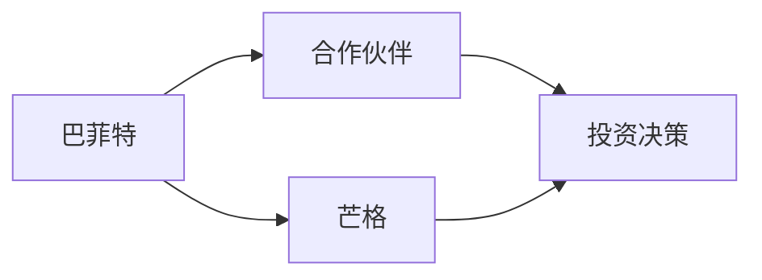

                 

# 巴菲特的圈子能力理论：知道自己的局限

---

## 关键词：
巴菲特，圈子能力，投资决策，局限性，价值投资，风险管理，长期投资

---

## 摘要：
本文系统阐述了巴菲特的圈子能力理论，通过对其投资理念、圈子能力的核心要素、数学模型以及实际应用的深入分析，揭示了巴菲特如何通过圈子能力实现投资成功，并强调了认知自身局限的重要性。文章从背景介绍、核心概念、算法原理、系统分析、实际应用到最佳实践，层层展开，为读者提供全面而深入的见解。

---

## 目录：

### 第一章：巴菲特与圈子能力概述

1.1 巴菲特的生平与投资理念  
1.2 圈子能力的概念与背景  
1.3 巴菲特圈子能力的理论基础  

### 第二章：圈子能力的核心概念与联系

2.1 圈子能力的核心原理  
2.2 核心概念对比分析  
2.3 实体关系图  

### 第三章：圈子能力的算法与数学模型

3.1 圈子能力的算法原理  
3.2 数学模型与公式  
3.3 算法优化与应用  

### 第四章：圈子能力的系统分析与架构设计

4.1 问题场景介绍  
4.2 系统功能设计  
4.3 系统架构设计  
4.4 系统接口设计  
4.5 系统交互设计  

### 第五章：圈子能力的实际应用与案例分析

5.1 投资决策中的圈子能力应用  
5.2 巴菲特成功案例分析  
5.3 实际投资中的圈子能力优化  
5.4 案例分析与经验总结  

### 第六章：圈子能力的局限性与风险管理

6.1 圈子能力的局限性分析  
6.2 风险管理策略  
6.3 投资决策中的平衡之道  
6.4 误区警示  

### 第七章：总结与最佳实践

7.1 全文总结  
7.2 最佳实践 Tips  
7.3 注意事项与展望  
7.4 未来研究方向  

---

## 正文：

### 第一章：巴菲特与圈子能力概述

#### 1.1 巴菲特的生平与投资理念
沃伦·巴菲特是全球最成功的投资者之一，他的投资理念以价值投资为核心。他强调通过深入研究企业基本面，寻找具有持续竞争优势的企业进行长期投资。巴菲特的成功不仅依赖于个人能力，还与其独特的圈子能力密切相关。

#### 1.2 圈子能力的概念与背景
圈子能力是指通过建立和维护高质量的关系网络，获取信息、资源和支持的能力。在投资领域，圈子能力可以帮助投资者发现优质机会，降低信息不对称，提高决策质量。

#### 1.3 巴菲特圈子能力的理论基础
巴菲特的圈子能力理论强调了信任、长期关系和互补性。他与查理·芒格的合作就是圈子能力成功应用的典范，两人通过互补的能力和信任，共同构建了独特的投资体系。

---

### 第二章：圈子能力的核心概念与联系

#### 2.1 圈子能力的核心原理
圈子能力的核心在于建立高质量的关系网络。通过信任和互补，投资者可以获取更多的信息和资源，从而做出更明智的投资决策。

#### 2.2 核心概念对比分析
| 概念       | 描述                                                                 |
|------------|----------------------------------------------------------------------|
| 个人能力   | 个体的知识、技能和判断力                                             |
| 圈子能力   | 通过关系网络获取的支持和资源                                         |
| 团队能力   | 团队成员的协作能力和整体表现                                         |

#### 2.3 实体关系图

---

### 第三章：圈子能力的算法与数学模型

#### 3.1 圈子能力的算法原理
评估圈子能力时，需要考虑信任度、互补性和合作频率等因素。通过加权计算，确定每个关系的影响力。

#### 3.2 数学模型与公式
圈子能力的计算公式：
$$ \text{圈子能力} = \sum_{i=1}^{n} w_i \cdot c_i $$
其中，\( w_i \) 是第 \( i \) 个要素的权重，\( c_i \) 是第 \( i \) 个要素的能力值。

#### 3.3 算法优化与应用
通过动态调整权重，优化圈子能力，以应对市场变化和投资需求。

---

### 第四章：圈子能力的系统分析与架构设计

#### 4.1 问题场景介绍
巴菲特的圈子能力在投资决策中的应用场景，包括信息获取、资源分配和风险控制。

#### 4.2 系统功能设计
- 圈子能力评估模块：评估关系质量。
- 信息共享模块：优化信息获取效率。

#### 4.3 系统架构设计

---

### 第五章：圈子能力的实际应用与案例分析

#### 5.1 投资决策中的圈子能力应用
通过圈子能力获取内部消息和行业见解，优化投资决策。

#### 5.2 巴菲特成功案例分析
巴菲特与可口可乐的合作，通过圈子能力获取长期稳定的收益。

#### 5.3 实际投资中的圈子能力优化
动态调整圈子结构，应对市场变化。

---

### 第六章：圈子能力的局限性与风险管理

#### 6.1 圈子能力的局限性分析
圈子能力无法覆盖所有投资领域，存在信息过载和决策偏差的风险。

#### 6.2 风险管理策略
通过多元化和分散投资，降低圈子能力的局限性带来的风险。

---

### 第七章：总结与最佳实践

#### 7.1 全文总结
巴菲特的圈子能力理论强调了信任、互补性和长期关系的重要性，但同时也需要认识到其局限性。

#### 7.2 最佳实践 Tips
- 建立高质量的关系网络。
- 定期评估和优化圈子能力。

#### 7.3 注意事项与展望
- 注意信息过载和决策偏差。
- 未来研究方向包括圈子能力与人工智能的结合。

---

通过以上章节的系统分析，读者可以全面理解巴菲特的圈子能力理论，并将其应用于实际投资中，同时认识到自身能力的局限性，做出更为明智的投资决策。

