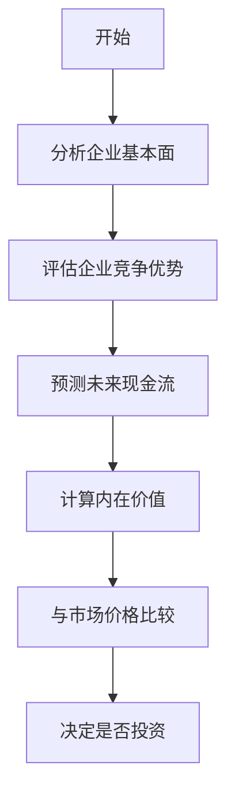

                 

# 巴菲特的媒体投资案例：华盛顿邮报的故事

## 关键词：巴菲特、媒体投资、华盛顿邮报、价值投资、长期投资

## 摘要：  
本文以巴菲特收购《华盛顿邮报》为案例，详细分析了其媒体投资的策略、方法和成功的关键因素。通过深入解析巴菲特的投资理念、媒体行业的特点、价值评估模型和系统架构设计，结合实际案例，为读者揭示巴菲特在媒体投资领域的独特见解和实践智慧。

---

## 第一部分：背景介绍

### 第1章：巴菲特的背景与投资理念

#### 1.1 巴菲特的投资哲学  
沃伦·巴菲特是全球最著名的价值投资者之一，其投资理念以“价值投资”为核心，强调以低于内在价值的价格购买优秀的公司。他的投资策略注重长期持有、注重公司基本面分析，并偏好具有强大竞争优势和持续盈利能力的企业。

#### 1.2 媒体行业的现状与挑战  
媒体行业是一个历史悠久但不断变革的行业，从传统的报纸、杂志到数字媒体、互联网新闻，媒体的形态和传播方式发生了翻天覆地的变化。数字化转型、读者习惯的变化、广告模式的转变以及竞争的加剧，使得媒体行业面临巨大的挑战和机遇。

---

## 第二部分：核心概念与联系

### 第2章：媒体行业的特点与投资关键要素

#### 2.1 媒体行业的核心要素  
媒体行业的核心要素包括：  
- **内容生产能力**：优质内容是吸引读者和广告商的关键。  
- **品牌影响力**：历史悠久的媒体品牌具有较高的市场信任度。  
- **成本结构**：媒体行业的成本主要集中在内容生产和发行渠道上。  
- **收入来源**：包括订阅、广告和发行收入。  

#### 2.2 巴菲特的投资策略分析  
巴菲特在媒体行业的投资策略包括：  
- **寻找具有强大竞争优势的公司**：例如《华盛顿邮报》作为美国最具影响力的报纸之一，具有强大的品牌影响力和读者基础。  
- **注重财务健康**：巴菲特偏好那些财务稳健、负债低、现金流充足的公司。  
- **长期投资**：巴菲特的投资以长期持有为主，注重企业的长期价值增长。  

---

## 第三部分：投资分析的算法与模型

### 第3章：媒体投资分析的流程与模型

#### 3.1 价值评估模型  
巴菲特的价值投资方法依赖于对企业内在价值的评估，常用的方法是现金流折现模型（DCF）。以下是DCF模型的步骤：

1. **预测未来现金流**：基于企业的财务数据和市场环境，预测未来5-10年的自由现金流。  
2. **确定折现率**：通常使用企业的加权平均资本成本（WACC）作为折现率。  
3. **计算终值**：假设企业未来现金流保持稳定增长，计算终值。  
4. **计算企业价值**：将未来现金流的现值与终值的现值相加，得到企业价值。  
5. **与市场价格比较**：如果市场价格低于企业价值，则企业具有投资价值。  

#### 3.2 投资决策流程  
以下是巴菲特的投资决策流程的Mermaid图：

---

## 第四部分：系统分析与架构设计

### 第4章：媒体投资分析系统的构建

#### 4.1 投资分析系统的模块划分  
媒体投资分析系统可以分为以下几个模块：  
- **数据收集模块**：收集目标媒体公司的财务数据、行业数据等。  
- **数据分析模块**：对数据进行清洗、建模和分析。  
- **投资决策支持模块**：基于分析结果，提供投资建议。  

#### 4.2 系统架构设计  
以下是媒体投资分析系统的架构图：

---

## 第五部分：项目实战——华盛顿邮报的收购案例

### 第5章：华盛顿邮报收购案例分析

#### 5.1 收购背景与动机  
1976年，巴菲特通过伯克希尔哈撒韦公司收购了《华盛顿邮报》。当时，报纸行业面临广告收入下降和读者流失的挑战，但《华盛顿邮报》凭借其强大的品牌影响力和优质的内容，仍然具有较高的市场地位。  

#### 5.2 收购过程与分析  
1. **财务分析**：  
   - 《华盛顿邮报》的财务状况稳健，具有较高的净利润率和稳定的现金流。  
   - 公司的负债较低，财务风险较小。  

2. **竞争优势分析**：  
   - 公司拥有强大的品牌影响力和读者基础。  
   - 内容生产能力强，能够持续提供高质量的新闻报道。  

3. **价值评估**：  
   - 使用DCF模型评估《华盛顿邮报》的内在价值，发现其市场价格低于内在价值，具有投资吸引力。  

#### 5.3 启示与经验总结  
巴菲特收购《华盛顿邮报》的成功，主要得益于以下几个方面：  
- **注重企业基本面**：巴菲特选择了财务稳健、具有强大竞争优势的企业。  
- **长期投资理念**：巴菲特的投资以长期持有为主，注重企业的长期价值增长。  
- **逆周期投资**：在媒体行业面临挑战时，巴菲特选择了优质企业进行投资，体现了其逆周期投资的智慧。  

---

## 第六部分：小结与最佳实践

### 6.1 小结  
巴菲特的媒体投资案例《华盛顿邮报》展示了价值投资的精髓：通过深入分析企业的基本面，选择具有强大竞争优势和财务健康的企业，以低于内在价值的价格进行投资，并长期持有。  

### 6.2 最佳实践  
1. **注重企业基本面分析**：在投资前，必须对企业的财务状况、竞争优势和行业地位进行深入分析。  
2. **长期投资**：避免短期市场波动的干扰，注重企业的长期价值增长。  
3. **逆周期投资**：在行业面临挑战时，选择优质企业进行投资，往往能够获得超额收益。  

### 6.3 注意事项  
- 投资者在进行媒体投资时，需要密切关注行业趋势和市场变化，及时调整投资策略。  
- 需要警惕媒体行业的高竞争性和不确定性，避免盲目跟风。  

### 6.4 拓展阅读  
1. 巴菲特的《 Intelligent Investor》  
2. 媒体行业的相关研究报告  
3. 其他巴菲特的经典投资案例  

---

通过本文的分析，读者可以更好地理解巴菲特的媒体投资策略，并将其应用于实际投资中。

