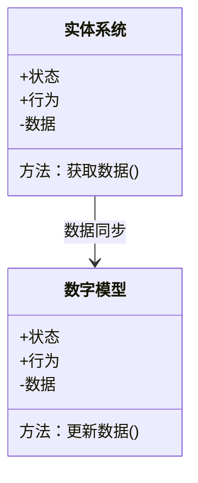
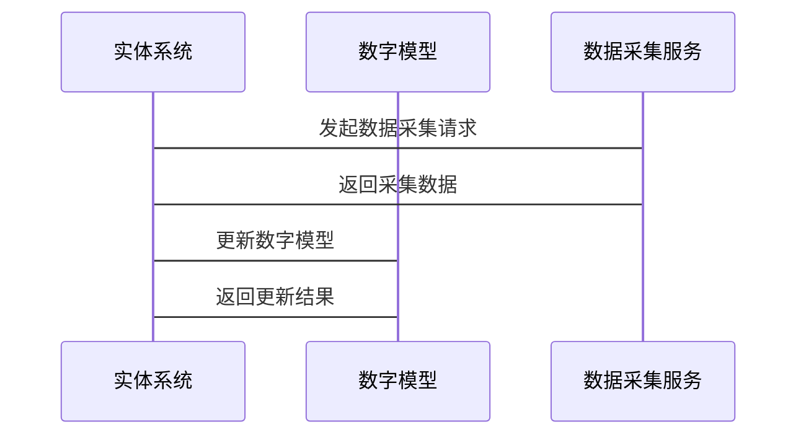

                 


```markdown
# 巴菲特的宏观经济分析：数字孪生技术对实体经济的影响

## 关键词：
- 巴菲特，宏观经济分析，数字孪生，实体经济，技术影响

## 摘要：
本文探讨了数字孪生技术对实体经济的影响，结合巴菲特的宏观经济分析方法，分析了数字孪生技术在制造业、金融领域的应用及其对经济结构和政策的深远影响。文章通过系统分析与架构设计，展示了数字孪生技术如何优化经济预测和决策，为投资者和政策制定者提供新的视角。

---

## 第一章：巴菲特的宏观经济分析概述

### 1.1 宏观经济分析的基本概念

#### 1.1.1 宏观经济分析的定义
宏观经济分析是研究整体经济系统的行为和相互关系的学科，关注GDP、通货膨胀、失业率等宏观指标。巴菲特通过分析这些指标，预测经济趋势并指导投资决策。

#### 1.1.2 宏观经济分析的核心要素
- 经济增长：GDP增长率反映经济活力。
- 通货膨胀：影响购买力和投资决策。
- 就业市场：失业率与劳动力市场的健康状况相关。

#### 1.1.3 巴菲特的宏观经济分析方法
巴菲特注重长期趋势和企业基本面，结合经济周期分析，选择在经济低迷时投资优质企业，长期持有以实现资本增值。

### 1.2 巴菲特的经济思想与投资策略

#### 1.2.1 巴菲特的投资哲学
- 长期投资：避免短期波动，关注企业内在价值。
- 价值投资：寻找被市场低估的企业，长期持有。

#### 1.2.2 巴菲特的经济周期分析
- 经济周期波动：通过分析周期，确定投资时机。
- 企业盈利能力：关注企业在不同经济周期中的表现。

#### 1.2.3 巴菲特的长期投资策略
- 选择优质企业：具备竞争优势和持续盈利能力。
- 分散投资风险：通过多元化投资降低风险。

---

## 第二章：数字孪生技术的基本原理

### 2.1 数字孪生的定义与技术基础

#### 2.1.1 数字孪生的定义
数字孪生是物理实体在数字空间的虚拟副本，通过实时数据更新，反映实体状态。

#### 2.1.2 数字孪生的核心技术
- 数据采集：传感器实时采集物理数据。
- 数据建模：构建高精度数字模型。
- 数据可视化：通过可视化工具展示数据。

#### 2.1.3 数字孪生与实体经济的关系
数字孪生是实体经济的数字映射，通过模拟和分析优化实体运营。

### 2.2 数字孪生技术的实现架构

#### 2.2.1 数据采集与处理
- 传感器数据采集：如温度、压力等。
- 数据清洗：去除噪声，确保数据准确性。

#### 2.2.2 模型构建与仿真
- 数学建模：使用系统动力学模型。
- 仿真分析：预测实体行为，优化决策。

#### 2.2.3 数据分析与决策支持
- 数据挖掘：发现数据中的潜在规律。
- 数据可视化：通过图表展示分析结果。

---

## 第三章：数字孪生技术对实体经济的影响

### 3.1 数字孪生在制造业中的应用

#### 3.1.1 制造业的数字化转型
- 数字化生产：通过数字孪生优化生产流程。
- 智能工厂：实现设备互联互通，提升生产效率。

#### 3.1.2 数字孪生对生产效率的提升
- 实时监控：及时发现并解决问题。
- 预测维护：减少设备故障，延长设备寿命。

#### 3.1.3 数字孪生在供应链管理中的作用
- 供应链优化：通过模拟优化物流路径。
- 库存管理：实时监控库存，减少浪费。

### 3.2 数字孪生在金融领域的应用

#### 3.2.1 金融风险评估与管理
- 风险建模：通过数字孪生模拟风险场景。
- 风险预测：预测市场波动，制定应对策略。

#### 3.2.2 数字孪生在投资决策中的应用
- 投资组合优化：通过模拟分析优化投资组合。
- 市场预测：预测市场趋势，指导投资决策。

#### 3.2.3 数字孪生对金融监管的影响
- 监管实时监控：通过数字孪生实时监控金融机构行为。
- 监管决策支持：提供数据支持，辅助监管决策。

---

## 第四章：数字孪生技术的宏观经济分析

### 4.1 数字孪生对经济结构的影响

#### 4.1.1 数字孪生对产业结构的优化
- 产业升级：通过数字孪生推动传统产业数字化转型。
- 新兴产业：催生新的经济增长点，如数字经济。

#### 4.1.2 数字孪生对就业市场的冲击与机遇
- 就业结构变化：自动化减少传统岗位，增加技术岗位。
- 新职业出现：数据分析师、数字孪生专员等新兴职业。

#### 4.1.3 数字孪生对经济增长的推动作用
- 经济效率提升：通过优化资源配置提高整体经济效率。
- 创新驱动：数字孪生促进技术创新，推动经济增长。

### 4.2 数字孪生对经济政策的影响

#### 4.2.1 数字孪生对货币政策的启示
- 货币政策工具：通过数字孪生模拟货币政策效果，优化政策制定。
- 经济预测：提高经济预测的准确性，制定更有效的货币政策。

#### 4.2.2 数字孪生对财政政策的影响
- 财政政策工具：通过数字孪生模拟财政政策效果，优化政策实施。
- 政府决策支持：提供数据支持，辅助政府制定更科学的财政政策。

#### 4.2.3 数字孪生对经济预测的准确性提升
- 经济模型优化：通过数字孪生构建更精确的经济模型，提高预测准确性。
- 数据分析能力：利用大数据分析技术，提高经济预测的准确性。

---

## 第五章：数字孪生技术的系统分析与架构设计

### 5.1 系统分析与需求定义

#### 5.1.1 问题场景介绍
- 问题背景：实体经济面临效率低下、资源浪费等问题。
- 问题描述：通过数字孪生技术优化实体经济运营。
- 问题解决：构建数字孪生系统，实时监控和优化实体运营。

#### 5.1.2 系统功能设计
- 数据采集：实时采集物理数据。
- 模型构建：建立高精度数字模型。
- 数据分析：分析数据，提供决策支持。

#### 5.1.3 领域模型设计（Mermaid 类图）


### 5.2 系统架构设计

#### 5.2.1 系统架构设计（Mermaid 架构图）
```mermaid
archi
    组件 数据采集层 {
        传感器
        数据采集服务
    }
    组件 数据处理层 {
        数据清洗服务
        数据存储服务
    }
    组件 数字模型层 {
        数字建模服务
        模拟分析服务
    }
    组件 应用层 {
        数据可视化服务
        决策支持服务
    }
    数据采集层 --> 数据处理层
    数据处理层 --> 数字模型层
    数字模型层 --> 应用层
```

#### 5.2.2 系统接口设计
- 数据接口：提供API接口，实现数据的实时传输。
- 模型接口：提供API接口，实现数字模型的更新和维护。

#### 5.2.3 系统交互设计（Mermaid 序列图）


---

## 总结

数字孪生技术作为连接数字世界与实体经济的桥梁，正在改变我们的生活方式、工作方式和思维方式。通过与巴菲特的宏观经济分析相结合，我们可以更好地理解数字孪生技术对经济的深远影响。未来，随着技术的不断发展，数字孪生将在更多领域发挥重要作用，推动经济的进一步发展。

---

## 最佳实践 Tips

- **小结**：数字孪生技术通过实时数据和模拟分析，优化实体经济的运营效率，推动经济增长。
- **注意事项**：在实际应用中，需注意数据隐私和安全问题，确保系统的稳定性和可靠性。
- **拓展阅读**：建议进一步阅读《巴菲特的选股之道》和《数字孪生技术与工业4.0》等书籍，深入理解数字孪生与宏观经济的结合。

---

通过本文的分析，我们可以看到数字孪生技术对实体经济的影响是深远而广泛的。它不仅改变了我们的生活方式，也为我们提供了新的思维方式和决策工具。未来，随着技术的不断发展，数字孪生将在更多领域发挥重要作用，推动经济的进一步发展。
```

