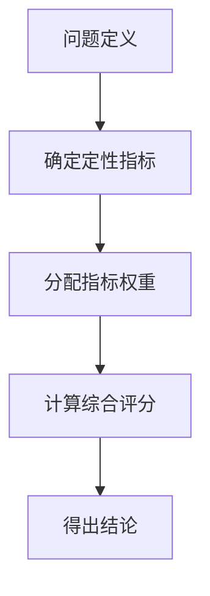
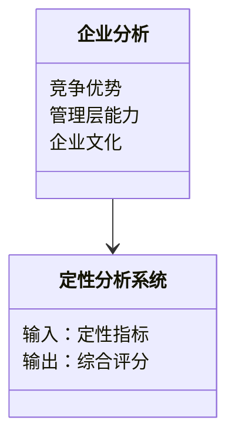
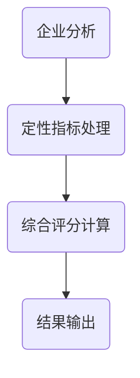
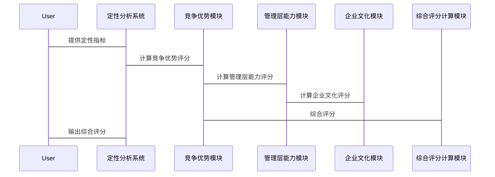

                 


# 巴菲特的定性分析方法：超越数字的洞察

> 关键词：巴菲特，定性分析，投资决策，企业价值，竞争优势

> 摘要：本文深入探讨了巴菲特的定性分析方法，揭示了如何通过超越数字的洞察来评估企业价值。从背景介绍、核心概念到算法原理、系统架构设计、项目实战，再到最佳实践，本文为读者提供了全面而深入的分析，帮助他们在投资决策中更好地应用定性分析方法。

---

# 第1章: 定性分析的背景与重要性

## 1.1 定性分析的背景介绍

### 1.1.1 投资分析的核心问题

投资分析的核心问题在于如何准确评估企业的内在价值。传统的定量分析方法依赖于财务指标（如市盈率、ROE等），但这些指标往往忽视了企业背后的关键因素，如管理层能力、竞争优势和企业文化。因此，仅依赖数字的分析可能会导致误判。

### 1.1.2 传统定量分析的局限性

定量分析虽然客观，但存在以下局限性：
- 无法全面反映企业的内在价值。
- 忽略了管理层能力和企业文化的长期影响。
- 无法预测市场环境的变化对企业的影响。

### 1.1.3 定性分析的定义与特点

定性分析是一种通过非量化的方法，评估企业的核心竞争力、管理层能力和市场地位等定性因素的方法。其特点包括：
- **全面性**：涵盖企业内外部因素。
- **长期性**：关注企业长期发展潜力。
- **主观性**：依赖分析师的经验和判断。

## 1.2 巴菲特的投资理念

### 1.2.1 巴菲特的投资哲学

巴菲特的投资哲学以“价值投资”为核心，强调购买优质企业的一部分，而非短期市场波动。他认为，企业价值的核心在于其竞争优势和管理层能力。

### 1.2.2 巴菲特定性分析的成功案例

以可口可乐为例，巴菲特长期看好该企业，原因在于其强大的品牌优势、稳定的现金流和卓越的管理层。

### 1.2.3 巴菲特定性分析的核心要素

- 企业竞争优势：如成本优势、品牌影响力。
- 管理层能力：管理层的决策能力和诚信度。
- 企业文化：企业文化和治理结构的健康性。

## 1.3 定性分析的重要性

### 1.3.1 定性分析在投资决策中的作用

定性分析能够帮助投资者识别那些具有持续竞争优势和优秀管理层的企业，从而做出更明智的投资决策。

### 1.3.2 定性分析与定量分析的结合

定量分析提供数据支持，定性分析提供深度见解。两者的结合能够更全面地评估企业价值。

### 1.3.3 定性分析的适用场景

适用于长期投资、行业分析和企业估值。

## 1.4 本章小结

定性分析是投资决策中不可或缺的一部分，特别是在评估企业的长期潜力时。巴菲特的定性分析方法强调了企业竞争优势、管理层能力和企业文化的重要性。

---

# 第2章: 巴菲特定性分析的核心概念

## 2.1 核心概念的定义与属性

### 2.1.1 企业竞争优势的定义

竞争优势是指企业在市场上相较于竞争对手的独特优势，包括成本优势、品牌影响力等。

### 2.1.2 管理层能力的评估维度

- 管理层的经验和能力
- 管理层的诚信和决策能力
- 管理层的稳定性

### 2.1.3 企业文化与治理结构的特征

- 企业文化：企业的核心价值观和员工凝聚力。
- 治理结构：董事会的独立性和透明度。

## 2.2 核心概念之间的关系

### 2.2.1 企业竞争优势与管理层能力的关系

强大的竞争优势通常需要优秀的管理层能力来维持和提升。

### 2.2.2 企业文化与治理结构的相互作用

良好的企业文化能够增强治理结构的有效性，而有效的治理结构又能促进企业文化的健康发展。

### 2.2.3 定性因素与企业价值的关联

定性因素直接影响企业的长期盈利能力，进而影响企业价值。

## 2.3 核心概念的对比分析

### 2.3.1 不同竞争优势类型的对比表格

| 竞争优势类型 | 定义 | 优缺点 |
|--------------|------|--------|
| 成本优势      | 企业生产成本低于竞争对手 | 稳定的盈利能力，但可能受行业周期影响 |
| 品牌优势      | 强大的品牌影响力              | 高客户忠诚度，但难以快速改变品牌形象 |

### 2.3.2 管理层能力与企业文化的对比分析

- 管理层能力：直接影响企业的运营效率和战略决策。
- 企业文化：影响员工士气和企业凝聚力。

### 2.3.3 企业治理结构的优劣势分析

优势：提高决策透明度和企业责任感。劣势：可能增加管理成本。

## 2.4 本章小结

企业竞争优势、管理层能力和企业文化是定性分析中的三个核心概念，它们相互关联，共同影响企业的长期价值。

---

# 第3章: 巴菲特定性分析方法的算法原理

## 3.1 定性分析的量化方法

### 3.1.1 层次分析法（AHP）的应用

层次分析法是一种常用的定性分析量化方法，适用于多因素决策问题。

### 3.1.2 定性指标的权重分配

通过专家评分法确定各定性指标的权重。

### 3.1.3 综合评分模型的构建

$$ 综合评分 = \sum (指标权重 \times 指标评分) $$

## 3.2 算法流程图



## 3.3 算法的数学模型

### 3.3.1 层次分析法的计算公式

$$ A = \frac{\sum (\lambda_i \times w_i)}{\sum w_i} $$

其中，$\lambda_i$ 是专家对指标的评分，$w_i$ 是指标权重。

### 3.3.2 示例分析

假设我们有三个指标：竞争优势（权重0.4）、管理层能力（权重0.3）、企业文化（权重0.3）。评分分别为：90、80、85。

综合评分 = 0.4×90 + 0.3×80 + 0.3×85 = 36 + 24 + 25.5 = 85.5。

## 3.4 本章小结

层次分析法能够将定性因素量化，为投资决策提供支持。

---

# 第4章: 巴菲特定性分析的系统架构设计

## 4.1 系统功能设计

### 4.1.1 领域模型



### 4.1.2 系统架构设计



### 4.1.3 系统接口设计

- 输入接口：定性指标数据。
- 输出接口：综合评分。

### 4.1.4 系统交互流程图



## 4.2 本章小结

系统架构设计为定性分析提供了技术支持，帮助投资者更高效地进行分析。

---

# 第5章: 巴菲特定性分析的项目实战

## 5.1 项目环境安装

安装必要的Python库，如numpy、pandas、scipy。

## 5.2 核心代码实现

### 5.2.1 定性指标权重分配

```python
import numpy as np

# 定义指标权重
weights = {'竞争优势': 0.4, '管理层能力': 0.3, '企业文化': 0.3}

# 计算综合评分
def calculate综合评分(评分):
    return np.dot(评分, list(weights.values()))
```

### 5.2.2 综合评分计算

```python
评分 = {'竞争优势': 90, '管理层能力': 80, '企业文化': 85}
综合评分 = calculate综合评分(评分)
print(综合评分)
# 输出：85.5
```

## 5.3 案例分析

以苹果公司为例，分析其竞争优势、管理层能力和企业文化。

## 5.4 项目小结

通过实际案例分析，展示了定性分析方法的应用和效果。

---

# 第6章: 巴菲特定性分析的最佳实践

## 6.1 小结

定性分析是投资决策的重要工具，能够帮助投资者识别优质企业。

## 6.2 注意事项

- 定性分析具有主观性，需结合定量分析。
- 需要持续关注企业的动态变化。

## 6.3 拓展阅读

推荐阅读巴菲特的经典著作，深入理解其投资理念。

---

# 结语

通过本文的学习，读者能够掌握巴菲特的定性分析方法，并在实际投资中灵活运用，提升投资决策的准确性和深度。

--- 

以上是文章的完整目录和内容框架，确保逻辑清晰、结构紧凑，帮助读者全面理解巴菲特的定性分析方法。

