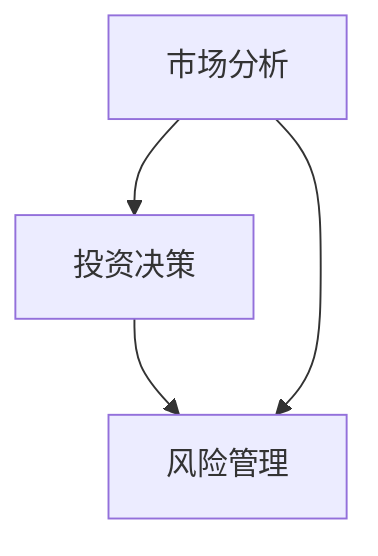
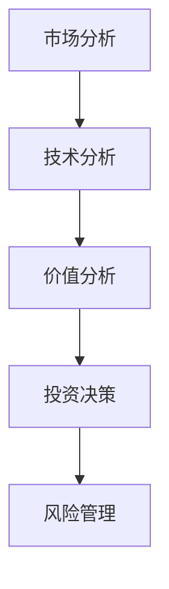
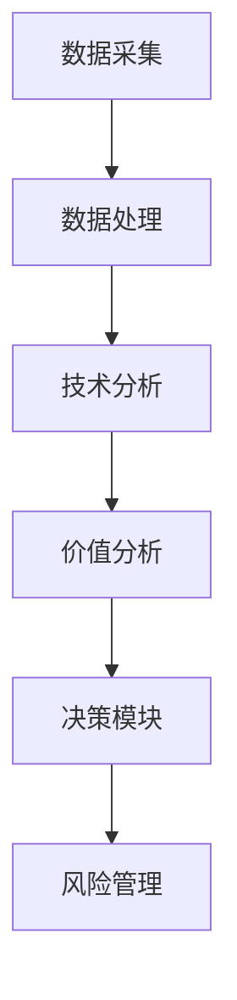
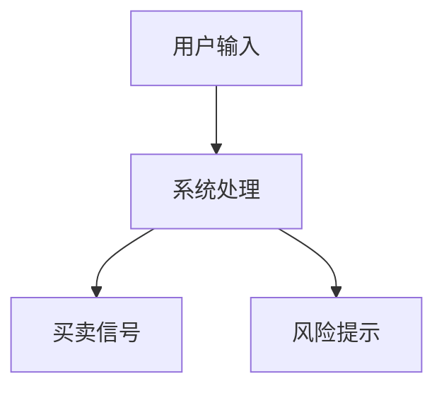

                 


# 巴菲特的市场Timing策略：何时买入和卖出

> 关键词：巴菲特，市场Timing，投资策略，价值投资，风险管理，技术分析，系统设计

> 摘要：本文系统地探讨了巴菲特的市场时机选择策略，从其核心理念到实际应用，结合技术分析和风险管理，深入剖析其买入和卖出决策的关键点，并通过实际案例和系统设计展示其策略的有效性。

---

## 第一部分: 巴菲特的市场Timing策略概述

### 第1章: 巴菲特市场Timing策略的背景与核心理念

#### 1.1 投资市场的基本概念
- 1.1.1 市场波动性与投资机会
- 1.1.2 市场参与者的行为模式
- 1.1.3 投资目标与策略选择

#### 1.2 巴菲特投资理念的起源
- 1.2.1 早期导师本杰明·格雷厄姆的影响
- 1.2.2 价值投资的核心理念
- 1.2.3 巴菲特对市场的独特见解

#### 1.3 巴菲特市场Timing策略的核心要素
- 1.3.1 市场分析的核心要素：基本面与情绪面
- 1.3.2 投资决策的核心要素：安全边际与内在价值
- 1.3.3 风险管理的核心要素：分散投资与长期持有

### 第2章: 巴菲特市场Timing策略的核心概念与联系

#### 2.1 核心概念原理
- 2.1.1 市场分析的数学模型：价值与价格的偏离
- 2.1.2 投资决策的逻辑框架：安全边际的应用
- 2.1.3 风险控制的策略：分散与对冲

#### 2.2 核心概念属性特征对比
- 2.2.1 市场分析与投资决策的对比
- 2.2.2 投资决策与风险管理的对比
- 2.2.3 市场分析与风险管理的对比

#### 2.3 实体关系图


---

## 第二部分: 巴菲特市场Timing策略的算法原理

### 第3章: 巴菲特市场Timing策略的算法原理

#### 3.1 算法原理概
- 3.1.1 市场分析的算法步骤
- 3.1.2 投资决策的数学模型
- 3.1.3 风险管理的策略优化

#### 3.2 核心算法流程
- 3.2.1 市场分析：基本面指标与情绪指标的结合
- 3.2.2 投资决策：内在价值与安全边际的计算
- 3.2.3 风险管理：动态调整与止损机制

#### 3.3 技术分析与价值分析的结合
- 3.3.1 技术指标的应用：移动平均线与相对强弱指数
- 3.3.2 价值分析的应用：内在价值计算与安全边际

#### 3.4 算法流程图


### 第4章: 巴菲特市场Timing策略的技术分析

#### 4.1 技术分析的核心指标
- 4.1.1 移动平均线（MA）的计算与应用
- 4.1.2 相对强弱指数（RSI）的计算与应用
- 4.1.3 布林带（Bollinger Bands）的计算与应用

#### 4.2 技术分析与价值分析的结合
- 4.2.1 通过K线图识别市场趋势
- 4.2.2 利用技术指标确认买卖信号
- 4.2.3 结合基本面分析优化技术信号

#### 4.3 技术分析的Python实现
```python
import pandas as pd
import numpy as np
import matplotlib.pyplot as plt

# 示例代码：计算移动平均线
data = pd.read_csv('market_data.csv')
data['MA_50'] = data['Close'].rolling(50).mean()
data['MA_200'] = data['Close'].rolling(200).mean()
plt.plot(data['MA_50'], label='50日均线')
plt.plot(data['MA_200'], label='200日均线')
plt.legend()
plt.show()
```

---

## 第三部分: 巴菲特市场Timing策略的系统设计

### 第5章: 巴菲特市场Timing策略的系统架构设计

#### 5.1 问题场景介绍
- 5.1.1 市场波动的复杂性
- 5.1.2 投资决策的系统化需求
- 5.1.3 风险管理的自动化实现

#### 5.2 系统功能设计
- 5.2.1 数据采集模块：实时数据获取与处理
- 5.2.2 分析模块：技术分析与价值分析的结合
- 5.2.3 决策模块：买卖信号的生成与优化
- 5.2.4 风险控制模块：动态调整与止损机制

#### 5.3 系统架构图


### 第6章: 巴菲特市场Timing策略的系统实现

#### 6.1 项目环境安装
- 6.1.1 Python环境的搭建
- 6.1.2 数据处理库的安装：Pandas、NumPy
- 6.1.3 可视化库的安装：Matplotlib、Seaborn

#### 6.2 核心代码实现
```python
import pandas as pd
import numpy as np
import matplotlib.pyplot as plt

# 示例代码：计算内在价值
def calculate_intrinsic_value(price, growth_rate, discount_rate):
    return price / (1 + growth_rate) / (1 - discount_rate)

# 示例代码：计算安全边际
def calculate_margin_of_safety(intrinsic_value, market_price):
    return (intrinsic_value - market_price) / intrinsic_value * 100

# 示例代码：可视化市场趋势
data = pd.read_csv('market_data.csv')
plt.plot(data['Date'], data['Close'], label='Market Price')
plt.xlabel('Date')
plt.ylabel('Price')
plt.title('Market Trend Analysis')
plt.legend()
plt.show()
```

#### 6.3 系统交互设计
- 6.3.1 用户输入模块：市场数据与参数设置
- 6.3.2 系统输出模块：买卖信号与风险提示
- 6.3.3 系统日志记录：操作记录与错误处理

#### 6.4 系统交互图


---

## 第四部分: 巴菲特市场Timing策略的案例分析

### 第7章: 巴菲特市场Timing策略的实际案例分析

#### 7.1 投资案例背景
- 7.1.1 案例公司介绍
- 7.1.2 市场环境分析
- 7.1.3 投资目标设定

#### 7.2 技术分析与价值分析的结合
- 7.2.1 技术指标分析：K线图与移动平均线
- 7.2.2 价值分析：内在价值与安全边际计算
- 7.2.3 投资决策：买入与卖出时机的确定

#### 7.3 实际交易策略
- 7.3.1 买入时机的选择
- 7.3.2 卖出时机的选择
- 7.3.3 交易执行与风险管理

### 第8章: 巴菲特市场Timing策略的总结与展望

#### 8.1 总结
- 8.1.1 巴菲特市场Timing策略的核心思想
- 8.1.2 技术分析与价值分析的结合
- 8.1.3 风险管理的重要性

#### 8.2 展望
- 8.2.1 人工智能在市场Timing中的应用
- 8.2.2 大数据分析对投资决策的推动
- 8.2.3 未来投资策略的发展趋势

---

## 第五部分: 巴菲特市场Timing策略的优化与实战

### 第9章: 巴菲特市场Timing策略的优化

#### 9.1 系统优化思路
- 9.1.1 数据处理的优化
- 9.1.2 分析算法的优化
- 9.1.3 决策模块的优化

#### 9.2 实战经验总结
- 9.2.1 系统设计中的常见问题
- 9.2.2 实战中的风险管理技巧
- 9.2.3 技术分析与价值分析的结合优化

### 第10章: 巴菲特市场Timing策略的最佳实践

#### 10.1 最佳实践 tips
- 10.1.1 风险控制的注意事项
- 10.1.2 技术分析与价值分析的结合技巧
- 10.1.3 长期投资与短期交易的平衡

#### 10.2 小结
- 10.2.1 巴菲特市场Timing策略的核心要点
- 10.2.2 未来投资策略的发展方向
- 10.2.3 对投资者的建议与展望

---

## 参考文献
- 巴菲特的经典著作
- 相关投资策略的研究论文
- 技术分析的经典书籍
- 相关系统设计的文献

---

## 附录
- Python代码示例
- 技术指标的详细计算方法
- 市场分析的案例研究

---

通过以上目录大纲，我们可以看到，文章从巴菲特的市场Timing策略的基本概念，到其算法原理、系统设计，再到实际案例分析和优化实战，全面、系统地探讨了这一主题。

