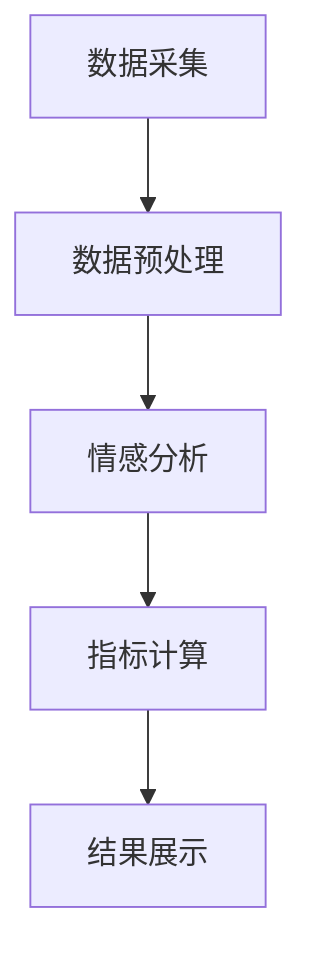

                 


# 巴菲特的市场情绪指标2.0：社交媒体时代的舆情分析

> 关键词：巴菲特市场情绪指标、社交媒体舆情分析、情感分析算法、市场情绪预测、投资决策优化

> 摘要：本文深入探讨了巴菲特市场情绪指标在社交媒体时代的演变与应用，结合最新的自然语言处理和机器学习技术，提出了一种基于社交媒体数据的市场情绪分析方法。通过构建多维度的情绪指标体系，本文旨在为投资者提供更精准的市场情绪预测和投资决策优化方案。文章从理论到实践，系统地介绍了情绪指标的设计、算法实现、系统架构以及项目实战，为读者提供了全面的技术指导。

---

## 第一部分: 巴菲特的市场情绪指标与社交媒体舆情分析概述

### 第1章: 市场情绪分析的背景与重要性

#### 1.1 什么是市场情绪指标

##### 1.1.1 市场情绪指标的定义
市场情绪指标（Market Sentiment Indicators）是用来衡量市场参与者情绪状态的量化工具，反映了市场对某一资产或市场的乐观或悲观程度。这些指标通常通过分析市场参与者的言行、交易行为和媒体报道等信息来构建。

##### 1.1.2 巴菲特市场情绪指标的演变
巴菲特作为价值投资的代表人物，其市场情绪指标最初主要依赖于传统媒体和市场数据。然而，随着社交媒体的兴起，传统的指标体系逐渐暴露出数据来源单一、实时性不足等问题。

##### 1.1.3 社交媒体时代市场情绪分析的新特点
社交媒体的海量数据、实时性和互动性为市场情绪分析提供了新的可能性。相比于传统媒体，社交媒体数据更具颗粒度，能够捕捉到更实时、更分散的市场情绪信号。

#### 1.2 市场情绪分析的重要性

##### 1.2.1 市场情绪与投资决策的关系
市场情绪是影响资产价格波动的重要因素。投资者通过对市场情绪的分析，可以更好地理解市场的波动性，优化投资策略。

##### 1.2.2 社交媒体对市场情绪的影响
社交媒体已经成为市场情绪传播和放大器的重要渠道。突发事件在社交媒体上的传播往往会导致市场情绪的快速变化，进而影响资产价格。

##### 1.2.3 量化市场情绪的挑战与机遇
传统的市场情绪指标往往依赖于主观判断，而社交媒体数据的引入使得市场情绪的量化分析成为可能。通过自然语言处理和机器学习技术，可以更精准地捕捉市场情绪的变化。

#### 1.3 巴菲特市场情绪指标的现状

##### 1.3.1 传统市场情绪指标的局限性
传统的市场情绪指标通常依赖于媒体分析和专家访谈，数据来源单一，且难以实时更新。

##### 1.3.2 社交媒体时代的新需求
社交媒体的兴起使得市场情绪分析需要更加实时、高频和多样化。投资者需要一种能够快速捕捉市场情绪变化的工具。

##### 1.3.3 巴菲特市场情绪指标2.0的提出
结合社交媒体数据和自然语言处理技术，提出了基于社交媒体的市场情绪指标2.0版本，旨在更准确地反映市场的实时情绪。

---

### 第2章: 社交媒体与市场情绪分析的结合

#### 2.1 社交媒体数据的特点

##### 2.1.1 数据的多样性
社交媒体数据包括文本、图片、视频等多种形式，信息来源广泛，覆盖了市场参与者的不同观点。

##### 2.1.2 数据的实时性
社交媒体数据可以实时更新，能够快速捕捉市场情绪的变化。

##### 2.1.3 数据的海量性
社交媒体每天产生的数据量巨大，为市场情绪分析提供了丰富的数据来源。

#### 2.2 社交媒体数据对市场情绪的影响

##### 2.2.1 情绪的传播与放大
社交媒体上的信息传播速度快，能够迅速放大市场情绪，影响资产价格。

##### 2.2.2 社交媒体事件对市场的冲击
突发事件在社交媒体上的快速传播可能导致市场的剧烈波动。

##### 2.2.3 情绪的周期性分析
通过分析社交媒体数据的时间序列，可以发现市场情绪的周期性变化规律。

#### 2.3 巴菲特市场情绪指标2.0的核心理念

##### 2.3.1 基于社交媒体的实时情绪监测
通过实时采集社交媒体数据，快速捕捉市场情绪的变化。

##### 2.3.2 多维度情绪指标的构建
结合文本情感分析、用户行为数据和市场交易数据，构建多维度的市场情绪指标体系。

##### 2.3.3 情绪指标与市场行为的关联分析
通过分析情绪指标与市场交易行为的关联性，优化投资决策。

---

### 第3章: 市场情绪指标的核心概念与联系

#### 3.1 核心概念的定义与属性

##### 3.1.1 情绪指标的构成要素
- 数据来源：社交媒体文本、用户行为数据、市场交易数据等。
- 情感分析：对社交媒体文本进行情感分类，提取情绪特征。
- 指标计算：基于情绪特征构建市场情绪指标。

##### 3.1.2 情绪指标的分类与特征
- 指标类型：恐慌指数、乐观指数、市场情绪强度等。
- 时间维度：实时指标、短期指标、长期指标。
- 行为维度：用户情绪、交易情绪、舆论情绪。

##### 3.1.3 情绪指标的数学模型
市场情绪指标可以通过加权平均、情感得分等方式进行计算。例如，恐慌指数的计算公式可以表示为：
$$
\text{恐慌指数} = \sum_{i=1}^{n} w_i \times \text{情感得分}_i
$$

#### 3.2 核心概念的对比分析

##### 3.2.1 不同情绪指标的对比表格
| 指标类型 | 数据来源 | 计算方法 | 适用场景 |
|----------|----------|----------|----------|
| 恐慌指数 | 社交媒体文本 | 加权情感得分 | 短期市场波动监测 |
| 乐观指数 | 用户行为数据 | 情感分类结果 | 长期市场趋势分析 |

##### 3.2.2 情绪指标与市场行为的ER实体关系图
```mermaid
er
  actor 情绪指标
  actor 市场行为
  relationship 关联分析
  情绪指标 --> 关联分析 --> 市场行为
```

---

### 第4章: 市场情绪分析的算法原理

#### 4.1 情感分析算法概述

##### 4.1.1 基于规则的情感分析
通过预设关键词和情感规则，对文本进行情感分类。例如，关键词“乐观”、“上涨”可能表示正面情绪，而“悲观”、“下跌”可能表示负面情绪。

##### 4.1.2 基于机器学习的情感分析
使用机器学习算法（如支持向量机、随机森林）对文本进行情感分类。训练数据通常包括标注好的文本和对应的情感标签。

##### 4.1.3 深度学习情感分析
利用神经网络模型（如LSTM、BERT）进行情感分析，能够更准确地捕捉文本的情感信息。

#### 4.2 情感分析算法实现

##### 4.2.1 文本预处理
对社交媒体文本进行清洗、分词和情感标签标注。

##### 4.2.2 特征提取
使用词袋模型或词嵌入模型（如Word2Vec）提取文本特征。

##### 4.2.3 模型训练
使用训练好的特征向量训练情感分类模型。

##### 4.2.4 模型评估
通过准确率、召回率等指标评估模型的性能。

#### 4.3 情感分析算法的数学模型

##### 4.3.1 词袋模型
词袋模型将文本表示为词袋，每个词的出现与否及其频率作为特征。

##### 4.3.2 LSTM模型
LSTM模型通过长短期记忆单元捕捉文本的情感信息，适用于处理序列数据。

---

## 项目实战: 基于社交媒体的市场情绪分析系统

### 5.1 系统架构设计

#### 5.1.1 系统功能模块
- 数据采集模块：从社交媒体API获取数据。
- 数据预处理模块：清洗和标注数据。
- 情感分析模块：对文本进行情感分类。
- 指标计算模块：基于情感结果计算市场情绪指标。
- 结果展示模块：可视化市场情绪指标。

#### 5.1.2 系统架构图


### 5.2 系统实现

#### 5.2.1 数据采集
使用Twitter API获取社交媒体数据。

#### 5.2.2 数据预处理
对获取的文本进行清洗、分词和情感标签标注。

#### 5.2.3 情感分析
使用预训练的BERT模型进行情感分类。

#### 5.2.4 指标计算
基于情感结果计算市场情绪指标，例如恐慌指数。

#### 5.2.5 结果展示
将市场情绪指标可视化，展示市场情绪的变化趋势。

---

## 总结与展望

### 6.1 总结
本文从理论到实践，系统地介绍了巴菲特市场情绪指标2.0的构建与应用。通过结合社交媒体数据和自然语言处理技术，提出了一种更精准的市场情绪分析方法，为投资者提供了优化的投资决策工具。

### 6.2 注意事项
在实际应用中，需要注意数据质量、模型精度和计算效率等问题。同时，市场情绪指标只能作为辅助工具，投资者需要结合其他因素进行综合判断。

### 6.3 拓展阅读
推荐阅读相关领域的最新研究成果，如自然语言处理在金融领域的应用、社交媒体数据挖掘等。

---

通过本文的系统介绍，读者可以全面了解如何利用社交媒体数据进行市场情绪分析，并在实际投资中应用这些方法。

