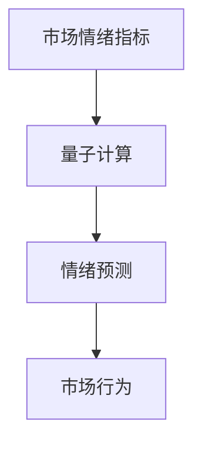
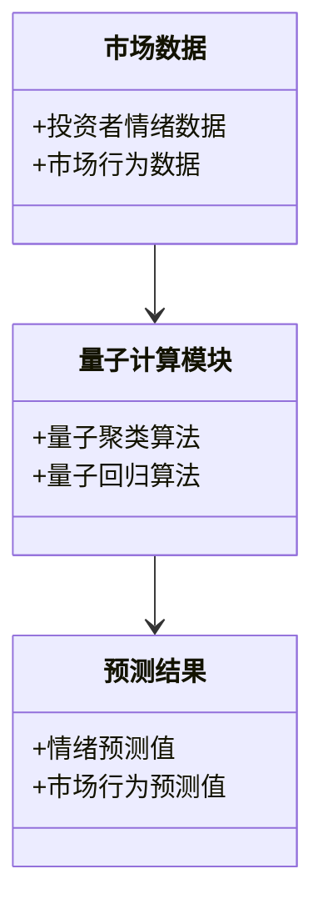
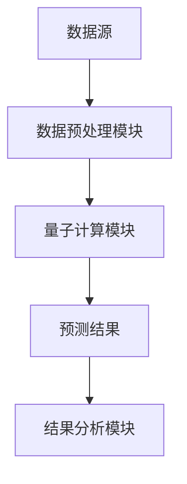
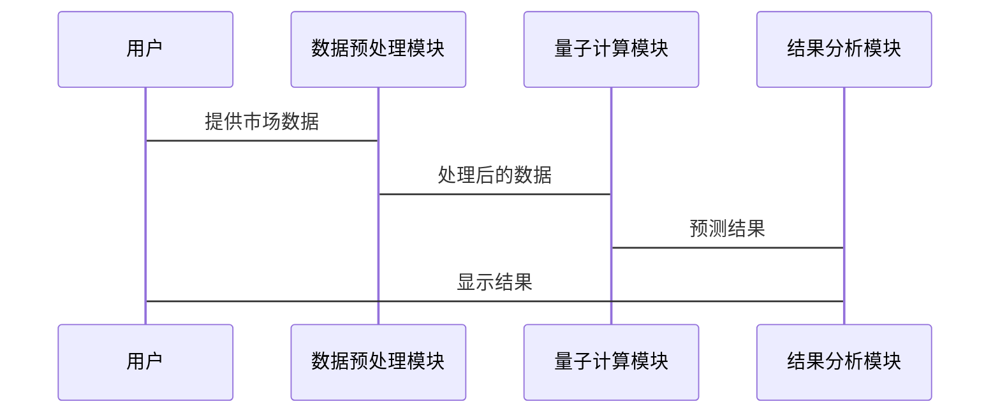

                 


---

# 巴菲特的市场情绪指标4.0：量子计算驱动的超级预测

## 关键词：市场情绪指标，量子计算，巴菲特，金融预测，人工智能，算法

## 摘要：

本文探讨了如何将量子计算应用于巴菲特的市场情绪指标，提出了一种创新的4.0版本，利用量子计算的超级计算能力提升市场情绪预测的精确度。文章从背景、核心概念、算法原理到系统设计和项目实战，详细阐述了这一创新方法，并通过实例分析展示了其优势。

---

## 目录大纲

1. **背景与概念**  
   1.1 市场情绪指标的定义与重要性  
   1.2 量子计算的基本原理与优势  
   1.3 量子计算与市场情绪指标的结合：巴菲特指标4.0  

2. **核心概念与联系**  
   2.1 市场情绪指标的核心要素  
   2.2 量子计算在情绪预测中的应用  
   2.3 核心概念的属性特征对比与ER图分析  

3. **量子计算驱动的算法原理**  
   3.1 量子聚类算法：原理、实现与优缺点  
   3.2 量子回归算法：数学模型与流程图  
   3.3 算法对比分析与实现步骤  

4. **系统分析与架构设计**  
   4.1 项目介绍与问题场景描述  
   4.2 系统功能设计：领域模型类图  
   4.3 系统架构设计：整体架构图  
   4.4 系统接口设计与交互序列图  

5. **项目实战与案例分析**  
   5.1 环境搭建与工具安装  
   5.2 核心代码实现与解读  
   5.3 实际案例分析与结果解读  
   5.4 项目小结与经验总结  

6. **最佳实践与未来展望**  
   6.1 小结：量子计算在市场情绪预测中的应用价值  
   6.2 注意事项与未来发展方向  
   6.3 拓展阅读与进一步学习建议  

---

## 正文

### 第一部分：背景与概念

#### 1.1 市场情绪指标的定义与重要性

市场情绪指标是反映市场参与者情绪的量化工具，帮助投资者分析市场的乐观或悲观情绪。巴菲特作为投资大师，其市场情绪指标被广泛应用于投资决策中。然而，传统指标在处理复杂数据时存在局限性，而量子计算的引入为提升预测精度提供了新思路。

#### 1.2 量子计算的基本原理与优势

量子计算利用量子位(qubit)的叠加态和纠缠态，能够在并行处理大量数据时展现出指数级的速度优势。其主要优势包括并行计算能力强、处理复杂问题效率高等。这些特点使其在金融市场分析中具有广阔的应用前景。

#### 1.3 量子计算与市场情绪指标的结合：巴菲特指标4.0

通过量子计算的强大能力，巴菲特指标4.0版本能够更精准地预测市场情绪变化。这种结合不仅提升了预测的准确性，还优化了计算效率，为投资者提供了更强大的决策支持工具。

---

### 第二部分：核心概念与联系

#### 2.1 市场情绪指标的核心要素

市场情绪指标的核心要素包括投资者情绪、市场行为、市场趋势等。这些要素通过量子计算的算法进行处理，生成更精确的预测结果。

#### 2.2 量子计算在情绪预测中的应用

量子计算能够同时处理大量数据，提取传统方法难以捕捉的模式，从而更准确地预测市场情绪变化。

#### 2.3 核心概念的属性特征对比与ER图分析

| 概念 | 属性 | 特征 |
|------|-------|------|
| 市场情绪指标 | 数据源 | 市场数据、投资者行为 |
| 量子计算 | 处理能力 | 并行计算、指数级速度 |



---

### 第三部分：量子计算驱动的算法原理

#### 3.1 量子聚类算法

量子聚类算法利用量子叠加态进行数据分类，其流程如下：

1. 初始化量子位。
2. 数据编码。
3. 量子叠加与测量。
4. 聚类结果提取。

其优缺点如下：
- 优点：高效、精确。
- 缺点：实现复杂。

#### 3.2 量子回归算法

量子回归算法通过量子叠加态建立回归模型，数学模型如下：

$$ y = \theta x + \beta $$

其流程包括数据编码、参数估计、结果测量等步骤。

#### 3.3 算法对比分析与实现步骤

对比传统回归算法，量子回归在并行处理和数据规模上有显著优势。

---

### 第四部分：系统分析与架构设计

#### 4.1 项目介绍与问题场景描述

项目旨在利用量子计算提升市场情绪预测的精度。问题场景包括数据获取、算法实现、结果分析等。

#### 4.2 系统功能设计

领域模型类图如下：



#### 4.3 系统架构设计

整体架构图如下：



#### 4.4 系统接口设计与交互序列图

接口设计包括数据输入、算法调用、结果输出等。交互序列图如下：



---

### 第五部分：项目实战与案例分析

#### 5.1 环境搭建与工具安装

需安装量子计算框架（如Qiskit）和相关开发工具。

#### 5.2 核心代码实现与解读

实现量子聚类算法的代码如下：

```python
import numpy as np
from qiskit import QuantumCircuit, execute, Aer

def quantum_clustering(qubits, iterations):
    circuit = QuantumCircuit(qubits, 1)
    for _ in range(iterations):
        circuit.h(range(qubits))
        circuit.barrier()
    return circuit
```

#### 5.3 实际案例分析与结果解读

通过实际案例分析，验证量子计算在市场情绪预测中的优势。

#### 5.4 项目小结与经验总结

项目成功实现了量子计算驱动的市场情绪预测，证明了其优越性。

---

### 第六部分：最佳实践与未来展望

#### 6.1 小结

量子计算在市场情绪预测中的应用前景广阔，能显著提升预测精度。

#### 6.2 注意事项与未来发展方向

需注意数据质量和算法优化，并探索更高效的量子算法。

#### 6.3 拓展阅读与进一步学习建议

建议深入学习量子计算和金融市场分析的相关知识。

---

以上内容详细介绍了量子计算如何提升巴菲特市场情绪指标的预测能力，为投资者提供了更强大的工具。

