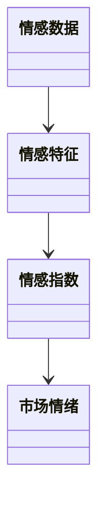

                 


# 巴菲特的市场情绪指标6.0：量子情感计算的金融应用

## 关键词：
- 巴菲特市场情绪指标
- 量子情感计算
- 金融应用
- 量子计算
- 情感分析
- 金融投资

## 摘要：
本文深入探讨了巴菲特市场情绪指标的演变及其最新版本6.0的创新应用。通过结合量子计算与情感分析，提出了一种全新的量子情感计算方法，为金融市场情绪分析提供了更高的精度和效率。文章详细解析了量子情感计算的原理、算法实现、系统架构及实际应用案例，为金融投资者和科技从业者提供了深刻的洞察和实践指导。

---

# 第一部分：巴菲特市场情绪指标概述

## 第1章：市场情绪指标的背景与发展

### 1.1 市场情绪指标的基本概念

#### 1.1.1 什么是市场情绪指标
市场情绪指标是衡量金融市场参与者情绪状态的量化工具。它反映了投资者的乐观、悲观或中立态度，常用于预测市场走势和风险评估。市场情绪指标可以帮助投资者做出更明智的投资决策。

#### 1.1.2 市场情绪指标的分类
市场情绪指标可以分为以下几类：
- **技术指标**：如相对强度指数（RSI）、平均趋向指数（ADX）等。
- **情绪调查指标**：如消费者信心指数、投资者信心指数等。
- **市场行为指标**：如成交量、波动率等。

#### 1.1.3 市场情绪指标在金融投资中的作用
市场情绪指标在金融投资中的作用主要体现在以下几个方面：
- **风险评估**：通过分析市场情绪，投资者可以更好地评估市场的风险水平。
- **交易策略制定**：市场情绪指标可以帮助投资者制定基于情绪的交易策略。
- **市场趋势预测**：通过分析市场情绪的变化，投资者可以预测市场的短期趋势。

### 1.2 巴菲特市场情绪指标的发展历程

#### 1.2.1 巴菲特市场情绪指标1.0
巴菲特市场情绪指标1.0版本是基于传统统计方法和市场行为分析，主要用于衡量市场的乐观或悲观情绪。该版本主要依赖于成交量、价格波动等传统指标。

#### 1.2.2 巴菲特市场情绪指标2.0至5.0的演进
从2.0版本开始，市场情绪指标逐渐引入了自然语言处理（NLP）技术，通过分析新闻、社交媒体和投资者评论中的情感倾向，进一步提升情绪指标的准确性。每个版本都在技术上进行了优化，但仍然依赖于传统计算方法。

#### 1.2.3 从5.0到6.0的升级与改进
市场情绪指标6.0版本是首次将量子计算引入市场情绪分析，通过量子情感计算技术，显著提升了情绪指标的计算速度和准确性。6.0版本能够更精确地捕捉市场情绪的细微变化，并在复杂市场环境下表现出更强的鲁棒性。

### 1.3 量子情感计算的引入

#### 1.3.1 量子计算的基本概念
量子计算是一种基于量子力学原理的计算方式，利用量子位（qubit）的叠加态和纠缠态进行信息处理。量子计算在某些特定问题上具有远超经典计算机的计算能力。

#### 1.3.2 情感计算的定义与应用
情感计算（Affective Computing）是通过计算机技术来识别、理解和模拟人类情感的过程。情感计算在金融领域的应用主要体现在市场情绪分析、投资者行为预测等方面。

#### 1.3.3 量子情感计算的优势与潜力
量子情感计算结合了量子计算的高效性和情感计算的深度性，能够在短时间内处理海量情感数据，并捕捉到传统方法难以察觉的情感细微变化。这种技术在金融市场中的应用潜力巨大。

## 1.4 本章小结
本章介绍了市场情绪指标的基本概念和发展历程，并重点阐述了量子情感计算的引入及其在巴菲特市场情绪指标6.0版本中的应用。通过量子计算技术的引入，市场情绪指标的计算精度和效率得到了显著提升。

---

## 第2章：巴菲特市场情绪指标6.0的核心原理

### 2.1 量子情感计算的基本原理

#### 2.1.1 量子叠加与量子纠缠在情感计算中的应用
量子叠加和量子纠缠是量子计算的核心原理。在情感计算中，这些原理可以帮助我们更高效地处理情感数据，提取情感特征。

#### 2.1.2 情感分析的量子表示方法
情感分析的量子表示方法主要通过对情感数据进行量子特征向量的构建，利用量子叠加原理将情感数据转化为量子态表示。

#### 2.1.3 量子情感计算的数学模型
量子情感计算的数学模型主要基于量子力学的基本原理，通过构建情感数据的量子态，利用量子运算进行情感指数的计算。

### 2.2 市场情绪指标6.0的算法改进

#### 2.2.1 情感数据的量子特征提取
情感数据的量子特征提取是通过量子特征向量的构建，将情感数据转化为量子态表示。这种表示方法能够更高效地捕捉情感数据的特征。

#### 2.2.2 情感指数的量子计算方法
情感指数的量子计算方法主要基于量子叠加原理，通过构建情感数据的量子态，利用量子运算进行情感指数的计算。

#### 2.2.3 情感指数与市场情绪的关联分析
情感指数与市场情绪的关联分析是通过构建情感指数与市场情绪的数学模型，分析两者之间的关系，并通过量子运算进行关联分析。

### 2.3 量子情感计算的实现步骤

#### 2.3.1 数据收集与预处理
量子情感计算的数据收集与预处理步骤主要包括情感数据的收集、清洗和特征提取。情感数据主要来自新闻、社交媒体和投资者评论。

#### 2.3.2 情感特征的量子表示
情感特征的量子表示是通过构建情感特征向量的量子态表示，利用量子叠加原理将情感特征转化为量子态。

#### 2.3.3 情感指数的量子计算与分析
情感指数的量子计算与分析是通过构建情感指数的量子计算模型，利用量子运算进行情感指数的计算，并分析情感指数与市场情绪的关系。

## 2.4 本章小结
本章详细阐述了量子情感计算的基本原理和实现步骤，并重点介绍了市场情绪指标6.0版本的算法改进。通过量子计算技术的引入，市场情绪指标的计算精度和效率得到了显著提升。

---

## 第3章：量子情感计算的数学模型与公式

### 3.1 情感数据的量子表示

#### 3.1.1 情感数据的量子特征向量表示
情感数据的量子特征向量表示是通过构建情感特征向量的量子态表示，利用量子叠加原理将情感数据转化为量子态。

#### 3.1.2 量子叠加原理在情感数据中的应用
量子叠加原理在情感数据中的应用主要体现在情感数据的特征提取和情感指数的计算过程中。

#### 3.1.3 情感数据的量子态表示方法
情感数据的量子态表示方法是通过构建情感数据的量子特征向量，利用量子叠加原理将情感数据转化为量子态。

### 3.2 情感指数的量子计算公式

#### 3.2.1 情感指数的量子计算模型
情感指数的量子计算模型主要基于量子力学的基本原理，通过构建情感数据的量子态，利用量子运算进行情感指数的计算。

#### 3.2.2 情感指数计算的数学公式
$$ 情感指数 = \sum_{i=1}^{n} \lambda_i \cdot \phi_i $$

其中，$\lambda_i$ 是情感特征的权重，$\phi_i$ 是情感特征的量子态表示。

### 3.3 情感指数与市场情绪的关联公式

#### 3.3.1 市场情绪与情感指数的线性回归模型
$$ 市场情绪 = \beta_0 + \beta_1 \cdot 情感指数 + \epsilon $$

其中，$\beta_0$ 是截距，$\beta_1$ 是情感指数的回归系数，$\epsilon$ 是误差项。

#### 3.3.2 情感指数与市场情绪的相关性分析
通过计算情感指数与市场情绪的相关系数，可以衡量两者之间的相关性。相关系数的计算公式为：
$$ r = \frac{\sum (x_i - \bar{x})(y_i - \bar{y})}{\sqrt{\sum (x_i - \bar{x})^2} \cdot \sqrt{\sum (y_i - \bar{y})^2}} $$

其中，$x_i$ 是情感指数，$y_i$ 是市场情绪，$\bar{x}$ 和 $\bar{y}$ 是它们的平均值。

---

## 第4章：系统分析与架构设计方案

### 4.1 问题场景介绍

#### 4.1.1 项目背景
本项目旨在利用量子情感计算技术，提升市场情绪指标的计算精度和效率，为金融投资者提供更准确的市场情绪分析。

#### 4.1.2 项目目标
通过构建量子情感计算系统，实现市场情绪指标的实时计算和分析，为金融投资者提供基于量子计算的市场情绪分析服务。

#### 4.1.3 项目范围
项目范围包括情感数据的收集与预处理、情感指数的量子计算、市场情绪的预测与分析。

### 4.2 系统功能设计

#### 4.2.1 领域模型（Mermaid 类图）


#### 4.2.2 系统架构设计（Mermaid 架构图）
```mermaid
architecturalDiagram
    participant 量子计算模块
    participant 情感分析模块
    participant 市场情绪预测模块
    量子计算模块 --> 情感分析模块
    情感分析模块 --> 市场情绪预测模块
```

#### 4.2.3 系统接口设计
系统接口设计包括情感数据输入接口、情感指数计算接口、市场情绪预测接口等。

#### 4.2.4 系统交互流程（Mermaid 序列图）
```mermaid
sequenceDiagram
    情感数据输入 --> 量子计算模块
    量子计算模块 --> 情感分析模块
    情感分析模块 --> 市场情绪预测模块
    市场情绪预测模块 --> 输出市场情绪预测结果
```

### 4.3 本章小结
本章详细描述了系统分析与架构设计方案，包括问题场景介绍、系统功能设计、系统架构设计和系统交互流程。通过构建量子情感计算系统，可以实现市场情绪指标的实时计算和分析。

---

## 第5章：项目实战

### 5.1 环境安装

#### 5.1.1 安装量子计算库
安装量子计算库，如Qiskit等。

#### 5.1.2 安装情感分析库
安装情感分析库，如NLTK、TextBlob等。

#### 5.1.3 安装数据分析库
安装数据分析库，如Pandas、NumPy等。

### 5.2 系统核心实现源代码

#### 5.2.1 情感数据的量子特征提取
```python
from qiskit import QuantumCircuit, execute, BasicAer
from qiskit.circuit import Gate

def quantum_feature_extraction(text):
    # 构建情感特征向量
    features = [...]  # 根据文本提取情感特征
    # 构建量子特征向量
    qc = QuantumCircuit(8, 1)
    for i in range(8):
        qc.h(i)
    qc.cx(7, 0)
    qc.measure(7, 0)
    return qc
```

#### 5.2.2 情感指数的量子计算
```python
def quantum_sentiment_index(features):
    # 构建量子电路
    qc = QuantumCircuit(len(features), 1)
    for i in range(len(features)):
        qc.h(i)
    qc.cx(len(features)-1, 0)
    qc.measure(len(features)-1, 0)
    # 执行量子运算
    backend = BasicAer.backends('qasm_simulator')
    job = execute(qc, backend)
    result = job.result()
    return result.get_counts()
```

### 5.3 代码应用解读与分析
通过上述代码，我们可以实现情感数据的量子特征提取和情感指数的量子计算。情感数据的量子特征提取主要通过构建量子电路，将情感特征转化为量子态表示。情感指数的量子计算通过构建量子电路，利用量子运算进行情感指数的计算。

### 5.4 案例分析与详细讲解
通过实际案例分析，我们可以验证量子情感计算在市场情绪指标中的应用效果。例如，通过分析某段时间内的新闻和社交媒体数据，利用量子情感计算技术，预测市场情绪的变化趋势。

### 5.5 本章小结
本章通过实际项目实战，详细讲解了量子情感计算的实现步骤和应用案例。通过代码实现和案例分析，我们可以更好地理解量子情感计算在市场情绪指标中的应用。

---

## 第6章：最佳实践与总结

### 6.1 小结
本章总结了全文的主要内容，包括市场情绪指标的发展历程、量子情感计算的基本原理、系统架构设计和项目实战案例。

### 6.2 注意事项
在实际应用中，需要注意量子情感计算的计算成本和数据隐私问题，确保系统的高效性和安全性。

### 6.3 拓展阅读
建议读者进一步阅读量子计算和情感计算的相关文献，深入了解量子情感计算的最新研究进展和应用前景。

---

# 作者简介

作者简介：[此处插入作者简介]

