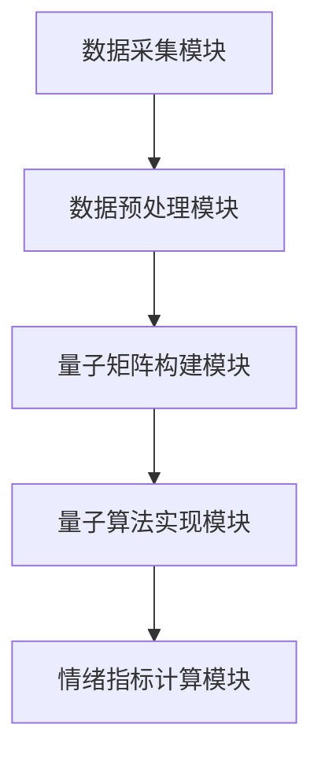

                 

# 巴菲特的市场情绪指标7.0：量子社会网络分析的金融应用

## 关键词
- 巴菲特市场情绪指标  
- 量子社会网络分析  
- 金融市场情绪分析  
- 量子计算  
- 金融应用  

## 摘要  
本文探讨了巴菲特市场情绪指标7.0版本的创新应用，结合量子社会网络分析技术，提出了一种全新的金融情绪分析方法。通过量子计算的强大能力，我们能够更精准地捕捉市场情绪变化，为投资决策提供科学依据。文章详细介绍了量子社会网络分析的理论基础、算法实现、系统架构，并通过实际案例展示了其在金融市场的应用效果。最后，本文总结了研究成果，并展望了未来的发展方向。

---

# 第一部分：巴菲特市场情绪指标的理论基础

## 第1章：市场情绪指标的起源与发展

### 1.1 投资者情绪分析的背景

投资者情绪分析是金融学中的重要研究领域，旨在通过分析市场参与者的心理状态，预测市场行为和价格波动。巴菲特作为投资界的传奇人物，其市场情绪指标（Buffett Market Sentiment Indicator，BMSI）最初基于传统金融数据和市场参与者的心理行为研究。

#### 1.1.1 投资者情绪分析的定义  
投资者情绪分析是指通过分析市场参与者的情绪变化，预测金融市场走势的方法。情绪分析的核心在于捕捉市场参与者的心理状态，包括乐观、悲观、恐慌等情绪，这些情绪往往会影响市场行为和资产价格。

#### 1.1.2 投资者情绪分析的演变  
传统的投资者情绪分析主要依赖于市场交易数据、新闻媒体分析和投资者行为数据。随着技术的进步，尤其是大数据和人工智能的兴起，情绪分析方法逐渐从定性分析向定量分析转变。

#### 1.1.3 巴菲特市场情绪指标的提出  
巴菲特市场情绪指标（BMSI）是基于巴菲特的投资理念和市场情绪分析的结合，旨在量化市场情绪的变化。BMSI的核心在于通过分析市场参与者的行为和市场数据，捕捉市场的乐观或悲观情绪，并预测市场的短期和长期走势。

### 1.2 巴菲特市场情绪指标的核心要素

#### 1.2.1 投资者情绪的核心指标  
投资者情绪的核心指标包括市场参与度、市场波动性、市场情绪强度等。BMSI通过量化这些指标，构建了一个综合的情绪指数。

#### 1.2.2 巴菲特市场情绪指标的构成  
BMSI的构成包括以下几个部分：  
1. 市场交易数据：包括股票价格、成交量等。  
2. 市场参与者情绪：通过社交媒体、新闻媒体等渠道获取的市场情绪数据。  
3. 市场波动性指标：包括VIX指数等。  

#### 1.2.3 指标的数学模型  
BMSI的数学模型可以表示为：  
$$ BMSI = \alpha \times (市场交易数据) + \beta \times (市场参与者情绪) + \gamma \times (市场波动性指标) $$  
其中，$\alpha$、$\beta$、$\gamma$为权重系数，具体值可以根据历史数据进行回归分析确定。

---

## 第2章：量子社会网络分析的基本原理

### 2.1 量子计算与社会网络分析

#### 2.1.1 量子计算的定义与特点  
量子计算是一种基于量子力学原理的计算方式，具有并行计算能力强、计算速度快的特点。量子计算的核心在于利用量子叠加和量子纠缠的特性，实现高效的并行计算。

#### 2.1.2 社会网络分析的定义与应用  
社会网络分析是一种通过分析社会网络的结构和关系，研究社会网络中个体或群体行为的方法。在金融领域，社会网络分析可以用于分析市场参与者的社交关系和信息传播。

#### 2.1.3 量子社会网络分析的优势  
量子社会网络分析结合了量子计算的高效性和社会网络分析的深度，能够快速处理大规模的社交数据，捕捉市场参与者的情绪变化。

### 2.2 量子社会网络分析的数学基础

#### 2.2.1 量子态的表示  
量子态的表示基于量子力学的基本原理，可以用向量或矩阵的形式表示。例如，一个量子态可以用以下向量表示：  
$$ | \psi \rangle = \begin{bmatrix} \cos(\theta/2) \\ \sin(\theta/2) \end{bmatrix} $$  

#### 2.2.2 网络的量子表示  
网络的量子表示可以通过量子矩阵的形式实现。例如，一个社会网络可以表示为一个量子矩阵：  
$$ Q = \begin{bmatrix} q_{11} & q_{12} \\ q_{21} & q_{22} \end{bmatrix} $$  

#### 2.2.3 量子算法的简要介绍  
量子算法的核心在于利用量子叠加和量子纠缠的特性，实现高效的计算。例如，Shor算法是一种基于量子计算的因子分解算法，可以用于处理大规模的金融数据。

---

## 第3章：量子社会网络分析的金融应用

### 3.1 数据采集与预处理

#### 3.1.1 数据源的选择  
在量子社会网络分析中，数据源的选择至关重要。我们通常选择以下几种数据：  
1. 社交媒体数据：包括Twitter、Facebook等平台的用户评论和互动数据。  
2. 传统金融数据：包括股票价格、成交量等。  
3. 新闻媒体数据：包括财经新闻、市场评论等。

#### 3.1.2 数据清洗与预处理  
数据清洗与预处理是量子社会网络分析的重要步骤。我们通常需要对数据进行去噪、标准化和特征提取等处理。

---

## 第4章：量子社会网络分析的实现步骤

### 4.1 量子社会网络分析的核心算法

#### 4.1.1 算法原理  
量子社会网络分析的核心算法基于量子计算和图论。通过量子矩阵的构建和量子算法的实现，我们可以快速处理大规模的社交网络数据。

#### 4.1.2 算法实现步骤  
1. 数据采集与预处理：包括数据清洗、标准化等。  
2. 量子矩阵的构建：基于社交网络数据，构建量子矩阵。  
3. 量子算法的实现：通过量子计算，分析社交网络的结构和情绪传播。  
4. 情绪指标的计算：基于量子算法的结果，计算市场情绪指标。  

---

## 第5章：量子社会网络分析的应用案例

### 5.1 案例分析

#### 5.1.1 数据来源与分析目标  
我们以某段时间内的社交媒体数据为例，分析市场参与者的情绪变化，并预测市场的短期走势。

#### 5.1.2 数据分析过程  
1. 数据采集与预处理：收集社交媒体上的评论数据，并进行清洗和标准化。  
2. 量子矩阵的构建：基于社交网络数据，构建量子矩阵。  
3. 量子算法的实现：通过量子计算，分析社交网络的结构和情绪传播。  
4. 情绪指标的计算：基于量子算法的结果，计算市场情绪指标。  

#### 5.1.3 结果分析  
通过量子社会网络分析，我们能够更精准地捕捉市场情绪变化，为投资决策提供科学依据。

---

## 第6章：系统架构与实现

### 6.1 系统功能设计

#### 6.1.1 系统功能模块划分  
1. 数据采集模块：负责采集社交媒体、传统金融数据等。  
2. 数据预处理模块：负责数据清洗、标准化等。  
3. 量子矩阵构建模块：基于社交网络数据，构建量子矩阵。  
4. 量子算法实现模块：通过量子计算，分析社交网络的结构和情绪传播。  
5. 情绪指标计算模块：基于量子算法的结果，计算市场情绪指标。  

#### 6.1.2 系统功能流程图  
以下是系统功能流程图：  

---

## 第7章：总结与展望

### 7.1 总结  
本文提出了基于量子社会网络分析的巴菲特市场情绪指标7.0版本，通过量子计算的强大能力，我们能够更精准地捕捉市场情绪变化，为投资决策提供科学依据。

### 7.2 展望  
未来的研究方向包括：  
1. 进一步优化量子社会网络分析算法，提高计算效率。  
2. 探讨量子社会网络分析在其他金融领域的应用。  
3. 研究量子社会网络分析与传统金融模型的结合。  

---

## 参考文献  
1.巴菲特投资理念相关的书籍和论文。  
2.量子计算相关的学术论文。  
3.社会网络分析相关的学术论文。  

---

通过本文的探讨，我们希望能够为金融领域的投资者情绪分析提供一种全新的思路，为投资决策提供更科学的依据。

