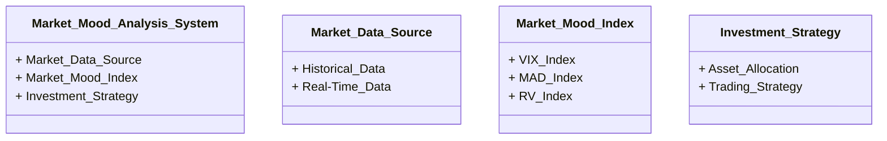
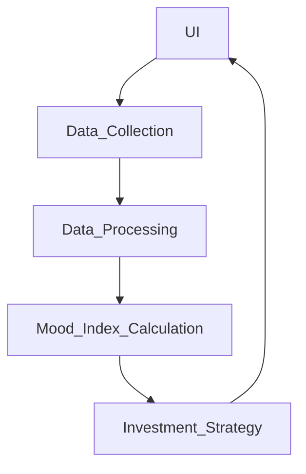

                 


# 巴菲特的市场情绪指标：如何利用大众心理

> **关键词**：市场情绪指标，巴菲特，投资者心理，市场波动，投资策略

> **摘要**：本文探讨了巴菲特的市场情绪指标，分析了如何通过投资者心理和市场情绪来指导投资决策。文章详细介绍了情绪指标的定义、分类、量化方法及其在投资策略中的应用，结合实际案例和系统架构设计，为读者提供了一套利用市场情绪指标进行投资的完整解决方案。

---

# 第一部分: 巴菲特的市场情绪指标概述

## 第1章: 市场情绪指标的定义与背景

### 1.1 市场情绪指标的定义与核心概念

市场情绪指标是一种用于量化市场参与者情绪的工具，通过分析投资者的心理状态和行为模式，帮助预测市场波动和趋势。巴菲特认为，市场情绪是投资决策的重要因素，尤其是在市场恐慌或贪婪时，情绪指标可以揭示市场的非理性行为。

#### 1.1.1 情绪指标的定义与核心概念

市场情绪指标是通过量化投资者的心理状态，反映市场整体情绪的指标。其核心概念包括：

- **投资者心理**：投资者在不同市场环境下的心理状态，如贪婪、恐惧、乐观、悲观等。
- **市场情绪周期**：市场情绪从乐观到悲观，再到乐观的周期性变化。
- **情绪与价格关系**：市场情绪波动通常与资产价格波动密切相关。

#### 1.1.2 情绪指标与市场波动的关系

市场情绪指标能够捕捉到投资者情绪的变化，从而预测市场价格波动。例如，当市场情绪过于乐观时，资产价格可能被高估，反之亦然。

#### 1.1.3 巴菲特与市场情绪指标的渊源

巴菲特在投资中非常重视市场情绪，他通过观察市场情绪的变化来寻找投资机会。他认为，市场情绪的极端化（如过度恐慌或过度乐观）是投资的绝佳机会。

---

### 1.2 市场情绪指标的分类

市场情绪指标可以根据不同的维度进行分类，主要包括以下几种：

#### 1.2.1 基于价格波动的情绪指标

价格波动是市场情绪的重要反映。以下是几种基于价格波动的情绪指标：

- **波动率指数（VIX）**：衡量市场波动性的指标，被称为“恐慌指数”。VIX越高，市场情绪越恐慌。
- **平均绝对偏差（MAD）**：衡量价格波动的指标，用于反映市场的稳定性。

#### 1.2.2 基于交易量的情绪指标

交易量是市场情绪的重要体现，以下是几种基于交易量的情绪指标：

- **成交量与价格关系**：当价格上升且成交量增加时，市场情绪乐观；反之，市场情绪悲观。
- **相对成交量**：将当前成交量与历史成交量进行对比，判断市场情绪的强弱。

#### 1.2.3 基于投资者行为的情绪指标

投资者行为是市场情绪的重要表现，以下是几种基于投资者行为的情绪指标：

- **投资者信心指数**：通过调查投资者信心来衡量市场情绪。
- **资金流动**：资金流入或流出市场的速度可以反映市场情绪的变化。

---

### 1.3 情绪指标与传统市场分析的对比

#### 1.3.1 传统市场分析方法的局限性

传统市场分析方法主要依赖于技术分析和基本面分析，但这些方法往往忽略了市场情绪的因素，难以捕捉市场的非理性波动。

#### 1.3.2 情绪指标的独特优势

情绪指标的独特优势在于能够量化市场情绪，帮助投资者更好地理解市场的非理性行为。

#### 1.3.3 情绪指标与技术分析的结合

将情绪指标与技术分析结合，可以更全面地分析市场走势。例如，结合价格趋势和市场情绪指标，可以更好地判断市场的顶点或底部。

---

## 第2章: 投资者心理与市场情绪

### 2.1 投资者心理分析

#### 2.1.1 投资者心理的分类

投资者心理可以分为以下几类：

- **乐观心理**：投资者对市场未来走势持乐观态度。
- **悲观心理**：投资者对市场未来走势持悲观态度。
- **贪婪心理**：投资者在市场上涨时过度追求收益。
- **恐惧心理**：投资者在市场下跌时过度规避风险。

#### 2.1.2 群体心理与市场情绪的关系

群体心理是市场情绪的重要来源。投资者的群体行为会导致市场情绪的放大或缩小。

#### 2.1.3 投资者心理对市场情绪的影响

投资者心理通过影响交易行为和市场价格，进而影响市场情绪。例如，当大多数投资者感到乐观时，市场情绪会转向贪婪。

---

### 2.2 市场情绪的形成机制

#### 2.2.1 信息传播与情绪扩散

信息传播是市场情绪形成的重要机制。例如，新闻、社交媒体等信息源会通过传播信息影响投资者情绪。

#### 2.2.2 市场参与者的心理互动

市场参与者的心理互动也会导致市场情绪的变化。例如，当一部分投资者开始恐慌时，这种情绪会迅速蔓延，导致市场情绪进一步恶化。

#### 2.2.3 情绪周期与市场周期的关系

市场情绪通常呈现周期性变化，与市场周期密切相关。例如，市场情绪的顶点往往对应市场的顶部，市场情绪的低谷往往对应市场的底部。

---

### 2.3 情绪指标的核心要素

#### 2.3.1 市场参与度

市场参与度是衡量市场情绪的重要指标。市场参与度越高，市场情绪越强烈。

#### 2.3.2 市场乐观程度

市场乐观程度是衡量市场情绪的重要指标。市场乐观程度越高，市场情绪越积极。

#### 2.3.3 市场恐慌程度

市场恐慌程度是衡量市场情绪的重要指标。市场恐慌程度越高，市场情绪越消极。

---

## 第3章: 情绪指标的量化与计算

### 3.1 情绪指标的量化方法

#### 3.1.1 基于价格波动的量化指标

以下是几种基于价格波动的量化指标：

- **波动率指数（VIX）**：计算公式为：
  $$ VIX = \sqrt{\frac{1}{N} \sum_{i=1}^{N} (R_i - \bar{R})^2} $$
  其中，$R_i$ 是第$i$个时间点的收益率，$\bar{R}$ 是平均收益率，$N$ 是时间窗口的长度。

- **平均绝对偏差（MAD）**：计算公式为：
  $$ MAD = \frac{1}{N} \sum_{i=1}^{N} |R_i - \bar{R}| $$

#### 3.1.2 基于交易量的情绪指标

以下是几种基于交易量的情绪指标：

- **成交量与价格关系**：通过比较成交量和价格的变化趋势，判断市场情绪的强弱。
- **相对成交量**：计算公式为：
  $$ RV = \frac{V_t}{V_{avg}} $$
  其中，$V_t$ 是当前时间点的成交量，$V_{avg}$ 是历史平均成交量。

#### 3.1.3 基于投资者行为的情绪指标

以下是几种基于投资者行为的情绪指标：

- **投资者信心指数**：通过调查投资者信心来计算。
- **资金流动**：通过分析资金流入或流出的速度来判断市场情绪。

---

### 3.2 情绪指标的计算公式

#### 3.2.1 市场情绪指数的计算公式

市场情绪指数（MEI）可以通过以下公式计算：
$$ MEI = \alpha \cdot VIX + \beta \cdot MAD + \gamma \cdot RV $$
其中，$\alpha$、$\beta$、$\gamma$ 是权重系数，$VIX$ 是波动率指数，$MAD$ 是平均绝对偏差，$RV$ 是相对成交量。

#### 3.2.2 市场恐慌指数的计算公式

市场恐慌指数（MPI）可以通过以下公式计算：
$$ MPI = \sqrt{\frac{1}{N} \sum_{i=1}^{N} (P_i - \bar{P})^2} $$
其中，$P_i$ 是第$i$个时间点的价格，$\bar{P}$ 是平均价格，$N$ 是时间窗口的长度。

---

## 第4章: 情绪指标在投资策略中的应用

### 4.1 投资策略的基本框架

#### 4.1.1 基于情绪指标的投资策略类型

以下是几种基于情绪指标的投资策略：

- **情绪驱动策略**：根据市场情绪的变化进行投资决策。
- **逆情绪策略**：在市场情绪极端化时进行反向投资。
- **情绪与技术结合策略**：结合技术分析和市场情绪指标进行投资决策。

#### 4.1.2 情绪指标与投资决策的关系

情绪指标可以帮助投资者更好地理解市场的非理性波动，从而做出更明智的投资决策。

#### 4.1.3 情绪指标在不同市场环境下的应用

情绪指标在不同市场环境下的应用策略有所不同。例如，在市场恐慌时，可以考虑买入被低估的资产；在市场乐观时，可以考虑卖出高估的资产。

---

### 4.2 情绪指标与资产配置

#### 4.2.1 资产配置的基本原理

资产配置是根据市场环境和个人风险偏好，将资金分配到不同资产类别中的过程。

#### 4.2.2 情绪指标在资产配置中的应用

通过分析市场情绪，可以动态调整资产配置比例。例如，在市场恐慌时增加股票配置，在市场乐观时减少股票配置。

#### 4.2.3 资产配置的动态调整方法

资产配置的动态调整方法包括：

- **定期再平衡**：根据市场情绪的变化，定期调整资产配置比例。
- **动态权重分配**：根据市场情绪指标，动态调整不同资产的权重。

---

## 第5章: 系统分析与架构设计方案

### 5.1 问题场景介绍

市场情绪分析系统的目标是通过分析市场情绪指标，帮助投资者做出更明智的投资决策。

### 5.2 系统功能设计

#### 5.2.1 领域模型设计

以下是市场情绪分析系统的领域模型图：



#### 5.2.2 系统架构设计

以下是市场情绪分析系统的架构图：



---

## 第6章: 项目实战

### 6.1 环境安装

市场情绪分析系统的运行环境包括：

- 操作系统：Windows、Linux、macOS
- 开发工具：Python、Jupyter Notebook、Git
- 数据源：Yahoo Finance、Quandl、Twitter API

---

### 6.2 系统核心实现源代码

以下是市场情绪指数（MEI）的Python实现代码：

```python
import pandas as pd
import numpy as np

def calculate_VIX(returns):
    mean_return = np.mean(returns)
    deviations = [r - mean_return for r in returns]
    squared_deviations = [d**2 for d in deviations]
    variance = np.mean(squared_deviations)
    vix = np.sqrt(variance)
    return vix

def calculate_MAD(returns):
    mean_return = np.mean(returns)
    deviations = [r - mean_return for r in returns]
    absolute_deviations = [abs(d) for d in deviations]
    mad = np.mean(absolute_deviations)
    return mad

def calculate_RV(volume, average_volume):
    rv = volume / average_volume
    return rv

def calculate_MEI(vix, mad, rv):
    alpha = 0.5
    beta = 0.3
    gamma = 0.2
    mei = alpha * vix + beta * mad + gamma * rv
    return mei

# 示例数据
returns = [0.02, 0.01, -0.01, 0.03, 0.02]
volume = 1000
average_volume = 800

vix = calculate_VIX(returns)
mad = calculate_MAD(returns)
rv = calculate_RV(volume, average_volume)
mei = calculate_MEI(vix, mad, rv)

print(f"VIX: {vix}, MAD: {mad}, RV: {rv}, MEI: {mei}")
```

---

### 6.3 代码应用解读与分析

上述代码通过计算波动率指数（VIX）、平均绝对偏差（MAD）和相对成交量（RV），最终计算出市场情绪指数（MEI）。投资者可以根据MEI的值来判断市场情绪的强弱。

---

### 6.4 实际案例分析

以2020年新冠疫情为例，市场情绪在疫情爆发初期急剧下降，随后逐步恢复。通过分析市场情绪指数，投资者可以更好地理解市场的恐慌情绪，并做出相应的投资决策。

---

## 第7章: 最佳实践 tips、小结、注意事项、拓展阅读

### 7.1 最佳实践 tips

- 定期监控市场情绪指数，及时调整投资策略。
- 结合市场情绪指数和其他分析方法（如技术分析、基本面分析）进行综合判断。
- 在市场情绪极端化时，保持冷静，避免盲目跟风。

### 7.2 小结

本文详细介绍了巴菲特的市场情绪指标，分析了如何通过市场情绪指标指导投资决策。通过实际案例和系统架构设计，为读者提供了一套利用市场情绪指标进行投资的完整解决方案。

### 7.3 注意事项

- 市场情绪指标只是投资决策的参考工具，不能单独作为投资依据。
- 在实际应用中，需要结合市场环境和其他分析方法进行综合判断。

### 7.4 拓展阅读

- 巴菲特的投资哲学
- 技术分析与市场情绪
- 市场情绪与风险管理

---

以上是《巴菲特的市场情绪指标：如何利用大众心理》的完整目录大纲和文章内容。

