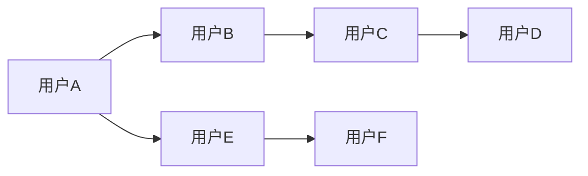

                 

# 巴菲特的市场情绪指标：社交图谱分析在金融市场的应用

> 关键词：巴菲特，市场情绪指标，社交图谱分析，金融投资，人工智能，情绪传播

> 摘要：本文探讨了如何利用社交图谱分析技术构建市场情绪指标，并将其应用于金融投资决策中。通过结合巴菲特的价值投资理念，本文详细介绍了社交图谱分析的核心概念、算法原理、系统架构以及实际应用案例。文章还提供了从数据收集到模型训练的完整实现过程，帮助读者理解如何通过社交图谱分析捕捉市场情绪变化，优化投资策略。

---

# 第1章 巴菲特投资理念与市场情绪的重要性

## 1.1 巴菲特投资理念概述

### 1.1.1 巴菲特的价值投资理论

巴菲特是价值投资的代表人物，他认为市场波动是投资机会的源泉，而非投资的终点。他强调长期投资、价值发现和安全边际。他的投资理念基于对公司基本面的深入分析，以及对市场情绪的敏锐洞察。

$$\text{投资=价格} \times \text{市场情绪} \times \text{公司价值}$$

### 1.1.2 巴菲特的市场情绪观点

巴菲特认为，市场情绪是影响投资决策的重要因素。他将市场情绪分为“恐惧”和“贪婪”，并强调在市场恐慌时买入，在市场狂热时卖出。然而，传统的市场情绪分析多基于价格数据和历史数据，缺乏对实时社交数据的利用。

### 1.1.3 巴菲特投资理念与现代金融分析的结合

现代金融分析技术，尤其是社交图谱分析，为巴菲特的投资理念提供了新的工具。通过分析社交网络中的情绪传播，投资者可以更准确地捕捉市场情绪变化，优化投资决策。

---

## 1.2 市场情绪指标的核心概念

### 1.2.1 市场情绪的定义与特征

市场情绪是指市场参与者（投资者、分析师、媒体等）对市场走势的心理预期和情感态度。其特征包括：

- **实时性**：市场情绪会随着时间和事件变化。
- **传播性**：情绪通过社交网络快速传播。
- **影响性**：情绪影响市场行为和资产价格。

### 1.2.2 市场情绪与投资决策的关系

市场情绪是投资决策的重要参考。当市场情绪过于乐观时，资产价格可能被高估；当市场情绪过于悲观时，资产价格可能被低估。通过分析市场情绪，投资者可以更好地把握市场的买卖时机。

### 1.2.3 巴菲特市场情绪指标的独特性

巴菲特市场情绪指标结合了传统金融分析和社交图谱分析，具有以下特点：

- **数据驱动**：基于社交媒体、新闻和论坛等实时数据。
- **网络效应**：利用社交网络的传播特性，捕捉情绪扩散路径。
- **可量化**：通过算法量化市场情绪的强度和方向。

---

## 1.3 社交图谱分析的背景与应用

### 1.3.1 社交网络的结构与特征

社交网络由节点（用户）和边（关系）组成，具有以下特征：

- **节点特征**：用户的兴趣、行为、影响力等。
- **边特征**：关系强度、互动频率等。
- **社区结构**：用户群体的聚集特征。

### 1.3.2 社交图谱在金融分析中的潜力

社交图谱分析为金融投资提供了新的视角。通过分析社交网络中的信息传播和情绪扩散，投资者可以更早地发现市场趋势和潜在风险。

### 1.3.3 巴菲特市场情绪指标的社交图谱基础

巴菲特市场情绪指标的核心是社交图谱分析，通过构建情绪传播模型，量化市场情绪的强度和方向。

---

## 1.4 本章小结

本章介绍了巴菲特的投资理念及其对市场情绪的重视，分析了市场情绪指标的核心概念，并探讨了社交图谱分析在金融投资中的潜力。接下来，我们将深入探讨社交图谱分析的核心概念与方法。

---

# 第2章 社交图谱分析的核心概念与方法

## 2.1 社交网络的结构与特征

### 2.1.1 社交网络的节点与边

节点代表用户，边代表用户之间的关系。例如，用户A关注用户B，可以表示为一条从A指向B的边。

### 2.1.2 社交网络的度、中心性和社区检测

- **度**：节点的度数表示其连接的边数。
- **中心性**：节点的中心性表示其在网络中的影响力。
- **社区检测**：将社交网络划分为多个社区，分析社区内部的情绪传播。

### 2.1.3 社交网络的权重与方向性

边的权重表示关系强度，方向性表示信息传播的方向。

---

## 2.2 情绪传播机制与社交图谱

### 2.2.1 情绪传播的基本模型

情绪传播模型包括扩散模型和感染模型。扩散模型假设情绪在社交网络中逐渐传播，感染模型假设情绪通过直接接触传播。

### 2.2.2 社交图谱中的情绪扩散路径

情绪扩散路径可以通过广度优先搜索（BFS）或深度优先搜索（DFS）算法确定。

### 2.2.3 情绪传播的强度与速度

情绪传播强度与节点的影响力和边的权重有关。情绪传播速度与网络结构和用户行为有关。

---

## 2.3 社交图谱分析的数学模型

### 2.3.1 基于图论的情绪传播模型

图论是社交图谱分析的基础。情绪传播模型可以用图论中的节点和边表示。

### 2.3.2 基于概率论的情绪扩散模型

概率论模型可以预测情绪传播的可能性和速度。

### 2.3.3 基于矩阵运算的社交图谱分析

矩阵运算可以用于分析社交图谱的特征和结构。

---

## 2.4 本章小结

本章详细介绍了社交图谱分析的核心概念与方法，包括社交网络的结构特征、情绪传播机制和数学模型。接下来，我们将探讨市场情绪指标的构建方法。

---

# 第3章 市场情绪指标的构建方法

## 3.1 市场情绪数据的收集与处理

### 3.1.1 数据来源：社交媒体、新闻、论坛等

数据来源包括社交媒体（如Twitter、Facebook）、新闻网站和金融论坛。

### 3.1.2 数据清洗与预处理

数据清洗包括去重、去噪和格式化。预处理包括分词和情感分析。

### 3.1.3 数据特征提取与标注

特征提取包括关键词提取和情感极性标注。

---

## 3.2 情绪指标的计算与量化

### 3.2.1 情绪强度的计算方法

情绪强度可以用情感分析模型计算，结果通常在-1到1之间。

### 3.2.2 情绪分布的统计模型

情绪分布可以用概率分布模型描述，例如正态分布和泊松分布。

### 3.2.3 情绪指标的标准化与对比

情绪指标可以通过标准化方法进行对比，例如Z-score标准化和min-max标准化。

---

## 3.3 社交图谱分析中的情绪指标优化

### 3.3.1 基于社交网络的情绪指标优化

通过分析社交网络的结构，优化情绪指标的计算方法。

### 3.3.2 基于情感分析的情绪指标优化

结合情感分析和社交网络分析，进一步优化情绪指标。

### 3.3.3 基于时间序列的情绪指标优化

通过时间序列分析，捕捉市场情绪的变化趋势。

---

## 3.4 本章小结

本章详细介绍了市场情绪指标的构建方法，包括数据收集、情绪计算和指标优化。接下来，我们将探讨社交图谱分析的算法原理。

---

# 第4章 社交图谱分析的算法原理

## 4.1 情绪传播算法的实现

### 4.1.1 基于网络结构的特征提取

通过网络分析算法提取社交网络的特征，例如节点的度数和社区结构。

### 4.1.2 情绪传播模型的实现

基于图论和概率论的算法实现情绪传播模型。

### 4.1.3 算法流程图

---

## 4.2 情绪传播模型的数学公式

### 4.2.1 情绪传播的扩散模型

$$P(t+1) = P(t) \times \alpha + (1 - P(t)) \times \beta$$

其中，$\alpha$是传播系数，$\beta$是初始情绪强度。

### 4.2.2 情绪传播的感染模型

$$P(t+1) = P(t) + \gamma \times (1 - P(t))$$

其中，$\gamma$是感染系数。

---

## 4.3 本章小结

本章详细介绍了社交图谱分析的算法原理，包括情绪传播模型的实现和数学公式。接下来，我们将探讨市场情绪指标的系统架构设计。

---

# 第5章 系统架构设计

## 5.1 系统功能设计

### 5.1.1 数据采集模块

负责采集社交媒体、新闻等数据。

### 5.1.2 数据处理模块

负责数据清洗、特征提取和情感分析。

### 5.1.3 情绪传播模型模块

负责基于社交图谱的情绪传播分析。

### 5.1.4 情绪指标计算模块

负责计算市场情绪指标。

---

## 5.2 系统架构图

---

## 5.3 系统接口设计

### 5.3.1 数据接口

数据接口用于采集和处理数据。

### 5.3.2 模型接口

模型接口用于调用情绪传播模型。

### 5.3.3 输出接口

输出接口用于展示情绪指标。

---

## 5.4 系统交互流程

### 5.4.1 用户输入数据

用户输入社交媒体数据。

### 5.4.2 数据处理

数据处理模块清洗数据并提取特征。

### 5.4.3 情绪传播分析

情绪传播模型模块分析情绪传播路径。

### 5.4.4 计算情绪指标

情绪指标计算模块计算市场情绪指标。

### 5.4.5 输出结果

输出接口展示情绪指标。

---

## 5.5 本章小结

本章详细介绍了系统的架构设计，包括功能设计、架构图和交互流程。接下来，我们将探讨市场情绪指标的项目实战。

---

# 第6章 项目实战：社交图谱分析系统实现

## 6.1 环境搭建

### 6.1.1 安装Python和相关库

安装Python和库：pandas、numpy、networkx、tweepy、nltk。

### 6.1.2 安装开发环境

安装Jupyter Notebook和IDE。

---

## 6.2 数据采集与处理

### 6.2.1 数据采集

使用tweepy库采集Twitter数据。

### 6.2.2 数据清洗

清洗数据并提取关键词。

### 6.2.3 情感分析

使用nltk库进行情感分析。

---

## 6.3 情绪传播模型实现

### 6.3.1 网络构建

使用networkx库构建社交网络。

### 6.3.2 情绪传播

实现情绪传播算法。

### 6.3.3 情绪指标计算

计算市场情绪指标。

---

## 6.4 实际案例分析

### 6.4.1 数据来源

以某次市场波动为例，分析社交网络中的情绪传播。

### 6.4.2 情绪指标分析

分析情绪指标的变化趋势。

### 6.4.3 投资决策参考

根据情绪指标优化投资策略。

---

## 6.5 本章小结

本章通过项目实战，详细介绍了社交图谱分析系统的实现过程。接下来，我们将探讨系统的优化与扩展。

---

# 第7章 优化与扩展

## 7.1 算法优化

### 7.1.1 参数优化

通过调整传播系数和感染系数，优化情绪传播模型。

### 7.1.2 模型优化

结合深度学习模型，进一步优化情绪分析。

---

## 7.2 系统扩展

### 7.2.1 多源数据融合

结合社交媒体、新闻和市场数据，提升情绪指标的准确性。

### 7.2.2 实时分析

实现实时情绪指标计算，提升系统的响应速度。

---

## 7.3 实际应用案例

### 7.3.1 金融危机中的情绪分析

分析金融危机期间的市场情绪变化。

### 7.3.2 个股情绪分析

分析个股的情绪变化，优化投资策略。

---

## 7.4 本章小结

本章探讨了系统的优化与扩展，包括算法优化和实际应用案例。接下来，我们将总结全书内容。

---

# 第8章 总结与展望

## 8.1 本章总结

本文详细介绍了社交图谱分析在市场情绪指标中的应用，结合巴菲特的投资理念，探讨了系统的构建与实现。

## 8.2 投资者的最佳实践

### 8.2.1 数据驱动投资决策

利用社交图谱分析捕捉市场情绪变化。

### 8.2.2 结合基本面分析

将情绪指标与基本面分析相结合，优化投资策略。

## 8.3 未来研究方向

### 8.3.1 深度学习在情绪分析中的应用

### 8.3.2 多模态数据融合

### 8.3.3 实时情绪指标计算

---

# 结语

社交图谱分析为市场情绪指标的构建提供了新的工具和方法。通过结合巴菲特的投资理念，投资者可以更好地捕捉市场情绪变化，优化投资策略。未来，随着技术的进步，社交图谱分析将在金融投资中发挥更大的作用。

---

**关键词**：巴菲特，市场情绪指标，社交图谱分析，金融投资，人工智能，情绪传播

**摘要**：本文探讨了如何利用社交图谱分析技术构建市场情绪指标，并将其应用于金融投资决策中。通过结合巴菲特的价值投资理念，本文详细介绍了社交图谱分析的核心概念、算法原理、系统架构以及实际应用案例。文章还提供了从数据收集到模型训练的完整实现过程，帮助读者理解如何通过社交图谱分析捕捉市场情绪变化，优化投资策略。

