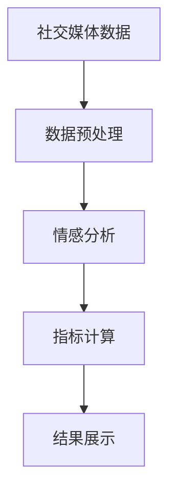

                 


# 巴菲特的市场情绪指标：社交媒体情绪分析的新维度

> 关键词：市场情绪指标，社交媒体，情绪分析，巴菲特投资理念，自然语言处理

> 摘要：本文探讨了巴菲特市场情绪指标在社交媒体情绪分析中的应用。通过分析社交媒体数据，结合巴菲特的投资理念，提出了一种新的市场情绪指标计算方法，为投资者提供更精准的决策支持。

---

## 第一部分：背景介绍

### 1.1 市场情绪指标的核心概念

市场情绪指标是衡量市场参与者情绪状态的重要工具，能够反映投资者对市场的乐观或悲观态度。传统上，市场情绪指标主要基于成交量、价格波动等量化指标，但近年来，社交媒体的兴起为情绪分析提供了新的数据来源。

#### 1.1.1 市场情绪指标的定义
市场情绪指标是通过量化投资者情绪状态，评估市场风险和投资机会的指标。它通常分为乐观、中性和悲观三种状态。

#### 1.1.2 市场情绪指标的分类
市场情绪指标可以分为以下几类：
- **基于价格数据的指标**：如波动率、相对强度指数（RSI）等。
- **基于交易数据的指标**：如成交量、换手率等。
- **基于新闻数据的指标**：如新闻标题的情感分析结果。

#### 1.1.3 市场情绪指标与投资决策的关系
市场情绪指标能够帮助投资者预测市场趋势，尤其是在市场情绪过热或过冷时，投资者可以调整投资策略，规避风险或抓住机会。

---

### 1.2 巴菲特与市场情绪分析

#### 1.2.1 巴菲特的投资理念与市场情绪
巴菲特强调长期投资和价值投资，但他也关注市场情绪对投资决策的影响。他认为，市场情绪的波动性可能导致短期市场的非理性波动，但长期来看，价值投资才是决定因素。

#### 1.2.2 巴菲特如何利用市场情绪做出投资决策
巴菲特通过观察市场情绪的变化，判断市场的估值是否偏离实际价值。例如，在市场情绪极度乐观时，他可能会选择卖出，避免市场泡沫破裂的风险。

#### 1.2.3 巴菲特市场情绪指标的独特性
与传统市场情绪指标不同，巴菲特市场情绪指标更注重长期价值，而非短期情绪波动。

---

### 1.3 社交媒体情绪分析的背景与现状

#### 1.3.1 社交媒体在金融分析中的作用
社交媒体成为投资者情绪的主要来源之一。通过分析社交媒体上的文本数据，可以实时捕捉市场参与者的观点和态度。

#### 1.3.2 社交媒体情绪分析的现状
社交媒体情绪分析在金融领域的应用还处于起步阶段，但其潜力巨大。通过自然语言处理技术，可以提取社交媒体上的情感信息，并将其转化为可量化的指标。

---

## 第二部分：数学模型与算法实现

### 2.1 巴菲特市场情绪指标的数学模型

#### 2.1.1 指标的构建逻辑
 Buffett市场情绪指标的构建逻辑如下：
1. 采集社交媒体上的文本数据。
2. 对文本进行情感分析，计算每条文本的情感得分。
3. 对情感得分进行加权平均，得到市场情绪指数。

#### 2.1.2 指标的数学表达式
市场情绪指数（BMEI）的计算公式如下：
$$
BMEI = \frac{\sum_{i=1}^{n} w_i \cdot s_i}{\sum_{i=1}^{n} w_i}
$$
其中，\( w_i \) 是第 \( i \) 条文本的权重，\( s_i \) 是第 \( i \) 条文本的情感得分。

#### 2.1.3 指标计算的步骤
1. 数据预处理：去除停用词、分词等。
2. 情感分析：使用机器学习模型对文本进行情感分类。
3. 权重计算：根据文本的影响力和相关性计算权重。
4. 计算市场情绪指数。

---

### 2.2 社交媒体情绪分析的算法实现

#### 2.2.1 文本预处理算法
文本预处理包括以下步骤：
1. 分词：使用分词工具对文本进行分词。
2. 去除停用词：去掉无意义的词汇，如“的”、“了”等。
3. 词干提取：将单词转换为词干，便于后续分析。

#### 2.2.2 情感分析算法
情感分析算法可以分为以下几类：
1. 基于机器学习的情感分析：使用SVM、随机森林等算法进行分类。
2. 基于深度学习的情感分析：使用LSTM、BERT等模型进行分类。
3. 基于规则的情感分析：根据预设的规则进行情感判断。

#### 2.2.3 情感分析结果的量化
情感分析结果可以量化为以下指标：
1. 情感强度：反映情感的强烈程度。
2. 情感分布：反映不同情感类别（如正面、负面）的比例。
3. 情感变化趋势：反映情感随时间的变化情况。

---

## 第三部分：系统架构与项目实战

### 3.1 系统架构设计

#### 3.1.1 系统功能设计
系统功能包括：
1. 数据采集：从社交媒体平台获取文本数据。
2. 文本预处理：对文本进行分词、去停用词等处理。
3. 情感分析：对文本进行情感分类，计算情感得分。
4. 指标计算：根据情感得分计算市场情绪指数。
5. 结果展示：将市场情绪指数可视化。

#### 3.1.2 系统架构图


### 3.2 项目实战

#### 3.2.1 环境安装
需要安装以下工具：
- Python：用于编程。
- NLTK：用于文本处理。
- Scikit-learn：用于机器学习模型训练。
- Matplotlib：用于结果可视化。

#### 3.2.2 核心实现代码
以下是情感分析模型的实现代码：
```python
import numpy as np
from sklearn.feature_extraction.text import TfidfVectorizer
from sklearn.svm import SVC

# 数据预处理
def preprocess(text):
    # 分词
    words = text.split()
    # 去除停用词
    stop_words = set(["的", "了", "是", "在", "和", "与"])
    filtered_words = [word for word in words if word not in stop_words]
    return " ".join(filtered_words)

# 情感分析模型训练
def train_model(train_texts, train_labels):
    vectorizer = TfidfVectorizer()
    X = vectorizer.fit_transform(train_texts)
    model = SVC()
    model.fit(X, train_labels)
    return model, vectorizer

# 情感分析预测
def predict(model, vectorizer, test_text):
    processed_text = preprocess(test_text)
    X = vectorizer.transform([processed_text])
    return model.predict(X)[0]

# 示例数据
train_texts = [
    "市场表现很好，投资者信心充足。",
    "市场下跌，投资者情绪低落。",
    "市场震荡，投资者持观望态度。"
]
train_labels = ["positive", "negative", "neutral"]

model, vectorizer = train_model(train_texts, train_labels)
test_text = "市场上涨，投资者非常乐观。"
prediction = predict(model, vectorizer, test_text)
print(f"预测结果：{prediction}")
```

#### 3.2.3 案例分析
以某段时间内的社交媒体数据为例，计算市场情绪指数，并与实际市场表现进行对比。通过对比分析，验证模型的有效性。

---

## 第四部分：结论与展望

### 4.1 结论
本文提出了一种基于社交媒体数据的市场情绪指标计算方法，结合巴菲特的投资理念，为投资者提供了新的决策支持工具。

### 4.2 未来展望
未来的研究方向包括：
1. 提高情感分析的准确性。
2. 引入更多数据源，如新闻、财报等，丰富市场情绪指标的维度。
3. 研究市场情绪指标与实际市场表现的相关性。

---

通过本文的分析，我们可以看到，社交媒体情绪分析为市场情绪指标的计算提供了新的可能性。未来，随着技术的不断发展，市场情绪分析将更加精准，为投资者提供更有力的决策支持。

