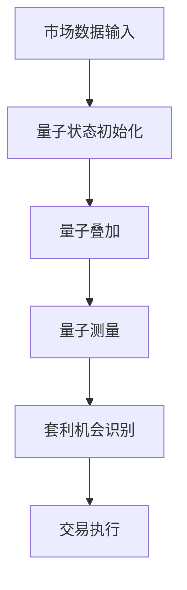
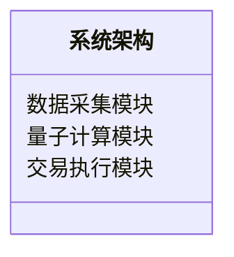
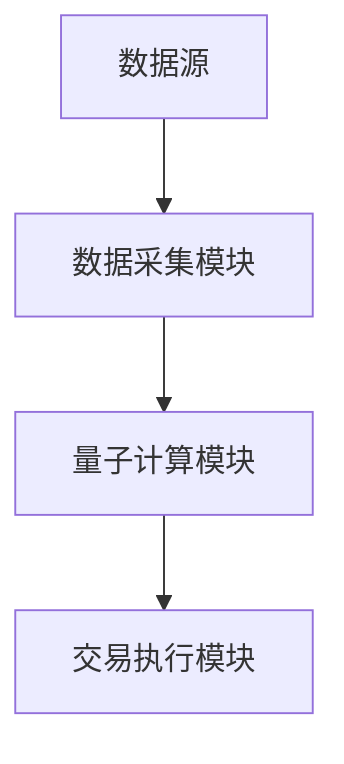

                 


# 巴菲特的市场效率理论批判：量子套利和市场微观结构

---

## 关键词：  
巴菲特，市场效率，量子套利，市场微观结构，交易行为分析，订单簿分析，金融算法，价值投资

---

## 摘要：  
本文从巴菲特的市场效率理论批判出发，深入探讨量子套利和市场微观结构的关系。通过分析量子套利的算法原理、市场微观结构对交易行为的影响，以及巴菲特的价值投资理念，揭示市场非有效性与套利机会之间的联系。文章结合实际案例和系统设计，为投资者提供理论支持和实践指导。

---

## 第一部分：巴菲特的市场效率理论与市场微观结构基础

---

## 第1章：市场效率理论的背景与基础

### 1.1 市场效率理论的定义与核心概念

#### 1.1.1 市场效率的基本定义
市场效率理论是金融学中的核心理论，认为市场价格反映了所有可获得的信息。有效市场假说（EMH）将市场分为三种类型：弱有效、半强有效和强有效。

$$EMH = \text{市场价格} = \text{所有可获得信息的反映}$$

#### 1.1.2 有效市场假说的理论基础
有效市场假说由Fama在1970年提出，认为价格已经反映了所有公开信息，因此无法通过技术分析或基本面分析获得超额收益。

#### 1.1.3 市场效率的分类与层次
- **弱有效市场**：价格反映历史信息。
- **半强有效市场**：价格反映公开信息。
- **强有效市场**：价格反映所有信息，包括内部信息。

### 1.2 巴菲特对市场效率理论的批判

#### 1.2.1 巴菲特的价值投资理念
巴菲特认为市场并非总是有效的，股票价格可能偏离其内在价值。他通过寻找被低估的股票进行投资。

$$\text{内在价值} = \text{企业未来现金流的现值}$$

#### 1.2.2 市场非有效性的表现形式
- **短期波动性**：市场价格短期可能偏离价值。
- **投资者情绪**：市场情绪影响价格波动。
- **信息不对称**：部分投资者掌握更多信息。

#### 1.2.3 巴菲特批判的有效性与局限性
巴菲特的批判揭示了市场非有效性，但其方法依赖于个人能力和信息获取，具有局限性。

---

## 第2章：量子套利的概念与方法论

### 2.1 量子套利的定义与起源

#### 2.1.1 量子套利的基本概念
量子套利是一种利用量子力学原理进行金融套利的方法，结合了量子计算和金融市场的复杂性。

#### 2.1.2 量子套利与传统套利的区别
- 传统套利：基于价格差异，如跨市场套利。
- 量子套利：利用量子计算分析复杂市场行为。

#### 2.1.3 量子套利的理论基础与数学模型
量子套利利用量子叠加和纠缠特性，分析市场状态的不确定性。

### 2.2 量子套利的核心算法与实现

#### 2.2.1 量子套利算法的流程图


#### 2.2.2 量子套利的数学模型与公式
量子套利模型基于量子概率，计算市场状态的最优解。

$$P(\text{状态}|d) = \frac{\langle \psi | d \rangle}{\langle d | d \rangle}$$

---

## 第3章：市场微观结构与交易行为分析

### 3.1 市场微观结构的基本概念

#### 3.1.1 市场微观结构的定义
市场微观结构研究订单簿、交易行为和市场参与者的互动。

#### 3.1.2 市场微观结构的核心要素
- **订单簿**：记录买价、卖价和成交量。
- **流动性**：市场买卖订单的深度和速度。
- **交易成本**：包括佣金、滑点等。

### 3.2 交易行为与订单簿分析

#### 3.2.1 交易行为的分类与特征
- **市场订单**：立即成交的价格。
- **限价订单**：指定价格成交。

#### 3.2.2 订单簿分析的基本方法
- **订单深度分析**：衡量市场参与者对价格的支持程度。
- **订单撤销率分析**：反映市场参与者的行为策略。

---

## 第二部分：量子套利与市场效率的结合

---

## 第4章：量子套利在市场效率批判中的应用

### 4.1 量子套利与市场非有效性的结合

#### 4.1.1 量子套利如何利用市场非有效性
量子套利通过分析市场微观结构，捕捉短期价格波动。

#### 4.1.2 量子套利在巴菲特批判中的体现
量子套利利用市场非有效性，寻找套利机会。

#### 4.1.3 量子套利与市场微观结构的互动
量子套利算法通过分析订单簿，识别套利机会。

---

## 第5章：市场微观结构对量子套利的影响

### 5.1 市场微观结构对量子套利策略的影响

#### 5.1.1 订单簿深度与量子套利策略
订单深度影响量子套利的执行成本。

#### 5.1.2 市场流动性对量子套利的影响
流动性影响量子套利的交易速度和规模。

#### 5.1.3 交易成本与量子套利的优化
优化交易成本是量子套利成功的关键。

### 5.2 量子套利在不同市场环境中的表现

#### 5.2.1 市场波动性对量子套利的影响
高波动性可能增加量子套利的机会，但也增加风险。

#### 5.2.2 市场参与者行为对量子套利的挑战
参与者行为的复杂性影响量子套利的执行。

#### 5.2.3 量子套利在新兴市场与成熟市场的差异
新兴市场波动性更高，套利机会更多。

---

## 第三部分：量子套利的系统分析与实战应用

---

## 第6章：量子套利系统的架构与设计

### 6.1 量子套利系统的整体架构

#### 6.1.1 系统功能模块划分
- 数据采集模块
- 量子计算模块
- 交易执行模块

#### 6.1.2 系统架构的ER图与类图


#### 6.1.3 系统接口设计与交互流程


### 6.2 量子套利系统的实现细节

#### 6.2.1 系统核心算法的代码实现
```python
def quantum_strategy(data):
    # 量子计算部分
    pass
```

---

## 第7章：量子套利的实战案例与分析

### 7.1 实战案例的背景与选择

#### 7.1.1 案例背景介绍
选择一个新兴市场，分析量子套利的机会。

#### 7.1.2 案例选择的标准
市场波动性高，信息不对称明显。

#### 7.1.3 交易策略设计
基于订单簿分析，制定套利策略。

---

## 总结

量子套利结合市场微观结构分析，为投资者提供了新的套利机会。通过分析市场非有效性，量子套利在现代金融市场中具有广阔的应用前景。然而，其复杂性和技术门槛要求投资者具备专业的知识和技能。

---

## 最佳实践 Tips

- 量子套利需要结合市场微观结构分析。
- 投资者应关注市场波动性和流动性。
- 量子套利算法需不断优化，以适应市场变化。

--- 

## 小结

本文通过分析巴菲特的市场效率理论，结合量子套利和市场微观结构，揭示了市场非有效性的套利机会。未来，随着量子计算的发展，量子套利将在金融市场上发挥更大作用。

