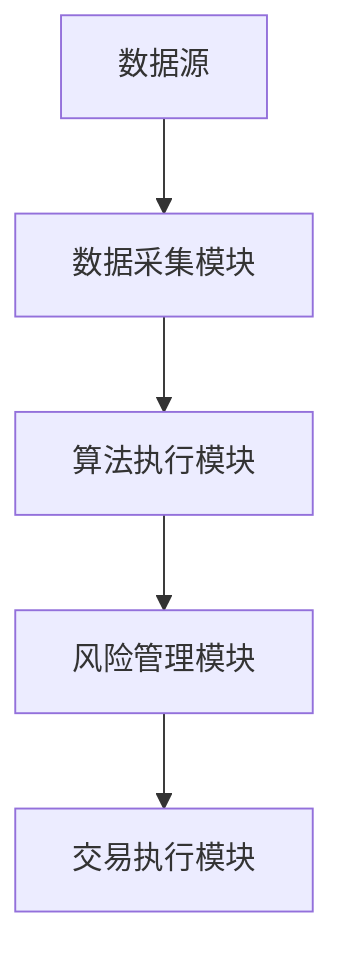

                 


# 巴菲特的市场效率理论批判：高频交易时代的市场异常

## 关键词：
- 巴菲特
- 市场效率
- 高频交易
- 市场异常
- 算法交易

## 摘要：
本文批判性地分析了巴菲特的市场效率理论在高频交易时代的适用性，探讨高频交易对市场效率的影响，以及如何引发市场异常现象。通过详细的技术分析和系统设计，本文揭示了高频交易算法对市场稳定性的影响，并提出了相应的解决方案。

---

# 第1章 巴菲特的市场效率理论概述

## 1.1 巴菲特市场效率理论的核心观点

### 1.1.1 市场有效性的基本定义
市场有效性是指市场价格反映所有相关信息的能力。巴菲特认为，市场通常是有效的，这意味着股票价格已经反映了所有公开信息，因此很难通过分析找到被低估的股票。

### 1.1.2 巴菲特对市场效率的判断标准
巴菲特判断市场效率的标准包括：
1. **价值投资**：寻找那些市场价格低于其内在价值的股票。
2. **市场情绪**：关注市场情绪，避免在市场狂热时买入或卖出。
3. **长期视角**：相信长期来看，市场会趋于有效，因此投资应注重长期价值。

### 1.1.3 市场效率与投资机会的关系
巴菲特认为，在有效的市场中，投资机会较少，因此他更倾向于寻找那些暂时未被市场发现的低估股票。

## 1.2 高频交易的起源与发展

### 1.2.1 高频交易的定义与特点
高频交易是指利用计算机算法在极短时间内进行大量交易，其特点包括：
- **高速性**：交易速度极快，通常以毫秒为单位。
- **自动化**：交易由算法自动执行，无需人工干预。
- **高频性**：短时间内进行大量交易。

### 1.2.2 高频交易的技术基础
高频交易依赖于高速网络、低延迟硬件和复杂算法。交易者通过这些技术手段在极短时间内完成大量交易。

### 1.2.3 高频交易与传统交易方式的对比
- **交易速度**：高频交易远快于传统交易。
- **交易量**：高频交易占市场总交易量的大部分。
- **风险管理**：高频交易依赖算法，而传统交易依赖人工判断。

## 1.3 巴菲特理论与高频交易的冲突

### 1.3.1 巴菲特理论在高频交易时代的适用性
巴菲特的市场效率理论假设市场是有效的，但在高频交易时代，市场信息反映速度极快，传统分析方法难以捕捉机会。

### 1.3.2 高频交易对市场效率的潜在影响
高频交易可能导致市场价格波动加剧，削弱市场效率。

### 1.3.3 巴菲特理论的局限性与争议
巴菲特理论忽视了高频交易对市场结构的影响，导致其在高频交易时代面临挑战。

## 1.4 本章小结
本章概述了巴菲特的市场效率理论和高频交易的背景，分析了两者之间的冲突，为后续批判提供了基础。

---

# 第2章 高频交易对市场效率的影响

## 2.1 高频交易的技术与策略

### 2.1.1 高频交易的算法与执行策略
高频交易依赖复杂的算法，如统计套利和算法交易策略。这些算法利用市场微小价格差异进行套利。

### 2.1.2 数据源与交易速度的优化
高频交易依赖高频数据源和低延迟网络，确保交易速度最大化。

### 2.1.3 市场微观结构分析
市场微观结构分析包括订单簿分析和交易量分析，帮助高频交易者捕捉市场机会。

## 2.2 高频交易对市场效率的挑战

### 2.2.1 市场流动性的影响
高频交易可能导致流动性波动，影响市场稳定性。

### 2.2.2 价格发现机制的改变
高频交易改变了价格发现机制，可能导致价格波动加剧。

### 2.2.3 市场波动性与不稳定性
高频交易可能导致市场波动性增加，影响市场效率。

## 2.3 巴菲特理论的批判与修正

### 2.3.1 巴菲特理论在高频交易时代的局限性
高频交易的快速发展使得市场信息反映速度极快，巴菲特的理论难以适用。

### 2.3.2 市场效率的新定义与衡量标准
市场效率需要重新定义，考虑高频交易对市场结构的影响。

### 2.3.3 巴菲特理论的修正与扩展
修正后的理论应考虑高频交易对市场效率的影响，提出新的投资策略。

## 2.4 本章小结
本章分析了高频交易的技术与策略，探讨其对市场效率的影响，并提出了对巴菲特理论的批判与修正。

---

# 第3章 高频交易与市场异常现象

## 3.1 市场异常现象的定义与分类

### 3.1.1 市场异常现象的定义
市场异常现象是指市场价格偏离正常波动的现象，通常由市场结构变化或算法交易引发。

### 3.1.2 市场异常现象的分类
市场异常现象包括市场闪崩、极端波动和价格反转等。

## 3.2 高频交易引发的市场异常现象

### 3.2.1 高频交易与市场闪崩
高频交易可能导致市场闪崩，如2010年“闪电崩盘”事件。

### 3.2.2 高频交易与极端波动
高频交易可能引发极端波动，影响市场稳定性。

### 3.2.3 高频交易与价格反转
高频交易可能导致价格反转，影响市场效率。

## 3.3 高频交易对市场稳定性的冲击

### 3.3.1 市场波动性加剧
高频交易可能导致市场波动性加剧，影响市场稳定性。

### 3.3.2 市场参与者行为变化
高频交易改变了市场参与者的行为，可能导致市场异常现象频发。

## 3.4 本章小结
本章分析了高频交易引发的市场异常现象，探讨其对市场稳定性的影响。

---

# 第4章 高频交易系统中的算法与策略

## 4.1 高频交易算法的实现

### 4.1.1 统计套利算法
统计套利算法通过寻找资产之间的统计套利机会，实现无风险收益。

### 4.1.2 算法交易策略
算法交易策略包括算法驱动的订单生成和执行策略优化。

## 4.2 算法交易的数学模型

### 4.2.1 市场微观结构模型
市场微观结构模型描述了订单簿和交易量之间的关系。

### 4.2.2 统计套利模型
统计套利模型包括均值回归模型和配对交易模型。

## 4.3 算法交易的代码实现

### 4.3.1 Python代码示例
以下是一个简单的统计套利算法示例：

```python
import pandas as pd
import numpy as np

# 假设我们有两个资产，A和B
data = pd.DataFrame({'A': np.random.randn(100), 'B': np.random.randn(100)})

# 计算资产之间的配对关系
data['spread'] = data['A'] - data['B']
data['mean'] = data['spread'].mean()
data['std'] = data['spread'].std()

# 统计套利策略
data['signal'] = 0
data.loc[data['spread'] > data['mean'] + 2*data['std'], 'signal'] = -1
data.loc[data['spread'] < data['mean'] - 2*data['std'], 'signal'] = 1

# 输出信号
print(data['signal'])
```

## 4.4 本章小结
本章详细讲解了高频交易中的算法与策略，分析了统计套利算法的实现及其数学模型。

---

# 第5章 高频交易与市场稳定性

## 5.1 市场微观结构分析

### 5.1.1 市场订单簿分析
订单簿分析帮助高频交易者捕捉市场机会。

### 5.1.2 交易量与价格关系
交易量与价格关系是市场微观结构的重要组成部分。

## 5.2 高频交易对市场稳定性的影响

### 5.2.1 市场波动性
高频交易可能导致市场波动性加剧，影响市场稳定性。

### 5.2.2 市场参与者行为
高频交易改变了市场参与者的行为，可能导致市场异常现象频发。

## 5.3 本章小结
本章分析了高频交易对市场稳定性的影响，探讨了市场微观结构的变化。

---

# 第6章 高频交易系统的架构设计

## 6.1 系统架构设计

### 6.1.1 系统功能模块
高频交易系统包括数据采集、算法执行、风险管理等模块。

### 6.1.2 系统架构图
以下是系统架构图：



## 6.2 系统接口设计

### 6.2.1 数据接口
数据接口负责采集高频数据，包括订单簿和交易量。

### 6.2.2 算法接口
算法接口负责执行高频交易算法，生成交易信号。

## 6.3 本章小结
本章设计了高频交易系统的架构，分析了各模块的功能和接口设计。

---

# 第7章 高频交易项目的实战分析

## 7.1 项目环境配置

### 7.1.1 硬件配置
高频交易需要高性能计算机和低延迟网络。

### 7.1.2 软件配置
高频交易需要高性能算法和快速数据处理能力。

## 7.2 核心代码实现

### 7.2.1 统计套利算法实现
以下是一个统计套利算法的Python代码示例：

```python
import pandas as pd
import numpy as np

# 假设我们有两个资产，A和B
data = pd.DataFrame({'A': np.random.randn(100), 'B': np.random.randn(100)})

# 计算资产之间的配对关系
data['spread'] = data['A'] - data['B']
data['mean'] = data['spread'].mean()
data['std'] = data['spread'].std()

# 统计套利策略
data['signal'] = 0
data.loc[data['spread'] > data['mean'] + 2*data['std'], 'signal'] = -1
data.loc[data['spread'] < data['mean'] - 2*data['std'], 'signal'] = 1

# 输出信号
print(data['signal'])
```

## 7.3 项目小结
本章通过实际案例分析了高频交易项目的实现，展示了统计套利算法的应用。

---

# 第8章 总结与展望

## 8.1 本章总结
本文批判性地分析了巴菲特的市场效率理论在高频交易时代的适用性，探讨了高频交易对市场效率的影响，并提出了相应的解决方案。

## 8.2 未来展望
未来的研究可以进一步探讨高频交易对市场结构的影响，提出更有效的市场监管策略。

## 8.3 最佳实践 tips
- 高频交易需要高性能硬件和低延迟网络。
- 统计套利算法是高频交易的重要工具。
- 市场监管是保障市场稳定性的关键。

---

# 附录

## 附录A 高频交易相关术语表
- **高频交易**：利用计算机算法在极短时间内进行大量交易。
- **统计套利**：通过寻找资产之间的统计套利机会实现无风险收益。

## 附录B 相关参考文献
- 巴菲特的市场效率理论相关文献。
- 高频交易算法相关文献。

---

通过以上内容，我们可以看到，高频交易对市场效率的影响是深远的。巴菲特的市场效率理论在高频交易时代面临挑战，需要重新审视和修正。未来的研究和实践需要更加关注高频交易对市场稳定性的影响，提出更有效的市场监管策略，以应对高频交易带来的市场异常现象。

