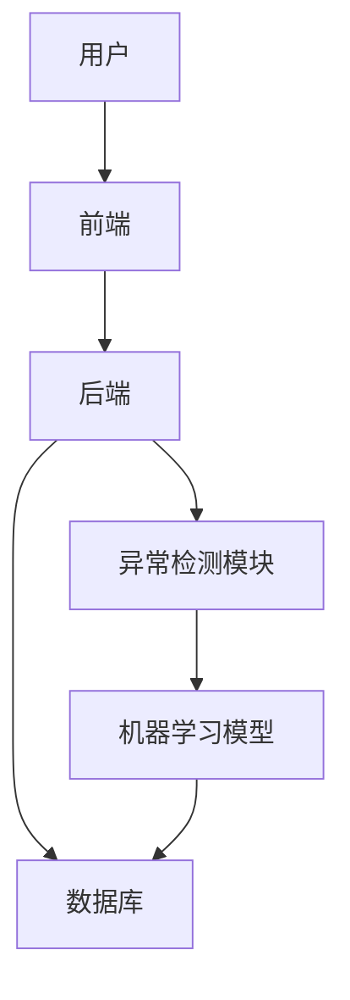

                 


# 巴菲特的市场泡沫识别：人工智能驱动的市场异常检测

## 关键词：巴菲特，市场泡沫，人工智能，市场异常检测，金融数据分析，机器学习

## 摘要：  
本文探讨了如何利用人工智能技术来实现巴菲特式的市场泡沫识别。通过结合巴菲特的价值投资理念与人工智能技术，我们提出了一种基于机器学习和深度学习的市场异常检测方法。该方法不仅能够帮助投资者识别市场泡沫，还能为投资决策提供数据支持。本文详细介绍了市场异常检测的核心理论、人工智能算法的实现、系统设计与实现，以及实际案例分析，为投资者和数据科学家提供了实用的参考。

---

## 第1章 巴菲特投资理念与人工智能基础

### 1.1 巴菲特投资理念的核心思想

#### 1.1.1 巴菲特的价值投资理论
巴菲特的价值投资理论强调长期投资、安全边际和内在价值。他认为，市场短期是投票机，长期是称重机。通过分析企业的基本面，如盈利能力、财务状况和行业地位，巴菲特能够识别市场中的低估股票。

#### 1.1.2 巴菲特对市场波动的观察
巴菲特注意到市场的波动性，认为市场的短期波动往往由情绪驱动，而长期趋势则由基本面决定。他强调，在市场恐慌时买入，在市场狂热时卖出。

#### 1.1.3 巴菲特市场泡沫识别的实践案例
巴菲特在1999年互联网泡沫期间，通过分析公司的基本面，避免了高估的科技股投资。他强调，市场的疯狂行为最终会回归理性。

---

### 1.2 人工智能与市场分析的结合

#### 1.2.1 人工智能在金融领域的应用
人工智能技术在金融领域的应用包括股票预测、风险评估、市场情绪分析和异常检测。通过机器学习和深度学习算法，投资者可以更高效地处理海量数据。

#### 1.2.2 市场异常检测的定义与分类
市场异常检测是指识别市场数据中的异常行为，如价格突然波动、交易量激增等。异常检测可以分为单变量异常检测和多变量异常检测。

#### 1.2.3 人工智能在市场异常检测中的优势
人工智能技术能够快速处理大量数据，发现隐藏的模式，并实时监控市场动态。通过机器学习模型，可以实现对市场异常的自动化识别。

---

### 1.3 巴菲特理念与AI技术的结合

#### 1.3.1 巴菲特市场泡沫识别的核心要素
巴菲特的市场泡沫识别基于企业的基本面分析，包括盈利能力、财务健康状况和行业地位。这些因素可以帮助投资者识别市场的高估或低估。

#### 1.3.2 人工智能在市场异常检测中的作用
人工智能技术可以帮助投资者实时监控市场数据，识别异常行为，并预测市场的短期波动。通过结合基本面分析，人工智能可以辅助巴菲特式的投资决策。

#### 1.3.3 巴菲特理念与AI技术的融合
将巴菲特的价值投资理念与人工智能技术相结合，可以实现对市场的全面分析。通过机器学习模型，投资者可以在大数据时代更高效地识别市场机会和风险。

---

## 第2章 市场异常检测的理论基础

### 2.1 市场异常检测的定义与分类

#### 2.1.1 市场异常检测的定义
市场异常检测是指识别市场数据中的异常行为，包括价格波动、交易量变化和市场情绪等。异常检测可以帮助投资者发现市场中的潜在风险。

#### 2.1.2 市场异常的分类
市场异常可以分为市场整体异常和个股异常。市场整体异常通常由系统性风险引起，而个股异常则由特定公司的基本面变化引起。

#### 2.1.3 市场异常检测的特征分析
市场异常检测需要分析多个特征，包括价格、交易量、市盈率、市净率等。这些特征可以帮助投资者识别市场的异常行为。

---

### 2.2 市场异常检测的核心要素

#### 2.2.1 市场数据的特征分析
市场数据的特征包括时间序列特征和统计特征。时间序列特征分析可以帮助识别市场的趋势和周期性变化，而统计特征分析可以帮助识别数据的分布和异常值。

#### 2.2.2 市场波动的数学模型
市场波动可以用时间序列模型，如ARIMA和GARCH模型来描述。这些模型可以帮助投资者预测市场的短期波动。

#### 2.2.3 异常检测的阈值设定
异常检测的阈值设定需要根据市场数据的分布特征来确定。通常，可以通过统计方法或机器学习模型来自动确定异常检测的阈值。

---

### 2.3 巴菲特理念与市场异常检测的结合

#### 2.3.1 巴菲特市场泡沫识别的关键指标
巴菲特的市场泡沫识别基于企业的基本面指标，如市盈率、市净率和盈利能力。这些指标可以帮助投资者识别市场的高估或低估。

#### 2.3.2 巴菲特理念在异常检测中的应用
通过结合巴菲特的价值投资理念，投资者可以利用机器学习模型分析市场的基本面数据，识别潜在的市场异常。

#### 2.3.3 巴菲特理念与AI技术的融合
将巴菲特的价值投资理念与人工智能技术相结合，可以帮助投资者实现对市场的全面分析，识别市场异常，并做出更明智的投资决策。

---

## 第3章 人工智能驱动的市场异常检测算法

### 3.1 时间序列分析与异常检测

#### 3.1.1 时间序列分析的基本概念
时间序列分析是研究数据随时间变化的模式和趋势。常见的时间序列分析方法包括ARIMA和LSTM模型。

#### 3.1.2 时间序列异常检测的算法选择
时间序列异常检测算法包括基于统计的方法（如Z-score）和基于机器学习的方法（如Isolation Forest和LSTM）。

#### 3.1.3 时间序列异常检测的实现步骤
时间序列异常检测的实现步骤包括数据预处理、特征提取、模型训练和异常检测。

---

### 3.2 基于机器学习的市场异常检测

#### 3.2.1 机器学习在市场异常检测中的应用
机器学习算法，如随机森林和XGBoost，可以用于市场异常检测。这些算法可以通过分析市场数据的特征，识别潜在的异常行为。

#### 3.2.2 机器学习模型的训练与优化
机器学习模型的训练需要选择合适的特征、调整超参数，并进行交叉验证。通过优化模型，可以提高市场异常检测的准确率。

#### 3.2.3 机器学习模型的数学模型
机器学习模型的数学模型包括线性回归、支持向量机和决策树等。这些模型可以通过训练数据学习市场的规律，并预测潜在的异常行为。

---

### 3.3 基于深度学习的市场异常检测

#### 3.3.1 深度学习在市场异常检测中的应用
深度学习算法，如LSTM和Transformer，可以用于市场异常检测。这些算法可以通过分析市场的时序数据，识别潜在的异常行为。

#### 3.3.2 深度学习模型的训练与优化
深度学习模型的训练需要选择合适的网络结构、调整超参数，并进行数据增强。通过优化模型，可以提高市场异常检测的准确率。

#### 3.3.3 深度学习模型的数学模型
深度学习模型的数学模型包括LSTM和Transformer等。这些模型可以通过训练数据学习市场的规律，并预测潜在的异常行为。

---

## 第4章 市场异常检测的系统设计

### 4.1 问题场景介绍

#### 4.1.1 市场异常检测的场景描述
市场异常检测的场景包括股票价格的突然波动、交易量激增和市场情绪的急剧变化。这些异常行为可能预示着市场的波动。

#### 4.1.2 项目目标
本项目的目标是开发一个基于人工智能的市场异常检测系统，能够实时监控市场数据，识别潜在的异常行为，并提供投资建议。

---

### 4.2 系统功能设计

#### 4.2.1 领域模型（ER实体关系图）
以下是领域模型的ER实体关系图：

```mermaid
erd
    title 领域模型
    User {
        id: integer
        username: string
        password: string
    }
    MarketData {
        id: integer
        timestamp: datetime
        price: float
        volume: integer
    }
    AbnormalBehavior {
        id: integer
        market_data_id: integer
        user_id: integer
        detected_time: datetime
    }
```

#### 4.2.2 系统架构设计
以下是系统架构设计的架构图：



---

### 4.3 系统接口设计

#### 4.3.1 API接口设计
以下是API接口设计：

```python
class MarketData:
    def __init__(self, timestamp, price, volume):
        self.timestamp = timestamp
        self.price = price
        self.volume = volume

class AbnormalBehaviorDetector:
    def __init__(self, model):
        self.model = model

    def detect_abnormalities(self, market_data):
        # 返回异常行为的列表
        return self.model.predict(market_data)
```

---

## 第5章 项目实战

### 5.1 环境安装

#### 5.1.1 安装Python和必要的库
以下是安装Python和必要库的命令：

```bash
python --version
pip install numpy pandas scikit-learn tensorflow
```

---

### 5.2 系统核心实现源代码

#### 5.2.1 机器学习模型实现
以下是机器学习模型的实现代码：

```python
import numpy as np
import pandas as pd
from sklearn.ensemble import IsolationForest

class MarketAnomalyDetector:
    def __init__(self):
        self.model = IsolationForest(random_state=42)

    def fit(self, X):
        self.model.fit(X)

    def predict(self, X):
        return self.model.predict(X)
```

---

### 5.3 代码应用解读与分析

#### 5.3.1 代码实现细节
以下是代码实现细节：

1. 数据预处理：将市场数据转换为适合模型输入的格式。
2. 模型训练：使用Isolation Forest算法训练异常检测模型。
3. 模型预测：使用训练好的模型预测市场数据中的异常行为。

---

### 5.4 实际案例分析

#### 5.4.1 案例分析
以下是案例分析：

假设我们有以下市场数据：

| 时间戳 | 价格 | 交易量 |
|--------|------|--------|
| 2023-01-01 | 100 | 1000 |
| 2023-01-02 | 105 | 2000 |
| 2023-01-03 | 110 | 3000 |
| 2023-01-04 | 120 | 4000 |
| 2023-01-05 | 130 | 5000 |
| 2023-01-06 | 140 | 6000 |
| 2023-01-07 | 150 | 7000 |
| 2023-01-08 | 160 | 8000 |
| 2023-01-09 | 170 | 9000 |
| 2023-01-10 | 180 | 10000 |

通过训练模型，我们可以发现市场数据中的异常行为，如价格突然上涨或交易量激增。

---

## 第6章 总结、最佳实践 tips、注意事项、拓展阅读

### 6.1 总结

通过结合巴菲特的投资理念与人工智能技术，我们提出了一种基于机器学习和深度学习的市场异常检测方法。该方法可以帮助投资者识别市场泡沫，做出更明智的投资决策。

---

### 6.2 最佳实践 tips

1. 数据质量：确保市场数据的准确性和完整性。
2. 模型优化：通过调整超参数和数据增强优化模型性能。
3. 实时监控：建立实时监控系统，及时发现市场异常。

---

### 6.3 注意事项

1. 数据隐私：在处理市场数据时，需要注意数据隐私和合规性。
2. 模型解释性：选择具有解释性的模型，以便更好地理解市场行为。

---

### 6.4 拓展阅读

1. 《巴菲特致股东的信》：了解巴菲特的投资理念。
2. 《机器学习实战》：学习机器学习算法的实现。
3. 《深度学习》：学习深度学习算法的实现。

---

通过本文的分析和实践，我们展示了如何利用人工智能技术实现市场异常检测，并为投资者提供了实用的参考。希望本文能够帮助读者更好地理解市场动态，并做出更明智的投资决策。

