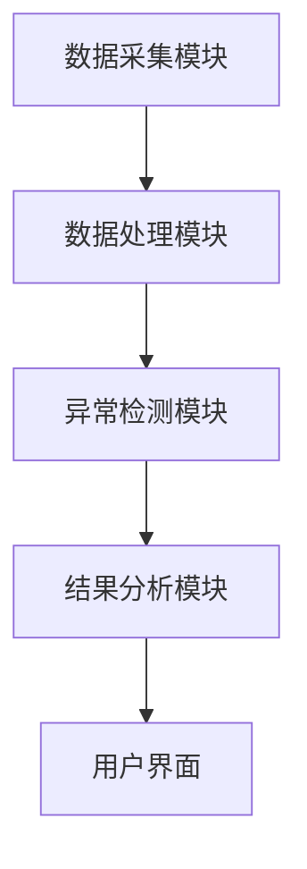
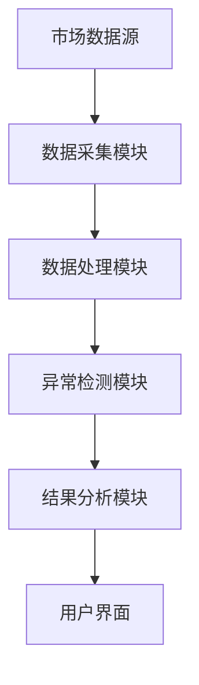
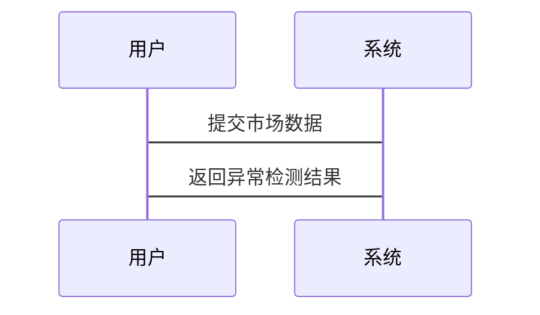

                 


# 巴菲特的市场泡沫识别：区块链驱动的市场异常检测

---

## 关键词：市场泡沫识别、区块链技术、异常检测、巴菲特投资理论、金融数据分析、去中心化系统

---

## 摘要：  
本文结合巴菲特的价值投资理论与区块链技术，探讨如何利用区块链驱动的市场异常检测系统识别市场泡沫。通过分析市场数据、构建数学模型、设计系统架构，提出一种基于区块链的实时市场异常检测方案，为投资者提供高效、可靠的市场风险预警工具。文章从理论到实践，详细阐述了区块链技术在金融数据分析中的应用，为理解和应对市场波动提供了新的思路。

---

# 第一部分: 巴菲特的市场泡沫识别与区块链技术基础

## 第1章: 巴菲特的市场泡沫识别理论

### 1.1 巴菲特的价值投资理念

#### 1.1.1 价值投资的核心思想
巴菲特的价值投资理念强调长期持有优质资产，关注企业的内在价值而非市场波动。以下是其核心思想的总结：

- **长期投资**：巴菲特认为市场的短期波动无法预测，但长期趋势可以通过对企业基本面的分析来把握。
- **安全边际**：投资时应考虑企业的内在价值与市场价格之间的差距，确保有一定的安全边际以降低风险。
- **企业竞争优势**：选择具有持续竞争优势的企业，如高利润率、稳定的市场需求和强大的品牌影响力。

#### 1.1.2 安全边际的概念与重要性
安全边际是巴菲特投资策略中的关键概念，指股票的市场价格低于其内在价值的部分。以下是其重要性：

- **降低投资风险**：通过安全边际，投资者可以在市场价格下跌时仍然保持投资价值。
- **避免情绪化决策**：安全边际为投资者提供了理性决策的空间，避免因市场波动而盲目跟风。
- **长期稳健回报**：通过安全边际，投资者可以在市场泡沫破裂时依然保持资产的稳定性。

#### 1.1.3 巴菲特的市场周期理论
巴菲特认为市场会经历周期性波动，包括牛市和熊市。以下是其市场周期理论的核心观点：

- **市场周期的波动性**：市场会因投资者情绪而波动，但长期趋势由经济基本面决定。
- **周期中的投资策略**：在市场低迷时，寻找被低估的资产；在市场繁荣时，保持警惕，避免盲目投资。
- **周期中的风险管理**：通过分散投资和安全边际，降低市场周期波动对投资组合的影响。

### 1.2 区块链技术的基本原理

#### 1.2.1 区块链的定义与核心特征
区块链是一种分布式账本技术，通过去中心化的方式记录和验证数据。以下是其核心特征：

- **去中心化**：数据分布在多个节点上，没有单点故障。
- **不可篡改性**：通过加密算法和共识机制确保数据不可篡改。
- **可追溯性**：每笔交易都可以追溯到源头，确保数据的透明性。
- **去信任化**：通过技术手段建立信任，无需依赖中心机构。

#### 1.2.2 区块链的共识机制
共识机制是区块链技术的核心之一，用于确保所有节点达成一致。以下是常见的共识机制：

- **工作量证明（PoW）**：通过计算哈希值来验证交易，比特币采用此机制。
- **权益证明（PoS）**：根据节点持有的代币数量分配记账权，以太坊2.0采用此机制。
- **实用拜占庭容错（PBFT）**：适用于高性能场景，通过投票机制达成共识。

#### 1.2.3 区块链的安全性与去中心化
区块链的安全性主要依赖于密码学和共识机制，而其去中心化特性则通过分布式网络实现。以下是安全性与去中心化的具体表现：

- **数据安全性**：通过加密算法和数字签名，确保数据的完整性和真实性。
- **网络去中心化**：数据分布在多个节点上，避免单点故障和数据垄断。

### 1.3 区块链在金融数据分析中的应用

#### 1.3.1 市场数据的实时性与完整性
金融市场数据的实时性和完整性是市场分析的关键。区块链技术可以通过以下方式实现：

- **实时数据记录**：通过区块链技术，每笔交易可以实时记录，确保数据的及时性。
- **数据完整性保障**：区块链的不可篡改性确保数据不会被修改或删除，保证数据的完整性。

#### 1.3.2 区块链在高频交易中的应用
高频交易需要快速的数据处理和低延迟的交易系统。区块链技术可以通过以下方式支持高频交易：

- **分布式架构**：区块链的去中心化架构可以减少交易延迟，提高交易效率。
- **智能合约**：通过智能合约自动化执行交易，减少人工干预，提高交易速度。

#### 1.3.3 区块链在市场情绪分析中的作用
市场情绪分析是市场预测的重要组成部分。区块链技术可以通过以下方式支持市场情绪分析：

- **数据透明性**：区块链的透明性使得市场数据更容易被分析和解读。
- **数据可追溯性**：通过区块链，可以追溯数据来源，确保数据的可靠性和真实性。

---

## 第2章: 市场异常检测的数学模型与算法

### 2.1 时间序列分析

#### 2.1.1 时间序列分析的定义与应用
时间序列分析是一种统计方法，用于分析和预测随时间变化的数据。以下是其定义与应用：

- **定义**：通过对时间序列数据的分析，发现数据中的模式和趋势，预测未来的变化。
- **应用**：广泛应用于金融、经济、气象等领域，帮助预测未来的变化趋势。

#### 2.1.2 基于ARIMA模型的市场异常检测
ARIMA（自回归积分滑动平均）模型是一种常用的时间序列预测模型。以下是其工作原理：

- **模型结构**：ARIMA模型由自回归部分、积分部分和滑动平均部分组成。
- **预测流程**：通过模型参数的估计，预测未来的时间序列数据。
- **异常检测**：通过比较预测值与实际值的差异，发现异常点。

#### 2.1.3 基于LSTM的市场异常检测
长短时记忆网络（LSTM）是一种深度学习模型，适用于处理长序列数据。以下是其工作原理：

- **模型结构**：LSTM由记忆单元、输入门和输出门组成，能够捕捉长期依赖关系。
- **预测流程**：通过训练模型，预测未来的时间序列数据。
- **异常检测**：通过比较预测值与实际值的差异，发现异常点。

### 2.2 基于机器学习的异常检测

#### 2.2.1 无监督学习算法
无监督学习是一种机器学习方法，用于处理无标签的数据。以下是常用的无监督学习算法：

- **K-Means聚类**：通过聚类分析，发现数据中的自然分组。
- **Isolation Forest**：通过隔离森林算法，检测异常点。

#### 2.2.2 异常检测的特征工程
特征工程是机器学习中的重要步骤，用于提取和选择有用的特征。以下是其主要内容：

- **特征选择**：选择对异常检测有重要影响的特征。
- **特征变换**：通过数据变换，改善数据的分布特性。
- **特征标准化**：对数据进行标准化处理，消除特征之间的量纲差异。

#### 2.2.3 基于深度学习的异常检测
深度学习是一种机器学习方法，适用于处理复杂的数据模式。以下是其在异常检测中的应用：

- **深度神经网络**：通过多层神经网络，学习数据中的复杂模式。
- **自动编码器**：通过自编码器模型，重建数据，检测异常点。

### 2.3 区块链与异常检测的结合

#### 2.3.1 区块链在异常检测中的数据优势
区块链技术通过去中心化和不可篡改性，确保了数据的安全性和完整性。以下是其优势：

- **数据可信度**：区块链的不可篡改性保证了数据的真实性和可靠性。
- **数据可追溯性**：通过区块链技术，可以追溯数据的来源和流向。

#### 2.3.2 基于区块链的异常检测算法
结合区块链技术，可以设计一种新的异常检测算法。以下是其基本思路：

- **数据上链**：将市场数据上传至区块链网络，确保数据的安全性和完整性。
- **数据处理**：通过区块链网络中的智能合约，对数据进行处理和分析。
- **异常检测**：基于处理后的数据，使用机器学习算法检测异常点。

---

## 第3章: 基于区块链的市场异常检测系统设计

### 3.1 系统架构设计

#### 3.1.1 系统功能模块
基于区块链的市场异常检测系统主要包括以下几个功能模块：

- **数据采集模块**：负责采集市场数据，包括价格、交易量等。
- **数据处理模块**：对采集到的数据进行清洗、转换和标准化处理。
- **异常检测模块**：使用机器学习算法，对数据进行异常检测。
- **结果分析模块**：对检测结果进行分析，生成报告。

#### 3.1.2 系统架构图
以下是系统的整体架构图，使用Mermaid绘制：



### 3.2 数据流与交互设计

#### 3.2.1 数据流图
以下是系统中的数据流图，使用Mermaid绘制：



#### 3.2.2 系统交互序列图
以下是系统的交互序列图，使用Mermaid绘制：



### 3.3 系统实现与优化

#### 3.3.1 系统实现
以下是系统的实现步骤：

1. **数据采集**：通过API接口采集市场数据，包括价格、交易量等。
2. **数据处理**：对采集到的数据进行清洗、转换和标准化处理。
3. **异常检测**：使用机器学习算法，对数据进行异常检测。
4. **结果分析**：对检测结果进行分析，生成报告。

#### 3.3.2 系统优化
为了提高系统的性能，可以进行以下优化：

- **算法优化**：使用更高效的算法，如集成学习算法，提高检测准确率。
- **数据预处理**：通过数据降维和特征选择，减少计算量。
- **系统优化**：通过分布式计算和并行处理，提高系统的计算效率。

---

## 第4章: 项目实战与总结

### 4.1 项目环境搭建

#### 4.1.1 环境要求
- **操作系统**：Windows、Linux、macOS均可
- **Python版本**：Python 3.8+
- **区块链框架**：以太坊、Hyperledger等
- **机器学习库**：Scikit-learn、TensorFlow、Keras

#### 4.1.2 工具安装
- **安装Python**：从官网下载安装最新版本的Python。
- **安装机器学习库**：使用pip安装Scikit-learn、TensorFlow、Keras。
- **安装区块链框架**：根据选择的框架，安装相应的库。

### 4.2 系统核心实现

#### 4.2.1 数据采集模块实现
以下是数据采集模块的实现代码：

```python
import requests
import json

def get_market_data(api_key):
    url = "https://api.example.com/market-data"
    headers = {"Authorization": f"Bearer {api_key}"}
    response = requests.get(url, headers=headers)
    return json.loads(response.text)
```

#### 4.2.2 数据处理模块实现
以下是数据处理模块的实现代码：

```python
import pandas as pd
from sklearn.preprocessing import StandardScaler

def preprocess_data(data):
    df = pd.DataFrame(data)
    scaler = StandardScaler()
    scaled_data = scaler.fit_transform(df)
    return scaled_data
```

#### 4.2.3 异常检测模块实现
以下是异常检测模块的实现代码：

```python
from sklearn.ensemble import IsolationForest

def detect_anomalies(data):
    model = IsolationForest(n_estimators=100, contamination=0.05)
    model.fit(data)
    anomalies = model.predict(data)
    return anomalies
```

### 4.3 实际案例分析

#### 4.3.1 案例背景
假设我们有一个股票市场的数据集，包含每天的收盘价、交易量等信息。我们的目标是通过基于区块链的异常检测系统，识别市场中的异常交易行为。

#### 4.3.2 案例分析
以下是具体分析步骤：

1. **数据采集**：通过API接口获取股票市场的数据。
2. **数据处理**：对数据进行清洗、转换和标准化处理。
3. **异常检测**：使用Isolation Forest算法，对数据进行异常检测。
4. **结果分析**：对检测结果进行分析，识别异常交易行为。

### 4.4 项目总结

#### 4.4.1 项目成果
通过本项目，我们成功构建了一个基于区块链的市场异常检测系统，能够实时检测市场中的异常交易行为，为投资者提供风险预警。

#### 4.4.2 项目经验
在项目实施过程中，我们积累了以下经验：

- **数据处理**：数据预处理是异常检测的关键，需要仔细处理数据中的缺失值、异常值等。
- **算法选择**：不同的异常检测算法适用于不同的场景，需要根据具体情况选择合适的算法。
- **系统优化**：系统的性能优化可以显著提高检测效率，尤其是在处理大规模数据时。

#### 4.4.3 项目不足
在项目实施过程中，我们也发现了以下不足：

- **数据隐私**：区块链的去中心化特性可能与数据隐私保护的要求存在冲突。
- **计算效率**：基于区块链的异常检测系统可能面临计算效率低下的问题。
- **模型解释性**：机器学习模型的解释性较差，可能影响异常检测的准确性。

### 4.5 总结与展望

#### 4.5.1 总结
本文结合巴菲特的价值投资理论与区块链技术，探讨了如何利用区块链驱动的市场异常检测系统识别市场泡沫。通过分析市场数据、构建数学模型、设计系统架构，提出了一种基于区块链的实时市场异常检测方案，为投资者提供高效、可靠的市场风险预警工具。

#### 4.5.2 展望
未来的研究方向可以包括以下几个方面：

- **数据隐私保护**：探索区块链技术与隐私保护技术的结合，如联邦学习、差分隐私等。
- **模型优化**：研究更高效的异常检测算法，如集成学习、深度学习等。
- **系统优化**：优化系统的计算效率，提高处理大规模数据的能力。
- **跨领域应用**：将区块链驱动的异常检测技术应用于其他领域，如 healthcare、能源等。

通过不断的研究和实践，我们相信区块链技术将在市场异常检测领域发挥越来越重要的作用，为投资者和市场监管机构提供更强大的工具和更准确的预警。

---

## 关键词：市场泡沫识别、区块链技术、异常检测、巴菲特投资理论、金融数据分析、去中心化系统

---

## 摘要：  
本文结合巴菲特的价值投资理论与区块链技术，探讨如何利用区块链驱动的市场异常检测系统识别市场泡沫。通过分析市场数据、构建数学模型、设计系统架构，提出一种基于区块链的实时市场异常检测方案，为投资者提供高效、可靠的市场风险预警工具。文章从理论到实践，详细阐述了区块链技术在金融数据分析中的应用，为理解和应对市场波动提供了新的思路。

