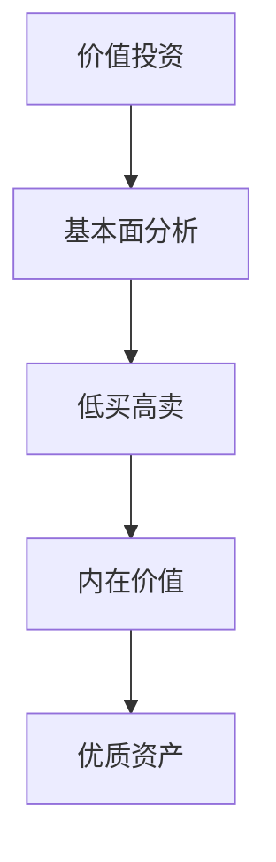

                 


# 巴菲特的市场泡沫识别：如何在繁荣中保持清醒

---

## 关键词：巴菲特、市场泡沫、价值投资、安全边际、投资策略、风险管理

---

## 摘要：本文深入探讨了巴菲特的市场泡沫识别方法，结合其投资理念和实际案例，分析了如何在市场繁荣中保持清醒。文章从巴菲特的价值投资哲学出发，详细介绍了市场泡沫的形成机制、识别指标以及应对策略，帮助读者在复杂多变的市场中做出明智的投资决策。

---

## 第一部分: 巴菲特的市场泡沫识别基础

## 第1章: 巴菲特投资理念概述

### 1.1 巴菲特投资哲学的核心思想

#### 1.1.1 价值投资的定义与特点

- **价值投资**是一种以基本面分析为基础的投资策略，强调以低于内在价值的价格购买优质资产。
- **特点**：
  - 长期导向：关注企业的长期价值，而非短期价格波动。
  - 低风险：通过买入被市场低估的资产，降低投资风险。
  - 高回报：通过长期持有优质资产，实现资本增值。



#### 1.1.2 巴菲特投资理念的核心要素

- **核心要素**：
  - **安全边际**：买入价格低于内在价值，确保投资的安全性。
  - **竞争优势**：选择具有持续竞争优势的企业。
  - **管理层**：关注管理层的诚信和能力。
  - **长期导向**：注重企业的长期价值，而非短期表现。

#### 1.1.3 巴菲特投资理念的演变与影响

- **演变**：从早期的合伙企业到后来的伯克希尔哈撒韦，巴菲特的投资理念不断完善，逐步形成了独特的价值投资体系。
- **影响**：巴菲特的投资理念影响了全球的投资者，尤其是在机构投资者和散户中，价值投资理念被广泛接受和应用。

### 1.2 市场泡沫的基本概念

#### 1.2.1 市场泡沫的定义与特征

- **定义**：市场泡沫是指资产价格脱离其内在价值，由过度投机和市场情绪推动的非理性上涨。
- **特征**：
  - 价格虚高：资产价格远高于其内在价值。
  - 市场情绪高涨：投资者基于乐观预期而非基本面进行投资。
  - 快速波动：价格在短时间内出现剧烈波动。

#### 1.2.2 市场泡沫的形成机制

- **形成机制**：
  - **投机情绪**：投资者基于短期收益预期而非长期价值进行投资。
  - **资金涌入**：大量资金流入特定资产，导致价格快速上涨。
  - **羊群效应**：投资者跟风投资，进一步推高资产价格。

#### 1.2.3 泡沫与非泡沫的区分标准

- **区分标准**：
  - **价格与价值的偏离度**：资产价格是否远高于其内在价值。
  - **市场情绪**：是否存在过度乐观或恐慌的市场情绪。
  - **基本面分析**：资产的盈利能力是否支撑其价格。

### 1.3 巴菲特与市场泡沫的关系

#### 1.3.1 巴菲特对市场泡沫的独到见解

- **独到见解**：
  - 泡沫是市场的一部分，但投资者应避免参与非理性的市场行为。
  - 通过基本面分析识别泡沫，避免被市场情绪所左右。

#### 1.3.2 巴菲特如何识别市场泡沫

- **识别方法**：
  - **估值指标**：使用市盈率、市净率等指标判断资产价格是否合理。
  - **安全边际**：确保买入价格低于内在价值，避免泡沫破裂带来的损失。
  - **竞争优势**：选择具有持续竞争优势的企业，避免投资于虚高的资产。

#### 1.3.3 巴菲特在泡沫中的投资策略

- **策略**：
  - **避免高位投资**：在市场泡沫期间，保持谨慎，避免高位买入。
  - **寻找低估资产**：在泡沫破裂前，寻找被市场低估的优质资产。
  - **长期持有**：通过长期持有优质资产，抵御市场的短期波动。

### 1.4 本章小结

- **总结**：巴菲特的价值投资理念强调长期导向、安全边际和基本面分析。在市场泡沫中，巴菲特通过基本面分析识别泡沫，并通过安全边际和竞争优势等方法，避免非理性投资，实现长期稳健的回报。

---

## 第2章: 巴菲特的估值方法与安全边际

### 2.1 价值投资的核心工具

#### 2.1.1 股票估值的基本原理

- **基本原理**：
  - 通过分析企业的财务状况、盈利能力和发展潜力，估算其内在价值。
  - 股票的内在价值是其未来现金流的现值。

#### 2.1.2 市盈率与市净率的计算方法

- **市盈率（P/E）**：
  - 公式：市盈率 = 股价 / 每股净利润。
  - 解释：市盈率反映了市场对公司盈利能力的评价，低市盈率可能意味着低估。
  
  $$ P/E = \frac{Price}{Earnings Per Share} $$

- **市净率（P/B）**：
  - 公式：市净率 = 股价 / 每股净资产。
  - 解释：市净率反映了市场对公司资产价值的评价，低市净率可能意味着低估。

  $$ P/B = \frac{Price}{Book Value Per Share} $$

#### 2.1.3 内在价值的评估模型

- **评估模型**：
  - 使用现金流折现法（DCF）估算企业的内在价值。
  - 考虑企业的未来盈利能力和成长潜力。

  ```python
  def dcf_c为企业价值():
      free_cash_flow = ...  # 自由现金流
      discount_rate = ...    # 折现率
     永续增长率 = ...        # 永续期增长率
      terminal_value = free_cash_flow * (1 + 永续增长率) / (discount_rate - 永续增长率)
      企业价值 = 总和(free_cash_flow 现金流折现) + terminal_value
      return 企业价值
  ```

### 2.2 安全边际的概念与应用

#### 2.2.1 安全边际的定义

- **定义**：
  - 安全边际是指买入价格与内在价值之间的差距，确保即使价格短期波动，也不会造成重大损失。

#### 2.2.2 安全边际的计算方法

- **计算方法**：
  - 安全边际 = 内在价值 - 买入价格
  - 安全边际率 = (内在价值 - 买入价格) / 内在价值

  $$ Safety Margin = Intrinsic Value - Purchase Price $$
  $$ Safety Margin Ratio = \frac{(Intrinsic Value - Purchase Price)}{Intrinsic Value} $$

#### 2.2.3 安全边际在投资决策中的作用

- **作用**：
  - 降低投资风险：通过安全边际确保投资的本金安全。
  - 提高投资收益：通过寻找具有较大安全边际的资产，实现超额收益。

### 2.3 巴菲特估值方法的实际案例

#### 2.3.1 可口可乐的估值案例

- **案例分析**：
  - 可口可乐的内在价值：通过DCF模型估算。
  - 安全边际：买入价格低于内在价值，确保投资安全。

#### 2.3.2 巴菲特对IBM的投资分析

- **分析**：
  - IBM的财务状况：关注其盈利能力、现金流和资产负债表。
  - 市场情绪：避免在市场高估时投资。

#### 2.3.3 安全边际在案例中的体现

- **体现**：
  - 通过安全边际，巴菲特定价买入低估资产，避免市场波动带来的损失。

### 2.4 本章小结

- **总结**：巴菲特的估值方法以基本面分析为核心，通过市盈率、市净率等指标估算内在价值，并通过安全边际确保投资的安全性。实际案例分析表明，巴菲特的投资策略在实践中取得了显著成效。

---

## 第3章: 市场泡沫的识别指标与工具

### 3.1 市场泡沫的常见指标

#### 3.1.1 市盈率的极端值

- **极端值**：
  - 市盈率过高：可能表明市场泡沫。
  - 市盈率过低：可能表明市场低估。

#### 3.1.2 市净率的异常值

- **异常值**：
  - 市净率过高：可能表明市场泡沫。
  - 市净率过低：可能表明市场低估。

#### 3.1.3 股价与 earnings 的偏离度

- **偏离度**：
  - 股价远高于盈利：可能表明市场泡沫。
  - 股价与盈利一致：表明市场合理。

### 3.2 巴菲特使用的独特工具

#### 3.2.1 股票筛选标准

- **标准**：
  - 具有持续的竞争优势。
  - 管理层诚信可靠。
  - 财务状况健康。

#### 3.2.2 行业分析框架

- **框架**：
  - 选择具有长期增长潜力的行业。
  - 避免夕阳行业。

#### 3.2.3 财务报表分析的关键指标

- **关键指标**：
  - 净利润：反映盈利能力。
  - 自由现金流：反映财务健康状况。
  - 负债率：反映财务风险。

### 3.3 巴菲特对市场情绪的判断

#### 3.3.1 市场情绪的周期性

- **周期性**：
  - 市场情绪会周期性波动，从乐观到悲观，再从悲观到乐观。

#### 3.3.2 投资者心理与市场泡沫的关系

- **关系**：
  - 过度乐观：可能导致市场泡沫。
  - 过度悲观：可能导致市场低估。

#### 3.3.3 巴菲特对市场恐慌的利用

- **利用**：
  - 在市场恐慌时，寻找被低估的资产。
  - 通过长期持有，抵御市场的短期波动。

### 3.4 本章小结

- **总结**：巴菲特通过市盈率、市净率等指标识别市场泡沫，并结合行业分析和财务报表分析，选择具有长期竞争优势的优质资产。同时，关注市场情绪，避免非理性投资。

---

## 第4章: 巴菲特的市场周期理论与投资策略

### 4.1 市场周期的基本阶段

#### 4.1.1 衰退期的特征与应对策略

- **特征**：
  - 经济衰退，企业盈利下降。
  - 市场情绪悲观，资产价格下跌。

- **应对策略**：
  - 寻找被低估的资产。
  - 增加投资，利用市场低点。

#### 4.1.2 回升期的特征与投资机会

- **特征**：
  - 经济开始复苏，企业盈利逐步恢复。
  - 市场情绪从悲观转向乐观。

- **投资机会**：
  - 投资于具有长期竞争优势的优质资产。
  - 逐步增加仓位，抓住市场回升的机会。

#### 4.1.3 繁荣期的特征与风险控制

- **特征**：
  - 经济繁荣，企业盈利增长。
  - 市场情绪高涨，资产价格虚高。

- **风险控制**：
  - 避免高位投资。
  - 保持清醒，控制风险。

### 4.2 巴菲特的周期性投资策略

#### 4.2.1 在衰退期寻找低估资产

- **策略**：
  - 通过基本面分析，寻找被市场低估的优质资产。
  - 利用市场低点，增加投资仓位。

#### 4.2.2 在繁荣期保持清醒

- **策略**：
  - 避免高位投资，保持谨慎。
  - 通过安全边际，避免市场泡沫破裂带来的损失。

#### 4.2.3 周期性波动中的风险管理

- **风险管理**：
  - 设置止损点，控制投资风险。
  - 通过分散投资，降低市场波动带来的影响。

### 4.3 巴菲特的长期投资策略

#### 4.3.1 长期投资的核心要素

- **核心要素**：
  - 选择具有长期竞争优势的优质资产。
  - 长期持有，避免频繁交易。

#### 4.3.2 长期投资与市场周期的关系

- **关系**：
  - 长期投资能够跨越市场周期，实现资产的长期增值。
  - 在市场波动中，长期投资能够平滑短期波动带来的影响。

#### 4.3.3 巴菲特对长期投资的建议

- **建议**：
  - 保持耐心，避免短期波动影响投资决策。
  - 通过长期持有，实现资产的稳健增值。

### 4.4 本章小结

- **总结**：巴菲特的市场周期理论强调在不同市场阶段采取不同的投资策略。在衰退期寻找低估资产，在繁荣期保持清醒，通过长期投资实现资产的稳健增值。

---

## 第5章: 巴菲特的案例分析与实战经验

### 5.1 巴菲特的经典投资案例

#### 5.1.1 可口可乐的投资历程

- **历程**：
  - 投资时间：长期持有。
  - 投资原因：可口可乐具有强大的竞争优势和稳定的现金流。
  - 投资回报：通过长期持有，实现资本增值。

#### 5.1.2 IBM的投资决策分析

- **分析**：
  - 投资时间：选择合适的时机。
  - 投资原因：IBM具有强大的技术优势和稳定的盈利。
  - 投资回报：通过安全边际，实现超额收益。

#### 5.1.3 巴菲特对伯克希尔哈撒韦的投资

- **投资**：
  - 投资时间：长期持有。
  - 投资原因：伯克希尔哈撒韦具有强大的竞争优势和优秀的管理层。
  - 投资回报：通过长期持有，实现资本的稳健增长。

### 5.2 巴菲特在市场泡沫中的实战经验

#### 5.2.1 互联网泡沫时期的应对策略

- **应对策略**：
  - 避免高位投资，保持清醒。
  - 寻找被市场低估的优质资产。

#### 5.2.2 次贷危机时期的应对策略

- **应对策略**：
  - 在市场恐慌时，寻找被低估的资产。
  - 通过长期持有，抵御市场的短期波动。

### 5.3 本章小结

- **总结**：巴菲特的经典投资案例表明，通过基本面分析和长期持有，能够在市场波动中实现稳健的投资回报。在市场泡沫时期，巴菲特通过安全边际和竞争优势等方法，避免非理性投资，实现长期的资本增值。

---

## 第6章: 巴菲特的投资理念对现代投资的启示

### 6.1 巴菲特投资理念的核心要点

- **要点**：
  - 价值投资：以内在价值为导向，避免非理性投资。
  - 安全边际：确保投资的安全性。
  - 长期导向：关注企业的长期价值。

### 6.2 对现代投资的启示

#### 6.2.1 价值投资的现代应用

- **应用**：
  - 在科技股投资中，选择具有长期竞争优势的企业。
  - 在新兴市场中，寻找被低估的资产。

#### 6.2.2 风险管理的重要性

- **重要性**：
  - 通过分散投资，降低市场风险。
  - 设置止损点，控制投资风险。

#### 6.2.3 市场情绪的理性应对

- **应对**：
  - 避免跟随市场情绪，保持独立思考。
  - 在市场恐慌时，寻找被低估的资产。

### 6.3 本章小结

- **总结**：巴菲特的投资理念对现代投资具有重要的启示。价值投资、安全边际和长期导向等理念，不仅适用于传统投资，也适用于现代科技股和新兴市场的投资。在市场波动中，保持理性，避免非理性投资，是实现长期稳健回报的关键。

---

## 第7章: 巴菲特的市场泡沫识别总结与展望

### 7.1 本章总结

- **总结**：巴菲特通过价值投资、安全边际和长期导向等方法，识别市场泡沫，并在市场繁荣中保持清醒。他的投资理念不仅帮助投资者在市场波动中实现稳健回报，也为现代投资提供了重要的启示。

### 7.2 对未来投资的展望

- **展望**：
  - 随着科技的发展，新兴市场和科技股的投资将更加重要。
  - 在市场波动中，巴菲特的理念将继续指导投资者，帮助他们识别市场泡沫，实现长期的投资目标。

### 7.3 投资者需要注意的事项

- **注意事项**：
  - 保持独立思考，避免跟随市场情绪。
  - 通过基本面分析，识别市场泡沫。
  - 长期持有，实现资本的稳健增长。

### 7.4 拓展阅读

- **推荐书籍**：
  - 《巴菲特传》：了解巴菲特的投资理念和人生历程。
  - 《价值投资：原理与实践》：深入学习价值投资的理论和实践。

### 7.5 本章小结

- **总结**：巴菲特的市场泡沫识别方法为投资者提供了重要的指导。在未来的投资中，投资者应继续关注市场周期，保持独立思考，通过基本面分析和长期持有，实现稳健的投资回报。

---

## 附录: 巴菲特的经典语录与投资工具

### 附录A: 巴菲特的经典语录

- “价格是你支付的，价值是你得到的。”
- “只有当潮水退去时，才能看到谁在裸泳。”
- “投资的第一条准则是：不要亏损，保住本金。”
- “时间是伟大企业的朋友。”

### 附录B: 巴菲特的投资工具

- **工具1**：市盈率计算器
  - 使用Python编写，帮助投资者计算市盈率。
  
  ```python
  def calculate_pe(eps, price):
      pe = price / eps
      return pe

  # 示例
  eps = 5
  price = 100
  print(f"市盈率 = {calculate_pe(eps, price)}")
  ```

- **工具2**：安全边际计算器
  - 使用Excel表格计算安全边际。

  | 参数       | 描述               |
  |------------|--------------------|
  | 内在价值   | 资产的内在价值     |
  | 买入价格   | 资产的买入价格     |
  | 安全边际   | 内在价值 - 买入价格 |

---

## 附录C: 巴菲特的投资工具示例代码

### 附录C.1: 市盈率计算器

```python
def calculate_pe(eps, price):
    return price / eps

# 示例：某公司的EPS为5，股价为100
eps = 5
price = 100
pe = calculate_pe(eps, price)
print(f"市盈率 = {pe}")
```

### 附录C.2: 安全边际计算器

```python
def calculate_safety_margin(intrinsic_value, purchase_price):
    return intrinsic_value - purchase_price

# 示例：内在价值为100，买入价格为80
intrinsic_value = 100
purchase_price = 80
safety_margin = calculate_safety_margin(intrinsic_value, purchase_price)
print(f"安全边际 = {safety_margin}")
```

---

## 附录D: 巴菲特投资理念的数学模型

### 附录D.1: 市盈率模型

$$ P/E = \frac{Price}{Earnings Per Share} $$

### 附录D.2: 市净率模型

$$ P/B = \frac{Price}{Book Value Per Share} $$

### 附录D.3: 现金流折现模型

$$ Terminal Value = \frac{Free Cash Flow}{Discount Rate - Perpetual Growth Rate} $$

---

## 结语

巴菲特的市场泡沫识别方法为投资者提供了重要的指导。通过价值投资、安全边际和长期导向等方法，投资者可以在市场繁荣中保持清醒，避免非理性投资，实现长期的稳健回报。未来，随着市场的变化，巴菲特的理念将继续指导投资者，帮助他们在复杂的市场环境中做出明智的投资决策。

---

**全文完**

