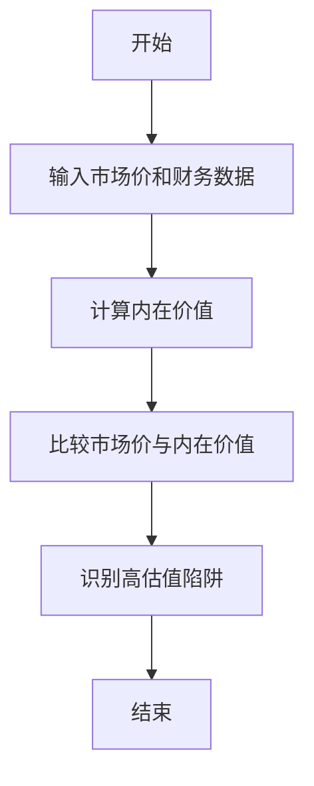
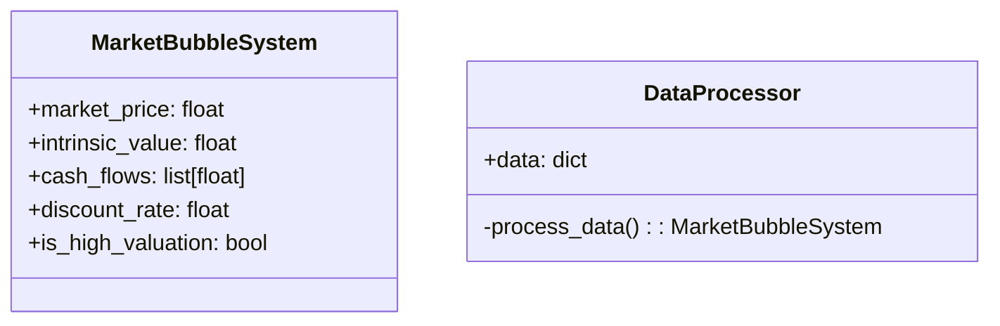
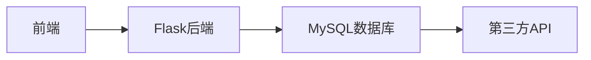

                 


# 巴菲特的市场泡沫识别：如何避免高估值陷阱

## 关键词
- 巴菲特，市场泡沫，高估值陷阱，内在价值，安全边际

## 摘要
本文深入分析了巴菲特的市场泡沫识别方法，探讨了如何通过基本面分析、内在价值计算和安全边际评估来避免高估值陷阱。文章从市场泡沫的基础知识入手，结合数学模型和系统架构设计，提供了实用的项目实战和最佳实践建议，帮助读者在投资中做出明智决策。

---

# 第一部分: 市场泡沫的基础知识

## 第1章: 市场泡沫的定义与形成机制

### 1.1 市场泡沫的定义
#### 1.1.1 市场泡沫的定义与特征
市场泡沫是指资产价格远高于其内在价值的现象，通常由投资者的非理性行为和过度乐观情绪引发。其特征包括价格虚高、交易量激增和市场参与者情绪狂热。

#### 1.1.2 市场泡沫的形成机制
市场泡沫的形成通常经历四个阶段：投机、上涨、疯狂和崩盘。投资者的羊群效应和杠杆资金的使用加速了泡沫的形成。

#### 1.1.3 市场泡沫与经济周期的关系
市场泡沫往往出现在经济周期的繁荣阶段，过度的信贷扩张和低利率环境为泡沫的形成提供了温床。

### 1.2 巴菲特的基本面分析方法
#### 1.2.1 基本面分析的核心概念
基本面分析关注企业的盈利能力、财务状况和行业地位，强调通过分析企业的内在价值来评估其投资价值。

#### 1.2.2 巴菲特投资理念的核心要素
巴菲特强调长期投资、价值投资和安全边际，认为市场价高于内在价值时应避免投资。

#### 1.2.3 高估值陷阱的定义与特征
高估值陷阱指市场价远高于内在价值的投资标的，通常出现在市场泡沫期间，具有高市盈率和高市净率的特征。

---

## 第2章: 巴菲特的市场泡沫识别方法

### 2.1 安全边际的概念与应用
#### 2.1.1 安全边际的定义
安全边际是市场价与内在价值之间的差距，确保在市场波动中仍能获得正收益。

#### 2.1.2 安全边际在投资决策中的作用
安全边际提供了风险缓冲，帮助投资者在市场波动中避免损失。

#### 2.1.3 如何计算安全边际
安全边际 = 内在价值 - 市场价

### 2.2 内在价值的计算方法
#### 2.2.1 内在价值的定义
内在价值是基于企业未来现金流的现值，反映了企业的实际价值。

#### 2.2.2 内在价值的计算公式
$$ \text{内在价值} = \sum_{t=1}^{\infty} \frac{\text{现金流}_t}{(1+r)^t} $$

#### 2.2.3 内在价值与市场价的对比分析
通过对比内在价值和市场价，可以识别是否存在高估值陷阱。

### 2.3 财务报表分析与估值陷阱识别
#### 2.3.1 财务报表分析的基本方法
分析利润表、资产负债表和现金流量表，重点关注盈利能力、偿债能力和发展潜力。

#### 2.3.2 如何通过财务报表识别高估值企业
通过分析市盈率、市净率和股息率等指标，识别市场价远高于内在价值的企业。

#### 2.3.3 财务指标在估值分析中的应用
市盈率 = 市场价 / 每股收益  
市净率 = 市场价 / 每股净资产  
股息率 = 每股股息 / 市场价

---

## 第3章: 巴菲特投资策略的数学模型与算法

### 3.1 内在价值计算的数学模型
#### 3.1.1 内在价值公式
$$ V = \frac{CF_1}{(1+r)^1} + \frac{CF_2}{(1+r)^2} + \dots + \frac{CF_n}{(1+r)^n} $$
其中，\( CF \) 表示现金流，\( r \) 表示折现率。

#### 3.1.2 现金流折现模型
通过预测未来现金流并将其折现，计算企业的内在价值。

#### 3.1.3 相对估值法
使用市盈率、市净率等指标与行业平均水平对比，判断市场价是否合理。

### 3.2 算法实现
```python
def calculate_intrinsic_value(cash_flows, discount_rate):
    intrinsic_value = 0
    for t in range(len(cash_flows)):
        cf = cash_flows[t]
        intrinsic_value += cf / (1 + discount_rate) ** t
    return intrinsic_value

# 示例
cash_flows = [100, 120, 150, 200]
discount_rate = 0.08
iv = calculate_intrinsic_value(cash_flows, discount_rate)
print(f"内在价值为: {iv:.2f}")
```

### 3.3 识别高估值陷阱的流程图


---

## 第4章: 系统分析与架构设计

### 4.1 项目介绍
设计一个基于巴菲特投资策略的市场泡沫识别系统，帮助投资者识别高估值陷阱。

### 4.2 系统功能设计
#### 4.2.1 功能模块
- 数据输入与处理
- 内在价值计算
- 高估值识别
- 结果展示

#### 4.2.2 领域模型类图


### 4.3 系统架构设计
#### 4.3.1 技术选型
- 前端：HTML, CSS, JavaScript
- 后端：Python, Flask
- 数据库：MySQL

#### 4.3.2 系统架构图


---

## 第5章: 项目实战

### 5.1 环境安装
安装Python、Flask和pandas库：
```bash
pip install flask pandas
```

### 5.2 核心代码实现
```python
from flask import Flask, request, jsonify
import pandas as pd

app = Flask(__name__)

@app.route('/calculate', methods=['POST'])
def calculate():
    data = request.json
    market_price = data['market_price']
    financial_data = data['financial_data']
    discount_rate = data['discount_rate']
    
    # 计算内在价值
    iv = calculate_intrinsic_value(financial_data, discount_rate)
    
    # 判断是否为高估值
    is_high_valuation = iv < market_price
    
    return jsonify({
        'intrinsic_value': iv,
        'is_high_valuation': is_high_valuation
    })

if __name__ == '__main__':
    app.run(debug=True)
```

### 5.3 案例分析
使用苹果公司财务数据进行分析，计算其内在价值并与市场价对比，判断是否存在高估值陷阱。

---

## 第6章: 最佳实践与小结

### 6.1 投资策略建议
- 保持价值投资理念，避免短期波动影响。
- 定期评估投资组合，及时调整。

### 6.2 风险管理注意事项
- 设置止损点，控制风险敞口。
- 分散投资，降低集中风险。

### 6.3 持续学习与市场关注
- 关注经济指标和市场动态，保持对市场的敏感性。
- 定期阅读巴菲特的著作，学习其投资理念。

### 6.4 总结
通过巴菲特的市场泡沫识别方法，投资者可以有效避免高估值陷阱，实现长期稳健的投资回报。

---

## 参考资料
1. 巴菲特股东大会演讲合集
2. 《巴菲特投资思想的形成与发展》
3. 《投资学基础》

--- 

以上为完整的技术博客文章目录和内容框架，涵盖了从理论到实践的各个方面，帮助读者系统性地理解和应用巴菲特的市场泡沫识别方法。

