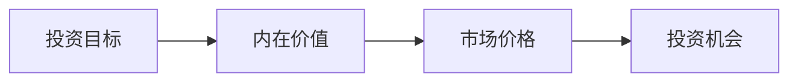
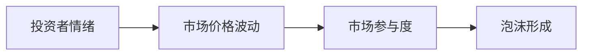

                 

# 巴菲特的市场泡沫识别：量子计算驱动的系统性风险预警

## 关键词
- 巴菲特
- 市场泡沫
- 量子计算
- 系统性风险
- 风险预警
- 金融分析
- 人工智能

## 摘要
本文探讨了如何利用量子计算技术来提升市场泡沫识别和系统性风险预警的效率。通过结合巴菲特的价值投资理念和量子计算的优势，本文提出了一个基于量子计算的系统性风险预警模型，旨在帮助投资者更准确地识别市场泡沫，优化投资策略，降低系统性风险。

---

# 第1章：巴菲特的市场泡沫识别方法

## 1.1 巴菲特投资哲学概述

### 1.1.1 价值投资的核心理念
巴菲特的价值投资理念强调购买具有内在价值的公司，长期持有，并关注公司的基本面指标，如市盈率、市净率、股息率等。这种投资策略的核心在于识别市场价格与内在价值之间的差异，从而发现被市场低估的投资机会。

**图1.1 巴菲特价值投资理念的简化模型**

### 1.1.2 巴菲特的市场分析方法
巴菲特通过分析公司的财务报表、行业地位、竞争优势等因素，评估公司的内在价值。他的市场分析方法注重长期趋势和基本面因素，而非短期市场波动。

### 1.1.3 巴菲特对市场泡沫的定义与识别
市场泡沫是指市场价格远高于其内在价值的现象。巴菲特认为，泡沫的形成通常与市场的非理性繁荣有关，投资者往往过于关注短期收益，而忽视了公司的基本面。

---

## 1.2 市场泡沫的形成机制

### 1.2.1 泡沫形成的经济理论基础
泡沫的形成通常与投资者的非理性行为、过度乐观情绪以及市场参与者的羊群效应有关。经济泡沫的形成是一个复杂的过程，涉及多种因素的相互作用。

**图1.2 泡沫形成的经济理论模型**

### 1.2.2 历史上的市场泡沫案例分析
历史上的市场泡沫案例，如2000年的互联网泡沫和2008年的全球金融危机，都展示了市场泡沫的形成和破裂过程。这些案例为我们提供了宝贵的经验和教训。

### 1.2.3 巴菲特对泡沫的预警指标
巴菲特提出了一些预警指标，如市盈率过高、市净率偏离正常水平等。这些指标可以帮助投资者识别市场泡沫，并做出相应的投资决策。

---

## 1.3 巴菲特投资策略与风险管理

### 1.3.1 安全边际的概念与应用
安全边际是指市场价格低于公司内在价值的部分。巴菲特强调，安全边际是投资成功的关键因素之一，可以帮助投资者在市场波动中规避风险。

### 1.3.2 巴菲特的分散投资策略
分散投资是巴菲特降低投资风险的重要策略。通过分散投资，投资者可以降低单一投资品种的风险，并在市场波动中保持稳定的投资收益。

### 1.3.3 风险管理在投资决策中的作用
风险管理是投资过程中不可忽视的重要环节。巴菲特强调，投资者应注重风险管理，制定合理的投资策略，并在市场波动中保持冷静。

---

# 第2章：量子计算的基本原理

## 2.1 量子计算的基本概念

### 2.1.1 量子计算的定义与特点
量子计算是一种基于量子力学原理的计算方式。与经典计算相比，量子计算具有并行计算能力强、计算速度快等优点。

### 2.1.2 量子计算与经典计算的区别
经典计算基于二进制逻辑，而量子计算基于量子叠加和量子纠缠原理。量子计算可以在某些特定问题上显著优于经典计算。

### 2.1.3 量子计算在金融领域的应用潜力
量子计算在金融领域的应用潜力巨大，特别是在市场预测、风险管理、投资组合优化等方面具有广阔的应用前景。

---

## 2.2 量子算法与金融分析

### 2.2.1 常见量子算法简介
常见的量子算法包括Shor算法、Grover算法等。这些算法在某些特定问题上具有显著优势。

### 2.2.2 量子算法在金融数据分析中的应用
量子算法可以用于金融数据分析，如市场趋势预测、风险评估、投资组合优化等。量子计算的高效性为金融分析提供了新的工具。

### 2.2.3 量子计算在市场预测中的优势
量子计算的并行计算能力使其在市场预测中具有显著优势。通过量子算法，投资者可以更快速地分析市场数据，发现潜在的投资机会。

---

## 2.3 量子计算的数学基础

### 2.3.1 量子叠加与量子纠缠
量子叠加是指量子系统处于多个状态的叠加态。量子纠缠是指两个或多个量子系统之间的关联性。

### 2.3.2 量子门与量子电路
量子门是量子计算的基本操作单元。量子电路由多个量子门组成，可以实现复杂的量子计算任务。

### 2.3.3 量子计算的数学模型
量子计算的数学模型基于量子态和量子操作的描述。通过数学模型，我们可以更好地理解量子计算的原理和应用。

---

# 第3章：系统性风险预警模型

## 3.1 系统性风险的定义与特征

### 3.1.1 系统性风险的概念
系统性风险是指整个金融系统面临的广泛风险，可能由市场波动、经济衰退等因素引发。

### 3.1.2 系统性风险与非系统性风险的区别
系统性风险影响整个市场，而非系统性风险仅影响个别资产。系统性风险的传播速度快、影响范围广。

### 3.1.3 系统性风险的传播机制
系统性风险的传播机制包括市场参与者之间的相互影响、金融机构的杠杆效应等。这些因素可能导致系统性风险迅速扩散。

---

## 3.2 量子计算驱动的系统性风险预警模型构建

### 3.2.1 模型的设计思路
系统性风险预警模型的设计思路包括数据采集、模型构建、风险评估等步骤。通过量子计算，我们可以更高效地分析市场数据，识别潜在风险。

### 3.2.2 模型的输入变量与输出结果
模型的输入变量包括市场数据、公司基本面指标等。输出结果是系统性风险的预警信号，帮助投资者做出决策。

### 3.2.3 模型的验证与优化
模型的验证需要通过历史数据进行回测，优化模型的参数和算法，以提高模型的准确性和可靠性。

---

## 3.3 模型的实现与应用

### 3.3.1 数据采集与预处理
数据采集包括市场数据、公司基本面数据等。预处理包括数据清洗、特征提取等步骤，为模型的输入做好准备。

### 3.3.2 量子计算算法的实现
通过量子算法实现系统的风险评估，识别潜在的系统性风险。量子算法的高效性使其在大规模数据处理中具有优势。

### 3.3.3 模型的应用场景与案例分析
模型可以应用于金融市场的实时监控、投资决策支持等领域。通过案例分析，我们可以验证模型的有效性和实用性。

---

# 第4章：量子计算在市场泡沫识别中的应用案例

## 4.1 历史市场泡沫案例分析

### 4.1.1 2000年互联网泡沫
互联网泡沫的形成与破裂过程展示了市场泡沫的典型特征。通过分析，我们可以总结出泡沫识别的关键指标。

### 4.1.2 2008年全球金融危机
全球金融危机是系统性风险的典型案例。通过量子计算模型，我们可以更准确地识别系统性风险，并制定相应的预警策略。

### 4.1.3 近期市场泡沫事件分析
近期的市场泡沫事件，如比特币价格波动、科技股泡沫等，展示了市场泡沫的多样性和复杂性。

---

## 4.2 量子计算在泡沫识别中的实际应用

### 4.2.1 泡沫识别模型的量子计算实现
通过量子算法实现泡沫识别模型，可以更高效地分析市场数据，识别潜在的泡沫。

### 4.2.2 量子计算在泡沫预警中的应用
量子计算可以帮助投资者提前识别市场泡沫，并制定相应的投资策略。

### 4.2.3 量子计算在泡沫破裂后的干预措施
在泡沫破裂后，量子计算可以帮助投资者快速调整投资策略，减少损失。

---

# 第5章：量子计算驱动的系统性风险预警模型实现

## 5.1 系统设计与实现

### 5.1.1 数据采集与预处理
通过数据采集模块获取市场数据，预处理模块对数据进行清洗和特征提取，为模型的输入做好准备。

### 5.1.2 量子计算算法的实现
通过量子算法实现系统的风险评估，识别潜在的系统性风险。量子算法的高效性使其在大规模数据处理中具有优势。

### 5.1.3 系统架构设计
系统的架构设计包括数据采集模块、量子计算模块、风险评估模块等。通过合理的架构设计，可以提高系统的稳定性和可扩展性。

---

## 5.2 系统实现与优化

### 5.2.1 环境安装与配置
需要安装量子计算相关的软件和工具，配置开发环境，确保系统的顺利运行。

### 5.2.2 量子计算算法的实现
通过Python代码实现量子计算算法，展示模型的实现过程和具体细节。

### 5.2.3 系统优化与测试
通过优化算法和调整参数，提高系统的运行效率和准确率。测试系统的性能和稳定性，确保系统的可靠运行。

---

## 5.3 项目实战与案例分析

### 5.3.1 项目实战
通过具体项目实战，展示量子计算在系统性风险预警中的应用。通过案例分析，验证模型的有效性和实用性。

### 5.3.2 案例分析
通过实际市场数据的分析，展示模型在识别系统性风险中的应用效果。

### 5.3.3 总结与优化
总结项目的实施过程，分析存在的问题，并提出优化建议，为未来的研究提供参考。

---

# 第6章：总结与展望

## 6.1 总结
本文探讨了如何利用量子计算技术提升市场泡沫识别和系统性风险预警的效率。通过结合巴菲特的价值投资理念和量子计算的优势，提出了一个基于量子计算的系统性风险预警模型。

## 6.2 未来展望
未来的研究可以进一步优化模型，探索新的量子算法，拓展量子计算在金融领域的应用。同时，随着量子计算技术的不断发展，系统性风险预警模型将更加智能化和高效化。

---

通过以上内容，我们可以看到，量子计算在市场泡沫识别和系统性风险预警中的应用前景广阔。结合巴菲特的投资理念，我们可以更好地识别市场风险，优化投资策略，实现长期稳定的收益。

