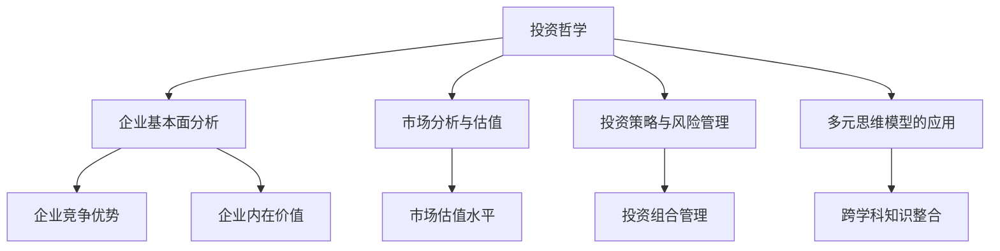

                 

# 巴菲特的师承：从格雷厄姆到芒格的思想融合

---

## 关键词：
- 巴菲特, 投资哲学, 格雷厄姆, 芒格, 价值投资, 安全边际, 多元思维模型

---

## 摘要：
本文深入探讨了巴菲特的投资思想是如何从格雷厄姆的价值投资理念演变为融合芒格多元思维模型的。通过分析格雷厄姆的安全边际原则和芒格的决策框架，揭示了巴菲特如何将这两种思想融合，并形成独特的投资哲学。文章从背景介绍、核心概念、系统分析到实战案例，全面解析了巴菲特的投资理念及其对现代投资者的启示。

---

## 第一部分：背景介绍

### 1.1 巴菲特的投资哲学与师承背景

#### 1.1.1 巴菲特的成长与投资起步
巴菲特的投资哲学深受其导师本杰明·格雷厄姆和查理·芒格的影响。他早年就读于哥伦比亚大学，师从格雷厄姆，学习价值投资的基本原理。格雷厄姆的安全边际理念和防御性投资策略为巴菲特奠定了坚实的基础。

#### 1.1.2 格雷厄姆的价值投资理论
格雷厄姆是20世纪最伟大的投资思想家之一，他的核心理念是“安全边际”。他认为，投资者应该以低于内在价值的价格买入股票，并通过分散投资来降低风险。格雷厄姆的理论强调了对企业的基本面分析和对市场的逆向思考。

#### 1.1.3 芒格的多元思维模型
查理·芒格是巴菲特的长期合作伙伴，他的多元思维模型强调了跨学科的知识整合。芒格认为，投资者需要通过心理学、经济学、统计学等多个领域的知识来构建决策框架。这种思维方式帮助巴菲特超越了单纯的价值投资，形成了更全面的投资策略。

---

## 第二部分：核心概念与联系

### 2.1 格雷厄姆与芒格的核心思想对比

#### 2.1.1 格雷厄姆的价值投资与安全边际原则
格雷厄姆的价值投资理论可以总结为“买入低于内在价值的股票”。他强调安全边际，即以低于企业内在价值的价格买入股票，以降低投资风险。

#### 2.1.2 芒格的多元思维模型与决策框架
芒格的多元思维模型强调了知识的广泛性和跨领域的整合。他认为，投资者需要从多个角度分析问题，避免认知偏差，并通过逆向思维来寻找投资机会。

### 2.2 两人思想的融合与相互影响

#### 2.2.1 巴菲特如何融合格雷厄姆与芒格的思想
巴菲特将格雷厄姆的安全边际理念与芒格的多元思维模型相结合，形成了自己的投资哲学。他强调了对企业内在价值的评估，同时注重对企业竞争优势和管理层能力的分析。

#### 2.2.2 格雷厄姆与芒格思想的异同点分析
格雷厄姆与芒格的思想在某些方面存在差异，例如格雷厄姆更注重股票的估值，而芒格更注重企业的竞争优势。然而，两者的共同点在于他们都强调了投资的长期性、安全性和对企业基本面的深入分析。

---

## 第三部分：系统分析与架构设计方案

### 3.1 巴菲特投资哲学的系统分析

#### 3.1.1 投资目标与核心要素
巴菲特的投资目标是通过长期持有优质资产来实现财富增值。其核心要素包括：
1. 企业内在价值的评估
2. 企业的竞争优势
3. 企业的管理层能力
4. 市场的估值水平

#### 3.1.2 投资策略与风险管理
巴菲特的投资策略可以分为以下几个步骤：
1. 识别具有持续竞争优势的企业
2. 评估企业的内在价值
3. 确定市场的估值水平
4. 构建投资组合，分散风险

### 3.2 投资哲学的架构设计

#### 3.2.1 知识体系的构建
巴菲特的投资哲学可以看作是一个知识体系，包含以下几个模块：
1. 企业基本面分析
2. 市场分析与估值
3. 投资策略与风险管理
4. 多元思维模型的应用

#### 3.2.2 系统架构图

---

## 第四部分：项目实战与案例分析

### 4.1 巴菲特的经典投资案例

#### 4.1.1 可口可乐的投资案例
巴菲特在1985年买入可口可乐股票，并长期持有。他认为可口可乐具有强大的品牌优势和持续的盈利能力，符合其投资哲学中对企业竞争优势的要求。

#### 4.1.2 伯克希尔哈撒韦的投资案例
伯克希尔哈撒韦是巴菲特的旗舰公司，他通过长期持有优质企业股票，实现了资产的持续增值。

### 4.2 投资哲学的实际应用

#### 4.2.1 如何识别具有持续竞争优势的企业
1. 分析企业的盈利能力
2. 评估企业的市场地位
3. 研究企业的管理层能力
4. 评估企业的财务健康状况

#### 4.2.2 如何构建投资组合
1. 分散投资以降低风险
2. 选择具有长期竞争优势的企业
3. 保持长期投资心态
4. 定期评估投资组合的绩效

---

## 第五部分：总结与启示

### 5.1 巴菲特投资思想的现代发展

#### 5.1.1 从格雷厄姆到芒格：巴菲特思想的传承与创新
巴菲特的投资哲学是格雷厄姆安全边际理念和芒格多元思维模型的完美结合。他通过不断学习和实践，将这两种思想融合，形成了自己的投资体系。

#### 5.1.2 巴菲特投资理念的全球化与时代适应
尽管巴菲特的投资哲学最初是基于美国市场，但其核心思想在其他市场和时代背景下仍然具有重要的指导意义。

### 5.2 对现代投资者的启示

#### 5.2.1 价值投资的永恒性与时代适应性
价值投资的核心理念是寻找具有长期竞争优势的企业，并以合理的价格买入。这种思想在任何市场和时代背景下都具有重要的意义。

#### 5.2.2 如何构建个人投资哲学与策略
投资者需要根据自身的知识背景、风险承受能力和投资目标，构建适合自己的投资哲学和策略。

#### 5.2.3 投资中的风险管理与心理控制
风险管理是投资成功的关键。投资者需要通过分散投资、合理估值和长期持有来降低投资风险。

---

## 第六部分：未来展望

### 6.1 巴菲特投资思想的未来发展趋势

#### 6.1.1 数字化与智能化投资
随着技术的发展，数字化和智能化投资工具将为投资者提供更多的机会和挑战。巴菲特的投资哲学需要与技术进步相结合，才能在未来的投资环境中保持竞争力。

#### 6.1.2 可持续投资与社会责任
可持续投资和企业社会责任将成为未来投资的重要方向。巴菲特的投资哲学也需要适应这种趋势，关注企业的社会责任和可持续发展能力。

### 6.2 投资者的最佳实践

#### 6.2.1 保持学习与创新
投资者需要不断学习新的知识和技能，以适应市场的变化和投资环境的演变。

#### 6.2.2 长期投资与耐心持有
巴菲特的成功离不开他对长期投资的坚持。投资者需要具备耐心，避免短期波动的干扰。

#### 6.2.3 风险管理与心理控制
投资者需要通过合理的风险管理策略和心理控制，避免情绪化决策的影响。

---

## 结语

巴菲特的投资哲学是格雷厄姆安全边际理念和芒格多元思维模型的完美结合。他的思想不仅影响了无数投资者，也为现代投资理论的发展提供了重要的启示。通过对巴菲特师承的分析，我们可以更好地理解投资的本质，并将其应用到实际的投资实践中。

