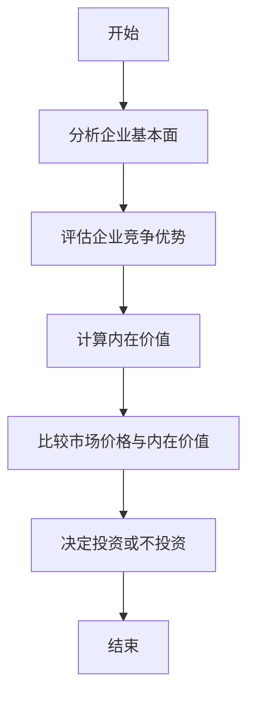
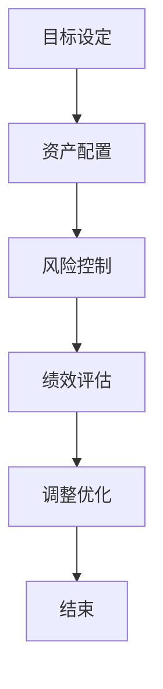
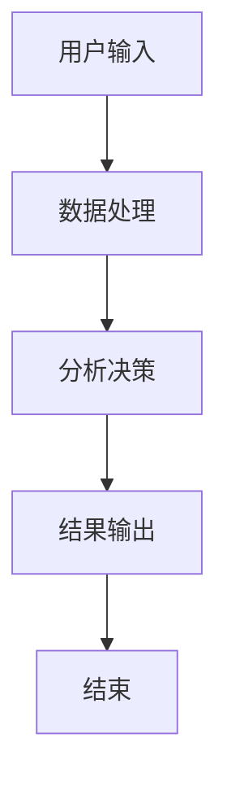
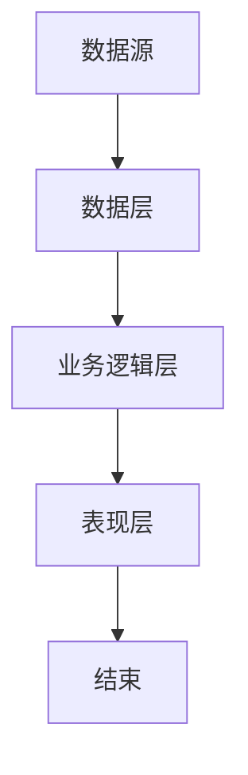
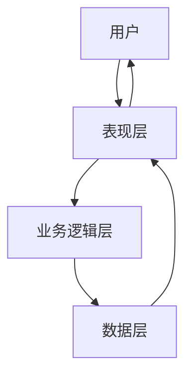

                 


```markdown
# 巴菲特的年度股东信：价值投资智慧的年度盛宴

> 关键词：巴菲特，价值投资，股东信，投资策略，复利效应，财务分析，投资决策

> 摘要：本文深入分析了巴菲特通过年度股东信传达的价值投资智慧，揭示其核心理念、方法论和实战应用，结合系统分析和项目实战，帮助读者掌握价值投资的精髓，实现长期稳健的投资收益。

---

# 第一部分：巴菲特投资理念的背景与核心概念

## 第1章：巴菲特投资理念的起源与发展

### 1.1 价值投资的起源与发展
- 1.1.1 价值投资的定义
- 1.1.2 价值投资的历史演变
- 1.1.3 巴菲特对价值投资的贡献

### 1.2 巴菲特投资理念的核心要素
- 1.2.1 企业内在价值
- 1.2.2 安全边际
- 1.2.3 长期投资与复利效应

## 第2章：股东信的背景与重要性

### 2.1 股东信的历史沿革
- 2.1.1 股东信的起源
- 2.1.2 股东信的发展历程
- 2.1.3 股东信的现状

### 2.2 股东信的撰写目的与价值
- 2.2.1 股东信的沟通功能
- 2.2.2 股东信的教育意义
- 2.2.3 股东信的市场影响

### 2.3 股东信的阅读群体与影响范围
- 2.3.1 股东信的主要读者
- 2.3.2 股东信的次要读者
- 2.3.3 股东信的广泛影响

## 第3章：价值投资的核心概念与特征

### 3.1 价值投资的定义
- 3.1.1 价值投资的定义
- 3.1.2 价值投资的核心要素
- 3.1.3 价值投资的哲学基础

### 3.2 价值投资与其它投资方法的对比
- 3.2.1 价值投资与成长投资的对比
- 3.2.2 价值投资与趋势投资的对比
- 3.2.3 价值投资与套利投资的对比

### 3.3 巴菲特价值投资方法的属性特征
- 3.3.1 长期性
- 3.3.2 稳定性
- 3.3.3 安全性

---

# 第二部分：巴菲特价值投资方法论

## 第4章：价值投资的核心原理

### 4.1 企业内在价值的计算公式
$$
\text{内在价值} = \frac{\text{未来现金流}}{\text{折现率}}
$$

### 4.2 安全边际的概念
- 4.2.1 安全边际的定义
- 4.2.2 安全边际的计算方法
- 4.2.3 安全边际的重要性

### 4.3 长期投资与复利效应的数学模型
$$
\text{复利公式}: A = P(1 + r)^n
$$

## 第5章：巴菲特投资决策的算法原理

### 5.1 投资决策流程图（Mermaid）


### 5.2 投资决策算法的实现
- 5.2.1 数据输入与处理
- 5.2.2 企业基本面分析
- 5.2.3 企业竞争优势评估
- 5.2.4 内在价值计算
- 5.2.5 投资决策

## 第6章：投资组合管理的系统架构

### 6.1 投资组合管理流程图（Mermaid）


### 6.2 投资组合管理的实现
- 6.2.1 资产配置策略
- 6.2.2 风险控制措施
- 6.2.3 绩效评估方法
- 6.2.4 调整优化流程

---

# 第三部分：巴菲特股东信的深度分析与实战应用

## 第7章：股东信的核心内容与案例分析

### 7.1 股东信的主要内容结构
- 7.1.1 经营成果总结
- 7.1.2 投资策略阐述
- 7.1.3 未来展望

### 7.2 股东信的经典案例分析
- 7.2.1 1980年代的股东信
- 7.2.2 1990年代的股东信
- 7.2.3 2000年代的股东信
- 7.2.4 近年来的股东信

### 7.3 股东信的阅读技巧与方法
- 7.3.1 系统阅读法
- 7.3.2 关键点提取法
- 7.3.3 实证分析法

## 第8章：股东信中的投资策略与实战

### 8.1 股东信中的投资策略总结
- 8.1.1 价值投资的核心策略
- 8.1.2 风险控制策略
- 8.1.3 投资组合优化策略

### 8.2 实战案例：如何通过股东信发现投资机会
- 8.2.1 案例背景
- 8.2.2 案例分析
- 8.2.3 投资决策

### 8.3 实战案例：如何避免投资陷阱
- 8.3.1 案例背景
- 8.3.2 案例分析
- 8.3.3 风险控制

---

# 第四部分：价值投资的系统分析与架构设计

## 第9章：投资决策系统的功能设计

### 9.1 系统功能模块划分
- 9.1.1 数据采集模块
- 9.1.2 数据处理模块
- 9.1.3 分析决策模块
- 9.1.4 结果输出模块

### 9.2 系统功能流程图（Mermaid）


## 第10章：投资决策系统的架构设计

### 10.1 系统架构图（Mermaid）


### 10.2 系统接口设计
- 10.2.1 数据接口
- 10.2.2 用户接口
- 10.2.3 报告接口

### 10.3 系统交互序列图（Mermaid）


---

# 第五部分：项目实战与小结

## 第11章：项目实战

### 11.1 环境安装
- 11.1.1 系统环境要求
- 11.1.2 软件安装步骤

### 11.2 系统核心实现源代码
```python
def calculate_intrinsic_value(cash_flows, discount_rate):
    return sum(cash_flows) / (1 + discount_rate)
```

### 11.3 代码应用解读与分析
- 11.3.1 代码功能分析
- 11.3.2 代码实现细节
- 11.3.3 代码优化建议

### 11.4 实际案例分析
- 11.4.1 案例背景
- 11.4.2 数据分析
- 11.4.3 投资决策

## 第12章：小结与展望

### 12.1 小结
- 12.1.1 核心内容总结
- 12.1.2 实战经验总结
- 12.1.3 系统设计总结

### 12.2 注意事项与最佳实践
- 12.2.1 投资风险提示
- 12.2.2 价值投资的纪律性
- 12.2.3 持续学习的重要性

### 12.3 拓展阅读
- 12.3.1 推荐书籍
- 12.3.2 推荐网站
- 12.3.3 推荐课程
```

