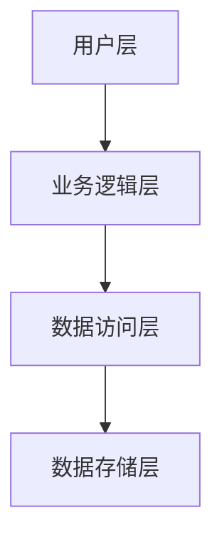
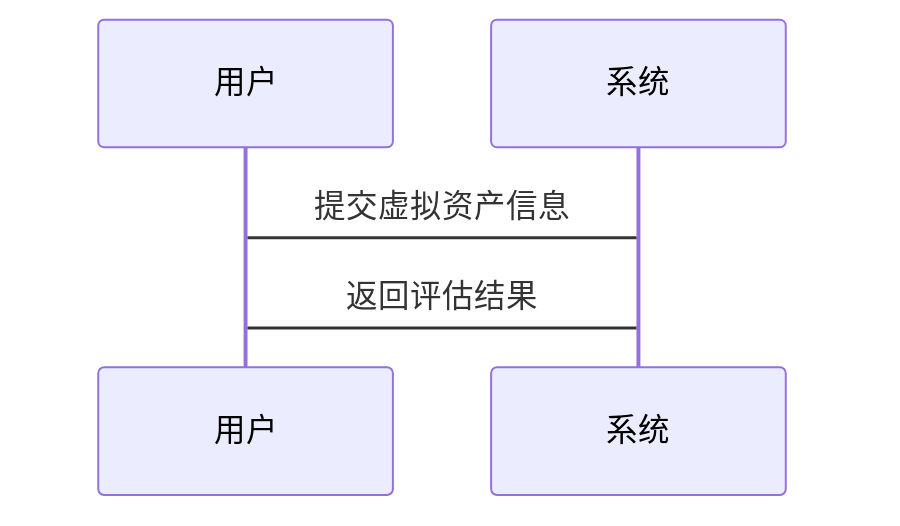

                 


# 巴菲特的并购策略在元宇宙虚拟资产整合中的创新

## 关键词：
巴菲特，并购策略，元宇宙，虚拟资产，价值投资，安全边际，NFT，虚拟土地

## 摘要：
本文探讨了巴菲特的经典并购策略在元宇宙虚拟资产整合中的创新应用。通过分析虚拟资产的特征和价值评估，结合巴菲特的安全边际和价值投资理念，提出了适合元宇宙环境的整合策略，并通过实际案例验证其可行性。

---

## 第一部分：背景介绍

### 第1章：巴菲特并购策略与元宇宙虚拟资产的背景

#### 1.1 股权投资与并购策略的核心概念

##### 1.1.1 股权投资与并购的定义与区别
- **股权投资**：指通过购买公司股份，成为其股东，以获得股息和资本增值的投资方式。
- **并购（Mergers and Acquisitions, M&A）**：指一家企业合并或收购另一家企业，以实现资源优化和市场扩展。

**区别**：
- 并购涉及企业控制权的转移，而股权投资通常不涉及控制权。
- 并购通常伴随着债务重组和资产整合，而股权投资更注重收益分享。

##### 1.1.2 巴菲特并购策略的核心理念
- **价值投资**：寻找市场价格低于内在价值的资产进行投资。
- **安全边际**：在投资时留有余地，确保市场价格大幅波动时仍能获利。
- **长期持有**：通过长期持有优质资产，避免短期市场波动的影响。

#### 1.2 元宇宙虚拟资产的定义与特征

##### 1.2.1 元宇宙的定义与技术基础
- **元宇宙**：一个虚拟的三维空间，用户可以通过虚拟现实设备进入，进行社交、交易和创作。
- **技术基础**：区块链、人工智能、5G通信和虚拟现实技术。

##### 1.2.2 虚拟资产的分类与价值来源
- **虚拟土地**：元宇宙中的虚拟地块，可用于建设虚拟建筑或出售。
- **NFT（非同质化代币）**：唯一标识的数字资产，代表虚拟物品的所有权。
- **虚拟商品与服务**：如虚拟服装、虚拟游戏道具等。

**价值来源**：
- 稀有性：NFT的独特性决定了其价值。
- 使用场景：资产的用途越广泛，价值越高。
- 社交属性：虚拟资产的社交影响力越大，价值越显著。

#### 1.3 问题背景与研究意义

##### 1.3.1 元宇宙虚拟资产整合的挑战
- 虚拟资产的价值评估困难。
- 虚拟资产的流动性较低。
- 元宇宙环境的不确定性。

##### 1.3.2 巴菲特并购策略在虚拟资产整合中的创新潜力
- 巴菲特的安全边际理念可以帮助降低虚拟资产投资风险。
- 价值投资策略可以用于筛选优质虚拟资产。

##### 1.3.3 研究目标与意义
- **目标**：将巴菲特的并购策略创新应用于元宇宙虚拟资产整合。
- **意义**：为虚拟资产投资者提供新的投资思路，推动元宇宙经济的发展。

---

## 第二部分：核心概念与联系

### 第2章：巴菲特并购策略的核心原理

#### 2.1 巴菲特并购策略的原理

##### 2.1.1 价值投资的核心公式
- **内在价值**：资产在未来现金流的现值。
  $$\text{内在价值} = \sum_{t=1}^{n} \frac{CF_t}{(1+r)^t}$$
  其中，\(CF_t\) 是第 \(t\) 年的现金流，\(r\) 是折现率。

##### 2.1.2 安全边际的计算方法
- 安全边际 = 市场价格 × 安全系数。
  $$\text{安全边际} = \text{市场价格} \times \text{安全系数}$$
  安全系数通常为 30% 至 50%。

#### 2.2 元宇宙虚拟资产的评估模型

##### 2.2.1 虚拟资产的价值评估维度
- **流动性**：资产能否快速变现。
- **稀有性**：资产的独特性。
- **使用场景**：资产的应用范围。

##### 2.2.2 虚拟资产的分类与评估
| 类型       | 价值评估维度       |
|------------|--------------------|
| 虚拟土地    | 位置、面积、用途     |
| NFT        | 独特性、创作者声誉   |
| 虚拟商品    | 使用寿命、市场需求 |

#### 2.3 巴菲特并购策略与虚拟资产整合的联系

##### 2.3.1 案例分析：巴菲特策略在传统并购中的应用
- **案例**：巴菲特收购喜马拉雅公司。
  - **背景**：喜马拉雅是一家在线音频平台。
  - **策略**：通过价值投资发现其市场潜力，以低于内在价值的价格收购。

##### 2.3.2 虚拟资产整合中的价值发现与风险控制
- 价值发现：通过分析虚拟资产的内在价值，寻找被低估的资产。
- 风险控制：通过安全边际降低市场波动带来的风险。

---

## 第三部分：系统分析与架构设计

### 第3章：元宇宙虚拟资产整合的系统架构

#### 3.1 系统功能设计

##### 3.1.1 虚拟资产的分类与管理
- **功能**：对虚拟资产进行分类，如土地、NFT、虚拟商品等。
- **流程**：用户提交资产信息，系统分类存储。

##### 3.1.2 资产价值评估模块
- **功能**：评估虚拟资产的内在价值。
- **流程**：输入现金流、折现率，计算内在价值。

##### 3.1.3 并购策略模拟与优化
- **功能**：模拟并购场景，优化并购策略。
- **流程**：输入资产信息，模拟并购结果。

#### 3.2 系统架构设计

##### 3.2.1 系统架构图（Mermaid）


#### 3.3 接口设计与交互流程

##### 3.3.1 用户交互序列图（Mermaid）


---

## 第四部分：项目实战与案例分析

### 第4章：虚拟资产整合的实战分析

#### 4.1 环境安装与工具配置

##### 4.1.1 工具安装
- 安装Python和相关库（如Pandas、NumPy）。
- 安装Mermaid和Markdown编辑器。

##### 4.1.2 环境配置
- 配置虚拟环境。
- 安装区块链钱包（如MetaMask）。

#### 4.2 系统核心实现源代码

##### 4.2.1 资产评估模块
```python
import pandas as pd
import numpy as np

def calculate_intrinsic_value(cash_flows, discount_rate):
    present_value = []
    for t in range(len(cash_flows)):
        pv = cash_flows[t] / (1 + discount_rate) ** t
        present_value.append(pv)
    return sum(present_value)

# 示例数据
cash_flows = [100, 200, 300]
discount_rate = 0.05

iv = calculate_intrinsic_value(cash_flows, discount_rate)
print(f"内在价值为：{iv}")
```

##### 4.2.2 安全边际计算
```python
def calculate_safety_margin(market_price, safety_coefficient):
    return market_price * safety_coefficient

market_price = 100
safety_coefficient = 0.3

sm = calculate_safety_margin(market_price, safety_coefficient)
print(f"安全边际为：{sm}")
```

#### 4.3 案例分析与详细讲解

##### 4.3.1 案例背景
- 某公司计划收购一个虚拟土地项目，用于建设虚拟总部。

##### 4.3.2 数据分析
- 虚拟土地面积：100平方单位。
- 年租金收入：50万虚拟货币。
- 折现率：5%。

##### 4.3.3 计算内在价值
```python
cash_flows = [50, 50, 50]
discount_rate = 0.05

iv = calculate_intrinsic_value(cash_flows, discount_rate)
print(f"内在价值为：{iv}")
```

##### 4.3.4 计算安全边际
```python
market_price = 45
safety_coefficient = 0.3

sm = calculate_safety_margin(market_price, safety_coefficient)
print(f"安全边际为：{sm}")
```

##### 4.3.5 结论
- 内在价值为52.5万虚拟货币。
- 安全边际为13.5万虚拟货币。
- 建议以45万价格收购，具有较高的安全边际。

---

## 第五部分：未来展望与挑战

### 第5章：元宇宙虚拟资产整合的未来趋势

#### 5.1 元宇宙虚拟资产整合的未来趋势
- **技术进步**：区块链技术的进一步发展将提升虚拟资产的安全性和流动性。
- **市场成熟**：虚拟资产市场将更加成熟，价值评估体系更加完善。
- **监管框架**：各国监管机构将出台更多虚拟资产相关法规，推动市场规范化。

#### 5.2 巴菲特并购策略在元宇宙中的未来应用
- **智能化**：利用人工智能技术优化并购策略。
- **全球化**：元宇宙的虚拟资产整合将更加全球化。
- **多元化**：并购策略将更加多元化，涵盖更多类型的虚拟资产。

#### 5.3 挑战与应对策略
- **挑战**：虚拟资产的波动性大，市场不确定性高。
- **应对策略**：加强市场研究，提高风险控制能力。

---

## 第六部分：结论与总结

### 第6章：结论与总结

#### 6.1 研究总结
- 本文将巴菲特的并购策略创新应用于元宇宙虚拟资产整合。
- 提出了虚拟资产的分类与评估方法，构建了系统的整合框架。

#### 6.2 展望未来
- 元宇宙虚拟资产整合将是一个长期而复杂的过程。
- 巴菲特并购策略在虚拟资产整合中的应用将更加广泛。

#### 6.3 研究意义
- 本文为虚拟资产投资者提供了新的投资思路。
- 为元宇宙经济的发展提供了理论支持。

---

## 参考文献

（此处可根据实际需要添加相关文献）

---

## 致谢

感谢读者的耐心阅读，感谢研究团队的支持。

---

通过以上结构和内容，本文系统地探讨了巴菲特并购策略在元宇宙虚拟资产整合中的创新应用，结合理论分析和实际案例，为虚拟资产投资者提供了有价值的参考。

