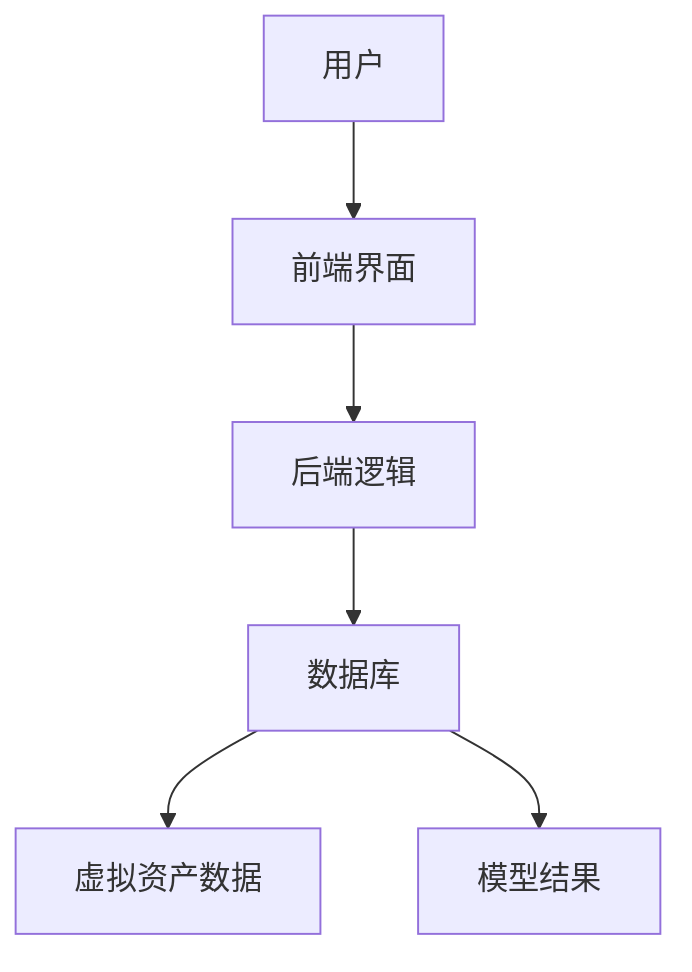
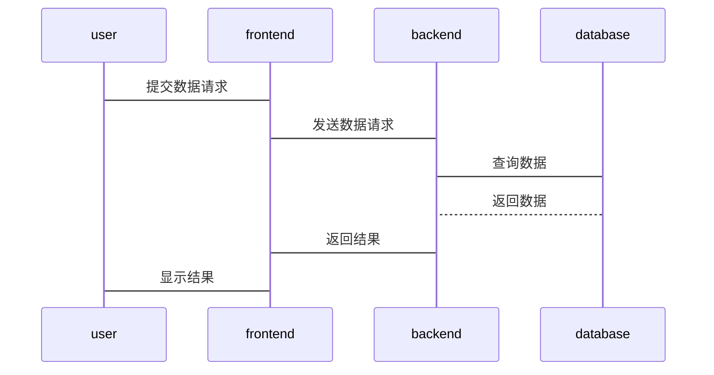

                 


# 巴菲特的并购策略在元宇宙虚拟资产整合中的新思路

## 关键词：巴菲特，并购策略，元宇宙，虚拟资产，整合，价值评估，投资新思路

## 摘要：  
本文探讨了巴菲特的经典并购策略在元宇宙虚拟资产整合中的新应用。通过分析巴菲特的并购哲学、价值评估方法和风险管理策略，结合元宇宙虚拟资产的特点，提出了将传统并购策略与新兴技术环境相结合的新思路。文章从理论到实践，详细阐述了如何在元宇宙中识别、评估和整合虚拟资产，并构建了数学模型和算法，为投资者提供了新的视角和工具。

---

# 第一部分: 巴菲特的并购策略概述

## 第1章: 巴菲特并购策略的核心理念

### 1.1 巴菲特价值投资理念

#### 1.1.1 巴菲特的价值投资哲学
巴菲特的价值投资理念强调“以合理的价格买入优秀的公司”。他注重企业的基本面分析，尤其是企业的盈利能力、竞争优势和财务健康状况。他认为，长期来看，企业的内在价值是决定股价的核心因素。

#### 1.1.2 巴菲特并购策略的核心要素
1. **企业基本面分析**：巴菲特通过分析企业的财务报表、盈利能力、竞争优势等，判断企业的内在价值。
2. **安全边际**：他强调在并购中留出安全边际，即以低于企业内在价值的价格进行并购，以降低风险。
3. **长期持有**：巴菲特倾向于长期持有优质资产，避免频繁交易，以实现稳定的收益。

#### 1.1.3 成功案例分析
以巴菲特并购可口可乐为例，他通过长期持有可口可乐的股票，利用其强大的品牌和市场地位，实现了稳定的收益。

### 1.2 巴菲特并购策略的关键步骤

#### 1.2.1 企业基本面分析
1. **财务报表分析**：通过利润表、资产负债表和现金流量表，评估企业的财务健康状况。
2. **盈利能力评估**：分析企业的净利润率、ROE（净资产收益率）等指标，判断企业的盈利能力。
3. **竞争优势分析**：评估企业的核心竞争力，如品牌、技术、市场地位等。

#### 1.2.2 并购目标筛选与估值
1. **目标筛选标准**：
   - 企业具有强大的竞争优势。
   - 财务健康，盈利能力稳定。
   - 行业前景良好。
2. **企业价值评估**：
   - 使用DCF（现金流折现法）等方法评估企业的内在价值。
   - 考虑市场溢价和风险因素。

#### 1.2.3 并购后的整合与协同效应
1. **整合挑战**：
   - 企业文化冲突。
   - 组织结构整合。
   - 业务协同的实现。
2. **协同效应的实现路径**：
   - 优化资源配置。
   - 共享资源。
   - 提高管理效率。

### 1.3 巴菲特并购策略的风险管理

#### 1.3.1 并购风险的识别与评估
1. **风险类型**：
   - 市场风险。
   - 经营风险。
   - 财务风险。
   - 整合风险。
2. **风险评估指标**：
   - 风险概率。
   - 风险影响程度。

#### 1.3.2 风险控制策略
1. **风险分散**：通过多元化并购降低风险。
2. **严格估值**：确保并购价格低于企业内在价值。
3. **整合管理**：制定详细的整合计划，降低整合风险。

---

# 第二部分: 元宇宙与虚拟资产的基础

## 第2章: 元宇宙的概念与技术基础

### 2.1 元宇宙的定义与特征

#### 2.1.1 元宇宙的定义
元宇宙是一个虚拟的、去中心化的数字世界，用户可以通过虚拟现实技术（VR、AR）进行互动、社交和交易。

#### 2.1.2 元宇宙的主要技术支撑
1. **区块链技术**：用于虚拟资产的去中心化交易和确权。
2. **虚拟现实技术**：提供沉浸式的用户体验。
3. **人工智能**：用于智能合约和自动化管理。

#### 2.1.3 元宇宙的经济体系
元宇宙中的经济体系类似于现实世界，包括虚拟货币、虚拟资产交易、虚拟服务等。

### 2.2 虚拟资产的类型与特点

#### 2.2.1 虚拟资产的分类
1. **虚拟货币**：如比特币、以太坊。
2. **NFT（非同质化代币）**：用于表示独特的数字资产。
3. **虚拟土地**：元宇宙中的虚拟地产。

#### 2.2.2 虚拟资产的属性特征
1. **去中心化**：基于区块链技术，具有不可篡改性。
2. **可编程性**：通过智能合约实现自动化的资产交易和管理。
3. **稀缺性**：部分虚拟资产具有稀缺性，决定了其价值。

#### 2.2.3 虚拟资产的价值评估
1. **技术评估**：评估区块链技术的成熟度和安全性。
2. **市场需求**：分析用户需求和市场热度。
3. **经济模型**：评估经济体系的可持续性和盈利能力。

---

# 第三部分: 巴菲特并购策略在元宇宙中的新思路

## 第3章: 元宇宙虚拟资产整合的背景与意义

### 3.1 虚拟资产整合的背景
随着元宇宙的快速发展，虚拟资产的种类和数量不断增加，传统的投资策略需要适应新的环境。

### 3.2 虚拟资产整合的意义
1. **资产多元化**：通过整合虚拟资产，降低投资风险。
2. **价值发现**：发现具有潜力的虚拟资产，实现超额收益。
3. **技术创新**：利用区块链和人工智能技术，优化资产整合过程。

## 第4章: 巴菲特并购策略在元宇宙中的应用

### 4.1 虚拟资产的并购目标筛选

#### 4.1.1 目标筛选标准
1. **技术评估**：评估虚拟资产的技术成熟度和安全性。
2. **市场需求**：分析用户需求和市场热度。
3. **经济模型**：评估经济体系的可持续性和盈利能力。

#### 4.1.2 虚拟资产的价值评估
1. **技术评估**：评估区块链技术的成熟度和安全性。
2. **市场需求**：分析用户需求和市场热度。
3. **经济模型**：评估经济体系的可持续性和盈利能力。

### 4.2 虚拟资产的整合与协同效应

#### 4.2.1 整合挑战
1. **技术冲突**：不同虚拟资产的技术标准可能不兼容。
2. **用户需求差异**：不同虚拟资产的目标用户可能不同。
3. **法律风险**：虚拟资产的法律地位尚未完全明确。

#### 4.2.2 协同效应的实现路径
1. **技术共享**：整合不同虚拟资产的技术优势，优化整体性能。
2. **用户共享**：通过共享用户资源，降低获客成本。
3. **数据共享**：利用大数据技术，优化决策和运营。

### 4.3 虚拟资产的风险管理

#### 4.3.1 风险类型
1. **技术风险**：虚拟资产的技术漏洞可能导致资产损失。
2. **市场风险**：虚拟资产的价格波动较大。
3. **法律风险**：虚拟资产的法律地位尚未完全明确。

#### 4.3.2 风险控制策略
1. **技术保障**：通过区块链技术确保资产的安全性。
2. **市场监控**：实时监控市场波动，及时调整投资策略。
3. **法律合规**：确保虚拟资产的交易和持有符合法律法规。

---

# 第四部分: 数学模型与算法

## 第5章: 数学模型与算法

### 5.1 虚拟资产整合的数学模型

#### 5.1.1 模型构建
1. **目标函数**：最大化资产价值。
2. **约束条件**：满足技术和市场需求的约束。

#### 5.1.2 算法流程
1. **数据收集**：收集虚拟资产的技术、市场和经济数据。
2. **数据预处理**：清洗和标准化数据。
3. **模型训练**：使用机器学习算法训练模型。
4. **模型评估**：评估模型的准确性和稳定性。

### 5.2 算法实现

#### 5.2.1 Python代码实现
```python
import pandas as pd
import numpy as np
from sklearn.model_selection import train_test_split
from sklearn.linear_model import LinearRegression

# 数据预处理
data = pd.read_csv('virtual_asset_data.csv')
X = data[['技术评估', '市场需求', '经济模型']]
y = data['资产价值']

# 划分训练集和测试集
X_train, X_test, y_train, y_test = train_test_split(X, y, test_size=0.2, random_state=42)

# 模型训练
model = LinearRegression()
model.fit(X_train, y_train)

# 模型评估
score = model.score(X_test, y_test)
print(f"模型得分: {score}")
```

#### 5.2.2 模型评估
1. **模型准确率**：评估模型的预测准确性。
2. **模型稳定性**：评估模型在不同数据集上的表现一致性。

---

# 第五部分: 系统分析与架构设计

## 第6章: 系统分析与架构设计

### 6.1 系统功能设计

#### 6.1.1 功能模块
1. **数据采集模块**：采集虚拟资产的技术、市场和经济数据。
2. **数据处理模块**：清洗和标准化数据。
3. **模型训练模块**：训练和优化数学模型。
4. **结果展示模块**：展示模型的预测结果和分析报告。

#### 6.1.2 系统架构
1. **前端界面**：用户友好的交互界面。
2. **后端逻辑**：处理数据和模型运算。
3. **数据库**：存储虚拟资产数据和模型结果。

### 6.2 系统架构设计

#### 6.2.1 系统架构图


#### 6.2.2 接口设计
1. **数据接口**：与外部数据源对接。
2. **模型接口**：与机器学习模型对接。
3. **用户接口**：与用户交互的界面。

### 6.3 系统交互设计

#### 6.3.1 交互流程


---

# 第六部分: 项目实战

## 第7章: 项目实战

### 7.1 环境安装

#### 7.1.1 Python环境
安装Python和必要的库：
```bash
pip install pandas numpy scikit-learn
```

#### 7.1.2 数据集准备
下载虚拟资产数据集，格式为CSV。

### 7.2 核心代码实现

#### 7.2.1 数据预处理
```python
import pandas as pd
import numpy as np

# 数据加载
data = pd.read_csv('virtual_asset_data.csv')

# 数据清洗
data = data.dropna()
data = data.drop_duplicates()
```

#### 7.2.2 模型训练
```python
from sklearn.linear_model import LinearRegression
from sklearn.model_selection import train_test_split

# 数据划分
X = data[['技术评估', '市场需求', '经济模型']]
y = data['资产价值']

X_train, X_test, y_train, y_test = train_test_split(X, y, test_size=0.2, random_state=42)

# 模型训练
model = LinearRegression()
model.fit(X_train, y_train)

# 模型预测
y_pred = model.predict(X_test)
```

### 7.3 案例分析

#### 7.3.1 数据分析
分析模型在测试集上的表现，计算R²值和均方误差。

#### 7.3.2 结果解读
解释模型的预测结果，找出影响虚拟资产价值的关键因素。

### 7.4 项目小结
总结项目的实施过程，提出改进建议，展望未来的研究方向。

---

# 第七部分: 总结与展望

## 第8章: 总结与展望

### 8.1 最佳实践 tips
1. 在虚拟资产整合中，注重技术和市场需求的结合。
2. 采用机器学习算法优化模型的预测能力。
3. 加强风险管理，确保投资安全。

### 8.2 小结
本文结合巴菲特的并购策略和元宇宙的虚拟资产整合，提出了新的思路和方法。通过数学模型和系统设计，为投资者提供了新的工具和策略。

### 8.3 注意事项
1. 虚拟资产市场波动较大，需谨慎操作。
2. 模型结果仅供参考，需结合实际情况进行调整。

### 8.4 拓展阅读
1. 巴菲特的《 Intelligent Investor 》。
2. 区块链和人工智能在虚拟资产中的应用。
3. 元宇宙的经济体系和法律问题。

---

通过以上思考步骤，我们逐步构建了巴菲特并购策略在元宇宙虚拟资产整合中的新思路，从理论到实践，结合技术与投资，为读者提供了全面的视角和工具。

