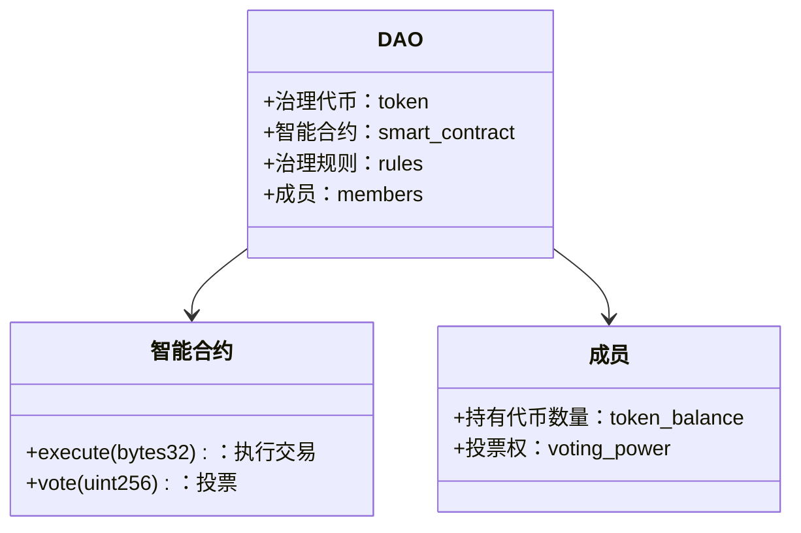

                 


# 巴菲特的并购策略在去中心化自治组织(DAO)中的新思路

> 关键词：巴菲特，并购策略，去中心化自治组织，DAO，价值投资，智能合约，治理机制

> 摘要：本文探讨了巴菲特并购策略在去中心化自治组织（DAO）中的新思路，分析了并购策略的核心理念、DAO的基本概念以及两者结合的可能性。通过系统架构设计和项目实战，提出了将并购策略应用于DAO治理的具体方法，并结合实际案例进行了深入分析。最后，展望了未来的发展方向，并提供了最佳实践的建议。

---

## 第1章：巴菲特并购策略概述

### 1.1 巴菲特并购策略的核心理念

#### 1.1.1 价值投资的定义与原则
价值投资是一种以内在价值为导向的投资策略，巴菲特是这一策略的代表人物。他强调购买低于其内在价值的资产，长期持有，直至其价值被市场发现。价值投资的核心在于寻找具有持续竞争优势的企业，并以合理的价格买入。

- **内在价值**：企业未来现金流的现值，计算公式为：
  $$\text{内在价值} = \sum_{t=1}^{n} \frac{C_t}{(1 + r)^t}$$
  其中，\(C_t\) 是第 \(t\) 年的现金流，\(r\) 是折现率。

- **安全边际**：巴菲特强调以低于内在价值的价格买入资产，确保投资的安全性。安全边际的计算公式为：
  $$\text{安全边际} = \text{内在价值} - \text{市场价格}$$

#### 1.1.2 安全边际的概念与应用
安全边际是巴菲特投资策略中的关键部分，它通过在价格低于内在价值时买入，降低投资风险。在并购中，安全边际确保企业以合理的价格收购目标公司，避免过度支付。

#### 1.1.3 竞争优势的识别与评估
竞争优势是企业长期盈利的基石。巴菲特关注企业的“护城河”，即那些能够长期保护企业免受竞争侵蚀的因素，如专利、品牌、成本优势等。

### 1.2 巴菲特并购策略的实施步骤

#### 1.2.1 企业估值方法
巴菲特常用的方法包括：
1. **相对估值法**：比较市盈率、市净率等指标。
2. **内在价值法**：通过现金流折现法（DCF）评估企业价值。

#### 1.2.2 并购前的尽职调查
尽职调查是并购决策的关键步骤，包括财务、法律和运营等方面。

#### 1.2.3 并购后的整合与管理
并购后，整合是确保协同效应最大化的重要步骤，包括文化整合、资源优化等。

### 1.3 巴菲特并购策略的案例分析

#### 1.3.1 可口可乐的并购案例
巴菲特对可口可乐的投资体现了其价值投资理念，通过长期持有获得稳定的股息收益。

#### 1.3.2 左右手公司的战略选择
巴菲特的“左右手”策略指的是将一部分资产用于长期投资，另一部分用于短期套利，以平衡风险和收益。

---

## 第2章：去中心化自治组织（DAO）的基本概念

### 2.1 DAO的定义与特点

#### 2.1.1 DAO的定义
DAO是基于区块链技术的去中心化组织，通过智能合约自动执行治理规则。

#### 2.1.2 DAO与传统组织的区别
- **去中心化**：没有传统组织的层级结构。
- **透明性**：所有决策和交易记录在区块链上，公开透明。
- **不可篡改性**：智能合约确保规则无法被篡改。

#### 2.1.3 DAO的治理机制
DAO的治理机制基于投票系统，成员通过持有治理代币进行决策。

### 2.2 DAO的运作模式

#### 2.2.1 智能合约的作用
智能合约是DAO运行的核心，自动执行治理规则和交易。

#### 2.2.2 去中心化决策的优势
- **公平性**：所有成员都有平等的决策权。
- **透明性**：所有决策过程公开透明。

#### 2.2.3 DAO的激励机制
通过治理代币分配和奖励机制激励成员积极参与治理。

### 2.3 DAO的法律与伦理挑战

#### 2.3.1 DAO的法律地位
DAO的法律地位因地区而异，存在不确定性。

#### 2.3.2 去中心化组织的道德责任
DAO成员需要共同承担责任，但如何分配责任尚不明确。

---

## 第3章：巴菲特并购策略与DAO的结合思路

### 3.1 并购策略在DAO中的潜在应用

#### 3.1.1 价值评估的DAO化
通过DAO的治理机制，实现对企业价值的共同评估。

#### 3.1.2 安全边际的DAO实现
利用DAO的透明性和智能合约，确保并购价格的安全边际。

#### 3.1.3 竞争优势的DAO识别
通过DAO的分布式决策，识别企业的竞争优势。

### 3.2 DAO治理中的并购策略

#### 3.2.1 智能合约在并购中的应用
智能合约可以自动执行并购协议，确保交易安全。

#### 3.2.2 DAO成员的并购决策机制
通过治理代币投票，实现并购决策的民主化。

#### 3.2.3 并购后的DAO整合策略
并购后，通过DAO的治理机制，实现资源整合和协同效应。

### 3.3 巴菲特并购策略对DAO治理的启示

#### 3.3.1 价值投资在DAO中的体现
通过DAO的治理机制，实现长期价值投资。

#### 3.3.2 安全边际的DAO化实现
利用DAO的透明性和智能合约，确保并购的安全边际。

#### 3.3.3 竞争优势的DAO化应用
通过DAO的分布式决策，识别和维护企业的竞争优势。

---

## 第4章：DAO治理中的并购策略实施框架

### 4.1 并购策略的DAO化实施步骤

#### 4.1.1 价值评估框架
通过DAO的治理机制，建立价值评估的框架。

#### 4.1.2 安全边际的DAO化设计
利用智能合约，确保并购价格的安全边际。

#### 4.1.3 竞争优势的DAO化识别
通过DAO的分布式决策，识别企业的竞争优势。

### 4.2 系统架构设计

#### 4.2.1 系统功能设计（领域模型mermaid类图）


#### 4.2.2 系统架构设计（mermaid架构图）


#### 4.2.3 系统交互设计（mermaid序列图）
```mermaid
sequenceDiagram
    participant 成员
    participant 智能合约
    participant DAO
    成员 -> 智能合约：提交投票
    智能合约 -> DAO：更新治理规则
    DAO -> 成员：反馈结果
```

### 4.3 项目实战

#### 4.3.1 环境安装
需要安装以太坊钱包和Solidity编译器。

#### 4.3.2 核心代码实现
以下是智能合约的代码示例：
```solidity
// SPDX-License-Identifier: MIT
pragma solidity ^0.8.0;

contract DAO {
    mapping(address => uint256) public tokenBalances;
    uint256 public totalTokens = 1000;
    address public governanceContract;

    constructor() {
        governanceContract = address(0);
    }

    function vote(uint256 proposalId, bool support) public {
        // 投票逻辑
    }

    function execute(bytes32 transactionHash) public {
        // 执行交易逻辑
    }
}
```

#### 4.3.3 案例分析
以一家DAO的并购案例为例，展示如何通过智能合约实现并购决策的自动化。

---

## 第5章：案例分析与未来展望

### 5.1 案例分析
通过具体案例，分析并购策略在DAO中的应用效果。

### 5.2 未来展望
展望未来，DAO与并购策略的结合将更加紧密，推动企业治理的革新。

### 5.3 最佳实践 tips
- 保持透明和公平的治理机制。
- 合理设计激励机制，鼓励成员积极参与。

---

## 结论

本文探讨了巴菲特并购策略在DAO中的新思路，通过系统的分析和案例研究，提出了将并购策略应用于DAO治理的具体方法。未来，随着区块链技术的发展，DAO将成为企业治理的重要形式，而并购策略的DAO化将为企业创造更大的价值。

---

感谢您的阅读！如果您有任何问题或建议，请随时与我联系。
```

