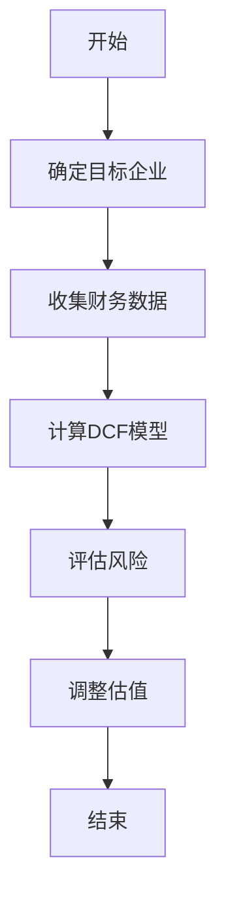
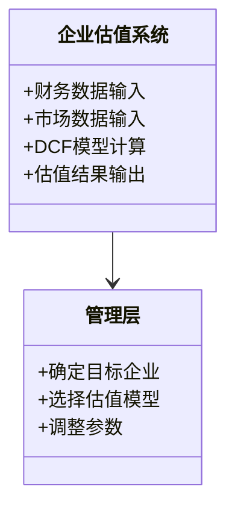

                 


```markdown
# 巴菲特的并购策略在科技独角兽中的新思路

> 关键词：巴菲特并购策略、科技独角兽、价值投资、创新模式、风险控制

> 摘要：本文深入探讨了巴菲特并购策略在科技独角兽领域的应用，分析了其在高成长性和创新性科技企业中的新思路。通过对比传统并购策略与科技独角兽的特点，提出了数据驱动的并购决策、动态估值模型和创业者心态等创新方法。文章结合实际案例，详细阐述了如何在科技独角兽中应用巴菲特并购策略，并提供了系统的算法与架构设计方案。

---

## 第一章: 巴菲特并购策略与科技独角兽的结合

### 1.1 巴菲特并购策略的核心理念
巴菲特的并购策略以价值投资为核心，注重企业的内在价值和长期盈利能力。他强调安全边际、管理层质量以及企业的财务健康状况。通过收购具有强大竞争优势和持续盈利能力的企业，巴菲特实现了长期稳健的投资回报。

#### 1.1.1 价值投资的定义与核心原则
- **价值投资**：寻找市场价格低于内在价值的股票进行投资。
- **核心原则**：
  1. 购买优秀的企业，而非廉价的股票。
  2. 重点关注企业的盈利能力、财务状况和管理层能力。
  3. 长期持有，避免频繁交易。

#### 1.1.2 巴菲特并购策略的关键要素
- **安全边际**：买入价格低于内在价值，确保投资的安全性。
- **管理层质量**：选择具有诚信和能力的管理层。
- **财务健康状况**：关注企业的盈利能力、资产负债表和现金流。

#### 1.1.3 巴菲特并购策略的成功案例分析
- **案例1：可口可乐的收购**：巴菲特通过长期持有可口可乐的股票，获得了稳定的股息收入和资本增值。
- **案例2：富国银行的收购**：通过分析管理层和业务模式，巴菲特看到了银行的长期增长潜力。

### 1.2 科技独角兽的定义与特点
#### 1.2.1 科技独角兽的定义与分类
- **科技独角兽**：指估值超过10亿美元的科技初创公司。
- **分类**：
  1. SaaS（软件即服务）公司。
  2. 人工智能和大数据公司。
  3. 云计算和基础设施公司。

#### 1.2.2 科技独角兽的核心竞争力分析
- **高成长性**：科技独角兽通常具有快速扩张的潜力。
- **创新性**：依赖核心技术或商业模式的创新。
- **技术壁垒**：通过专利和技术积累形成竞争优势。

#### 1.2.3 科技独角兽的市场定位与发展趋势
- **市场定位**：科技独角兽通常在细分市场占据领先地位。
- **发展趋势**：随着技术进步和市场需求变化，科技独角兽需要不断创新以维持竞争优势。

---

## 第二章: 巴菲特并购策略在科技独角兽中的应用

### 2.1 巴菲特并购策略的核心要素
#### 2.1.1 价值投资的逻辑与方法
- **逻辑**：寻找具有强大竞争优势和持续盈利能力的科技独角兽。
- **方法**：
  1. 通过财务数据分析企业的盈利能力。
  2. 评估企业的技术壁垒和市场地位。
  3. 分析管理层的愿景和战略。

#### 2.1.2 安全边际的概念与应用
- **概念**：确保买入价格低于企业的内在价值，降低投资风险。
- **应用**：
  1. 通过DCF模型评估企业价值。
  2. 结合市场波动调整买入价格。

#### 2.1.3 财务指标分析与企业估值
- **财务指标分析**：
  - 利润率（净利润率、毛利率）。
  - 资产负债率。
  - 现金流状况。
- **企业估值**：
  - DCF模型。
  - 市盈率、市净率等相对估值方法。

### 2.2 科技独角兽的并购策略特点
#### 2.2.1 科技独角兽的高成长性与不确定性
- **高成长性**：科技独角兽通常具有快速扩张的潜力。
- **不确定性**：技术更新换代快，市场变化大，投资风险高。

#### 2.2.2 科技独角兽的创新性与技术壁垒
- **创新性**：依赖核心技术或商业模式的创新。
- **技术壁垒**：通过专利和技术积累形成竞争优势。

#### 2.2.3 科技独角兽的市场地位与竞争优势
- **市场地位**：科技独角兽通常在细分市场占据领先地位。
- **竞争优势**：通过技术创新、成本优势或商业模式创新获得竞争优势。

---

## 第三章: 巴菲特并购策略在科技独角兽中的新思路

### 3.1 科技独角兽并购策略的创新点
#### 3.1.1 数据驱动的并购决策
- **数据驱动**：利用大数据分析企业财务数据、市场数据和行业趋势，辅助并购决策。
- **案例分析**：通过分析某科技独角兽的历史财务数据和市场表现，评估其投资价值。

#### 3.1.2 风险控制与动态估值模型
- **动态估值模型**：根据市场变化和企业业绩动态调整估值。
- **风险管理**：通过分散投资、设置止损点等方式降低投资风险。

#### 3.1.3 创业者心态与长期价值创造
- **创业者心态**：关注企业的长期发展，与管理层建立良好的合作关系。
- **长期价值创造**：通过战略协同和资源整合，实现并购后的价值最大化。

### 3.2 科技独角兽并购策略的实施步骤
#### 3.2.1 确定并购目标与战略方向
- **目标选择**：根据企业战略和财务状况确定并购目标。
- **战略方向**：明确并购后的整合方向和协同发展计划。

#### 3.2.2 进行尽职调查与风险评估
- **尽职调查**：
  - 财务审计。
  - 法律合规性审查。
  - 市场竞争分析。
- **风险评估**：
  - 企业经营风险。
  - 市场风险。
  - 技术风险。

#### 3.2.3 制定并购后的整合与管理策略
- **整合计划**：
  - 企业文化融合。
  - 组织架构调整。
  - 业务流程整合。
- **管理策略**：
  - 设立合理的激励机制。
  - 加强内部沟通与协调。
  - 定期评估整合效果。

---

## 第四章: 科技独角兽并购中的估值模型与算法

### 4.1 估值模型的数学公式与实现
#### 4.1.1 DCF模型的公式与应用
$$
DCF = \frac{CF_1}{(r - g)} + \frac{CF_2}{(r - g)^2} + \dots + \frac{CF_n}{(r - g)^n}
$$
- **DCF模型**：通过预测未来现金流，折现到现值，评估企业价值。
- **应用**：
  - 确定企业未来现金流。
  - 选择合适的折现率。
  - 计算企业估值。

#### 4.1.2 市盈率与市净率的对比分析
- **市盈率（P/E）**：股价除以每股收益。
- **市净率（P/B）**：股价除以每股净资产。
- **对比**：市盈率适用于高增长企业，市净率适用于重资产企业。

#### 4.1.3 股权价值的多阶段模型
- **多阶段模型**：将企业生命周期分为多个阶段，分别进行估值。
- **应用**：适用于企业处于快速成长期的科技独角兽。

### 4.2 算法原理与流程图
#### 4.2.1 DCF模型的算法流程图


#### 4.2.2 企业估值的系统架构设计


---

## 第五章: 项目实战与总结

### 5.1 项目环境安装
- **工具安装**：
  - 数据分析工具：Python、Excel。
  - 开发环境：PyCharm、Jupyter Notebook。
- **依赖库安装**：
  - Pandas、NumPy、Matplotlib。

### 5.2 核心代码实现
#### 5.2.1 DCF模型的实现
```python
import pandas as pd
import numpy as np

def calculate_dcf(cash_flows, discount_rate, growth_rate):
    dcf = 0
    for i in range(len(cash_flows)):
        cf = cash_flows[i]
        dcf += cf / (discount_rate + growth_rate) ** i
    return dcf

# 示例数据
cash_flows = [100, 120, 140, 160]
discount_rate = 0.08
growth_rate = 0.02

dcf = calculate_dcf(cash_flows, discount_rate, growth_rate)
print(f"DCF Value: {dcf:.2f}")
```

#### 5.2.2 估值结果的可视化
```python
import matplotlib.pyplot as plt

# 示例数据
years = [2023, 2024, 2025, 2026]
DCF_values = [100, 120, 140, 160]

plt.plot(years, DCF_values)
plt.title('DCF Model Visualization')
plt.xlabel('Year')
plt.ylabel('DCF Value')
plt.show()
```

### 5.3 案例分析与总结
#### 5.3.1 案例分析
- **案例选择**：某人工智能初创公司。
- **分析过程**：
  1. 收集企业的财务数据和市场数据。
  2. 应用DCF模型进行估值。
  3. 结合管理层战略进行综合评估。

#### 5.3.2 总结
- **主要结论**：科技独角兽的投资需要结合数据分析和长期战略。
- **最佳实践**：
  1. 采用数据驱动的并购决策。
  2. 建立动态估值模型，实时调整投资策略。
  3. 与管理层保持良好沟通，确保并购后的协同效应。

---

## 第六章: 总结与展望

### 6.1 总结
本文探讨了巴菲特并购策略在科技独角兽中的新思路，通过数据分析和案例分析，提出了数据驱动的并购决策、动态估值模型和创业者心态等创新方法。这些方法能够有效降低投资风险，提高投资回报率。

### 6.2 展望
未来，随着科技行业的快速发展，科技独角兽的投资将更加复杂和具有挑战性。投资者需要不断优化并购策略，结合新技术和新方法，应对市场的不确定性和风险。

### 6.3 最佳实践 tips
- **风险管理**：在并购过程中，注重风险控制和动态调整。
- **长期视角**：关注企业的长期发展，与管理层建立良好的合作关系。
- **持续学习**：不断更新知识，适应科技行业的快速变化。

---

通过本文的分析和实践，读者可以更好地理解巴菲特并购策略在科技独角兽中的应用，并在实际投资中灵活运用这些策略，实现长期稳健的投资回报。
```

