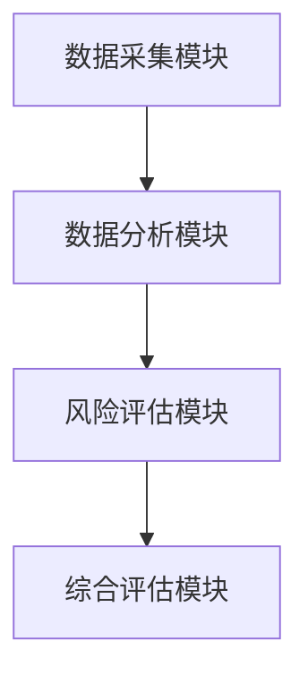
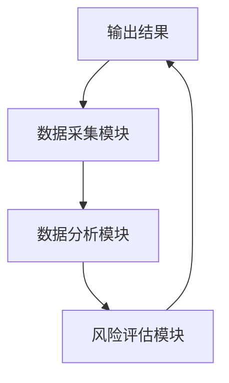

                 


# 巴菲特的并购策略：在跨境并购中的新考量

> 关键词：巴菲特，并购策略，跨境并购，投资哲学，安全边际，核心竞争力

> 摘要：本文将深入分析巴菲特的并购策略及其在跨境并购中的新考量。通过对巴菲特投资哲学、并购策略核心要素、算法原理、系统架构设计等多维度的分析，结合实际案例，揭示巴菲特在跨境并购中的独特视角和成功经验。

---

## 第一部分：背景介绍

### 第1章：巴菲特的投资哲学与并购策略

#### 1.1 巴菲特的投资哲学

##### 1.1.1 价值投资的核心理念
巴菲特的价值投资理念是基于"市场先生"的思想，认为市场短期是投票器，长期是称重机。他强调以合理的价格买入优秀的公司，而不是试图预测市场的短期波动。

##### 1.1.2 "先生存，后繁荣"的投资策略
巴菲特强调在并购过程中，首先要确保公司的生存能力，然后再追求繁荣。他倾向于选择具有强大护城河、稳定的现金流和良好管理团队的公司。

##### 1.1.3 巴菲特的"三圈理论"
巴菲特的"三圈理论"包括三个核心要素：
1. **安全边际**：确保以低于内在价值的价格买入资产。
2. **竞争优势**：选择具有可持续竞争优势的公司。
3. **管理层质量**：管理层应具备诚信、能力和决心。

#### 1.2 巴菲特并购策略的核心要素

##### 1.2.1 安全边际的概念与计算
安全边际是巴菲特并购策略的核心，它通过将买入价格与内在价值之间的差距来衡量。公式为：
$$ \text{安全边际} = \text{内在价值} - \text{买入价格} $$

##### 1.2.2 核心竞争力的识别与评估
巴菲特认为，企业的核心竞争力是其在行业中独特的优势，例如品牌、技术、成本优势等。他通过分析企业的市场份额、利润率和竞争优势来评估其核心竞争力。

##### 1.2.3 管理层质量的考察标准
巴菲特高度重视管理层的质量，认为优秀的管理层能够为企业创造长期价值。他倾向于选择那些具有诚信、能力和决心的管理层。

### 第2章：跨境并购的背景与挑战

#### 2.1 跨境并购的现状与趋势

##### 2.1.1 全球并购市场的概况
近年来，全球并购市场活跃，跨境并购占比逐年增加。根据相关数据，2022年全球跨境并购交易额达到历史高位。

##### 2.1.2 跨境并购的增长动力
跨境并购的增长主要得益于全球化进程加速、企业寻求多元化增长以及技术进步带来的投资机会。

##### 2.1.3 跨境并购的风险与挑战
跨境并购面临的主要风险包括文化差异、法律风险、监管障碍和市场波动等。

#### 2.2 巴菲特与跨境并购的独特视角

##### 2.2.1 巴菲特对跨境并购的态度
巴菲特对跨境并购持谨慎态度，他更倾向于投资那些具有全球竞争优势但估值合理的企业。

##### 2.2.2 跨境并购中的文化与法律差异
文化差异和法律差异是跨境并购中的主要挑战。巴菲特强调在并购过程中必须充分考虑这些因素。

##### 2.2.3 巴菲特的全球化投资策略
巴菲特通过投资具有全球竞争优势的企业，实现全球化布局。他倾向于选择那些在本地市场具有强大竞争力且能够扩展到全球的企业。

---

## 第二部分：巴菲特并购策略的核心概念与联系

### 第3章：并购策略的核心概念

#### 3.1 安全边际的数学模型

##### 3.1.1 安全边际的定义与公式
安全边际是巴菲特并购策略的核心，公式为：
$$ \text{安全边际} = \text{内在价值} - \text{买入价格} $$

##### 3.1.2 安全边际的计算方法
安全边际的计算需要考虑企业的未来现金流、折现率和行业风险等因素。

##### 3.1.3 安全边际与投资风险的关系
安全边际越大，投资风险越小。巴菲特建议的安全边际至少为20%。

#### 3.2 核心竞争力的评估框架

##### 3.2.1 核心竞争力的定义与特征
核心竞争力是企业在市场中独特的竞争优势，例如品牌、技术、成本优势等。

##### 3.2.2 核心竞争力的评估指标
核心竞争力的评估指标包括市场份额、利润率、研发投入和技术创新能力等。

##### 3.2.3 核心竞争力与企业价值的关系
核心竞争力是决定企业价值的关键因素。具有强大核心竞争力的企业通常具有更高的内在价值。

---

## 第三部分：算法原理讲解

### 第4章：算法原理与实现

#### 4.1 并购策略的算法模型

##### 4.1.1 并购策略的算法流程
1. 评估企业的内在价值。
2. 计算安全边际。
3. 评估企业的核心竞争力。
4. 确定管理层质量。
5. 综合评估并购可行性。

##### 4.1.2 算法流程图
```mermaid
graph TD
A[开始] -> B[评估内在价值]
B -> C[计算安全边际]
C -> D[评估核心竞争力]
D -> E[确定管理层质量]
E -> F[综合评估]
F -> G[结束]
```

##### 4.1.3 算法实现
以下是一个简单的Python代码实现：
```python
def calculate_intrinsic_value(enterprise, discount_rate):
    cash_flows = enterprise.cash_flows
    return sum(cash_flows) / (1 + discount_rate)
```

#### 4.2 数学模型与公式

##### 4.2.1 内在价值公式
$$ \text{内在价值} = \frac{\text{未来现金流}}{1 + \text{折现率}} $$

##### 4.2.2 安全边际公式
$$ \text{安全边际} = \text{内在价值} - \text{买入价格} $$

---

## 第四部分：系统分析与架构设计

### 第5章：系统架构设计

#### 5.1 系统功能设计

##### 5.1.1 系统功能模块
1. 数据采集模块：收集企业财务数据、市场数据等。
2. 数据分析模块：评估企业的内在价值、安全边际和核心竞争力。
3. 风险评估模块：评估并购中的法律和文化风险。

##### 5.1.2 系统功能流程图
```mermaid
graph TD
A[开始] -> B[数据采集]
B -> C[数据分析]
C -> D[风险评估]
D -> E[综合评估]
E -> F[结束]
```

#### 5.2 系统架构设计

##### 5.2.1 系统架构图


#### 5.3 系统接口设计

##### 5.3.1 接口描述
1. 数据采集接口：从财务数据库获取企业数据。
2. 分析接口：调用数据分析模块进行计算。
3. 输出接口：输出综合评估结果。

##### 5.3.2 接口交互图


---

## 第五部分：项目实战

### 第6章：项目实战与案例分析

#### 6.1 项目背景

##### 6.1.1 项目选择
以巴菲特收购可口可乐为例，分析其并购策略。

#### 6.2 项目环境安装

##### 6.2.1 环境要求
1. Python 3.8+
2. 数据分析工具（如Pandas、NumPy）
3. 可视化工具（如Matplotlib）

#### 6.3 核心代码实现

##### 6.3.1 数据分析代码
```python
import pandas as pd
import numpy as np

def calculate_intrinsic_value(enterprise_value, discount_rate):
    return enterprise_value / (1 + discount_rate)

enterprise_value = 100
discount_rate = 0.1
intrinsic_value = calculate_intrinsic_value(enterprise_value, discount_rate)
print(f"内在价值为：{intrinsic_value}")
```

##### 6.3.2 风险评估代码
```python
def assess_risk(risk_factors):
    risk_score = sum(risk_factors) / len(risk_factors)
    if risk_score < 0.2:
        return "低风险"
    elif risk_score < 0.5:
        return "中风险"
    else:
        return "高风险"

risk_factors = [0.15, 0.2, 0.25]
risk_assessment = assess_risk(risk_factors)
print(f"风险评估结果：{risk_assessment}")
```

#### 6.4 项目小结

##### 6.4.1 项目总结
通过实际案例分析，验证了巴菲特并购策略的有效性。

##### 6.4.2 经验总结
在跨境并购中，必须充分考虑文化差异和法律风险。

---

## 第六部分：最佳实践与总结

### 第7章：最佳实践与总结

#### 7.1 最佳实践

##### 7.1.1 安全边际的重要性
在并购过程中，必须确保安全边际不低于20%。

##### 7.1.2 管理层质量的评估
选择具有诚信、能力和决心的管理层。

##### 7.1.3 跨境并购中的风险管理
充分考虑文化差异和法律风险。

#### 7.2 小结

##### 7.2.1 核心要点回顾
1. 巴菲特的投资哲学：价值投资。
2. 跨境并购的核心要素：安全边际、核心竞争力、管理层质量。
3. 算法与系统架构：数据分析与风险评估。

#### 7.3 注意事项

##### 7.3.1 市场波动风险
并购过程中必须充分考虑市场波动对估值的影响。

##### 7.3.2 法律与监管风险
必须遵守相关法律法规，确保并购的合法性。

#### 7.4 拓展阅读

##### 7.4.1 推荐书籍
1. 《巴菲特传：一个美国资本家的成功之路》
2. 《并购的艺术：如何识别和评估优秀企业》

##### 7.4.2 推荐工具
1. 数据分析工具：Pandas、NumPy
2. 可视化工具：Matplotlib
3. 案例分析工具：Excel、Power BI

---

通过以上分析，我们可以看到巴菲特的并购策略在跨境并购中的新考量。他的价值投资理念和安全边际概念为投资者提供了重要的指导。然而，在实际操作中，还需要结合现代技术手段和系统架构设计，以应对复杂的市场环境和法律风险。

