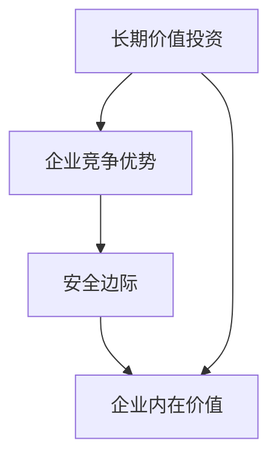
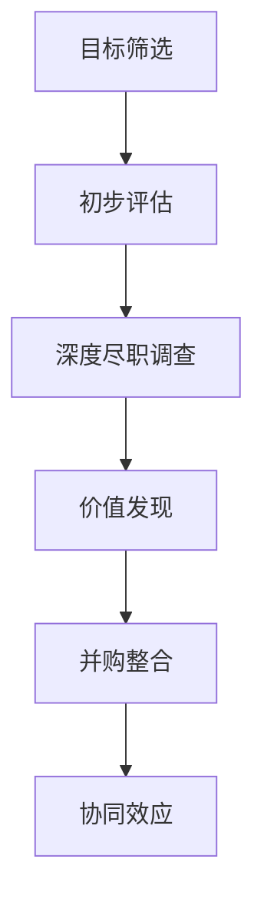
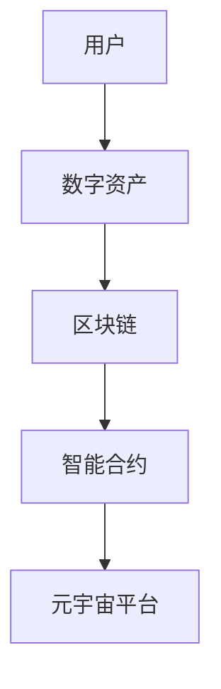
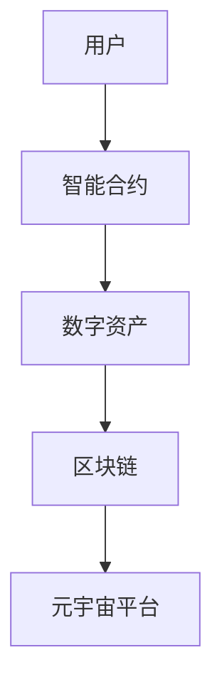

                 

# 巴菲特的并购艺术：元宇宙生态系统整合的新策略

---

## 关键词  
巴菲特, 并购艺术, 元宇宙, 生态系统, 整合策略, 价值投资, 区块链, 智能合约, 数字资产

---

## 摘要  
本文从巴菲特的并购艺术出发，结合元宇宙生态系统的整合策略，详细探讨如何将巴菲特的价值投资理念与元宇宙的技术特性相结合。通过分析元宇宙生态系统的构成、整合方法以及关键技术，提出一种新的并购策略，为元宇宙的生态整合提供理论支持和实践指导。

---

## 第一部分: 巴菲特并购艺术的核心理念

---

### 第1章: 巴菲特并购艺术的哲学基础

#### 1.1 投资哲学的核心要素

巴菲特的并购艺术建立在其独特的价值投资哲学之上。其核心要素包括：

1. **长期价值投资**：巴菲特认为，投资的最终目标是寻找具有持续竞争优势的企业，而非短期价格波动。
2. **安全边际**：在并购过程中，巴菲特强调安全边际的重要性，即以低于企业内在价值的价格买入。
3. **企业竞争优势**：他注重企业的核心竞争力，包括成本优势、品牌优势和技术优势等。

**背景介绍**  
价值投资的核心是寻找被市场低估的企业。巴菲特通过分析企业的财务报表、市场地位和竞争优势，判断其内在价值。这种投资哲学在并购中体现为对企业价值的深度挖掘和对安全边际的严格要求。

**核心概念与联系**  
下图展示了巴菲特投资哲学的核心要素及其相互关系：

---

#### 1.2 巴菲特并购的三大核心策略

1. **目标筛选与初步评估**：巴菲特在并购前会对企业进行严格的初步评估，重点关注企业的财务状况和市场地位。
2. **深度尽职调查与价值发现**：通过详细的尽职调查，发现企业的潜在价值和竞争优势。
3. **并购后的整合与协同效应**：并购完成后，注重企业文化的融合和资源整合，以实现协同效应。

**算法原理讲解**  
巴菲特的并购决策可以看作是一种基于企业价值评估的优化问题。其核心公式为：

$$ V = \frac{FCF}{WACC} $$

其中，\( V \) 是企业的内在价值，\( FCF \) 是自由现金流，\( WACC \) 是加权平均资本成本。

**系统分析与架构设计**  
下图展示了巴菲特并购的系统架构：

---

### 第2章: 巴菲特并购艺术的实践方法论

#### 2.1 巴菲特并购的“三步走”战略

1. **目标筛选与初步评估**：通过行业分析和财务指标筛选潜在目标。
2. **深度尽职调查与价值发现**：通过详细的财务分析和市场调研，发现企业的潜在价值。
3. **并购后的整合与价值提升**：通过资源整合和协同效应，提升企业整体价值。

**数学模型与公式**  
巴菲特常用市盈率（P/E）和市净率（P/B）来评估企业价值。公式如下：

$$ P/E = \frac{股价}{每股收益} $$

$$ P/B = \frac{股价}{每股净资产} $$

---

## 第二部分: 元宇宙生态系统的整合策略

---

### 第3章: 元宇宙生态系统的定义与架构

#### 3.1 元宇宙的基本概念与核心特征

元宇宙是一个虚拟与现实结合的数字生态系统，具有以下核心特征：

1. **虚拟现实**：通过VR/AR技术实现沉浸式体验。
2. **区块链技术**：确保数据的安全性和不可篡改性。
3. **智能合约**：实现去中心化的交易和结算。

**背景介绍**  
元宇宙的生态系统包括多个组成部分，如数字资产、区块链技术和智能合约。这些技术为企业提供了新的整合方式。

**系统架构设计**  
下图展示了元宇宙生态系统的架构：

---

#### 3.2 元宇宙生态系统的整合模型

1. **元宇宙生态系统的层级结构**：包括用户层、数字资产层、区块链层和平台层。
2. **元宇宙生态系统的整合框架**：通过智能合约实现去中心化的整合。
3. **元宇宙生态系统的协同效应**：通过资源整合实现生态系统的整体优化。

**项目实战**  
以下是一个元宇宙生态系统整合的案例：

1. **环境安装**：安装Solidity编译器和以太坊节点。
2. **代码实现**：编写智能合约代码，实现数字资产的发行和交易。
3. **案例分析**：分析智能合约的运行机制和实际应用效果。

---

### 第4章: 元宇宙生态系统整合的关键技术

#### 4.1 元宇宙生态系统整合的核心技术

1. **区块链技术**：确保数据的安全性和不可篡改性。
2. **智能合约**：实现去中心化的交易和结算。
3. **数字资产**：作为生态系统中的价值载体。

**系统接口设计**  
下图展示了元宇宙生态系统中的系统接口：

---

## 第三部分: 巴菲特并购艺术与元宇宙生态系统的整合

---

### 第5章: 元宇宙生态系统整合中的巴菲特策略

#### 5.1 巴菲特并购策略在元宇宙中的应用

1. **企业价值评估**：通过区块链技术和智能合约实现对数字资产的价值评估。
2. **竞争优势分析**：分析企业的技术优势和市场地位。
3. **并购整合**：通过资源整合和协同效应提升企业价值。

**数学模型与公式**  
在元宇宙中，企业价值的评估公式为：

$$ V = \frac{FCF}{WACC} $$

其中，\( FCF \) 是数字资产的自由现金流，\( WACC \) 是数字资产的加权平均资本成本。

---

## 结论

巴菲特的并购艺术为元宇宙生态系统的整合提供了重要的理论支持。通过结合区块链技术和智能合约，可以实现对企业价值的精准评估和资源整合。未来，随着元宇宙技术的不断发展，巴菲特的并购策略将在其中发挥更大的作用。

---

## 参考文献  
1. 巴菲特，沃伦. 《巴菲特致股东的信》  
2. 加里亚诺，克里斯. 《区块链技术入门与应用》  
3. 李录. 《投资中最简单的事》

