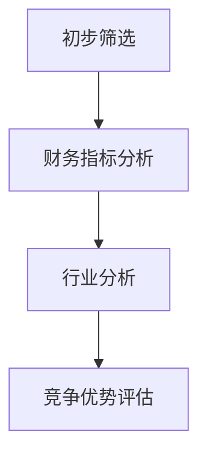
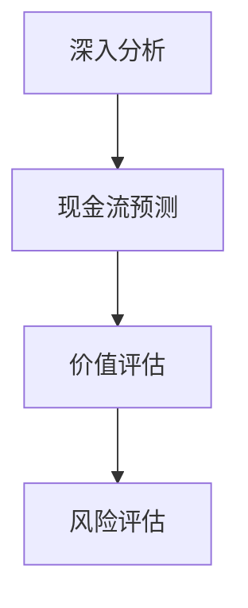
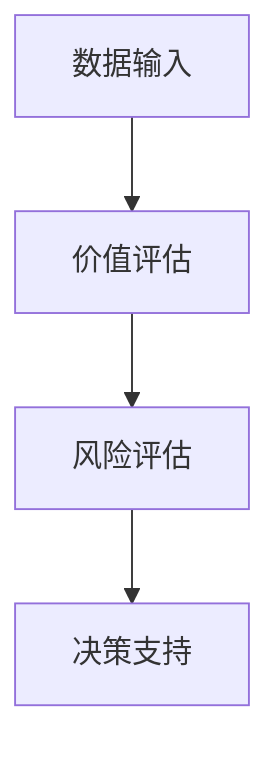
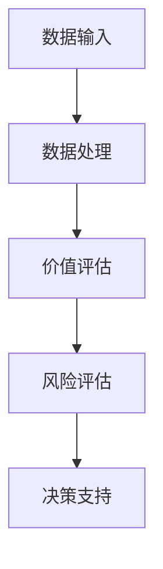
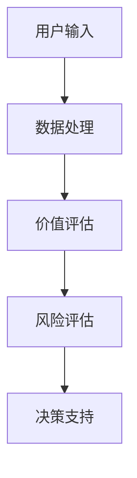

                 


# 巴菲特的并购艺术：在全球化背景下的新策略

## 关键词：
- 巴菲特
- 并购策略
- 全球化
- 投资哲学
- 价值评估

## 摘要：
本文深入探讨了巴菲特的并购艺术，结合其投资哲学，分析了在全球化背景下并购策略的新变化。通过具体案例、数学模型和系统架构的设计，详细解读了巴菲特的并购决策流程，并提供了实际的应用指导和最佳实践。

---

# 第1章: 巴菲特并购策略的背景与核心概念

## 1.1 巴菲特并购策略的背景

### 1.1.1 并购的基本概念与定义

并购（Mergers and Acquisitions，M&A）是指一家企业与其他企业（被并购方）合并或收购其资产、股权的过程。并购可以分为横向并购、纵向并购和混合并购。横向并购是指在同一行业内的并购，旨在扩大市场份额；纵向并购则是指产业链上下游的并购，以增强企业控制力；混合并购则是指不同行业之间的并购，以实现多元化发展。

### 1.1.2 巴菲特投资哲学的核心理念

巴菲特的投资哲学以“价值投资”为核心，强调以合理的价格买入具有持续竞争优势的企业。他主张长期持有优质资产，避免短期市场的波动干扰。巴菲特的价值投资理念包括以下几点：

1. **安全边际**：买入价格低于内在价值，确保投资的安全性。
2. **竞争优势**：选择具有强大竞争优势的企业，确保企业的持续盈利能力。
3. **财务健康**：关注企业的财务状况，特别是现金流和负债情况。
4. **长期视角**：关注企业的长期价值，而非短期市场波动。

### 1.1.3 全球化背景下的并购新趋势

全球化背景下，并购活动更加频繁，跨国并购成为主流。企业通过并购实现全球化布局，扩大市场占有率，同时优化资源配置。此外，并购也更加注重企业的文化和管理整合，以确保并购后的协同效应。

---

## 1.2 巴菲特并购策略的核心要素

### 1.2.1 安全边际的定义与计算

**安全边际**是指股票的市场价格低于其内在价值的部分。计算公式为：

$$ \text{安全边际} = \text{内在价值} - \text{市场价格} $$

例如，如果一只股票的内在价值为100元，市场价格为80元，那么安全边际为20元。安全边际越大，投资的风险越小。

### 1.2.2 企业竞争优势的分析框架

巴菲特认为，企业的竞争优势是其持续盈利的关键。竞争优势可以分为以下几种：

1. **成本优势**：企业能够以更低的成本生产产品或服务。
2. **品牌优势**：强大的品牌能够吸引更多的客户。
3. **技术优势**：拥有独特的技术或专利。
4. **网络效应**：产品或服务的使用能够吸引更多的用户，形成正反馈。

### 1.2.3 财务指标在并购中的应用

巴菲特在并购中非常注重企业的财务指标，尤其是以下几个方面：

1. **盈利能力**：ROE（净资产收益率）和ROA（资产收益率）是衡量企业盈利能力的重要指标。
2. **财务健康**：关注企业的负债情况和现金流状况。
3. **增长潜力**：通过分析企业的收入增长率和利润率，判断企业的未来增长潜力。

---

## 1.3 巴菲特并购策略的理论基础

### 1.3.1 股价与内在价值的对比分析

巴菲特认为，股价的波动与企业的内在价值无关。内在价值是企业未来现金流的现值，可以通过DCF（Discounted Cash Flow）模型进行计算。公式如下：

$$ \text{内在价值} = \sum_{t=1}^{n} \frac{\text{现金流}}{(1 + r)^t} + \text{终值} $$

其中，r是折现率，n是预测期。

### 1.3.2 股权投资中的价值评估模型

巴菲特常用以下几种价值评估模型：

1. **DCF模型**：通过预测企业的未来现金流，计算其内在价值。
2. **相对估值法**：通过比较企业的市盈率、市净率等指标，判断其估值是否合理。
3. **资产重估法**：将企业的资产进行重新评估，判断其是否被低估。

### 1.3.3 并购中的风险与收益平衡

并购的风险主要体现在以下几个方面：

1. **整合风险**：并购后的文化和管理整合可能失败，影响企业的协同效应。
2. **财务风险**：并购可能增加企业的负债，影响财务状况。
3. **市场风险**：并购后的企业可能面临市场的不确定性，影响股价。

为了平衡风险与收益，巴菲特通常选择具有强大竞争优势的企业，并且在价格合理的情况下进行并购。

---

## 1.4 巴菲特并购策略的实践案例

### 1.4.1 可口可乐的并购案例分析

可口可乐是巴菲特投资的经典案例之一。巴菲特通过分析可口可乐的财务状况、竞争优势和市场地位，认为其具有持续的盈利能力。可口可乐的高品牌价值和全球市场布局，使其成为巴菲特长期持有的优质资产。

### 1.4.2 左右手公司的战略意义

“左手公司”是指巴菲特收购的公司，而“右手公司”是指巴菲特投资的公司。左手公司通常是指巴菲特亲自参与收购的公司，这些公司具有强大的竞争优势和安全边际。右手公司则是指巴菲特通过二级市场投资的公司，这些公司通常具有较高的内在价值和较低的市场价格。

### 1.4.3 巴菲特并购决策的标志性事件

1. **购买吉列公司**：吉列公司是一家剃须刀制造商，巴菲特通过分析其竞争优势和市场地位，认为其具有长期的盈利能力。
2. **收购喜诗糖果**：喜诗糖果是巴菲特早期的一次重要并购，这次并购帮助巴菲特积累了并购的经验。
3. **投资苹果公司**：苹果公司的创新能力和市场地位，使其成为巴菲特长期持有的优质资产。

---

## 1.5 本章小结

本章主要介绍了巴菲特并购策略的背景、核心概念和理论基础。通过分析并购的基本概念、巴菲特的投资哲学以及全球化背景下的并购新趋势，读者可以更好地理解巴菲特的并购策略。接下来的章节将详细介绍巴菲特并购策略的核心模型与工具，以及其实现的数学模型与算法原理。

---

# 第2章: 巴菲特并购策略的核心模型与工具

## 2.1 巴菲特并购决策的模型框架

### 2.1.1 安全边际的数学模型

$$ \text{安全边际} = \text{内在价值} - \text{市场价格} $$

安全边际的计算可以帮助投资者判断股票的买入价格是否合理。例如，如果一只股票的内在价值为100元，市场价格为80元，那么安全边际为20元，此时买入具有较高的安全边际。

### 2.1.2 企业价值评估的公式推导

企业价值评估的公式如下：

$$ \text{企业价值} = \sum_{t=1}^{n} \frac{\text{现金流}}{(1 + r)^t} + \text{终值} $$

其中，r是折现率，n是预测期。

### 2.1.3 并购中的风险评估矩阵

并购中的风险评估矩阵可以通过以下步骤进行：

1. **识别风险因素**：列出所有可能的风险因素，例如市场风险、整合风险等。
2. **评估风险概率**：对每个风险因素进行概率评估，确定其发生概率。
3. **评估风险影响**：对每个风险因素进行影响评估，确定其对企业的影响程度。
4. **制定风险管理策略**：根据风险评估结果，制定相应的风险管理策略。

---

## 2.2 巴菲特并购策略的工具箱

### 2.2.1 财务比率分析工具

财务比率分析是巴菲特并购策略中的重要工具之一。常用的财务比率包括：

1. **市盈率（P/E）**：市盈率=股价/每股收益。
2. **市净率（P/B）**：市净率=股价/每股净资产。
3. **ROE**：ROE=净利润/净资产。

### 2.2.2 行业分析与竞争优势评估

行业分析可以帮助投资者了解企业的市场地位和竞争优势。竞争优势评估包括以下几点：

1. **成本优势**：企业是否具有成本优势。
2. **品牌优势**：企业的品牌是否具有竞争力。
3. **技术优势**：企业是否拥有独特的技术或专利。

### 2.2.3 股价与内在价值的对比分析工具

股价与内在价值的对比分析可以帮助投资者判断股票的买入价格是否合理。如果股价低于内在价值，那么买入具有较高的安全边际。

---

## 2.3 巴菲特并购策略的流程图

### 2.3.1 并购前的初步筛选



### 2.3.2 深入分析阶段



---

## 2.4 巴菲特并购策略的优缺点分析

### 2.4.1 优点：低风险、高回报

巴菲特的并购策略注重安全边际和竞争优势，能够在较低风险的情况下获得较高的回报。

### 2.4.2 缺点：机会成本高、灵活性差

巴菲特的并购策略需要长期持有优质资产，这可能会导致较高的机会成本，并且在市场环境变化时，灵活性较差。

---

## 2.5 本章小结

本章主要介绍了巴菲特并购策略的核心模型与工具。通过分析安全边际的数学模型、企业价值评估的公式推导以及并购中的风险评估矩阵，读者可以更好地理解巴菲特并购策略的理论基础。接下来的章节将详细介绍巴菲特并购策略的数学模型与算法原理。

---

# 第3章: 巴菲特并购策略的数学模型与算法原理

## 3.1 巴菲特并购策略的数学模型

### 3.1.1 安全边际的计算公式

$$ \text{安全边际} = \text{内在价值} - \text{市场价格} $$

### 3.1.2 企业价值评估的DCF模型

$$ \text{企业价值} = \sum_{t=1}^{n} \frac{\text{现金流}}{(1 + r)^t} + \text{终值} $$

### 3.1.3 并购中的风险评估矩阵

并购中的风险评估矩阵可以通过以下步骤进行：

1. **识别风险因素**：列出所有可能的风险因素，例如市场风险、整合风险等。
2. **评估风险概率**：对每个风险因素进行概率评估，确定其发生概率。
3. **评估风险影响**：对每个风险因素进行影响评估，确定其对企业的影响程度。
4. **制定风险管理策略**：根据风险评估结果，制定相应的风险管理策略。

---

## 3.2 巴菲特并购策略的算法流程

### 3.2.1 初步筛选阶段


### 3.2.2 深入分析阶段


---

## 3.3 巴菲特并购策略的代码实现

### 3.3.1 安全边际计算代码

```python
def calculate_margin_of_safety(intrinsic_value, market_price):
    return intrinsic_value - market_price
```

### 3.3.2 DCF模型实现

```python
def dcf_model(cash_flows, discount_rate, terminal_value):
    return sum(cash_flow / (1 + discount_rate) ** t for t, cash_flow in enumerate(cash_flows)) + terminal_value
```

---

## 3.4 本章小结

本章主要介绍了巴菲特并购策略的数学模型与算法原理。通过分析安全边际的计算公式、企业价值评估的DCF模型以及并购中的风险评估矩阵，读者可以更好地理解巴菲特并购策略的理论基础。接下来的章节将详细介绍系统分析与架构设计方案。

---

# 第4章: 系统分析与架构设计方案

## 4.1 并购评估系统的功能设计

### 4.1.1 问题场景介绍

并购评估系统的目标是帮助企业评估并购目标的内在价值，并判断其是否具有安全边际。系统需要实现以下功能：

1. **数据输入**：输入企业的财务数据、行业信息等。
2. **价值评估**：使用DCF模型计算企业的内在价值。
3. **风险评估**：评估并购中的风险因素。
4. **决策支持**：根据评估结果，提供并购决策的建议。

### 4.1.2 系统功能设计

系统功能设计包括以下模块：

1. **数据输入模块**：用户输入企业的财务数据、行业信息等。
2. **价值评估模块**：使用DCF模型计算企业的内在价值。
3. **风险评估模块**：评估并购中的风险因素。
4. **决策支持模块**：根据评估结果，提供并购决策的建议。

### 4.1.3 系统功能流程图



---

## 4.2 系统架构设计

### 4.2.1 系统架构图



### 4.2.2 系统组件设计

系统组件设计包括以下部分：

1. **数据处理组件**：对输入数据进行清洗和预处理。
2. **价值评估组件**：使用DCF模型计算企业的内在价值。
3. **风险评估组件**：评估并购中的风险因素。
4. **决策支持组件**：根据评估结果，提供并购决策的建议。

---

## 4.3 系统接口设计

### 4.3.1 输入接口设计

输入接口设计包括以下内容：

1. **财务数据接口**：输入企业的财务数据，包括收入、利润、现金流等。
2. **行业信息接口**：输入企业的行业信息，包括行业趋势、竞争状况等。
3. **市场数据接口**：输入市场的相关数据，包括股价、市盈率等。

### 4.3.2 输出接口设计

输出接口设计包括以下内容：

1. **内在价值接口**：输出企业的内在价值。
2. **风险评估接口**：输出并购中的风险因素。
3. **决策建议接口**：输出并购决策的建议。

---

## 4.4 系统交互设计

### 4.4.1 系统交互流程图



---

## 4.5 本章小结

本章主要介绍了并购评估系统的功能设计、系统架构设计以及系统接口设计。通过系统交互流程图和系统架构图，读者可以更好地理解并购评估系统的整体结构和功能模块。接下来的章节将详细介绍项目实战部分，包括环境安装、核心代码实现、案例分析等。

---

# 第5章: 项目实战

## 5.1 环境安装

### 5.1.1 安装Python环境

安装Python环境可以通过以下步骤进行：

1. 下载Python安装包。
2. 安装Python，并配置环境变量。
3. 验证Python安装是否成功。

### 5.1.2 安装相关库

安装相关库可以通过以下步骤进行：

1. 打开Python命令行工具。
2. 使用pip安装相关库，例如numpy、pandas、scipy等。
3. 验证库的安装是否成功。

---

## 5.2 核心代码实现

### 5.2.1 DCF模型实现

```python
import numpy as np

def calculate_intrinsic_value(cash_flows, discount_rate, terminal_value):
    return np.npv(discount_rate, cash_flows) + terminal_value
```

### 5.2.2 风险评估实现

```python
def calculate_risk_assessment(risk_factors, probability, impact):
    risk_assessment = {}
    for factor in risk_factors:
        risk_assessment[factor] = probability * impact
    return risk_assessment
```

---

## 5.3 案例分析

### 5.3.1 案例背景

假设我们想要评估一家公司的并购价值，以下是具体步骤：

1. **数据输入**：输入公司的财务数据，包括现金流、折现率和终值。
2. **价值评估**：使用DCF模型计算公司的内在价值。
3. **风险评估**：评估并购中的风险因素，并计算其影响程度。
4. **决策支持**：根据评估结果，提供并购决策的建议。

### 5.3.2 案例实现

```python
cash_flows = [100, 120, 140, 160, 180]
discount_rate = 0.08
terminal_value = 200
risk_factors = ['市场风险', '整合风险']
probability = 0.5
impact = 0.8

intrinsic_value = calculate_intrinsic_value(cash_flows, discount_rate, terminal_value)
risk_assessment = calculate_risk_assessment(risk_factors, probability, impact)
```

---

## 5.4 本章小结

本章通过实际案例分析，详细讲解了并购评估系统的实现过程。从环境安装到核心代码实现，再到案例分析，读者可以逐步掌握并购评估系统的实际操作步骤。接下来的章节将总结并购策略的最佳实践，并提供进一步的指导和建议。

---

# 第6章: 最佳实践与总结

## 6.1 最佳实践

### 6.1.1 安全边际的重要性

在并购过程中，安全边际是判断股票买入价格合理性的关键因素。建议投资者在买入股票时，确保安全边际足够大，以降低投资风险。

### 6.1.2 竞争优势的分析

竞争优势是企业持续盈利能力的关键。投资者在并购过程中，应注重分析企业的竞争优势，并选择具有强大竞争优势的企业。

### 6.1.3 并购后的整合

并购后的整合是影响并购成功的重要因素。投资者应注重文化整合和管理整合，以确保并购后的协同效应。

---

## 6.2 总结

巴菲特的并购艺术以价值投资为核心，注重安全边际和竞争优势。在全球化背景下，并购策略需要更加注重企业的全球布局和资源整合能力。通过系统的分析和实际的案例分析，读者可以更好地理解巴菲特并购策略的理论基础和实际应用。未来，并购策略将继续在全球化和数字化的背景下发展，投资者需要不断学习和适应新的市场环境。

---

## 6.3 小结

本章总结了并购策略的最佳实践，并提供了进一步的指导和建议。通过安全边际、竞争优势和并购整合的分析，读者可以更好地掌握巴菲特并购策略的核心思想。接下来的章节将结束全文，并提供拓展阅读的内容。

---

# 第7章: 拓展阅读

## 7.1 拓展阅读内容

### 7.1.1 巴菲特的其他并购案例

1. **购买吉列公司**：吉列公司是一家剃须刀制造商，巴菲特通过分析其竞争优势和市场地位，认为其具有长期的盈利能力。
2. **收购喜诗糖果**：喜诗糖果是巴菲特早期的一次重要并购，这次并购帮助巴菲特积累了并购的经验。
3. **投资苹果公司**：苹果公司的创新能力和市场地位，使其成为巴菲特长期持有的优质资产。

### 7.1.2 全球化背景下的并购趋势

全球化背景下，并购活动更加频繁，跨国并购成为主流。企业通过并购实现全球化布局，扩大市场占有率，同时优化资源配置。此外，并购也更加注重企业的文化和管理整合，以确保并购后的协同效应。

---

## 7.2 拓展阅读总结

通过阅读拓展内容，读者可以更好地理解巴菲特并购策略的实践应用，并在全球化背景下把握并购策略的新趋势。希望读者能够通过不断学习和实践，掌握并购策略的核心思想，并在实际操作中取得成功。

---

# 结语

巴菲特的并购艺术以价值投资为核心，注重安全边际和竞争优势。在全球化背景下，并购策略需要更加注重企业的全球布局和资源整合能力。通过系统的分析和实际的案例分析，读者可以更好地理解巴菲特并购策略的理论基础和实际应用。未来，并购策略将继续在全球化和数字化的背景下发展，投资者需要不断学习和适应新的市场环境。

---

# 附录

## 附录A: 参考文献

1. 巴菲特股东大会演讲。
2. 《巴菲特投资思想》。
3. 《价值投资实战》。

## 附录B: 巴菲特并购策略的关键公式

1. 安全边际公式：
$$ \text{安全边际} = \text{内在价值} - \text{市场价格} $$

2. DCF模型公式：
$$ \text{企业价值} = \sum_{t=1}^{n} \frac{\text{现金流}}{(1 + r)^t} + \text{终值} $$

---

# END

---

通过以上目录和内容，您可以撰写一篇详细的博客文章，覆盖从基础到高级的各个方面，确保内容全面且结构清晰。希望这个目录和内容对您有所帮助！

