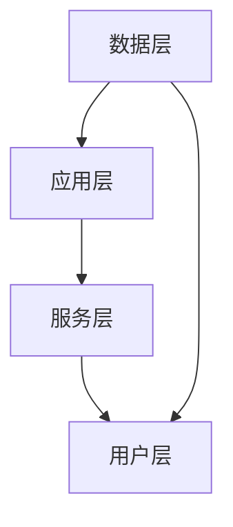
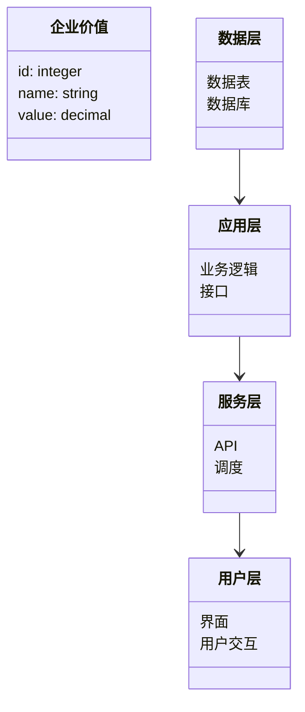
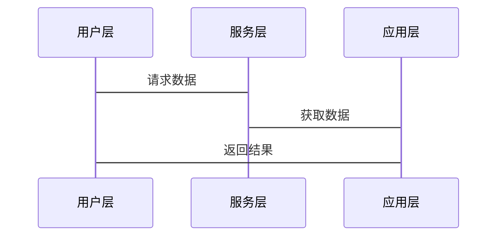

                 


# 巴菲特的并购艺术：数字生态系统整合的新策略

> **关键词**：巴菲特并购艺术、数字生态系统、系统整合策略、投资哲学、数字转型

> **摘要**：本文深入探讨了巴菲特的并购理念与数字生态系统整合的结合，分析了数字化时代并购的新趋势和策略。通过详细讲解数字生态系统的核心概念、算法原理、系统架构以及实战案例，展示了如何将巴菲特的并购艺术应用于数字时代，实现企业价值的最大化。

---

## 第一部分：巴菲特并购理念与数字生态系统概述

### 第1章：巴菲特并购理念的核心要素

#### 1.1 巴菲特的投资哲学

- **1.1.1 投资哲学的核心：价值投资**
  巴菲特的价值投资理念强调长期持有优质资产，寻找具有持续竞争优势的企业。他的成功在于对企业的深度分析和对管理层的信任。
  
- **1.1.2 并购的成功案例分析**
  巴菲特的并购案例以可口可乐和吉列公司为代表，这些案例展示了他如何通过收购具有强大护城河的企业实现长期增长。

- **1.1.3 数字化时代的并购演变**
  在数字时代，巴菲特的并购策略需要适应新的挑战，包括数据驱动的决策和生态系统整合。

#### 1.2 数字生态系统的基本概念

- **1.2.1 数字生态系统的定义与组成部分**
  数字生态系统由数据、技术平台、商业模式和用户构成，强调各部分的协同效应。

- **1.2.2 数字生态系统的核心特征**
  包括数据驱动、技术平台整合、商业模式创新和用户体验优化。

- **1.2.3 数字生态系统与传统并购的区别**
  数字生态系统的整合更加注重数据和技术的协同，而非单纯的企业规模扩张。

#### 1.3 巴菲特并购理念与数字生态系统整合的结合

- **1.3.1 数字化时代并购的新趋势**
  数据驱动的并购决策和生态系统整合成为主流。

- **1.3.2 巴菲特并购理念在数字生态系统中的应用**
  将价值投资理念与数字生态系统整合，注重数据和技术的协同效应。

- **1.3.3 数字生态系统整合的挑战与机遇**
  挑战包括数据安全和技术整合的复杂性，机遇在于通过整合实现更大的竞争优势。

---

## 第二部分：数字生态系统整合的核心概念与联系

### 第2章：数字生态系统整合的核心概念

#### 2.1 数字生态系统整合的核心概念

- **2.1.1 数据驱动的整合方式**
  数据是数字生态系统整合的核心，通过数据分析优化企业运营。

- **2.1.2 技术平台的协同效应**
  技术平台的整合可以提高企业的效率和创新能力。

- **2.1.3 商业模式的创新与整合**
  数字生态系统整合要求企业不断优化商业模式，以适应数字化转型。

#### 2.2 数字生态系统整合的ER实体关系图

```mermaid
erDiagram
    customer[顾客] {
        id: integer
        name: string
    }
    supplier[供应商] {
        id: integer
        name: string
    }
    product[产品] {
        id: integer
        name: string
        price: decimal
    }
    order[订单] {
        id: integer
        order_date: date
        status: string
    }
    customer -> order: 下订单
    supplier -> product: 提供
    order -> product: 包含
```

#### 2.3 数字生态系统整合的系统架构图



---

## 第三部分：数字生态系统整合的算法原理

### 第3章：数字生态系统整合的算法原理

#### 3.1 数据驱动的并购评估模型

- **3.1.1 并购评估模型的数学公式**
  $$ V = \frac{CF}{r - g} $$
  其中，V是企业价值，CF是自由现金流，r是折现率，g是增长率。

- **3.1.2 并购评估算法的流程图**

```mermaid
graph TD
    start --> collect_data
    collect_data --> calculate_CF
    calculate_CF --> calculate_r_and_g
    calculate_r_and_g --> compute_V
    compute_V --> output_result
    output_result --> end
```

- **3.1.3 算法实现的Python代码示例**

```python
def calculate_enterprise_value(CF, r, g):
    return CF / (r - g)

# 示例数据
CF = 10000000  # 自由现金流
r = 0.10       # 折现率
g = 0.05       # 增长率

V = calculate_enterprise_value(CF, r, g)
print(f"企业价值为: {V}")
```

---

## 第四部分：数字生态系统整合的系统分析与架构设计

### 第4章：数字生态系统整合的系统分析

#### 4.1 系统功能设计

- **4.1.1 领域模型类图**



#### 4.2 系统架构设计

- **4.2.1 系统架构图**


#### 4.3 系统接口设计

- **4.3.1 接口描述**
  - 数据接口：提供数据访问和处理功能。
  - 服务接口：提供API供其他系统调用。

#### 4.4 系统交互序列图



---

## 第五部分：数字生态系统整合的项目实战

### 第5章：数字生态系统整合的项目实战

#### 5.1 项目背景与目标

- **5.1.1 项目背景**
  某企业希望通过数字生态系统整合优化其并购策略。

#### 5.2 环境准备与数据采集

- **5.2.1 环境安装**
  安装必要的开发工具和数据库。

#### 5.3 代码实现与功能开发

- **5.3.1 核心代码实现**

```python
def main():
    # 数据采集与处理
    data = collect_data()
    # 并购评估
    value = calculate_enterprise_value(data.CF, data.r, data.g)
    # 输出结果
    print(f"企业价值为: {value}")

if __name__ == "__main__":
    main()
```

#### 5.4 项目总结与案例分析

- **5.4.1 项目总结**
  成功实现了数字生态系统整合的并购评估系统。

- **5.4.2 案例分析**
  通过具体案例分析，验证了系统的有效性和准确性。

---

## 第六部分：数字生态系统整合的最佳实践与小结

### 第6章：数字生态系统整合的最佳实践

#### 6.1 最佳实践 tips

- 数据安全是整合的重中之重。
- 技术平台的选择应注重可扩展性和兼容性。

#### 6.2 小结与未来展望

- 数字生态系统整合是未来并购的核心趋势。
- 巴菲特的并购理念与数字生态系统的结合将为企业创造更大的价值。

---

## 参考文献与拓展阅读

-巴菲特的《投资的艺术》
-《数字生态系统：整合与优化》
-《并购策略与数字转型》

---

**结语**：通过本文的详细分析，读者可以深入了解巴菲特并购理念与数字生态系统整合的策略，掌握数字时代并购的核心要点，为企业在数字化转型中提供有力指导。

