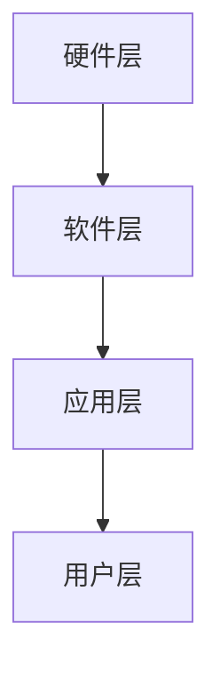

                 

# 巴菲特的并购艺术：量子科技生态系统的整合策略

## 关键词：巴菲特，并购艺术，量子科技，生态系统，整合策略

## 摘要：本文探讨了巴菲特的并购艺术在量子科技生态系统中的应用，分析了量子科技的核心概念与生态系统，详细讲解了巴菲特并购策略在量子科技中的整合方法，并通过实际案例分析了量子科技生态系统的整合策略。

---

# 第一部分: 巴菲特并购艺术概述

## 第1章: 巴菲特并购艺术的核心理念

### 1.1 巴菲特的投资哲学
巴菲特的投资哲学以“价值投资”为核心，强调长期持有优质资产，寻找具有强大护城河的企业。他的并购策略注重企业的财务健康、竞争优势和管理团队。

### 1.2 巴菲特并购的三大标准
1. **护城河**：企业必须具备独特的竞争优势，能够在市场上长期保持领先地位。
2. **管理层**：管理层必须诚实、有能力，并且以股东利益为重。
3. **财务健康**：企业必须具备稳健的财务状况，能够经受经济周期的考验。

### 1.3 巴菲特并购的三大要素
1. **企业护城河**：企业必须具备难以复制的核心竞争力。
2. **竞争优势**：企业在市场中的独特优势，如成本优势、技术优势等。
3. **财务健康状况**：企业的财务状况稳健，具备持续盈利能力。

### 1.4 巴菲特并购的三大工具
1. **财务杠杆**：通过合理的财务杠杆，优化资本结构，提升企业价值。
2. **股权结构优化**：通过调整股权结构，提升企业治理效率。
3. **股票回购**：通过股票回购，提升每股收益，增强股东价值。

---

## 第2章: 量子科技的核心概念与生态系统

### 2.1 量子科技的基本原理
量子科技基于量子力学的基本原理，包括量子叠加、量子纠缠和量子测量。量子计算利用这些原理，能够在某些特定领域实现比经典计算机更强的计算能力。

### 2.2 量子科技的核心技术
1. **量子计算**：利用量子比特进行并行计算，解决复杂问题。
2. **量子通信**：利用量子纠缠实现信息的超安全传输。
3. **量子传感**：利用量子技术进行高精度测量。

### 2.3 量子科技的生态系统
量子科技的生态系统包括量子计算平台、量子通信网络、量子传感器等，以及相关的软件、算法和应用。

### 2.4 量子科技的未来发展
量子科技的发展将推动信息技术的进步，改变许多行业，如金融、医疗、能源等。

---

## 第3章: 量子科技生态系统的整合策略

### 3.1 量子科技生态系统的整合模型
量子科技生态系统的整合模型包括硬件、软件、算法、应用和用户五个部分。

### 3.2 量子科技生态系统的整合方法
1. **技术整合**：将量子计算、量子通信等技术整合到现有系统中。
2. **行业应用**：将量子科技应用于金融、医疗、能源等领域。
3. **协同发展**：通过协同合作，推动量子科技的全面发展。

### 3.3 量子科技生态系统的整合案例
1. **IBM量子计算平台**：IBM通过其量子计算平台，为用户提供量子计算服务。
2. **谷歌量子计算平台**：谷歌通过其量子计算平台，展示了量子计算的潜力。
3. **英国量子通信网络**：英国通过量子通信网络，实现了超安全的信息传输。

---

## 第4章: 巴菲特并购艺术在量子科技中的应用

### 4.1 巴菲特并购艺术的核心要素在量子科技中的应用
1. **企业护城河**：量子科技企业必须具备强大的技术优势和市场优势。
2. **竞争优势**：量子科技企业必须具备独特的技术优势和市场地位。
3. **财务健康状况**：量子科技企业必须具备稳健的财务状况，能够支持长期的研发投入。

### 4.2 巴菲特并购策略在量子科技中的应用
1. **企业估值**：通过巴菲特的估值方法，评估量子科技企业的价值。
2. **风险管理**：通过巴菲特的风险管理策略，降低并购风险。
3. **企业整合**：通过巴菲特的整合策略，实现量子科技企业的协同发展。

### 4.3 巴菲特并购工具在量子科技中的应用
1. **财务杠杆**：通过合理的财务杠杆，优化量子科技企业的资本结构。
2. **股权结构优化**：通过调整股权结构，提升量子科技企业的治理效率。
3. **股票回购**：通过股票回购，提升量子科技企业的股东价值。

---

## 第5章: 量子科技生态系统整合的系统架构设计

### 5.1 量子科技生态系统的整体架构
量子科技生态系统的整体架构包括硬件层、软件层、应用层和用户层。

### 5.2 量子科技生态系统的功能设计
1. **硬件层**：包括量子计算机、量子通信设备等。
2. **软件层**：包括量子算法、量子编程框架等。
3. **应用层**：包括金融、医疗、能源等领域的量子应用。
4. **用户层**：包括开发者、企业和最终用户。

### 5.3 量子科技生态系统的架构图

---

## 第6章: 巴菲特并购艺术与量子科技的结合

### 6.1 巴菲特并购艺术的核心要素在量子科技中的应用
1. **企业护城河**：量子科技企业必须具备强大的技术优势和市场优势。
2. **竞争优势**：量子科技企业必须具备独特的技术优势和市场地位。
3. **财务健康状况**：量子科技企业必须具备稳健的财务状况，能够支持长期的研发投入。

### 6.2 巴菲特并购策略在量子科技中的应用
1. **企业估值**：通过巴菲特的估值方法，评估量子科技企业的价值。
2. **风险管理**：通过巴菲特的风险管理策略，降低并购风险。
3. **企业整合**：通过巴菲特的整合策略，实现量子科技企业的协同发展。

### 6.3 巴菲特并购工具在量子科技中的应用
1. **财务杠杆**：通过合理的财务杠杆，优化量子科技企业的资本结构。
2. **股权结构优化**：通过调整股权结构，提升量子科技企业的治理效率。
3. **股票回购**：通过股票回购，提升量子科技企业的股东价值。

---

## 第7章: 量子科技生态系统整合的系统架构设计

### 7.1 量子科技生态系统的整体架构
量子科技生态系统的整体架构包括硬件层、软件层、应用层和用户层。

### 7.2 量子科技生态系统的功能设计
1. **硬件层**：包括量子计算机、量子通信设备等。
2. **软件层**：包括量子算法、量子编程框架等。
3. **应用层**：包括金融、医疗、能源等领域的量子应用。
4. **用户层**：包括开发者、企业和最终用户。

### 7.3 量子科技生态系统的架构图

---

## 第8章: 巴菲特并购艺术与量子科技的结合

### 8.1 巴菲特并购艺术的核心要素在量子科技中的应用
1. **企业护城河**：量子科技企业必须具备强大的技术优势和市场优势。
2. **竞争优势**：量子科技企业必须具备独特的技术优势和市场地位。
3. **财务健康状况**：量子科技企业必须具备稳健的财务状况，能够支持长期的研发投入。

### 8.2 巴菲特并购策略在量子科技中的应用
1. **企业估值**：通过巴菲特的估值方法，评估量子科技企业的价值。
2. **风险管理**：通过巴菲特的风险管理策略，降低并购风险。
3. **企业整合**：通过巴菲特的整合策略，实现量子科技企业的协同发展。

### 8.3 巴菲特并购工具在量子科技中的应用
1. **财务杠杆**：通过合理的财务杠杆，优化量子科技企业的资本结构。
2. **股权结构优化**：通过调整股权结构，提升量子科技企业的治理效率。
3. **股票回购**：通过股票回购，提升量子科技企业的股东价值。

---

## 第9章: 量子科技生态系统整合的系统架构设计

### 9.1 量子科技生态系统的整体架构
量子科技生态系统的整体架构包括硬件层、软件层、应用层和用户层。

### 9.2 量子科技生态系统的功能设计
1. **硬件层**：包括量子计算机、量子通信设备等。
2. **软件层**：包括量子算法、量子编程框架等。
3. **应用层**：包括金融、医疗、能源等领域的量子应用。
4. **用户层**：包括开发者、企业和最终用户。

### 9.3 量子科技生态系统的架构图

---

## 第10章: 巴菲特并购艺术与量子科技的结合

### 10.1 巴菲特并购艺术的核心要素在量子科技中的应用
1. **企业护城河**：量子科技企业必须具备强大的技术优势和市场优势。
2. **竞争优势**：量子科技企业必须具备独特的技术优势和市场地位。
3. **财务健康状况**：量子科技企业必须具备稳健的财务状况，能够支持长期的研发投入。

### 10.2 巴菲特并购策略在量子科技中的应用
1. **企业估值**：通过巴菲特的估值方法，评估量子科技企业的价值。
2. **风险管理**：通过巴菲特的风险管理策略，降低并购风险。
3. **企业整合**：通过巴菲特的整合策略，实现量子科技企业的协同发展。

### 10.3 巴菲特并购工具在量子科技中的应用
1. **财务杠杆**：通过合理的财务杠杆，优化量子科技企业的资本结构。
2. **股权结构优化**：通过调整股权结构，提升量子科技企业的治理效率。
3. **股票回购**：通过股票回购，提升量子科技企业的股东价值。

---

## 第11章: 量子科技生态系统整合的系统架构设计

### 11.1 量子科技生态系统的整体架构
量子科技生态系统的整体架构包括硬件层、软件层、应用层和用户层。

### 11.2 量子科技生态系统的功能设计
1. **硬件层**：包括量子计算机、量子通信设备等。
2. **软件层**：包括量子算法、量子编程框架等。
3. **应用层**：包括金融、医疗、能源等领域的量子应用。
4. **用户层**：包括开发者、企业和最终用户。

### 11.3 量子科技生态系统的架构图

---

## 第12章: 结论与展望

### 12.1 本章总结
本文探讨了巴菲特的并购艺术在量子科技生态系统中的应用，分析了量子科技的核心概念与生态系统，详细讲解了巴菲特并购策略在量子科技中的整合方法，并通过实际案例分析了量子科技生态系统的整合策略。

### 12.2 未来展望
未来，随着量子科技的不断发展，巴菲特的并购艺术将在量子科技生态系统中发挥越来越重要的作用。量子科技企业需要具备强大的技术优势和市场优势，巴菲特的并购策略将为量子科技企业的整合提供重要的指导。

---

通过以上章节的详细分析，我们可以看到，巴菲特的并购艺术在量子科技生态系统中的应用具有重要的现实意义。量子科技企业需要具备强大的技术优势和市场优势，巴菲特的并购策略将为量子科技企业的整合提供重要的指导。

