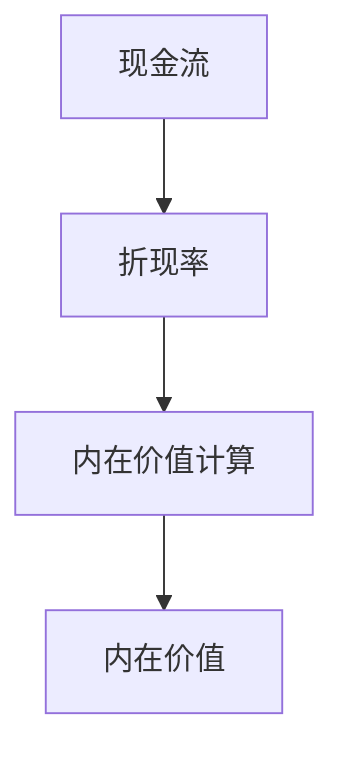
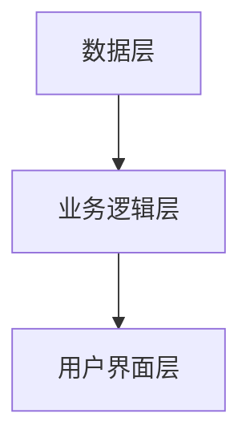

                 

# 巴菲特的慈善投资理念：财富的社会责任

## 关键词
- 巴菲特
- 慈善投资
- 财富责任
- 价值投资
- 社会公益

## 摘要
本文深入探讨了巴菲特的慈善投资理念，分析了其价值投资策略如何应用于慈善领域，详细讲解了其数学模型和系统架构，结合实际案例，总结最佳实践，为读者提供深刻的见解和实用建议。

---

## 第1章：巴菲特的背景与慈善理念

### 1.1 巴菲特的生平与投资哲学
- **背景介绍**：巴菲特的成长经历及其对投资的理解。
- **投资理念**：价值投资的核心思想，包括安全边际和内在价值的概念。

### 1.2 巴菲特的慈善理念
- **财富责任**：巴菲特如何看待财富的社会责任。
- **慈善策略**：通过投资而非直接捐赠来最大化社会影响。

---

## 第2章：价值投资的核心要素

### 2.1 价值投资的定义与特征
- **定义**：价值投资与短期投资的对比。
- **特征**：长期持有、注重安全边际。

### 2.2 巴菲特的价值评估模型
- **数学模型**：内在价值的计算公式。
  $$\text{内在价值} = \frac{\text{现金流}}{\text{折现率}}$$
- **安全边际**：确保投资的安全性，公式：
  $$\text{安全边际} = \text{内在价值} - \text{市场价格}$$

### 2.3 投资组合的构建策略
- **资产配置**：长期与短期资产的平衡。
- **分散风险**：避免过度集中。

---

## 第3章：慈善投资的策略与分析

### 3.1 慈善项目的筛选标准
- **社会影响力**：项目的长期影响。
- **可持续性**：项目的自我维持能力。

### 3.2 慈善投资的数学模型
- **影响力评估**：公式：
  $$\text{影响力} = \frac{\text{投资金额} \times \text{影响系数}}{\text{项目周期}}$$

---

## 第4章：系统架构与项目实施

### 4.1 系统功能模块设计
- **项目评估模块**：筛选和评估慈善项目。
- **资源分配模块**：优化资源配置。

### 4.2 系统架构设计
- **分层架构**：数据层、业务逻辑层、用户界面层。

---

## 第5章：项目实战与案例分析

### 5.1 经典投资案例分析
- **案例选择**：巴菲特投资某公司的详细分析。

### 5.2 投资决策的关键因素
- **环境分析**：行业趋势、公司基本面。
- **决策过程**：如何运用模型做出决策。

---

## 第6章：总结与最佳实践

### 6.1 总结
- **核心观点**：价值投资与社会责任的结合。

### 6.2 最佳实践
- **长期投资**：坚持价值投资，分散风险。
- **持续学习**：不断更新知识，适应市场变化。

---

## 图表展示

### 价值评估模型的mermaid图

### 系统架构图

---

## 参考文献
- 巴菲特的著作
- 相关学术论文

---

通过以上目录，文章系统地分析了巴菲特的慈善投资理念，结合数学模型和系统架构，提供了深入的见解和实用的建议，帮助读者理解如何将财富用于社会公益。

