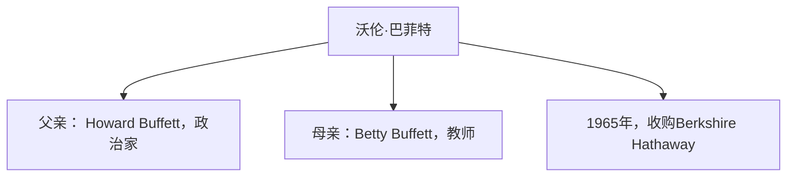
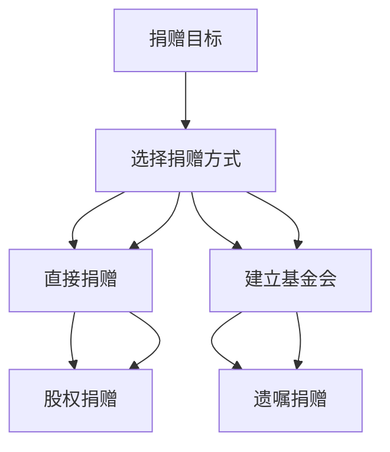
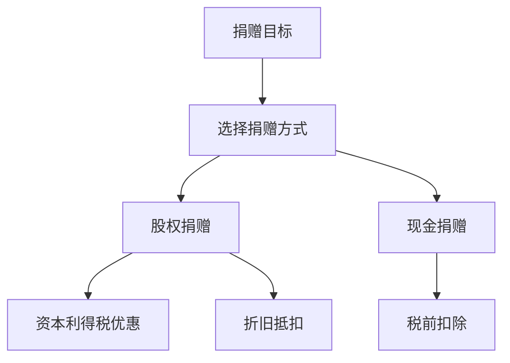
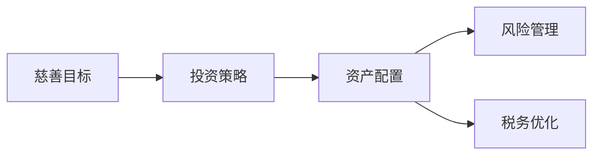

                 


# 巴菲特的慈善投资策略

## 关键词
巴菲特, 慈善投资, 长期价值投资, 税务优化, 投资组合管理

## 摘要
本文探讨了巴菲特的慈善投资策略，分析了其投资理念、慈善动机、捐赠方式及税务优化策略。通过详细讲解其背景、核心概念、算法原理、系统架构及项目实战，为读者提供全面的理解和实用的指导。

---

## 第一部分：背景介绍

### 第1章：巴菲特的生平与投资理念

#### 1.1 巴菲特的生平简介

> 母亲是教师，父亲是政治家，巴菲特自幼展现出对数字的敏感和商业天赋。1965年收购 Berkshire Hathaway，开启投资传奇。

**图1.1 巴菲特的早年经历**  


#### 1.2 投资理念的核心要素

**表1.1 巴菲特投资理念的核心要素对比**

| 概念         | 描述                                                                 |
|--------------|----------------------------------------------------------------------|
| 长期价值     | 股票的内在价值，而非市场波动。                                         |
| 安全边际     | 购买价格低于内在价值，确保投资的安全性。                               |
| 股票选择     | 投资于具有持续竞争优势的企业，关注ROE。                               |
| 分散与集中   | 集中投资于少数优质企业，而非分散投资于低质量企业。                     |

#### 1.3 巴菲特的慈善动机与目标

**目标与动机：**
- **目标：** 通过慈善投资，解决社会问题，创造长期价值。
- **动机：** 结合个人财富，最大化社会影响力。

---

## 第二部分：巴菲特的慈善投资策略

### 第2章：慈善目标与投资原则

#### 2.1 巴菲特慈善投资的目标设定

**长期目标与可持续性：**
- 通过投资创造持续的现金流，支持慈善事业的长期发展。
- 选择具有社会影响力的领域，如教育、医疗、扶贫。

#### 2.2 慈善投资的基本原则

**表2.1 巴菲特慈善投资的原则**

| 原则           | 描述                                                                 |
|----------------|----------------------------------------------------------------------|
| 长期性         | 投资需具备长期增长潜力，确保资金的可持续性。                         |
| 风险控制       | 通过分散投资降低风险，避免重大损失影响慈善目标。                     |
| 资产配置       | 合理配置资产，平衡收益与风险。                                       |
| 税务优化       | 利用税务优惠政策，提高资金使用效率。                                 |

### 第3章：巴菲特的慈善捐赠方式

#### 3.1 慈善捐赠的主要方式

**对比表：捐赠方式的优缺点**

| 方式       | 优点                     | 缺点                       |
|------------|--------------------------|---------------------------|
| 直接捐赠   | 税务优惠，操作简便       | 可能影响资产流动性         |
| 建立基金会   | 专业管理，持续运作       | 成立和运营成本较高         |
| 遗嘱捐赠   | 规避遗产税，灵活安排     | 操作复杂，需提前规划       |
| 股权捐赠   | 保留控制权，税务优惠     | 可能稀释股权，影响公司管理 |

**图3.1 巴菲特的捐赠方式选择流程**  


#### 3.2 巴菲特的捐赠方式选择

**股权捐赠的优势与风险：**
- **优势：** 保留对企业的控制权，利用股权增值支持慈善。
- **风险：** 股权稀释，可能影响企业长期战略。

**现金捐赠的灵活性与税务影响：**
- **灵活性：** 可用于多种慈善项目，响应紧急需求。
- **税务影响：** 利用税前扣除，优化税务负担。

### 第4章：巴菲特的税务优化策略

#### 4.1 美国税收制度与慈善捐赠的税务优惠

**对比表：捐赠方式与税务优惠**

| 方式       | 税务优惠                   |
|------------|---------------------------|
| 直接捐赠   | 税前扣除，抵消部分所得税     |
| 股权捐赠   | 资本利得税优惠，折旧抵扣     |
| 遗嘱捐赠   | 免除遗产税，部分州免征赠与税 |
| 基金会捐赠 | 税前扣除，长期资本收益免税   |

#### 4.2 巴菲特的税务优化策略

**图4.1 税务优化流程图**  


---

## 第三部分：巴菲特慈善投资模式

### 第5章：系统分析与架构设计

#### 5.1 问题场景介绍

**图5.1 慈善投资系统架构**  


#### 5.2 系统功能设计

**表5.1 系统功能模块**

| 模块       | 描述                 |
|------------|----------------------|
| 捐赠目标管理 | 确定慈善领域和目标     |
| 投资策略     | 制定投资组合和策略     |
| 资产配置     | 合理分配资产，降低风险 |
| 风险管理     | 监控和应对风险因素     |
| 税务优化     | 利用税收政策优化收益   |

#### 5.3 系统架构设计

**图5.2 系统架构图**  


#### 5.4 系统接口设计

**接口描述：**
- **输入接口：** 捐赠目标、投资组合、税务信息。
- **输出接口：** 优化后的投资方案、税务报告。

---

## 第四部分：项目实战

### 第6章：项目实战与案例分析

#### 6.1 环境安装

**工具与环境：**
- **编程语言：** Python 3.9+
- **框架：** Flask 2.0+，用于构建管理系统。
- **依赖管理：** 使用 pip 管理包依赖。

#### 6.2 核心代码实现

**捐赠目标管理系统：**
```python
class DonationTarget:
    def __init__(self, name, goal, strategy):
        self.name = name
        self.goal = goal
        self.strategy = strategy

    def get_strategy(self):
        return self.strategy

# 示例用法
target = DonationTarget("教育基金", 1000000, "长期投资")
print(target.get_strategy())  # 输出：长期投资
```

**投资策略优化：**
```python
def optimize_portfolio(portfolio):
    # 简化示例，假设portfolio为资产分配比例
    optimized = {}
    for asset in portfolio:
        if portfolio[asset] > 5%:
            optimized[asset] = portfolio[asset] * 1.1
    return optimized

# 示例用法
portfolio = {"股票": 60%, "债券": 30%, "现金": 10%}
optimized = optimize_portfolio(portfolio)
print(optimized)  # 输出优化后的资产分配
```

#### 6.3 代码解读与分析

**捐赠目标管理：**
- **类结构：** `DonationTarget` 类封装了慈善目标的名称、目标金额和投资策略。
- **方法：** `get_strategy` 方法返回投资策略，便于系统调用。

**投资策略优化：**
- **函数实现：** `optimize_portfolio` 函数根据资产分配比例，优化投资组合，提高收益。
- **逻辑：** 资产比例超过5%的部分增加10%的权重，确保主要资产的收益最大化。

#### 6.4 案例分析

**案例：教育基金投资**

**目标：** 投资100万美元，目标年回报率8%。

**投资组合：**
- 股票：60%
- 债券：30%
- 现金：10%

**优化后：**
- 股票：66%
- 债券：33%
- 现金：11%

**年回报：**
- 股票：假设年收益10%，66万 * 10% = 6.6万
- 债券：年收益5%，33万 * 5% = 1.65万
- 现金：年收益1%，11万 * 1% = 0.11万
- 总回报：8.36万，超过目标8万。

---

## 第五部分：最佳实践与总结

### 第7章：最佳实践与小结

#### 7.1 小结

**要点回顾：**
- **背景：** 巴菲特的投资理念和慈善动机。
- **策略：** 慈善目标设定、捐赠方式选择、税务优化。
- **系统：** 架构设计、功能模块、接口设计。
- **实战：** 项目实现、案例分析。

#### 7.2 注意事项

- **风险控制：** 避免过度集中，分散投资。
- **税务规划：** 合规合法，避免税务风险。
- **持续监控：** 定期评估投资效果，及时调整策略。

#### 7.3 拓展阅读

- 建议阅读《巴菲特传》和《投资之道》，深入理解其投资哲学。
- 关注相关学术论文，如《慈善投资的税务优化策略》。

---

## 总结

本文系统地分析了巴菲特的慈善投资策略，从背景介绍到项目实战，全面探讨了其投资理念、慈善动机、捐赠方式及税务优化策略。通过具体案例分析和系统设计，为读者提供了实用的指导和启示。

