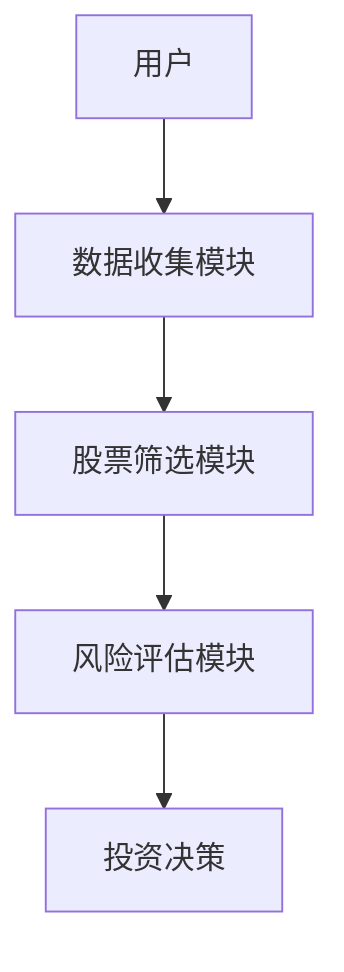

                 


# 巴菲特的成功秘诀：长期价值投资策略

> 关键词：巴菲特，价值投资，长期投资，内在价值，投资策略，经济护城河

> 摘要：本文深入分析了巴菲特的投资理念和长期价值投资策略，探讨了其成功的核心要素，包括安全边际、内在价值、经济护城河等关键概念，并结合数学模型和实际案例，详细阐述了如何在投资中应用这些策略。

---

# 第一部分：巴菲特的成功秘诀概述

## 第1章：巴菲特的投资理念

### 1.1 巴菲特的生平与投资哲学

沃伦·巴菲特是全球最著名的投资者之一，他的投资哲学深刻影响了全球投资者。巴菲特出生于1930年，早年通过阅读和实践积累了丰富的投资经验。他的投资理念基于价值投资，强调寻找具有强大内在价值的公司，并长期持有。

#### 1.1.1 巴菲特的生平
- 1930年出生，美国内布拉斯州。
- 1950年代开始投资，初期通过分析公司财务报表，寻找被市场低估的股票。
- 1957年与合伙人共同创立合伙公司，开始系统化投资。

#### 1.1.2 投资哲学
- 价值投资：寻找市场低估的股票，长期持有。
- 避免短期波动，注重公司基本面。
- 分散投资：通过投资不同行业的公司降低风险。

### 1.2 长期价值投资的核心原则

#### 1.2.1 长期投资的优势
- 避免频繁交易的交易成本。
- 享受复利效应，长期增长显著。
- 降低市场短期波动的影响。

#### 1.2.2 避免短期波动的策略
- 研究公司基本面，选择具有稳定增长的公司。
- 避免情绪化投资，坚持理性分析。

#### 1.2.3 巴菲特成功的关键因素
- 深入研究公司，寻找具有强大护城河的公司。
- 保持分散投资，降低风险。
- 长期持有，避免频繁交易。

---

## 第2章：价值投资的基本概念

### 2.1 价值投资的定义与特征

#### 2.1.1 价值投资的定义
价值投资是一种投资策略，强调以低于内在价值的价格购买优质股票，长期持有。

#### 2.1.2 与成长投资的对比
| 比较维度 | 价值投资 | 成长投资 |
|----------|-----------|----------|
| 投资目标 | 低估值股票 | 高增长公司 |
| 投资期限 | 长期 | 短期至中期 |
| 风险承受 | 较低 | 较高 |

#### 2.1.3 价值投资的核心要素
- 内在价值：公司未来现金流的现值。
- 安全边际：买入价格低于内在价值的部分，提供安全空间。
- 经济护城河：公司竞争优势，防止竞争对手侵蚀利润。

### 2.2 巴菲特的价值投资框架

#### 2.2.1 经济护城河
经济护城河是公司竞争优势的体现，包括成本优势、品牌优势、技术优势等。例如，可口可乐的全球品牌和分销网络是其强大的护城河。

#### 2.2.2 管理层的信任与能力
巴菲特认为，优秀的管理层能够带领公司持续创造价值。他倾向于投资管理层诚信且能力强的公司。

#### 2.2.3 财务稳健性
公司财务状况稳健，避免高负债和低现金流。例如，苹果公司通过强大的现金流支持持续研发。

---

## 第3章：长期投资的数学模型与分析

### 3.1 投资回报的数学模型

#### 3.1.1 复利计算公式
$$ FV = PV \times (1 + r)^n $$
其中，FV为终值，PV为现值，r为年收益率，n为投资年数。

#### 3.1.2 投资回报率的计算
$$ ROI = \frac{Net Profit}{Investment} \times 100\% $$

### 3.2 股票估值的关键指标

#### 3.2.1 市盈率（P/E）计算
$$ P/E = \frac{Price}{Earnings Per Share} $$

#### 3.2.2 市净率（P/B）计算
$$ P/B = \frac{Price}{Book Value Per Share} $$

---

## 第4章：投资决策的系统架构

### 4.1 投资决策系统的功能设计

#### 4.1.1 数据收集模块
- 从财务报表、新闻等多渠道收集数据。

#### 4.1.2 股票筛选模块
- 基于P/E、P/B等指标筛选低估股票。

#### 4.1.3 风险评估模块
- 分析市场风险、行业风险等，评估投资风险。

### 4.2 系统架构设计

#### 4.2.1 分层架构图


---

## 第5章：项目实战——巴菲特投资策略的应用

### 5.1 环境与工具安装

#### 5.1.1 财务分析工具的安装
- 使用Excel或Python进行数据分析。

### 5.2 核心实现代码

#### 5.2.1 股票筛选脚本
```python
def screen_stocks(stocks, pe_ratio, pb_ratio):
    selected = []
    for stock in stocks:
        if stock.pe < pe_ratio and stock.pb < pb_ratio:
            selected.append(stock)
    return selected

# 示例数据
stocks = [
    {'name': '苹果', 'pe': 15, 'pb': 2},
    {'name': '谷歌', 'pe': 18, 'pb': 3}
]
selected_stocks = screen_stocks(stocks, 20, 4)
print(selected_stocks)
```

### 5.3 案例分析

#### 5.3.1 投资苹果公司的分析
- 苹果公司拥有强大的品牌和技术创新能力，P/E和P/B均低于市场平均水平，具备投资价值。

---

## 第6章：最佳实践与小结

### 6.1 长期投资的最佳实践

#### 6.1.1 投资心态
- 长期持有，避免短期波动影响决策。

#### 6.1.2 分散投资
- 通过投资不同行业和公司分散风险。

#### 6.1.3 持续学习
- 关注行业动态，定期评估投资组合。

### 6.2 小结

长期价值投资是一种需要耐心和纪律的投资策略。通过深入分析公司基本面，寻找具有强大护城河的公司，并长期持有，投资者可以实现稳健的收益。巴菲特的成功证明了这一策略的有效性。

---

通过以上分析，我们可以看到，巴菲特的成功并非偶然，而是基于深入的价值投资理念和长期持有策略。读者可以通过系统学习和实践，逐步掌握这一投资方法，实现财务自由。

