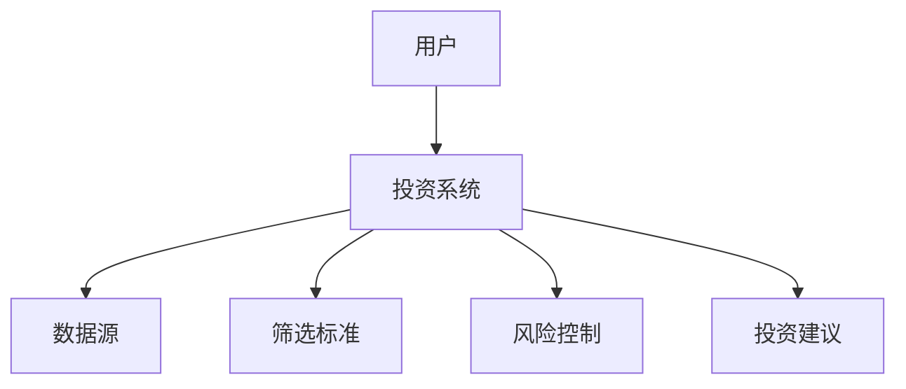
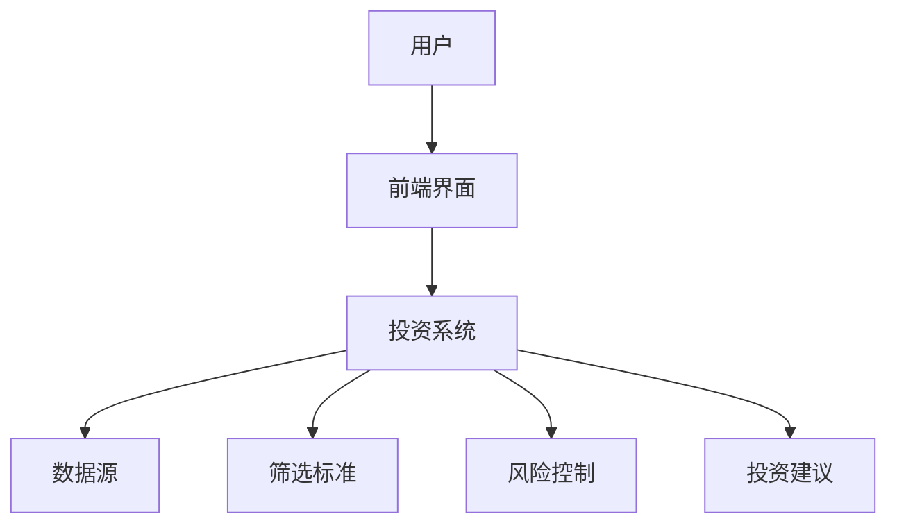
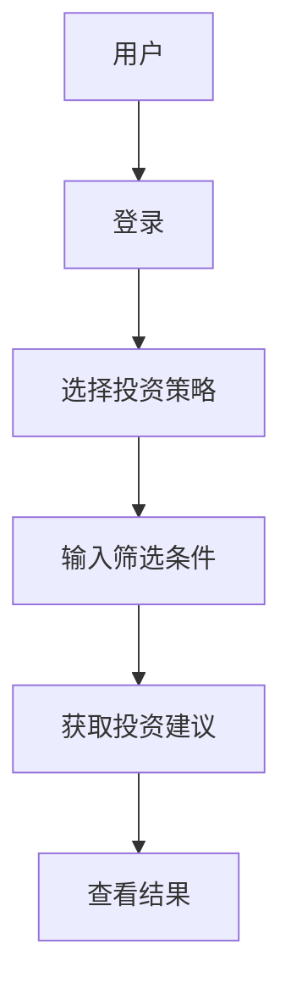

                 


# 巴菲特的投资checklist：系统化的选股流程

## 关键词：
- 巴菲特投资
- 选股流程
- 价值投资
- 安全边际
- 股票分析
- 投资策略

## 摘要：
本文详细解析了巴菲特的投资checklist，从背景介绍到实际应用，系统地阐述了巴菲特的选股流程。通过分析企业基本面、财务状况、竞争优势等核心要素，结合实际案例和系统架构设计，为投资者提供一套可操作的投资策略。

---

# 第一部分：巴菲特投资checklist的背景与基础

## 第1章：投资的基本概念

### 1.1 投资的基本定义

#### 1.1.1 投资的定义与分类
投资是指将资金投入某种资产或项目，以期望在未来获得收益的行为。投资可以分为以下几类：
- **股票投资**：通过购买公司股份成为股东，分享公司收益。
- **债券投资**：购买政府或企业发行的债券，定期获得利息。
- **房地产投资**：通过购买房地产资产获取租金收入或资本增值。
- **基金投资**：通过购买基金间接参与股票、债券等资产的投资。

#### 1.1.2 金融市场的基本结构
金融市场是资金流动和资产交易的场所，主要包括以下几个部分：
- **股票市场**：投资者买卖公司股份的地方。
- **债券市场**：投资者买卖政府或企业债券的地方。
- **外汇市场**：投资者买卖不同国家货币的场所。
- **衍生品市场**：交易期货、期权等衍生品的场所。

#### 1.1.3 投资者的角色与类型
投资者在金融市场中扮演着重要角色，主要包括以下几种类型：
- **机构投资者**：如基金公司、保险公司等。
- **个人投资者**：散户投资者，以个人名义进行投资。
- **长期投资者**：注重资产长期增值的投资者。
- **短期投资者**：追求短期收益的投资者。

---

### 1.2 巴菲特的生平与投资理念

#### 1.2.1 巴菲特的生平简介
沃伦·巴菲特（Warren Buffett）是美国著名投资者，被誉为“股神”。他于1934年出生在美国奥马哈市，毕业于哥伦比亚大学，后师从价值投资之父本杰明·格雷厄姆。巴菲特创立了伯克希尔·哈撒韦公司，并通过长期的价值投资策略积累了巨额财富。

#### 1.2.2 巴菲特的投资哲学
巴菲特的投资哲学可以概括为“价值投资”。他强调以下几点：
1. **寻找具有持续竞争优势的企业**：选择那些在行业中具有竞争优势，能够长期盈利的企业。
2. **安全边际**：在投资时，确保买入价格低于企业的内在价值，留有安全边际。
3. **长期持有**：避免频繁交易，长期持有优质资产，获取复利效应。

#### 1.2.3 巴菲特的成功案例
巴菲特的成功案例包括：
- **可口可乐**：巴菲特长期持有可口可乐的股票，因为其具有强大的品牌优势和持续的盈利能力。
- **美国运通**：巴菲特投资美国运通时，该公司面临信用卡行业的激烈竞争，但巴菲特认为其品牌优势和客户忠诚度是长期竞争优势的体现。

---

## 第2章：价值投资的核心理念

### 2.1 价值投资的定义与特点

#### 2.1.1 价值投资的定义
价值投资是一种投资策略，强调以低于企业内在价值的价格买入优质资产。巴菲特认为，市场先生的情绪波动为理性投资者提供了低价买入优质资产的机会。

#### 2.1.2 价值投资的核心特点
价值投资的核心特点包括：
- **注重基本面分析**：关注企业的财务状况、盈利能力、竞争优势等。
- **长期投资**：避免短期市场的波动，关注企业的长期价值。
- **安全边际**：买入价格低于内在价值，确保投资的安全性。

#### 2.1.3 价值投资与其它投资策略的对比
与技术分析和趋势投资不同，价值投资注重企业的内在价值，而非市场的短期波动。价值投资者更关注企业的基本面，寻找被市场低估的资产。

---

### 2.2 安全边际的概念

#### 2.2.1 安全边际的定义
安全边际是指买入价格低于企业内在价值的部分。巴菲特认为，安全边际的存在可以降低投资的风险，确保在市场波动中依然能够获得收益。

#### 2.2.2 安全边际的重要性
安全边际的重要性体现在以下几点：
- **降低投资风险**：通过安全边际，确保即使市场波动，投资者也不会亏损。
- **提高投资收益**：通过安全边际，投资者能够在市场低估时买入优质资产，长期获得超额收益。

#### 2.2.3 如何计算安全边际
安全边际的计算公式如下：
$$ \text{安全边际} = \text{内在价值} - \text{市场价格} $$

---

## 第3章：巴菲特投资checklist概述

### 3.1 投资checklist的定义

#### 3.1.1 投资checklist的定义
投资checklist是指投资者在选股过程中，根据企业的基本面、财务状况、竞争优势等因素，制定的一套筛选标准。

#### 3.1.2 投资checklist的作用
投资checklist的作用包括：
- **提高选股效率**：通过标准化的筛选流程，快速识别潜在投资标的。
- **降低投资风险**：通过系统化的筛选，避免遗漏重要的风险因素。

#### 3.1.3 投资checklist的分类
投资checklist可以根据不同的标准进行分类，主要包括以下几种：
- **基本面 checklist**：关注企业的盈利能力、财务状况等。
- **技术面 checklist**：关注股票的价格走势、成交量等。
- **行业 checklist**：关注企业的行业地位、竞争优势等。

---

### 3.2 巴菲特投资checklist的核心要素

#### 3.2.1 企业基本面分析
企业基本面分析包括以下几点：
- **收入与利润**：关注企业的收入来源和利润水平。
- **财务健康状况**：关注企业的资产负债表、利润表等财务报表。
- **竞争优势**：关注企业的行业地位、品牌影响力等。

#### 3.2.2 财务状况评估
财务状况评估包括以下几点：
- **资产结构**：关注企业的资产构成，如流动资产、非流动资产等。
- **负债水平**：关注企业的债务情况，如短期负债、长期负债等。
- **盈利能力**：关注企业的净利润率、ROE等指标。

#### 3.2.3 竞争优势分析
竞争优势分析包括以下几点：
- **行业地位**：关注企业在行业中的地位，如是否为龙头公司。
- **品牌影响力**：关注企业的品牌价值和市场认可度。
- **创新能力**：关注企业的研发能力和创新能力。

#### 3.2.4 管理团队评估
管理团队评估包括以下几点：
- **管理团队的稳定性**：关注管理团队是否稳定，是否有频繁的人员变动。
- **管理团队的能力**：关注管理团队的行业经验和领导能力。

#### 3.2.5 行业地位分析
行业地位分析包括以下几点：
- **行业前景**：关注行业的发展趋势和增长潜力。
- **行业集中度**：关注行业中的竞争格局，如是否为寡头垄断市场。

#### 3.2.6 市场风险评估
市场风险评估包括以下几点：
- **宏观经济环境**：关注宏观经济环境对企业的影响。
- **政策风险**：关注政策变化对企业的影响。

---

## 第4章：巴菲特投资checklist的详细分析

### 4.1 企业基本面分析

#### 4.1.1 企业的商业模式
商业模式是企业获取收入和利润的核心方式。例如，可口可乐的商业模式是通过销售饮料获取收入，而亚马逊的商业模式是通过电子商务平台销售商品。

#### 4.1.2 企业的市场地位
市场地位是指企业在行业中的地位，包括市场份额、品牌影响力等。例如，苹果公司在科技行业具有强大的市场地位和品牌影响力。

#### 4.1.3 企业的竞争优势
竞争优势是指企业在行业中相对于竞争对手的独特优势。例如，麦当劳的竞争优势在于其全球品牌影响力和高效的供应链管理。

---

### 4.2 财务状况评估

#### 4.2.1 财务报表分析
财务报表分析是评估企业财务状况的重要手段，主要包括资产负债表、利润表和现金流量表。

- **资产负债表**：反映企业的资产、负债和所有者权益。
- **利润表**：反映企业的收入、成本和利润。
- **现金流量表**：反映企业的现金流入和流出情况。

#### 4.2.2 财务比率分析
财务比率分析是评估企业财务状况的重要工具，主要包括以下几种比率：
- **流动比率**：流动资产与流动负债的比值，用于评估企业的短期偿债能力。
- **速动比率**：速动资产与流动负债的比值，用于评估企业的短期偿债能力。
- **ROE（净资产收益率）**：净利润与所有者权益的比值，用于评估企业的盈利能力。

#### 4.2.3 财务健康状况评估
财务健康状况评估包括以下几点：
- **债务水平**：关注企业的债务是否过高，是否影响企业的偿债能力。
- **现金流状况**：关注企业的现金流是否健康，是否能够支持企业的日常运营。

---

### 4.3 竞争优势分析

#### 4.3.1 企业的核心竞争力
企业的核心竞争力是指企业在行业中相对于竞争对手的独特优势。例如，苹果公司的核心竞争力在于其创新能力和品牌影响力。

#### 4.3.2 企业的竞争优势
竞争优势分析包括以下几点：
- **成本优势**：企业是否在成本控制方面具有优势。
- **技术优势**：企业是否在技术研发方面具有优势。
- **市场优势**：企业是否在市场占有率方面具有优势。

---

## 第5章：巴菲特投资checklist的系统架构设计

### 5.1 系统功能设计

#### 5.1.1 领域模型
领域模型是系统设计的重要工具，用于描述系统的功能和数据流。以下是一个简单的领域模型示意图：



---

### 5.2 系统架构设计

#### 5.2.1 系统架构图
系统架构图是系统设计的重要工具，用于描述系统的整体架构。以下是一个简单的系统架构图：



---

### 5.3 系统接口设计

#### 5.3.1 数据接口
数据接口是系统与外部数据源交互的接口，主要包括以下几种类型：
- **API接口**：通过API获取实时数据。
- **数据库接口**：通过数据库查询历史数据。

#### 5.3.2 用户接口
用户接口是系统与用户交互的界面，主要包括以下几种类型：
- **Web界面**：通过网页进行交互。
- **移动应用界面**：通过移动应用进行交互。

---

### 5.4 系统交互设计

#### 5.4.1 交互流程图
交互流程图是系统设计的重要工具，用于描述用户的操作流程。以下是一个简单的交互流程图：



---

## 第6章：项目实战

### 6.1 环境安装

#### 6.1.1 安装Python
Python是一种常用编程语言，支持多种金融数据分析库。安装Python可以通过官方网站下载安装包。

#### 6.1.2 安装金融数据分析库
常用的金融数据分析库包括：
- **pandas**：用于数据处理。
- **numpy**：用于数值计算。
- **matplotlib**：用于数据可视化。
- **yfinance**：用于获取股票数据。

---

### 6.2 核心实现源代码

#### 6.2.1 数据获取
以下代码用于获取股票数据：

```python
import yfinance as yf
import pandas as pd

# 下载股票数据
msft = yf.download('MSFT', start='2020-01-01', end='2023-01-01')
```

#### 6.2.2 数据分析
以下代码用于分析股票数据：

```python
import pandas as pd
import numpy as np

# 计算移动平均线
msft['MA_50'] = msft['Close'].rolling(50).mean()
msft['MA_200'] = msft['Close'].rolling(200).mean()
```

#### 6.2.3 数据可视化
以下代码用于可视化股票数据：

```python
import matplotlib.pyplot as plt

# 绘制股价走势图
plt.figure(figsize=(12, 6))
plt.plot(msft['Close'], label='Close Price')
plt.plot(msft['MA_50'], label='50-day MA')
plt.plot(msft['MA_200'], label='200-day MA')
plt.legend()
plt.show()
```

---

### 6.3 投资组合管理

#### 6.3.1 投资组合构建
投资组合构建需要考虑以下几点：
- **资产配置**：根据风险偏好和投资目标进行资产配置。
- **风险分散**：通过分散投资降低风险。

#### 6.3.2 风险控制
风险控制需要考虑以下几点：
- **止损策略**：设定止损点，避免亏损过大。
- **定期 rebalancing**：定期调整投资组合，保持资产配置合理。

---

### 6.4 投资策略应用

#### 6.4.1 实际案例分析
以下是一个实际案例分析：

```python
import yfinance as yf
import pandas as pd

# 下载股票数据
msft = yf.download('MSFT', start='2020-01-01', end='2023-01-01')
```

---

## 第7章：总结与展望

### 7.1 总结
巴菲特的投资checklist是一种系统化的选股流程，通过分析企业的基本面、财务状况、竞争优势等因素，帮助投资者识别优质资产。投资checklist的应用可以提高选股效率，降低投资风险。

### 7.2 展望
未来，随着人工智能和大数据技术的发展，投资checklist将更加智能化和自动化。投资者可以通过算法和模型，快速筛选出优质资产，实现更高效的投资。

---

### 7.3 小结
巴菲特的投资checklist是一种科学的投资方法，通过系统化的分析和筛选，帮助投资者实现长期稳健的投资收益。投资者在应用投资checklist时，需要结合实际情况，灵活调整筛选标准，以适应市场的变化。

---

### 7.4 最佳实践 Tips

#### 7.4.1 持续学习
投资是一个不断学习的过程，投资者需要不断关注市场动态，学习新的投资知识。

#### 7.4.2 避免情绪化投资
投资者在投资过程中，需要避免情绪化投资，保持冷静和理性。

#### 7.4.3 分散投资
通过分散投资，降低投资风险，避免过度依赖单一资产。

---

### 7.5 注意事项

#### 7.5.1 风险提示
投资有风险，投资者需要充分认识到市场的波动性和不确定性。

#### 7.5.2 信息来源
投资者需要确保信息来源的可靠性，避免受到虚假信息的影响。

---

### 7.6 拓展阅读

#### 7.6.1 推荐书籍
- 《巴菲特致股东的信》
- 《价值投资实战》

#### 7.6.2 推荐网站
- [ Berkshire Hathaway](https://www.berkshirehathaway.com/)
- [ Yahoo Finance](https://finance.yahoo.com/)

---

### 7.7 思考与实践

#### 7.7.1 投资心态
投资者需要保持耐心和信心，避免被市场的短期波动所影响。

#### 7.7.2 投资纪律
投资者需要严格遵守投资纪律，坚持投资策略，避免随意更改。

---

通过以上详细的分析和讲解，我们系统地了解了巴菲特的投资checklist，并掌握了如何在实际投资中应用这些筛选标准。希望本文能为投资者提供有价值的参考和指导。

