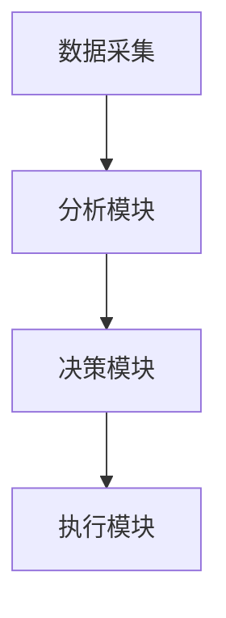

                 


# 巴菲特的投资哲学：在市场恐慌时贪婪

> 关键词：巴菲特，价值投资，市场恐慌，投资哲学，内在价值，安全边际，逆向投资

> 摘要：本文深入探讨了巴菲特的投资哲学，特别是他在市场恐慌时的贪婪策略。通过分析价值投资的核心概念、市场情绪的影响以及逆向投资的策略，结合数学模型和算法流程图，展示了如何在技术领域应用这些投资哲学。文章还包括了基于Python的投资组合优化实战项目，帮助读者理解如何将巴菲特的哲学转化为实际投资策略。

---

# 第1章: 巴菲特投资哲学的核心思想

## 1.1 巴菲特的生平与投资理念

### 1.1.1 巴菲特的生平简介
沃伦·巴菲特（Warren Buffett）是世界上最著名的投资者之一，被誉为“股神”。他于1934年出生在美国内布拉斯州，毕业于哥伦比亚大学，师从本杰明·格雷厄姆（Benjamin Graham）。巴菲特的投资哲学深受格雷厄姆的影响，形成了他独特的价值投资理念。

### 1.1.2 巴菲特的投资理念概述
巴菲特的投资理念可以概括为“价值投资”，即以低于内在价值的价格买入优质资产并长期持有。他认为市场波动是投资的机会，而不是风险。

### 1.1.3 巴菲特投资哲学的核心原则
1. **安全边际**：买入价格低于内在价值，以确保有足够的安全空间。
2. **长期持有**：避免频繁交易，减少交易成本和税收。
3. **分散投资**：通过分散投资降低风险，但不要过度分散。
4. **关注基本面**：分析公司的财务报表，选择具有强大护城河和良好管理的公司。

---

## 1.2 价值投资的基本概念

### 1.2.1 价值投资的定义
价值投资是一种投资策略，强调以低于公司内在价值的价格买入股票。这种策略认为市场往往会出现非理性波动，导致股票价格与公司实际价值出现偏差。

### 1.2.2 价值投资的核心要素
1. **内在价值**：公司未来现金流的现值。
2. **市场价值**：市场交易中股票的价格。
3. **安全边际**：买入价格与内在价值之间的差距。

### 1.2.3 价值投资与其他投资策略的对比
| 投资策略 | 核心思想 | 适用场景 | 优缺点 |
|----------|----------|----------|--------|
| 价值投资 | 买入低于内在价值的股票 | 市场恐慌或低估时 | 需要深入分析，长期持有 |
| 技术分析 | 通过价格和成交量预测未来走势 | 市场波动频繁 | 易受市场情绪影响 |

---

## 1.3 巴菲特的投资策略

### 1.3.1 购买优质资产的原则
巴菲特强调选择具有强大竞争优势（即“护城河”）和良好管理的公司。例如，他长期持有可口可乐和苹果，因为这些公司具有稳定的现金流和品牌优势。

### 1.3.2 长期持有与分散投资
巴菲特倡导长期持有优质资产，避免频繁交易。同时，他建议分散投资以降低风险，但不要过度分散，以免稀释收益。

### 1.3.3 安全边际的概念
安全边际是巴菲特价值投资的核心概念之一。他建议投资者买入价格低于内在价值的股票，以确保即使市场波动，也能获得超额收益。

---

## 1.4 巴菲特投资哲学的现代应用

### 1.4.1 现代市场环境下的价值投资
在现代市场中，价值投资依然适用。投资者需要关注公司的基本面，尤其是现金流和盈利能力。

### 1.4.2 巴菲特哲学对个人投资者的启示
个人投资者应注重长期投资，避免被短期市场波动影响情绪。同时，要深入研究公司基本面，选择优质资产。

### 1.4.3 巴菲特哲学对机构投资者的影响
机构投资者可以借鉴巴菲特的策略，通过分散投资和长期持有优质资产，降低风险并实现稳定收益。

---

## 1.5 本章小结
本章介绍了巴菲特的投资哲学，强调了价值投资的核心原则和策略。通过分析市场恐慌时的贪婪策略，投资者可以在市场低估时买入优质资产，实现长期收益。

---

# 第2章: 价值投资的理论基础

## 2.1 股票的内在价值

### 2.1.1 内在价值的定义
内在价值是股票的真正价值，与市场波动无关。它基于公司未来的现金流折现值计算。

### 2.1.2 内在价值的计算方法
$$ V = \frac{CF}{r - g} $$
其中，\( CF \) 是未来现金流，\( r \) 是折现率，\( g \) 是增长率。

### 2.1.3 内在价值与市场价值的对比
| 指标 | 内在价值 | 市场价值 |
|------|----------|----------|
| 计算方式 | 现金流折现 | 市场交易价格 |
| 影响因素 | 公司基本面 | 市场情绪 |

---

## 2.2 安全边际的概念与应用

### 2.2.1 安全边际的定义
安全边际是买入价格与内在价值之间的差额，确保即使市场波动，投资者也能获得超额收益。

### 2.2.2 安全边际的计算公式
$$ MS = V - P $$
其中，\( MS \) 是安全边际，\( V \) 是内在价值，\( P \) 是市场价。

### 2.2.3 安全边际在投资决策中的作用
- 确保投资的安全性。
- 降低市场波动对投资组合的影响。

---

## 2.3 财务报表分析与投资决策

### 2.3.1 财务报表分析的基本方法
分析财务报表时，重点关注利润表、资产负债表和现金流量表。

### 2.3.2 财务指标在价值投资中的应用
- **ROE**：$$ ROE = \frac{\text{净利润}}{\text{股东权益}} $$
- **毛利率**：$$ 毛利率 = \frac{\text{营业收入} - \text{营业成本}}{\text{营业收入}} $$

---

## 2.4 价值投资的数学模型

### 2.4.1 内在价值计算的数学公式
$$ V = \frac{CF}{r - g} $$

### 2.4.2 安全边际的计算公式
$$ MS = V - P $$

### 2.4.3 财务指标分析的数学模型
$$ ROE = \frac{\text{净利润}}{\text{股东权益}} $$

---

## 2.5 本章小结
本章详细介绍了价值投资的理论基础，包括内在价值、安全边际和财务报表分析。通过数学模型和公式，投资者可以更好地理解和应用这些概念。

---

# 第3章: 市场情绪与逆向投资

## 3.1 市场情绪的定义与影响

### 3.1.1 市场情绪的定义
市场情绪是投资者对市场的整体看法，通常由贪婪和恐惧驱动。

### 3.1.2 市场情绪的影响因素
- 市场波动
- 经济数据
- 公司业绩

### 3.1.3 市场情绪与投资决策的关系
市场情绪会影响股票价格，但理性投资者应避免被情绪左右。

---

## 3.2 逆向投资的策略与原则

### 3.2.1 逆向投资的定义
逆向投资是在市场恐慌时买入，市场狂热时卖出。

### 3.2.2 逆向投资的原则
- 买入低估资产
- 卖出高估资产

### 3.2.3 逆向投资的风险与机会
- 风险：短期可能亏损
- 机会：长期收益潜力大

---

## 3.3 巴菲特的逆向投资策略

### 3.3.1 巴菲特的恐慌时贪婪策略
巴菲特在市场恐慌时买入优质资产，因为他认为恐慌会导致价格低估。

### 3.3.2 巴菲特逆向投资的经典案例
- 2008年金融危机期间，巴菲特大量买入高盛和美国银行的股票。

### 3.3.3 逆向投资的实施步骤
1. 分析市场情绪
2. 识别低估资产
3. 买入并持有

---

## 3.4 本章小结
本章探讨了市场情绪对投资的影响，并详细介绍了逆向投资策略。通过巴菲特的案例，投资者可以理解如何在市场恐慌时贪婪。

---

# 第4章: 投资组合管理与风险管理

## 4.1 投资组合管理的核心思想

### 4.1.1 投资组合管理的定义
投资组合管理是通过优化资产配置，实现收益与风险的平衡。

### 4.1.2 投资组合管理的目标
- 最大化收益
- 最小化风险

---

## 4.2 投资组合优化的数学模型

### 4.2.1 投资组合优化问题
$$ \text{最大化 } \mu \text{，最小化 } \sigma $$
其中，\( \mu \) 是收益，\( \sigma \) 是风险。

### 4.2.2 投资组合优化的算法
使用均值-方差优化模型，通过Python实现：

```python
import numpy as np
from scipy.optimize import minimize

# 假设 returns 是资产的收益数组
def portfolio_optimization(returns):
    n = len(returns)
    mean_return = np.mean(returns, axis=0)
    cov_matrix = np.cov(returns)
    
    # 定义优化目标函数
    def objective(weights):
        return np.dot(weights, mean_return)
    
    # 定义约束条件
    constraints = [{'type': 'eq', 'fun': lambda w: sum(w) - 1},
                   {'type': 'ineq', 'fun': lambda w: w[i] >= 0 for i in range(n)}]
    
    # 使用SLSQP求解
    result = minimize(objective, np.ones(n)/n, method='SLSQP', constraints=constraints)
    return result.x

# 示例
returns = np.array([[0.1, 0.2, 0.15],
                   [0.05, 0.1, 0.08],
                   [0.15, 0.25, 0.2]])
weights = portfolio_optimization(returns)
print(weights)
```

---

## 4.3 风险管理的策略与技巧

### 4.3.1 风险管理的定义
风险管理是识别、评估和控制投资风险的过程。

### 4.3.2 风险管理的策略
- 分散投资
- 设置止损
- 定期评估

---

## 4.4 本章小结
本章介绍了投资组合管理和风险管理的核心思想，并通过Python代码展示了投资组合优化的实现。

---

# 第5章: 投资心理与行为

## 5.1 投资心理的定义与影响

### 5.1.1 投资心理的定义
投资心理是投资者在决策过程中表现出的心理特征。

### 5.1.2 投资心理的影响因素
- 市场情绪
- 个人经验
- 社会影响

---

## 5.2 投资行为的分析与改进

### 5.2.1 投资行为的分析
- 过度自信
- 从众心理
- 拖延决策

### 5.2.2 改进投资行为的技巧
- 保持理性
- 定期复盘
- 建立投资计划

---

## 5.3 巴菲特的投资心理

### 5.3.1 巴菲特的投资心理特点
- 理性决策
- 长期思维

### 5.3.2 巴菲特对投资者的心理建议
- 避免情绪化决策
- 保持耐心

---

## 5.4 本章小结
本章分析了投资心理与行为对投资决策的影响，并提出了改进投资行为的建议。

---

# 第6章: 投资哲学的系统架构

## 6.1 投资系统的整体架构

### 6.1.1 系统架构概述
投资系统包括数据采集、分析、决策和执行四个模块。

### 6.1.2 系统功能设计
- 数据采集模块：收集市场数据
- 分析模块：评估资产价值
- 决策模块：制定投资策略
- 执行模块：下单交易

### 6.1.3 系统架构图


---

## 6.2 系统接口设计

### 6.2.1 接口定义
- 数据接口：获取市场数据
- 分析接口：评估资产价值
- 决策接口：制定投资策略
- 执行接口：下单交易

---

## 6.3 本章小结
本章通过系统架构图展示了投资系统的整体结构，并详细介绍了各模块的功能和接口设计。

---

# 第7章: 投资哲学的实战项目

## 7.1 环境安装与配置

### 7.1.1 Python环境安装
安装Python和必要的库（Pandas, NumPy, Matplotlib）。

### 7.1.2 数据源配置
选择股票数据源（如Yahoo Finance）。

---

## 7.2 核心实现代码

### 7.2.1 投资组合优化代码
```python
import pandas as pd
import numpy as np
from scipy.optimize import minimize

def portfolio_optimization(returns):
    n = len(returns.columns)
    returns_mean = returns.mean()
    covariance = returns.cov()
    
    # 定义优化函数
    def objective(weights):
        return -np.dot(weights, returns_mean)
    
    # 定义约束条件
    constraints = [{'type': 'eq', 'fun': lambda w: sum(w) - 1},
                   {'type': 'ineq', 'fun': lambda w: w[i] >= 0 for i in range(n)}]
    
    # 初始权重
    initial_weights = np.array([1/n]*n)
    
    # 使用SLSQP方法优化
    result = minimize(objective, initial_weights, method='SLSQP', constraints=constraints)
    return result.x

# 示例
data = pd.read_csv('stock_data.csv')
returns = data.pct_change().dropna()
weights = portfolio_optimization(returns)
print(weights)
```

---

## 7.3 项目实战分析

### 7.3.1 项目背景
假设我们有三只股票，目标是优化投资组合。

### 7.3.2 代码实现
使用上述代码优化投资组合。

### 7.3.3 结果分析
分析优化后的权重，选择最优资产配置。

---

## 7.4 本章小结
本章通过实战项目展示了如何将巴菲特的投资哲学转化为技术实现，通过Python代码优化投资组合。

---

# 第8章: 总结与展望

## 8.1 总结
本文深入探讨了巴菲特的投资哲学，特别是市场恐慌时的贪婪策略。通过分析价值投资、市场情绪和投资组合管理，结合技术方法，展示了如何在实际投资中应用这些理念。

---

## 8.2 未来展望
未来，投资者可以进一步研究人工智能在投资决策中的应用，结合巴菲特的投资哲学，开发更智能的投资系统。

---

# 结语
巴菲特的投资哲学不仅是投资的成功之道，也是技术领域的重要启示。通过本文的分析，读者可以更好地理解如何在市场恐慌时保持理性，实现长期收益。

