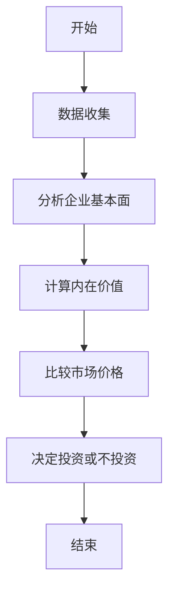

                 


# 巴菲特的投资哲学：简单但不容易

> 关键词：巴菲特, 投资哲学, 价值投资, 安全边际, 内在价值

> 摘要：本文深入探讨了巴菲特的投资哲学，分析了其核心概念和数学模型，展示了如何通过系统化的方法实现长期价值投资。从背景介绍到实战案例，逐步拆解巴菲特的投资智慧，揭示其简单背后的深刻逻辑。

---

## 第一部分: 巴菲特的投资哲学概述

## 第1章: 巴菲特投资哲学的背景与核心概念

### 1.1 投资哲学的背景与演变

#### 1.1.1 传统投资理论的局限性
传统投资理论，如技术分析和短期交易策略，往往依赖市场波动和价格走势，但这种方法在长期投资中表现不稳定。投资者容易受到市场情绪的影响，难以实现稳定收益。

#### 1.1.2 巴菲特投资哲学的起源与演变
巴菲特的投资哲学起源于价值投资理论，由本杰明·格雷厄姆提出。巴菲特在老师的理论基础上，结合自己的实践，发展出一套以长期持有、安全边际为核心的投资策略。

#### 1.1.3 价值投资与长期投资的核心理念
价值投资强调购买低于其内在价值的资产，长期持有，等待市场的合理定价。这种策略要求投资者具备深刻的企业分析能力，以及对市场波动的耐心。

### 1.2 巴菲特投资哲学的核心概念

#### 1.2.1 安全边际的定义与作用
安全边际是指股票的市场价格低于其内在价值的部分。通过安全边际，投资者可以降低投资风险，确保在市场波动中依然能够获得收益。

#### 1.2.2 内在价值的计算与市场定价
内在价值是企业未来现金流的现值。市场定价可能偏离内在价值，投资者的任务是找到这种偏离，利用价差获利。

#### 1.2.3 股东权益与企业价值的关联
股东权益是企业价值的重要组成部分，巴菲特通过分析企业的财务状况，评估其长期盈利能力，从而决定投资价值。

### 1.3 巴菲特投资哲学的核心要素对比

#### 1.3.1 价值投资与成长投资的对比分析
价值投资注重安全边际和内在价值，而成长投资注重企业的成长潜力。两者各有优缺点，巴菲特更倾向于结合两者的优势进行投资。

#### 1.3.2 投资者心理与市场行为的关系
投资者心理是市场波动的主要原因，巴菲特强调理性投资，避免情绪化决策。

#### 1.3.3 安全边际与风险控制的数学模型
安全边际的计算公式为：$$ 安全边际 = 内在价值 - 市场价格 $$

---

## 第2章: 巴菲特投资哲学的核心原理

### 2.1 价值投资的数学模型

#### 2.1.1 内在价值的计算公式
$$ 内在价值 = \frac{未来现金流的现值}{折现率} $$

例如，假设未来现金流为$100，折现率为5%，那么内在价值为$100 / 1.05 ≈ $95.24。

### 2.2 安全边际的计算与应用

#### 2.2.1 安全边际的定义与公式
$$ 安全边际 = 内在价值 - 市场价格 $$

例如，如果内在价值为$100，市场价格为$80，那么安全边际为$20。

### 2.3 股东权益与企业价值的关系

#### 2.3.1 股东权益的计算公式
$$ 股东权益 = 资产 - 负债 $$

---

## 第3章: 巴菲特投资哲学的系统分析

### 3.1 投资决策的系统架构

#### 3.1.1 数据收集与分析模块
包括收集企业的财务报表、行业分析、竞争对手分析等。

#### 3.1.2 价值评估与决策模块
通过计算内在价值和市场价格，评估安全边际，决定是否投资。

#### 3.1.3 风险控制与调整模块
定期评估投资组合，调整权重，控制风险。

### 3.2 投资决策的流程图



---

## 第4章: 巴菲特投资哲学的项目实战

### 4.1 项目环境与工具安装

#### 4.1.1 数据分析工具的安装与配置
常用工具包括Excel、Python（Pandas、NumPy）等。

#### 4.1.2 财务分析工具的使用方法
使用财务报表分析工具，如 Yahoo Finance 或 Bloomberg。

### 4.2 核心算法实现

#### 4.2.1 内在价值计算的Python代码

```python
def calculate_intrinsic_value(cash_flows, discount_rate):
    present_value = sum(cash_flow / (1 + discount_rate) ** i for i, cash_flow in enumerate(cash_flows))
    return present_value
```

### 4.3 实际案例分析

#### 4.3.1 苹果公司的投资价值分析
通过计算苹果公司的内在价值，评估其市场价格是否低于内在价值。

#### 4.3.2 银行股的安全边际计算
通过分析银行股的财务状况，计算其安全边际。

---

## 第5章: 巴菲特投资哲学的最佳实践与小结

### 5.1 最佳实践 tips

#### 5.1.1 长期投资的重要性
长期持有优质资产，避免频繁交易。

#### 5.1.2 安全边际的应用技巧
寻找市场价格低于内在价值的企业进行投资。

#### 5.1.3 投资者心理的自我控制
保持理性，避免情绪化决策。

### 5.2 项目总结与展望

#### 5.2.1 本书的核心内容回顾
从背景介绍到实战案例，全面解析巴菲特的投资哲学。

#### 5.2.2 未来投资哲学的发展趋势
随着科技的发展，投资哲学将更加注重数据分析和系统化决策。

---

通过以上分析，我们可以看到，巴菲特的投资哲学虽然简单，但其背后的逻辑和数学模型却十分深刻。通过系统化的分析和实战案例，我们可以更好地理解和应用这些投资理念，实现长期稳定的收益。

