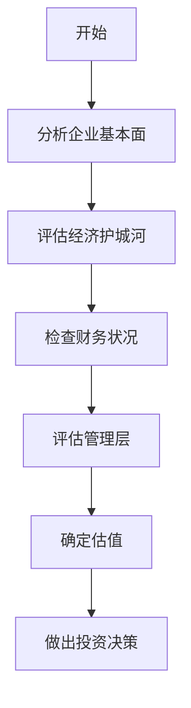
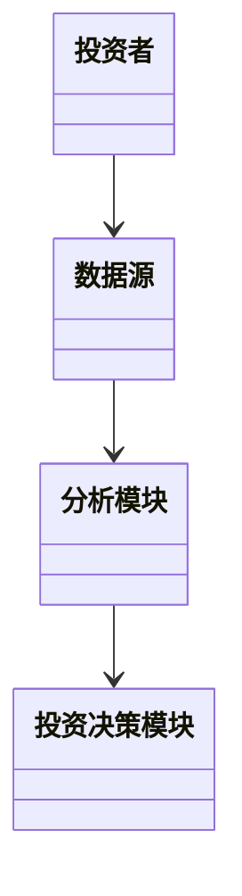

                 


# 巴菲特的投资失误：从错误中学习

## 关键词
巴菲特, 投资失误, 价值投资, 风险管理, 投资策略

## 摘要
本文深入分析了巴菲特的投资失误，探讨了这些错误的原因及其教训。通过具体案例分析，我们揭示了巴菲特在投资过程中曾犯的错误，并总结了从这些错误中学习到的经验。文章还提出了如何避免类似错误的投资策略和风险管理方法。

---

## 第一部分：巴菲特的投资理念与背景

### 第1章：巴菲特的生平与投资风格
1.1 巴菲特的早年经历
- 出生背景与早期教育
- 初次投资经历
- 合伙企业时期

1.2 巴菲特的投资哲学
- 价值投资的核心理念
- 安全边际的概念
- 长期投资的策略

### 第2章：价值投资的定义与原则
2.1 价值投资的核心概念
- 定义与特点
- 市场与内在价值的关系
- 价格与价值的差异

2.2 价值投资的五项原则
- ① 投资优质企业
- ② 保持合理的估值
- ③ 长期持有
- ④ 分散投资
- ⑤ 风险管理

### 第3章：巴菲特的投资决策过程
3.1 投资框架
- 经济护城河的分析
- 财务状况的评估
- 管理层的评估标准

3.2 投资决策的关键因素
- 财务指标分析
- 行业趋势判断
- 竞争优势评估

---

## 第二部分：巴菲特的投资失误案例分析

### 第4章：早期的投资错误
4.1 贝肯-艾克尔斯合伙公司案例
- 投资背景
- 错误决策的原因
- 教训与反思

4.2 喜诗糖果公司的投资教训
- 投资决策过程
- 错误的判断依据
- 从失败中吸取的教训

### 第5章：可口可乐的投资失误
5.1 投资决策的背景
- 可口可乐的市场地位
- 巴菲特的投资逻辑
- 市场变化的不可预测性

5.2 投资过程中的问题
- 对管理层的信任过度
- 市场周期的判断失误
- 估值模型的局限性

### 第6章：错失苹果的投资机会
6.1 苹果公司的崛起
- 技术创新与市场影响
- 苹果的财务表现
- 巴菲特的投资策略与科技股的矛盾

6.2 巴菲特为何错过苹果
- 对科技行业的偏见
- 风险管理的限制
- 投资决策的局限性

---

## 第三部分：从错误中学习投资智慧

### 第7章：巴菲特失误的共同点
7.1 人性的弱点与投资决策
- 过度自信的陷阱
- 情绪化决策的危害
- 从众心理的负面影响

7.2 估值错误与市场泡沫
- 估值模型的局限性
- 市场泡沫的识别难度
- 估值与实际表现的偏差

### 第8章：避免投资失误的对策
8.1 价值投资的真谛
- 安全边际的重要性
- 长期持有与耐心等待
- 风险管理的核心地位

8.2 投资策略的优化
- 分散投资与集中投资的平衡
- 行业选择与公司基本面的结合
- 宏观经济环境的考量

### 第9章：风险管理与投资心态
9.1 风险管理的数学模型
- 风险与收益的平衡
- 风险分散的原理
- 估值风险的控制

9.2 投资心态的调整
- 避免情绪化决策
- 建立合理的预期
- 持续学习与反思

---

## 第四部分：技术分析与系统设计

### 第10章：投资决策的技术分析
10.1 投资决策过程的Mermaid流程图


10.2 估值模型的数学公式
$$ V = \frac{CF}{r - g} $$
其中：
- \( CF \)：未来现金流
- \( r \)：折现率
- \( g \)：增长率

10.3 风险管理的系统架构


### 第11章：系统设计与实战案例
11.1 投资决策支持系统的功能设计
- 数据收集与分析模块
- 模型计算与估值模块
- 风险评估与预警模块

11.2 系统架构的Mermaid图


11.3 项目实战与代码实现
- 环境安装：Python、Pandas、Matplotlib
- 核心代码实现：
  ```python
  def calculate_value(enterprise, r, g):
      return enterprise.cash_flow / (r - g)
  ```
- 实际案例分析：可口可乐的估值与实际表现对比

---

## 第五部分：总结与展望

### 第12章：从错误中学习
12.1 总结巴菲特的失误与教训
- 价值投资的真谛
- 风险管理的重要性
- 持续学习与反思的必要性

12.2 对投资者的启示
- 避免盲目模仿
- 强调独立思考
- 注重风险管理

### 第13章：最佳实践与小结
13.1 投资策略建议
- 长期持有优质股票
- 分散投资以降低风险
- 定期复盘与调整

13.2 小结
- 巴菲特的投资失误为投资者提供了宝贵的经验教训
- 从错误中学习是投资成功的关键

---

## 第六部分：拓展阅读与参考文献

### 第14章：推荐阅读书籍
14.1 经典投资书籍推荐
- 《巴菲特致股东的信》
- 《价值投资入门》
- 《投资学原理》

14.2 网络资源与工具
- 巴菲特股东大会演讲
- 投资分析工具推荐

---

通过以上结构，我们可以系统地分析巴菲特的投资失误，并从中学到宝贵的经验，从而在未来的投资决策中避免类似的错误。

