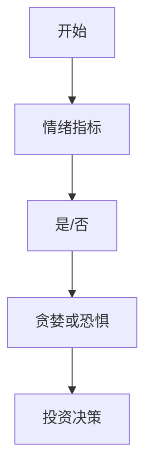

                 


# 巴菲特的投资心理学：情绪控制的重要性

> 关键词：巴菲特，投资心理学，情绪控制，价值投资，决策优化

> 摘要：本文从巴菲特的投资哲学出发，深入探讨情绪控制在投资决策中的重要性。通过分析情绪对投资的影响，结合数学模型和算法，提供情绪管理的策略和方法，帮助投资者优化决策过程。

---

## 第一部分：投资心理学概述

### 第1章：投资心理学的基本概念

#### 1.1 投资心理学的定义与核心要素

投资心理学是研究投资者心理活动及其对投资决策影响的学科。其核心要素包括认知、情感、动机和行为四个维度。

- 认知：投资者对市场的理解和判断。
- 情感：投资者在决策中的情绪波动。
- 动机：投资者的投资目标和驱动因素。
- 行为：投资者基于认知和情感做出的决策。

#### 1.2 巴菲特的投资理念

巴菲特的价值投资理念强调长期持有优质资产，关注企业的内在价值，而非市场的短期波动。

$$ \text{价值投资} = \text{内在价值} \times \text{安全边际} $$

巴菲特的成功在于他能够保持冷静，避免情绪化决策，专注于基本面分析。

---

## 第2章：情绪控制的重要性

### 2.1 情绪对投资决策的影响

#### 2.1.1 情绪波动的负面影响

情绪波动会导致投资者做出非理性决策，如高位追涨或低位恐慌抛售。

$$ P(\text{情绪决策}) = \text{贪婪或恐惧} $$

#### 2.1.2 情绪稳定的积极作用

情绪稳定有助于投资者坚持长期策略，避免短期波动干扰。

$$ P(\text{理性决策}) = \text{情绪控制} $$

---

## 第3章：巴菲特的情绪管理策略

### 3.1 巴菲特的情绪控制方法

#### 3.1.1 自我反思与日记记录

巴菲特通过记录投资决策过程，反思情绪波动，提升自我认知。

#### 3.1.2 长期心态的培养

巴菲特强调长期投资，避免短期市场波动的干扰。

#### 3.1.3 纪律与耐心

巴菲特严格遵守投资纪律，保持耐心，避免冲动交易。

---

## 第4章：投资心理学的核心概念

### 4.1 理性与感性决策

#### 4.1.1 理性决策的优缺点

- 优点：基于逻辑和数据分析，减少错误。
- 缺点：忽视市场参与者的情绪因素。

#### 4.1.2 感性决策的优缺点

- 优点：快速反应市场情绪。
- 缺点：容易导致过度交易和错误判断。

#### 4.1.3 理性与感性决策的对比分析

通过表格对比理性和感性决策的差异：

| **方面** | **理性决策** | **感性决策** |
|----------|--------------|--------------|
| 基础    | 数据分析     | 情感驱动     |
| 优点    | 减少错误     | 快速反应     |
| 缺点    | 忽略情绪     | 易错判       |

---

## 第5章：情绪控制的数学模型与算法

### 5.1 情绪影响的数学模型

#### 5.1.1 线性回归模型

$$ \text{情绪影响} = \beta_0 + \beta_1 \times \text{情绪指标} + \epsilon $$

其中，$\beta_1$表示情绪指标对投资决策的影响程度。

#### 5.1.2 决策树模型

使用mermaid绘制决策树：



---

## 第6章：投资决策系统的架构设计

### 6.1 项目环境搭建

#### 6.1.1 开发工具安装

安装Python、Jupyter Notebook和相关库（如numpy、pandas）。

#### 6.1.2 数据源获取

获取历史市场数据和情绪指标数据。

#### 6.1.3 系统框架搭建

使用Flask或Django框架搭建Web界面。

### 6.2 核心代码实现

#### 6.2.1 情绪指标计算代码

```python
import pandas as pd

def calculate_emotion(sentiment_scores):
    return pd.Series(sentiment_scores).mean()

# 示例数据
sentiment_data = [0.8, 0.6, 0.7, 0.5]
emotion_score = calculate_emotion(sentiment_data)
print(emotion_score)
```

#### 6.2.2 投资决策算法实现

```python
def investment_decision(price_data, emotion_score):
    if emotion_score > 0.6:
        return "买入"
    elif emotion_score < 0.4:
        return "卖出"
    else:
        return "持有"

# 示例数据
price_data = [100, 105, 98, 102]
emotion_score = 0.5
decision = investment_decision(price_data, emotion_score)
print(decision)
```

---

## 第7章：项目实战与案例分析

### 7.1 项目实战

#### 7.1.1 环境安装与数据准备

安装必要的Python库，并收集历史数据和情绪指标。

#### 7.1.2 核心代码实现

实现情绪指标计算和投资决策算法，测试系统功能。

#### 7.1.3 案例分析

以巴菲特的经典投资案例为例，分析情绪控制对投资决策的影响。

---

## 第8章：最佳实践

### 8.1 小结

情绪控制是投资成功的关键因素之一，巴菲特通过严格的纪律和长期心态的培养，实现了卓越的投资业绩。

### 8.2 注意事项

- 避免情绪化决策。
- 坚持基本面分析。
- 定期反思和调整策略。

### 8.3 拓展阅读

推荐阅读巴菲特的《 Intelligent Investor》和行为金融学的经典著作，进一步深入理解投资心理学。

---

## 结语

通过本文的分析，读者可以理解情绪控制在投资中的重要性，并掌握相关的数学模型和算法，优化投资决策过程。巴菲特的投资哲学为我们提供了一个极佳的学习范例，帮助我们在复杂多变的市场中保持冷静和理性。

