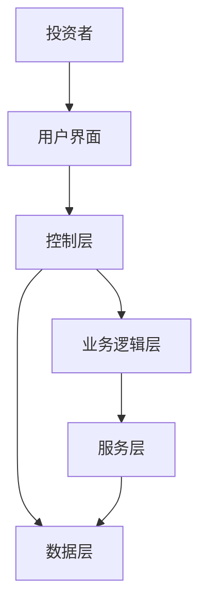
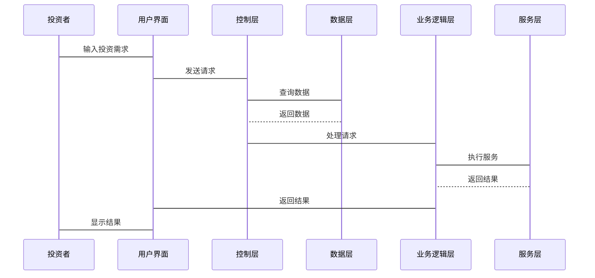

                 


```markdown
# 巴菲特的投资心理学：控制情绪的艺术

## 关键词：巴菲特, 投资心理学, 情绪控制, 决策心理, 价值投资, 投资策略, 理性决策

## 摘要：本文深入探讨了巴菲特的投资心理学，特别是情绪控制在投资决策中的重要性。通过分析巴菲特的投资哲学、认知偏差、行为经济学和系统化投资策略，结合数学模型和系统架构，帮助读者掌握如何在投资中保持理性，避免情绪干扰，做出更明智的决策。

---

# 第一部分: 投资心理学的背景与基础

## 第1章: 投资心理学概述

### 1.1 投资心理学的核心概念

#### 1.1.1 投资心理学的定义
- 投资心理学是研究投资者在决策过程中心理活动的学科，关注情绪、认知和行为对投资结果的影响。
- 通过分析投资者的心理状态，揭示投资决策中的非理性行为和偏差。

#### 1.1.2 投资心理学与巴菲特的哲学
- 巴菲特强调价值投资，注重长期视角和安全边际，其哲学与投资心理学密切相关。
- 巴菲特的成功部分归因于他对情绪的控制和对理性的坚持。

#### 1.1.3 投资中的情绪问题
- 情绪波动是投资中的主要障碍，可能导致非理性决策和投资失误。
- 情绪控制是巴菲特投资策略的核心之一，通过纪律和系统化的方法减少情绪干扰。

### 1.2 投资中的问题背景与描述

#### 1.2.1 投资者的行为偏差
- 认知偏差：投资者因信息处理错误导致的决策偏差，如确认偏差、锚定效应等。
- 行为偏差：投资者因情绪或习惯导致的非理性行为，如贪婪、恐惧等。

#### 1.2.2 情绪对决策的影响
- 贪婪：市场上涨时的过度乐观，可能导致高估资产价值。
- 恐惧：市场下跌时的过度悲观，可能导致恐慌性抛售。
- 从众心理：跟随市场趋势而非独立思考，可能导致羊群效应。

#### 1.2.3 投资市场的非理性特征
- 市场波动：价格波动往往由情绪驱动，而非基本面因素。
- 市场泡沫：投资者情绪高涨时，可能导致资产价格脱离实际价值。

### 1.3 投资心理学的核心要素

#### 1.3.1 理性与感性决策的对比
- 理性决策：基于逻辑和数据，追求最优解决方案。
- 感性决策：受情绪和直觉驱动，可能偏离最优解决方案。

#### 1.3.2 投资决策中的认知偏差
- 确认偏差：倾向于寻找支持自己观点的信息，忽略反面证据。
- 锚定效应：过度依赖初始信息，导致决策僵化。
- 过度简化：将复杂问题简化为简单判断，可能导致错误结论。

#### 1.3.3 情绪波动与市场周期的关系
- 情绪波动推动市场周期，如牛市中的贪婪和熊市中的恐惧。
- 投资者应识别情绪周期，避免被市场情绪左右。

### 1.4 本章小结
- 投资心理学关注情绪和认知对决策的影响，帮助投资者理解自身行为。
- 巴菲特的成功部分归因于他对情绪的控制和对理性的坚持。
- 情绪波动是投资中的主要障碍，需通过纪律和系统化方法加以控制。

---

# 第二部分: 情绪对投资决策的影响

## 第2章: 情绪对投资决策的影响

### 2.1 情绪与决策的关系

#### 2.1.1 情绪的定义与分类
- 情绪：短暂的心理状态，影响认知和行为。
- 情绪类型：积极情绪（贪婪、乐观）与消极情绪（恐惧、悲观）。

#### 2.1.2 情绪对理性决策的干扰
- 情绪化的决策可能导致错误判断，如高位买入或低位卖出。
- 情绪波动使投资者偏离长期目标，追求短期收益。

#### 2.1.3 情绪在投资中的具体表现
- 贪婪：市场上涨时的过度买入，忽视风险。
- 恐惧：市场下跌时的过度卖出，错失反弹机会。
- 从众心理：跟随市场趋势，缺乏独立判断。

### 2.2 投资中的常见情绪偏差

#### 2.2.1 贪婪与恐惧
- 贪婪：市场上涨时的过度乐观，可能导致高价买入。
- 恐惧：市场下跌时的过度悲观，可能导致恐慌性抛售。

#### 2.2.2 从众心理与逆向思维
- 从众心理：跟随市场多数人的行为，可能导致羊群效应。
- 逆向思维：在市场恐慌时寻找机会，逆市买入优质资产。

#### 2.2.3 过度自信与后悔厌恶
- 过度自信：高估自己的判断能力，可能导致错误决策。
- 后悔厌恶：因害怕后悔而避免做出决策，错失投资机会。

### 2.3 情绪控制的策略

#### 2.3.1 内在情绪的自我觉察
- 自我反思：定期回顾自己的投资行为，识别情绪波动。
- 情绪记录：记录情绪变化，分析其对决策的影响。

#### 2.3.2 外部环境的应对方法
- 建立支持系统：与信任的投资者或顾问交流，避免孤立决策。
- 信息过滤：避免接触引发情绪波动的信息源。

#### 2.3.3 长期目标与短期情绪的平衡
- 设定明确的投资目标：基于长期价值，而非短期情绪。
- 分阶段执行：将大目标分解为小步骤，逐步实现。

### 2.4 本章小结
- 情绪是投资中的主要干扰因素，需通过自我觉察和外部支持加以控制。
- 巴菲特的成功在于他能够保持冷静，避免情绪化决策。
- 投资者应建立情绪控制的策略，平衡短期情绪与长期目标。

---

# 第三部分: 投资决策中的心理学原理

## 第3章: 投资决策中的心理学原理

### 3.1 认知偏差与决策错误

#### 3.1.1 认知偏差的定义与分类
- 认知偏差：信息处理中的系统性错误，影响决策质量。
- 常见认知偏差：确认偏差、锚定效应、过度简化等。

#### 3.1.2 认知偏差对投资决策的影响
- 确认偏差：只关注支持自己观点的信息，导致判断失误。
- 锚定效应：过度依赖初始信息，影响价值评估。
- 过度简化：将复杂问题简化为简单判断，导致决策失误。

#### 3.1.3 认知偏差的案例分析
- 案例1：投资者因锚定效应而高估某股票的价值，导致亏损。
- 案例2：投资者因确认偏差而忽略反面证据，导致错误决策。

### 3.2 行为经济学与投资决策

#### 3.2.1 行为经济学的基本原理
- 行为经济学：研究实际决策中的非理性行为，强调情感和环境的影响。
- 基础理论： prospect theory, 有限理性理论等。

#### 3.2.2 市场参与者的非理性行为
- 从众心理：跟随市场趋势，导致羊群效应。
- 情感驱动：投资者因情绪波动而做出非理性决策。

#### 3.2.3 行为经济学对投资策略的影响
- 提醒投资者注意认知偏差和行为偏差，避免情绪化决策。
- 建立系统化投资策略，减少非理性行为的影响。

### 3.3 理性决策的构建

#### 3.3.1 理性决策的定义与特征
- 理性决策：基于逻辑和数据，追求最优解决方案。
- 理性决策特征：客观性、逻辑性、可验证性。

#### 3.3.2 理性决策的实现步骤
1. 明确目标：确定投资目标和风险承受能力。
2. 收集信息：全面了解投资标的的基本面。
3. 分析评估：使用数学模型和价值评估方法进行分析。
4. 制定策略：基于分析结果制定投资计划。
5. 执行决策：按计划执行，避免情绪干扰。
6. 监测调整：定期评估结果，必要时进行调整。

#### 3.3.3 理性与感性的平衡
- 理性决策需要考虑长期目标和系统化方法。
- 情感因素是人性的一部分，需通过纪律和系统化方法加以控制。

### 3.4 本章小结
- 认知偏差和行为偏差是投资决策中的主要障碍，需通过系统化方法加以克服。
- 行为经济学的研究为投资者提供了理解自身行为的工具。
- 理性决策是投资成功的关键，需通过纪律和系统化方法实现。

---

# 第四部分: 投资体系的构建与情绪控制

## 第4章: 投资体系的构建与情绪控制

### 4.1 投资体系的核心要素

#### 4.1.1 价值评估体系
- 基本面分析：分析公司的财务状况、行业地位、竞争优势等。
- 价值评估模型：使用DCF模型等工具评估资产的内在价值。

#### 4.1.2 风险管理框架
- 风险识别：识别投资中的各种风险，如市场风险、流动性风险等。
- 风险控制：设定止损点，分散投资组合，避免过度集中。

#### 4.1.3 长期投资策略
- 长期视角：关注公司的长期价值，而非短期价格波动。
- 价值投资：选择具有持续竞争优势和良好管理的公司。

### 4.2 情绪控制的系统化方法

#### 4.2.1 投资纪律的建立
- 投资计划：制定明确的投资计划，包括买入和卖出标准。
- 纪律执行：严格按照计划执行，避免情绪干扰。

#### 4.2.2 逆向思维的培养
- 逆向思维：在市场恐慌时寻找机会，逆市买入优质资产。
- 质疑共识：独立思考，避免从众心理。

#### 4.2.3 风险承受能力的评估
- 风险承受能力：根据自身财务状况和心理承受能力，评估可承受的风险。
- 风险管理：通过分散投资、设定止损等方式控制风险。

### 4.3 巴菲特投资体系的案例分析

#### 4.3.1 巴菲特的价值投资理念
- 选择具有持续竞争优势的公司。
- 关注公司的内在价值，而非市场价格。

#### 4.3.2 巴菲特的选股标准
- 具有强大的竞争优势。
- 财务状况稳健，负债低，现金流充足。
- 管理层诚信可靠。

#### 4.3.3 巴菲特的情绪控制策略
- 长期视角：关注公司的长期价值，避免短期波动干扰。
- 系统化决策：基于基本面分析和价值评估，而非市场情绪。

### 4.4 本章小结
- 投资体系的构建需要明确的价值评估和风险管理框架。
- 情绪控制是投资成功的关键，需通过纪律和系统化方法实现。
- 巴菲特的成功证明了价值投资和情绪控制的有效性。

---

## 第五章: 数学模型与价值评估

### 5.1 价值评估模型

#### 5.1.1 现金流折现模型（DCF模型）
- 定义：通过预测公司未来现金流，折现到现值，评估公司内在价值。
- 公式：$$ V = \sum_{t=1}^{n} \frac{CF_t}{(1+r)^t} + \frac{TV}{(1+r)^n} $$
  - $V$：公司价值
  - $CF_t$：第t年的现金流
  - $r$：折现率
  - $TV$：终值

#### 5.1.2 市盈率与市净率模型
- 市盈率：$$ P/E = \frac{P}{E} $$
  - $P$：股价
  - $E$：每股收益
- 市净率：$$ P/B = \frac{P}{B} $$
  - $P$：股价
  - $B$：每股净资产

### 5.2 系统架构设计

#### 5.2.1 系统功能设计
- 投资者信息管理模块：管理投资者的基本信息和投资偏好。
- 资产评估模块：基于DCF模型等工具，评估资产的内在价值。
- 风险管理模块：识别和评估投资中的各种风险，制定风险管理策略。
- 投资决策支持模块：提供决策支持，包括市场分析、组合优化等。

#### 5.2.2 系统架构图


#### 5.2.3 系统交互流程


### 5.3 项目实战

#### 5.3.1 环境安装
- 安装Python和相关库（如numpy、pandas、scipy）。
- 安装Jupyter Notebook用于数据分析和建模。

#### 5.3.2 核心代码实现

##### 5.3.2.1 价值评估函数
```python
import numpy as np
import pandas as pd
import scipy.stats as stats

def discounted_cash_flow(cash_flows, discount_rate, terminal_value):
    """
    计算现金流的现值
    """
    present_value = 0
    for t, cf in enumerate(cash_flows):
        if t == 0:
            present_value += cf
        else:
            present_value += cf / (1 + discount_rate) ** t
    present_value += terminal_value / (1 + discount_rate) ** len(cash_flows)
    return present_value

# 示例数据
cash_flows = [100, 150, 200, 250]
discount_rate = 0.08
terminal_value = 500

# 计算现值
value = discounted_cash_flow(cash_flows, discount_rate, terminal_value)
print(f"公司价值: {value:.2f}")
```

##### 5.3.2.2 市盈率与市净率计算
```python
def calculate_pe(stock_price, earnings_per_share):
    """
    计算市盈率
    """
    return stock_price / earnings_per_share

def calculate_pb(stock_price, book_value_per_share):
    """
    计算市净率
    """
    return stock_price / book_value_per_share

# 示例数据
stock_price = 100
earnings_per_share = 2.5
book_value_per_share = 5

# 计算市盈率和市净率
pe = calculate_pe(stock_price, earnings_per_share)
pb = calculate_pb(stock_price, book_value_per_share)

print(f"市盈率: {pe:.2f}")
print(f"市净率: {pb:.2f}")
```

#### 5.3.3 案例分析：以茅台为例
- 茅台的财务数据：收入、利润、现金流等。
- 应用DCF模型评估茅台的内在价值。
- 分析茅台的竞争优势和长期增长潜力。

### 5.4 本章小结
- 数学模型是投资决策的重要工具，DCF模型等方法帮助评估资产的内在价值。
- 系统架构设计为投资决策提供了技术支持，帮助投资者更好地管理信息和决策过程。
- 项目实战通过具体案例，展示了如何将理论应用于实际投资中。

---

## 第六章: 投资决策支持系统的实现

### 6.1 系统设计

#### 6.1.1 系统功能模块
- 数据采集模块：采集股票价格、财务数据等。
- 数据分析模块：使用统计分析和机器学习技术进行数据挖掘。
- 投资策略模块：根据分析结果制定投资策略。
- 风险管理模块：评估和管理投资中的风险。

#### 6.1.2 系统架构设计


### 6.2 系统实现

#### 6.2.1 数据采集
- 使用API（如Yahoo Finance API）获取实时数据。
- 数据预处理：清洗、转换和存储。

#### 6.2.2 数据分析
- 使用Pandas和NumPy进行数据处理。
- 应用统计分析和机器学习模型进行预测。

#### 6.2.3 投资策略实现
- 基于价值评估模型和风险管理框架，制定投资策略。
- 系统化决策：避免情绪干扰，严格按照策略执行。

### 6.3 项目实战

#### 6.3.1 环境安装
- 安装Python和相关库（如numpy、pandas、scikit-learn）。
- 安装Jupyter Notebook用于数据分析和建模。

#### 6.3.2 核心代码实现

##### 6.3.2.1 数据采集
```python
import yfinance as yf

# 下载茅台数据
msft = yf.download('AAPL', start='2020-01-01', end='2023-12-31')
print(msft.head())
```

##### 6.3.2.2 数据分析
```python
import pandas as pd
import numpy as np

# 计算移动平均线
msft['MA20'] = msft['Close'].rolling(20).mean()
msft['MA50'] = msft['Close'].rolling(50).mean()

# 生成信号
msft['Signal'] = np.where(msft['MA20'] > msft['MA50'], 'Buy', 'Sell')
print(msft.head())
```

##### 6.3.2.3 投资策略实现
```python
def backtest_strategy(prices, strategy):
    """
    回测策略实现
    """
    portfolio = 0
    returns = []
    for i in range(len(prices)):
        if i == 0:
            portfolio = 100000  # 初始资金
            position = 0  # 初始持仓
        else:
            # 根据策略决定买卖
            if strategy[i] == 'Buy':
                position += (portfolio / prices[i])
                portfolio -= (portfolio / prices[i]) * prices[i]
            elif strategy[i] == 'Sell':
                position -= (portfolio / prices[i])
                portfolio += (portfolio / prices[i]) * prices[i]
        returns.append(portfolio)
    return returns

# 示例策略：当MA20 > MA50时买入，否则卖出
strategy = msft['MA20'] > msft['MA50']
strategy = strategy.replace(True, 'Buy').replace(False, 'Sell')

# 回测策略
returns = backtest_strategy(msft['Close'], strategy)
print(f"最终资金: {returns[-1]:.2f}")
```

### 6.4 本章小结
- 投资决策支持系统为投资者提供了一种系统化的方法，帮助他们做出更明智的决策。
- 通过技术手段，投资者可以更好地控制情绪，避免非理性行为。
- 系统化的决策过程结合数学模型，提高了投资决策的科学性和准确性。

---

## 第七章: 总结与最佳实践

### 7.1 总结
- 投资心理学是投资成功的重要因素，情绪控制是关键。
- 巴菲特的成功证明了价值投资和情绪控制的有效性。
- 系统化决策和数学模型为投资者提供了科学的工具和方法。

### 7.2 最佳实践

#### 7.2.1 小结
- 投资者应注重情绪控制，避免非理性决策。
- 通过系统化方法和数学模型，提高投资决策的科学性和准确性。

#### 7.2.2 注意事项
- 投资有风险，需谨慎评估自己的风险承受能力。
- 避免过度自信，定期反思和调整投资策略。

#### 7.2.3 拓展阅读
- 《巴菲特传》：了解巴菲特的投资哲学和成功经验。
- 《投资学原理》：学习投资的基本理论和方法。
- 《行为经济学》：深入理解人类行为对投资决策的影响。

### 7.3 本章小结
- 投资心理学是投资成功的重要因素，情绪控制是关键。
- 巴菲特的成功证明了价值投资和情绪控制的有效性。
- 系统化决策和数学模型为投资者提供了科学的工具和方法。

---

## 附录: 代码示例与参考文献

### 附录A: 代码示例
- 价值评估函数
- 投资决策支持系统实现
- 数据分析与回测策略

### 附录B: 参考文献
- 巴菲特的著作与演讲
- 行为经济学的经典文献
- 投资心理学的相关研究

---

通过本文的详细阐述，读者可以全面理解巴菲特的投资心理学，掌握情绪控制的艺术，并在实际投资中应用这些方法和策略，做出更明智的决策。
```

