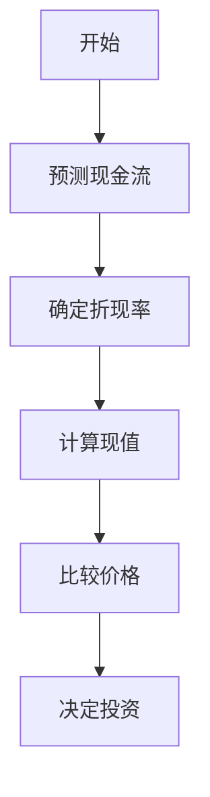
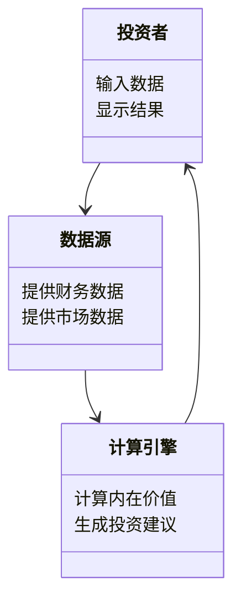

                 


# 巴菲特的投资时间框架：长期主义的优势

> 关键词：巴菲特，长期主义，投资策略，价值投资，企业分析

> 摘要：本文深入探讨了巴菲特的投资哲学和长期主义的优势，结合技术领域的最佳实践，分析了长期主义在投资决策中的重要性，并通过实际案例展示了如何在复杂市场环境中应用这一策略。

---

## 第一部分：背景介绍

### 1. 巴菲特的投资哲学与长期主义的背景

#### 1.1 背景介绍

长期主义是一种投资哲学，强调关注企业的长期价值，而非短期市场波动。这一理念的核心在于通过深入分析企业的基本面，寻找具有持续竞争优势和良好管理的公司，长期持有，以实现财富的稳定增长。

#### 1.2 长期主义的定义与特征

- **定义**：长期主义是一种投资策略，强调长期持有优质资产，关注企业的内在价值，而非市场的短期波动。
- **特征**：
  - 长期视角：关注企业的长期增长潜力。
  - 价值导向：寻找具有内在价值的公司。
  - 风险控制：通过安全边际降低投资风险。

#### 1.3 长期主义与短期投资的对比

| 对比维度       | 长期主义          | 短期投资          |
|----------------|-------------------|-------------------|
| 投资期限       | 长期              | 短期              |
| 投资目标       | 企业内在价值      | 市场波动套利      |
| 风险承受能力   | 较低              | 较高              |
| 投资策略       | 价值投资          | 技术分析/趋势交易 |

### 1.4 巴菲特的长期主义投资哲学

巴菲特的长期主义投资哲学基于以下几点：

1. **价值投资**：寻找市场价格低于内在价值的公司。
2. **企业竞争优势**：关注具有持续竞争优势的企业。
3. **安全边际**：通过买入价格低于内在价值的股票，降低投资风险。

---

## 第二部分：长期主义的核心概念与优势

### 2. 长期主义的核心概念

#### 2.1 投资模型的核心要素

- **企业内在价值**：企业未来现金流的现值。
- **竞争优势**：企业的核心竞争力，如品牌、技术、成本优势等。
- **管理团队**：企业的管理层能力和战略决策。

#### 2.2 投资模型的数学公式

企业内在价值的计算公式如下：

$$
\text{内在价值} = \sum_{t=1}^{n} \frac{\text{现金流}_t}{(1 + r)^t}
$$

其中，\( r \) 是折现率，\( \text{现金流}_t \) 是第 \( t \) 年的现金流。

---

## 第三部分：算法原理

### 3. 投资模型的算法原理

#### 3.1 企业内在价值的计算步骤

1. 预测未来现金流。
2. 确定合理的折现率。
3. 计算未来现金流的现值之和。
4. 比较市场价格与内在价值，决定是否投资。

#### 3.2 Python代码实现

```python
def calculate_intrinsic_value(cash_flows, discount_rate, years):
    iv = 0
    for t in range(years):
        iv += cash_flows[t] / (1 + discount_rate) ** t
    return iv

# 示例：预测未来5年的现金流和折现率
cash_flows = [100, 120, 150, 180, 200]
discount_rate = 0.10
years = 5

iv = calculate_intrinsic_value(cash_flows, discount_rate, years)
print(f"内在价值为：{iv}")
```

#### 3.3 算法的图形化展示



---

## 第四部分：系统分析与架构设计

### 4. 系统架构设计

#### 4.1 系统功能设计

- **输入模块**：获取企业的财务数据和市场数据。
- **计算模块**：计算企业内在价值。
- **决策模块**：比较市场价格与内在价值，生成投资建议。

#### 4.2 系统架构图



---

## 第五部分：项目实战

### 5. 实际案例分析

#### 5.1 投资案例：可口可乐

1. **现金流预测**：预测未来5年的现金流。
2. **折现率确定**：选择合适的折现率。
3. **计算内在价值**：比较市场价格与内在价值。

#### 5.2 代码实现

```python
def calculate_intrinsic_value(cash_flows, discount_rate, years):
    iv = 0
    for t in range(years):
        iv += cash_flows[t] / (1 + discount_rate) ** t
    return iv

# 可口可乐案例
cash_flows = [100, 120, 150, 180, 200]
discount_rate = 0.10
years = 5

iv = calculate_intrinsic_value(cash_flows, discount_rate, years)
print(f"可口可乐的内在价值为：{iv}")
```

---

## 第六部分：总结与启示

### 6. 总结

长期主义是一种有效的投资策略，通过关注企业的长期价值，避免短期市场波动的影响，实现财富的稳定增长。

### 7. 最佳实践 tips

- **保持耐心**：长期投资需要时间和耐心。
- **持续学习**：不断提升自己的投资知识和能力。
- **避免情绪化决策**：市场波动时保持冷静，避免情绪化决策。

### 8. 小结

通过本文的分析，我们可以看到长期主义的优势和应用。希望本文能为投资者提供有价值的启示，帮助他们在复杂多变的市场中做出更明智的投资决策。

---

## 结语

巴菲特的长期主义投资策略不仅是一种投资方法，更是一种生活态度。通过深入分析企业的基本面，关注长期价值，我们可以更好地应对市场的不确定性，实现财富的稳健增长。

