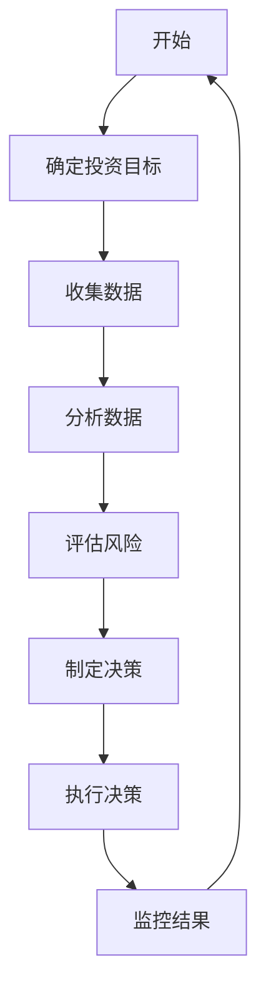
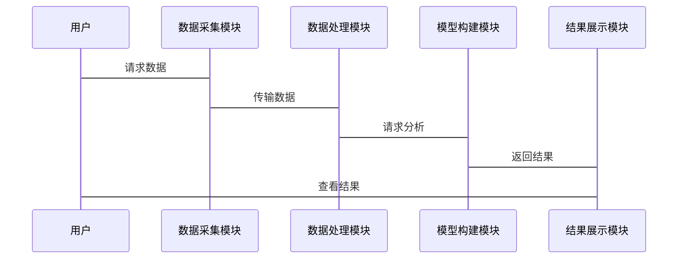

                 


# 巴菲特的投资清单：系统化决策的重要性

---

## 关键词

- 巴菲特投资哲学
- 价值投资
- 系统化决策
- 内在价值评估
- 投资组合管理

---

## 摘要

本文将探讨巴菲特的投资哲学及其系统化决策方法，深入分析价值投资的核心理念、内在价值评估的数学模型，以及如何通过系统化的方法构建和管理投资组合。文章结合经典案例和实际操作，帮助读者理解如何将巴菲特的投资理念应用于实际投资中。

---

## 第1章：巴菲特的投资哲学概述

### 1.1 巴菲特的投资理念

#### 1.1.1 巴菲特的生平与投资风格

沃伦·巴菲特，世界著名投资者，以价值投资著称。他强调长期投资、安全边际和复利效应。

#### 1.1.2 价值投资的核心理念

价值投资的核心在于寻找市场价低于内在价值的公司。巴菲特强调深入分析财务报表和行业趋势。

#### 1.1.3 长期投资与复利效应的重要性

复利效应是巴菲特成功的关键。他主张长期持有优质资产，避免频繁交易。

### 1.2 系统化决策的重要性

#### 1.2.1 投资中的非系统化决策误区

非系统化决策容易受情绪影响，导致错误判断。系统化决策能减少人为错误。

#### 1.2.2 系统化决策的优势与必要性

系统化决策通过模型和数据支持，提高决策的准确性和效率。巴菲特通过系统化方法筛选投资目标。

#### 1.2.3 巴菲特如何实现系统化决策

巴菲特通过建立严格的筛选标准和系统化的分析流程，确保投资决策的科学性。

---

## 第2章：系统化决策的核心要素

### 2.1 价值投资的核心要素

#### 2.1.1 企业内在价值的定义与计算

内在价值是企业未来现金流的现值。公式：
$$ V = \sum_{t=1}^{\infty} \frac{CF_t}{(1 + r)^t} $$

#### 2.1.2 安全边际的概念与应用

安全边际是市场价格低于内在价值的部分。公式：
$$ \text{安全边际} = \text{内在价值} - \text{市场价格} $$

#### 2.1.3 财务报表分析的关键指标

分析指标包括ROE、净利润率、负债率等，评估企业的财务健康状况。

### 2.2 投资决策的系统化框架

#### 2.2.1 系统化决策的步骤与流程

步骤包括：确定投资目标、收集数据、分析数据、评估风险、制定决策、执行决策、监控结果。

#### 2.2.2 数据收集与分析的系统化方法

数据收集包括行业趋势、财务数据、市场情绪等，分析方法包括定量分析和定性分析。

#### 2.2.3 决策模型的构建与优化

构建多因素模型，考虑多个变量，如盈利能力、成长性、估值等。

---

## 第3章：系统化决策的数学模型与算法

### 3.1 企业内在价值的计算模型

#### 3.1.1 自由现金流的计算公式

自由现金流公式：
$$ FCFF = EBIT(1 - T) + D(1 - T) - FC \times (1 - T) $$

#### 3.1.2 内在价值的DCF模型

DCF模型计算公式：
$$ V = \sum_{t=1}^{\infty} \frac{CF_t}{(1 + r)^t} $$

### 3.2 安全边际的量化方法

#### 3.2.1 安全边际的计算公式

安全边际公式：
$$ \text{安全边际} = \text{内在价值} - \text{市场价格} $$

#### 3.2.2 系统化评估模型的构建

模型包括数据清洗、特征选择、模型训练、结果验证等步骤。

---

## 第4章：系统化决策的系统架构与投资策略

### 4.1 投资组合的系统化构建

#### 4.1.1 资产配置的系统化方法

资产配置考虑风险承受能力、投资目标和市场环境，采用定性和定量方法。

#### 4.1.2 风险管理的系统化策略

风险管理包括风险分散、风险对冲和风险评估，使用VaR等指标量化风险。

#### 4.1.3 投资组合的动态调整机制

动态调整基于市场变化和企业基本面，定期评估和调整持仓。

### 4.2 系统化决策的流程图



---

## 第5章：项目实战——巴菲特投资策略的应用

### 5.1 经典案例分析

#### 5.1.1 可口可乐的投资案例

分析可口可乐的财务状况、竞争优势和管理层质量，评估其内在价值和安全边际。

#### 5.1.2 苹果公司的投资分析

评估苹果公司的盈利能力、成长性和估值，确定是否符合价值投资标准。

#### 5.1.3 银行股的投资策略

分析银行股的财务健康状况、资产质量，评估其内在价值和风险。

### 5.2 项目核心实现

#### 5.2.1 数据收集与清洗

收集目标公司的财务数据、行业数据和市场数据，清洗数据，处理缺失值和异常值。

#### 5.2.2 模型构建与验证

构建DCF模型，计算企业内在价值，验证模型的准确性和稳定性。

#### 5.2.3 投资决策的系统化实现

根据模型结果和安全边际，制定投资决策，构建投资组合。

---

## 第6章：系统分析与架构设计方案

### 6.1 系统架构设计

#### 6.1.1 系统功能模块划分

功能模块包括数据采集、数据处理、模型构建、结果展示等。

#### 6.1.2 系统架构图


#### 6.1.3 系统接口设计

接口包括数据接口、模型接口和用户界面接口，采用RESTful API设计。

#### 6.1.4 系统交互序列图



---

## 第7章：项目实战——代码实现与数据分析

### 7.1 环境安装与配置

安装Python、Pandas、NumPy、Matplotlib等库，配置数据源。

### 7.2 核心代码实现

#### 7.2.1 数据处理代码

```python
import pandas as pd
import numpy as np

# 读取数据
df = pd.read_csv('data.csv')

# 数据清洗
df.dropna(inplace=True)
df = df[~df['revenue'].str.contains('None')]
```

#### 7.2.2 模型构建代码

```python
def calculate_intrinsic_value(cash_flow, discount_rate):
    return sum(cash_flow / (1 + discount_rate)**t for t in range(len(cash_flow)))

cash_flow = [100, 120, 150, 200]
discount_rate = 0.08
iv = calculate_intrinsic_value(cash_flow, discount_rate)
print(f"内在价值：{iv}")
```

#### 7.2.3 数据可视化代码

```python
import matplotlib.pyplot as plt

plt.figure(figsize=(10, 6))
plt.plot(range(len(cash_flow)), cash_flow, label='现金流')
plt.xlabel('时间（年）')
plt.ylabel('现金流（百万美元）')
plt.legend()
plt.show()
```

### 7.3 实际案例分析

分析可口可乐的现金流，计算其内在价值和安全边际，评估投资可行性。

---

## 第8章：总结与展望

### 8.1 最佳实践 Tips

- 坚持价值投资，注重安全边际。
- 定期评估投资组合，动态调整。
- 结合定量分析和定性分析，提高决策准确性。

### 8.2 小结

通过系统化决策，巴菲特实现了长期稳定的收益。本文详细讲解了系统化决策的流程和方法，帮助读者在投资中应用。

### 8.3 注意事项

- 风险管理是投资的重要部分，不可忽视。
- 数据质量和模型准确性直接影响决策结果。

### 8.4 拓展阅读

推荐书籍：《巴菲特致股东的信》、《投资最重要的简单真理》。

---

## 结语

系统化决策是巴菲特投资成功的关键。通过本文的分析，读者可以掌握系统化决策的方法和工具，提升投资能力。

