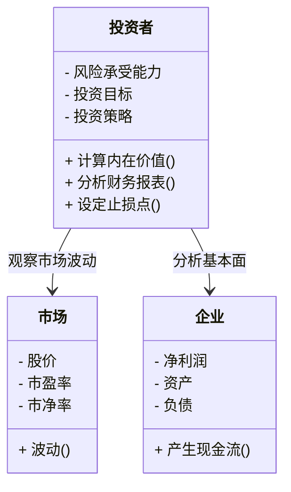

                 


# 巴菲特的投资纪律：耐心和自制力的重要性

## 关键词：
- 巴菲特
- 投资纪律
- 耐心
- 自制力
- 价值投资
- 内在价值
- 风险控制

## 摘要：
本文探讨了巴菲特的投资纪律，特别是耐心和自制力在投资中的重要性。通过分析巴菲特的投资原则、价值投资的核心理念、内在价值的计算方法以及如何在市场波动中保持纪律，文章为投资者提供了深刻的见解和实用的建议。

---

## 正文：

### 第一部分：巴菲特投资纪律的核心理念

#### 第1章：巴菲特投资纪律的背景与重要性

##### 1.1 投资纪律的定义与内涵

投资纪律是投资者在市场波动中保持理性决策的能力，它包括严格遵守投资策略、避免情绪化决策以及坚持长期投资目标。投资纪律的核心要素包括：明确的投资目标、系统的投资方法、严格的风险控制以及持续的自我约束。

##### 1.2 巴菲特投资理念的形成

- **背景介绍**：巴菲特的投资理念深受价值投资之父本杰明·格雷厄姆的影响，他强调寻找具有安全边际的低估股票，并长期持有。
- **核心思想**：价值投资的核心在于寻找市场低估的公司，关注企业的内在价值，而不是市场的短期波动。
- **理念演变**：从早期的套利交易到后期的长期价值投资，巴菲特不断完善自己的投资策略，注重企业的竞争优势和管理层质量。

##### 1.3 投资纪律的重要性

通过严格的纪律，投资者可以避免追涨杀跌的错误，降低交易成本，专注于长期价值的实现。

---

#### 第2章：巴菲特的投资原则

##### 2.1 价值投资的核心原则

- **购买优质企业**：选择具有强大竞争优势、良好管理层和可持续盈利模式的公司。
- **长期持有**：避免频繁交易，降低交易成本，享受复利效应。
- **安全边际**：买入价格低于内在价值，以降低投资风险。

##### 2.2 股票估值的基本方法

- **内在价值计算**：  
  内在价值 = (净利润 × (1 + g)) / (r - g)  
  其中，g为增长率，r为折现率。  
  例如，假设净利润为100万元，g=5%，r=10%，则内在价值 = (100 × 1.05) / 0.10 = 1050万元。

- **市盈率与市净率分析**：  
  - 市盈率（P/E）= 股价 / 每股净利润  
  - 市净率（P/B）= 股价 / 每股净资产  
  低于行业平均水平的P/E和P/B通常表明股票被低估。

- **财务报表分析**：  
  关注收入、利润、现金流和负债等关键指标，评估企业的财务健康状况。

---

#### 第3章：耐心与自制力的培养

##### 3.1 投资中的耐心

- **耐心的重要性**：市场短期波动无法预测，耐心使投资者能够坚持长期投资目标。
- **培养耐心的方法**：制定明确的投资计划，避免频繁关注市场波动，通过复盘反思提升耐心。

##### 3.2 自制力在投资中的应用

- **自制力的定义**：抵制短期诱惑，坚持长期投资纪律的能力。
- **克服冲动的方法**：设定投资规则，避免情绪化决策，通过分散投资降低风险。

---

#### 第4章：巴菲特投资纪律的实践

##### 4.1 投资决策的流程

1. **确定投资目标**：明确投资目的和风险承受能力。
2. **分析企业基本面**：评估企业的财务状况、竞争优势和管理层。
3. **评估投资风险**：计算安全边际，确保买入价格合理。

##### 4.2 投资组合的管理

- **构建投资组合**：分散投资，降低风险。
- **定期审查与调整**：根据市场变化和企业情况调整持仓。
- **风险控制策略**：设定止损点，避免重大损失。

---

#### 第5章：案例分析与实际应用

##### 5.1 巴菲特的经典投资案例

- **可口可乐的投资**：  
  - 内在价值计算：通过分析可口可乐的现金流和增长率，确定其合理估值。
  - 投资决策：长期持有，享受公司成长带来的收益。

---

### 第二部分：系统分析与架构设计方案

#### 6.1 系统功能设计（领域模型）



#### 6.2 系统架构设计


---

### 第三部分：项目实战

#### 7.1 环境安装

- **工具**：Excel、Python（用于财务分析和估值计算）

#### 7.2 核心实现源代码

```python
def calculate_intrinsic_value(net_profit, growth_rate, discount_rate):
    return (net_profit * (1 + growth_rate)) / discount_rate

# 示例计算
net_profit = 1000000  # 净利润（元）
growth_rate = 0.05    # 增长率
discount_rate = 0.10   # 折现率
intrinsic_value = calculate_intrinsic_value(net_profit, growth_rate, discount_rate)
print(f"内在价值：{intrinsic_value} 元")
```

#### 7.3 应用解读

通过代码计算某公司的内在价值，与市场价格进行对比，判断是否低估。

---

### 第四部分：最佳实践与总结

#### 8.1 小结

耐心和自制力是巴菲特投资成功的基石，通过严格的纪律和长期的投资策略，投资者可以在市场中实现稳健收益。

#### 8.2 注意事项

- 避免追涨杀跌，坚持长期投资。
- 定期审视投资组合，及时调整。
- 保持学习，提升投资能力。

#### 8.3 拓展阅读

- 《巴菲特的选股艺术》
- 《投资最重要的简单真理》

---

通过本文的系统分析和实际案例，读者可以更好地理解巴菲特的投资纪律，并将其应用到实际投资中，实现长期稳健的收益。

