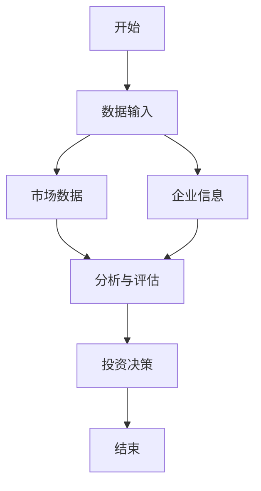
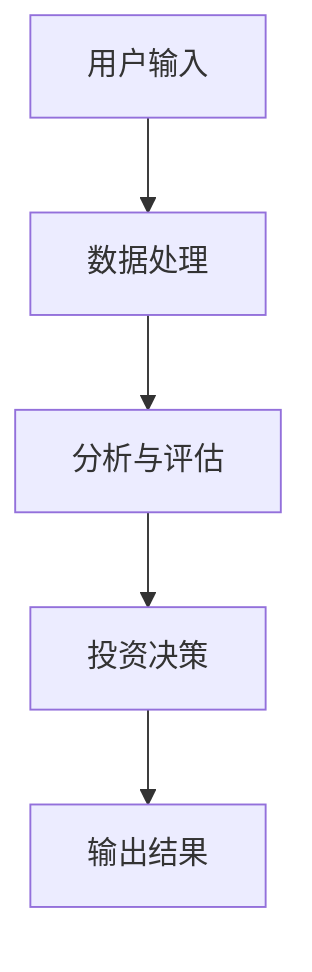

                 


# 巴菲特的投资纪律：耐心和自制的重要性

## 关键词：巴菲特，投资纪律，耐心，自制，价值投资，长期投资

## 摘要： 巴菲特的投资纪律是其长期成功的关键。本文将深入探讨巴菲特的投资哲学、策略和方法，重点分析耐心和自制在投资中的重要性。通过详细分析巴菲特的经典投资案例，结合系统的投资决策模型，本文将为读者提供一套实践性的投资纪律框架，帮助投资者在复杂多变的市场中做出明智决策。

---

# 巴菲特的投资纪律：耐心和自制的重要性

## 第一部分：引言

### 1. 巴菲特的投资理念

巴菲特的投资理念是基于价值投资的长期哲学，强调寻找具有持续竞争优势的企业，并以合理的价格买入并长期持有。他的投资策略不仅关注企业的基本面，还注重市场行为和心理因素。巴菲特的成功证明了投资纪律的重要性，特别是耐心和自制在投资过程中的关键作用。

### 2. 投资纪律的重要性

投资纪律是指在投资过程中，遵循预先制定的策略和规则，避免情绪化和非理性决策。巴菲特强调，没有纪律的投资容易导致错误决策，而纪律则是长期稳定收益的基础。本文将详细探讨巴菲特如何通过纪律实现长期投资成功。

### 3. 耐心与自制的双重作用

耐心和自制是巴菲特投资纪律的核心要素。耐心要求投资者在市场低迷时保持信心，在市场繁荣时保持冷静。自制则是指投资者在面对市场波动时，能够控制情绪，坚持既定的投资策略。这两者的结合，使得巴菲特能够在长期市场中实现稳定收益。

---

## 第二部分：巴菲特的投资策略与方法

### 1. 价值投资的核心策略

#### 1.1 价值投资的定义与特点

价值投资是一种以低于内在价值的价格买入优质股票的投资策略。其特点包括：寻找低估企业、长期持有、注重基本面分析、避免短期波动干扰。与其他投资策略相比，价值投资更注重企业的内在价值，而不是市场的短期波动。

#### 1.2 安全边际的概念与应用

安全边际是巴菲特价值投资中的重要概念，指买入价格与企业内在价值之间的差距。通过预留安全边际，投资者可以降低投资风险，确保在市场波动中仍能获得收益。安全边际的计算需要综合考虑企业的财务状况、行业地位、竞争优势等因素。

#### 1.3 企业评估与投资决策

巴菲特的企业评估方法包括：分析财务报表，评估企业的盈利能力、成长潜力和财务健康状况；研究行业地位和竞争优势；评估管理团队的能力和诚信。投资决策则基于对企业全面了解和安全边际的预留。

### 2. 投资纪律的系统分析

#### 2.1 投资决策的系统模型

投资决策的系统模型包括：输入（市场数据、企业信息）、处理（分析与评估）、输出（投资决策）。系统模型的流程图展示了从数据输入到决策输出的完整过程，帮助投资者系统地进行投资决策。

#### 2.2 系统模型的数学模型

投资决策的数学模型包括：安全边际计算公式、市盈率和市净率的比较、内在价值计算公式。这些数学模型帮助投资者量化分析，做出更科学的投资决策。

#### 2.3 系统模型的流程图



---

## 第三部分：巴菲特投资纪律的实践案例

### 1. 经典投资案例分析

#### 1.1 可口可乐的投资案例

可口可乐是巴菲特的经典投资案例。1988年，巴菲特开始投资可口可乐，因为其强大的品牌优势、稳定的现金流和合理的估值。他长期持有该股票，即使在市场波动中也保持耐心，最终实现丰厚的回报。

#### 1.2 伯克希尔 Hathaway 的投资案例

伯克希尔 Hathaway 是巴菲特的控股公司，他通过长期持有该公司股票，实现了稳定的收益。这一案例展示了巴菲特如何通过长期投资和价值投资实现财富增长。

#### 1.3 其他经典投资案例分析

巴菲特还投资过多家公司，如美国运通、吉列公司等。这些案例共同展示了他如何通过价值投资和纪律性的投资策略实现长期收益。

### 2. 耐心与自制在案例中的体现

#### 2.1 长期持有的耐心表现

巴菲特在投资过程中始终坚持长期持有的策略，即使在市场低迷时也不轻易卖出。他的耐心帮助他在市场波动中保持投资组合的稳定性。

#### 2.2 面对市场波动的自制力

在市场繁荣时，巴菲特能够保持冷静，避免盲目跟风。他的自制力使他能够在市场高位时保持理性，避免过度投资。

#### 2.3 案例中的纪律性决策

通过经典案例分析，我们可以看到巴菲特如何在实际投资中坚持纪律性决策，如选择低估企业、预留安全边际、长期持有等。

### 3. 案例分析的启示

#### 3.1 案例中的纪律性原则

经典案例分析展示了巴菲特如何通过纪律性原则实现投资成功，如价值投资、长期持有、预留安全边际等。

#### 3.2 纪律在投资中的实际应用

通过案例分析，我们可以看到纪律在投资中的实际应用，如如何在市场波动中保持冷静，如何选择和评估企业等。

#### 3.3 案例对投资者的启示

巴菲特的投资纪律为投资者提供了重要的启示，如坚持价值投资、长期持有、预留安全边际等。

---

## 第四部分：巴菲特投资纪律的系统分析

### 1. 投资纪律的系统架构

#### 1.1 投资决策的系统架构

投资决策的系统架构包括：数据输入、分析与评估、投资决策三个模块。数据输入包括市场数据和企业信息，分析与评估包括财务分析、行业分析和竞争优势分析，投资决策基于分析结果做出。

#### 1.2 系统架构的流程图


#### 1.3 系统架构的数学模型

投资决策的数学模型包括：安全边际计算公式、市盈率和市净率的比较、内在价值计算公式。这些数学模型帮助投资者量化分析，做出更科学的投资决策。

### 2. 投资纪律的算法原理

#### 2.1 投资决策的算法原理

投资决策的算法原理包括：数据输入、分析与评估、投资决策。数据输入包括市场数据和企业信息，分析与评估包括财务分析、行业分析和竞争优势分析，投资决策基于分析结果做出。

#### 2.2 投资决策的流程图


### 3. 投资纪律的系统实现

#### 3.1 系统实现的代码

以下是一个简单的投资决策系统的代码实现：

```python
def calculate_intrinsic_value(financials):
    # 计算内在价值的函数
    return financials['earnings'] * 10

def calculate_margin_of_safety(price, intrinsic_value):
    # 计算安全边际的函数
    return intrinsic_value - price

# 示例数据
financials = {
    'earnings': 100,
    'revenue': 500,
    'net_profit': 75
}

price = 50

# 计算内在价值和安全边际
intrinsic_value = calculate_intrinsic_value(financials)
margin_of_safety = calculate_margin_of_safety(price, intrinsic_value)

print(f"内在价值: {intrinsic_value}")
print(f"安全边际: {margin_of_safety}")
```

#### 3.2 代码解读与分析

上述代码展示了如何通过函数计算企业的内在价值和安全边际。`calculate_intrinsic_value`函数基于企业的盈利情况计算内在价值，`calculate_margin_of_safety`函数计算安全边际。通过这些计算，投资者可以评估企业是否被低估，是否值得投资。

### 4. 投资纪律的系统交互

#### 4.1 系统交互的流程图



#### 4.2 系统交互的详细描述

用户输入市场数据和企业信息，系统进行数据处理和分析，基于分析结果做出投资决策，并输出结果。

---

## 第五部分：总结与展望

### 1. 总结

巴菲特的投资纪律是其长期成功的关键。本文详细探讨了巴菲特的投资哲学、策略和方法，分析了耐心和自制在投资中的重要性，并通过经典案例和系统分析，为读者提供了一套实践性的投资纪律框架。

### 2. 展望

未来，投资环境将更加复杂和不确定。投资者需要更加严格的纪律和系统的方法来应对市场的挑战。基于巴菲特的投资纪律，结合现代技术手段，投资者可以开发更加智能化的投资系统，实现更高效的投资决策。

### 3. 最佳实践 tips

- 坚持价值投资，寻找低估企业。
- 长期持有，避免短期波动干扰。
- 预留安全边际，降低投资风险。
- 坚持纪律性，避免情绪化决策。

---

# 结语

巴菲特的投资纪律为投资者提供了重要的启示。通过耐心和自制，投资者可以在复杂多变的市场中实现长期稳定的收益。本文的系统分析和经典案例为投资者提供了实践性的指导，帮助他们在投资过程中坚持纪律，实现投资目标。

---

# 附录

## 附录A：相关书籍推荐

1. 《巴菲特的智慧》
2. 《价值投资实战策略》
3. 《投资的三大纪律》

## 附录B：工具与资源

1. 投资分析工具：Excel、Python、MATLAB
2. 数据源：Yahoo Finance、Morningstar、Bloomberg
3. 在线课程：Coursera、edX、Udemy

## 附录C：进一步学习

1. 学习巴菲特的投资理念，阅读他的股东大会演讲。
2. 实践价值投资策略，分析企业基本面。
3. 参与投资社群，交流经验与教训。

---

通过本文的学习，读者可以深入了解巴菲特的投资纪律，并将其应用到实际投资中，实现长期稳定的收益。

