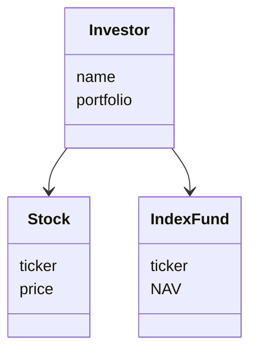

                 


# 巴菲特的投资风格：价值投资vs指数投资

> **关键词**：价值投资、指数投资、巴菲特、投资策略、投资分析、投资案例

> **摘要**：本文深入分析巴菲特的投资风格，重点比较价值投资和指数投资的核心概念、优缺点及其数学模型，并通过实际案例和系统架构设计，提供投资决策的详细指南。

---

## 第一部分：巴菲特的投资风格背景与概述

### 第1章：巴菲特的投资风格概述

#### 1.1 投资风格的背景介绍

巴菲特是全球著名投资者，倡导长期价值投资。本文比较价值投资和指数投资，探讨其优劣及适用场景。

#### 1.2 巴菲特的投资理念与哲学

巴菲特强调长期持有优质股票，关注企业基本面，避免短期市场波动。

#### 1.3 价值投资与指数投资的起源与发展

价值投资由格雷厄姆提出，指数投资源于现代金融学，强调分散投资。

---

## 第二部分：价值投资与指数投资的核心概念

### 第2章：价值投资的核心概念与特点

#### 2.1 价值投资的定义与核心要素

**定义**：寻找市场价格低于内在价值的股票，长期持有。

**核心要素对比表格**：

| 核心要素 | 价值投资 |
|----------|-----------|
| 投资目标 | 寻找低估股票 |
| 风险管理 | 侧重企业质量 |
| 投资期限 | 长期 |

**ER实体关系图架构（使用 Mermaid）**：

```mermaid
erDiagram
    investor ->[选择] stock
    stock -- price
    company ->[拥有] stock
```

### 第3章：指数投资的核心概念与特点

#### 3.1 指数投资的定义与核心要素

**定义**：通过投资指数基金，获得市场平均收益。

**核心要素对比表格**：

| 核心要素 | 指数投资 |
|----------|-----------|
| 投资目标 | 获取平均收益 |
| 风险管理 | 分散投资 |
| 投资期限 | 长期 |

**ER实体关系图架构（使用 Mermaid）**：

```mermaid
erDiagram
    investor ->[投资] index_fund
    index_fund -- market_return
    market ->[包含] stocks
```

---

## 第三部分：价值投资与指数投资的比较分析

### 第4章：价值投资与指数投资的比较

#### 4.1 两种投资策略的优缺点对比

**对比表格**：

| 策略 | 优点 | 缺点 |
|------|------|------|
| 价值投资 | 高回报潜力 | 需要高研究能力，市场波动风险 |
| 指数投资 | 分散风险，简单 | 无法超越市场收益 |

### 第5章：价值投资与指数投资的数学模型与公式

#### 5.1 价值投资的数学模型

**市盈率计算公式**：

$$ P/E = \frac{\text{市场价格}}{\text{每股收益}} $$

**内在价值计算公式**：

$$ \text{内在价值} = \sum \frac{\text{未来现金流}}{(1 + r)^t} $$

**Python代码实现**：

```python
def calculate_intrinsic_value(cash_flows, discount_rate):
    return sum(cash_flows / (1 + discount_rate)**t for t in range(len(cash_flows)))

cash_flows = [100, 120, 140]
discount_rate = 0.1
iv = calculate_intrinsic_value(cash_flows, discount_rate)
print(f"内在价值：{iv}")
```

#### 5.2 指数投资的数学模型

**指数基金预期收益**：

$$ \text{预期收益} = \text{市场平均收益} \times \text{基金跟踪误差} $$

**Python代码实现**：

```python
import pandas as pd

def calculate_expected_return(index_return, tracking_error):
    return index_return * (1 + tracking_error)

index_return = 0.1
tracking_error = 0.02
er = calculate_expected_return(index_return, tracking_error)
print(f"预期收益：{er}")
```

---

## 第四部分：系统分析与架构设计方案

### 第6章：系统分析与架构设计方案

#### 6.1 价值投资与指数投资的系统架构设计

**系统架构图（使用 Mermaid）**：


**领域模型 Mermaid 类图**：



#### 6.2 投资决策系统的实现

**环境安装与配置**：

安装Python、Pandas、Matplotlib。

**系统核心功能的 Python 源代码实现**：

```python
import pandas as pd
import matplotlib.pyplot as plt

# 价值投资分析函数
def analyze_value_investing(stocks):
    df = pd.DataFrame(stocks)
    df['P/E'] = df['price'] / df['eps']
    plt.scatter(df['price'], df['P/E'], label='Value Stocks')
    plt.xlabel('Price')
    plt.ylabel('P/E Ratio')
    plt.title('Value Investment Analysis')
    plt.legend()
    plt.show()

# 指数投资分析函数
def analyze_index_investing(indices):
    df = pd.DataFrame(indices)
    df['return'] = df['close'] / df['open'] - 1
    plt.plot(df['return'], label='Index Returns')
    plt.xlabel('Time')
    plt.ylabel('Return')
    plt.title('Index Investment Analysis')
    plt.legend()
    plt.show()

# 示例数据
stocks = [{'ticker': 'AAPL', 'price': 150, 'eps': 10},
          {'ticker': 'GOOGL', 'price': 250, 'eps': 20}]
indices = [{'ticker': 'SPY', 'open': 300, 'close': 310},
          {'ticker': 'IXIC', 'open': 8000, 'close': 8100}]

analyze_value_investing(stocks)
analyze_index_investing(indices)
```

---

## 第五部分：项目实战与案例分析

### 第7章：项目实战与案例分析

#### 7.1 价值投资的实战案例

**实际案例分析**：巴菲特投资可口可乐。

**投资决策过程详细讲解**：分析可口可乐的财务状况、竞争优势，计算内在价值，评估安全边际。

#### 7.2 指数投资的实战案例

**实际案例分析**：投资标普500指数基金。

**投资决策过程详细讲解**：选择指数基金，分散投资，定期定额投资。

---

## 第六部分：总结与建议

### 8.1 总结

价值投资适合长期看好特定企业，指数投资适合追求市场平均收益。投资者应根据自身情况选择。

### 8.2 投资建议

- **价值投资**：深入研究企业，长期持有。
- **指数投资**：分散风险，定期投资。
- **风险管理**：设置止损，避免过度集中。
- **持续学习**：跟踪市场变化，调整投资策略。

通过系统分析与实战案例，读者可以更好地理解巴菲特的投资风格，并根据自身情况选择合适的投资策略。

